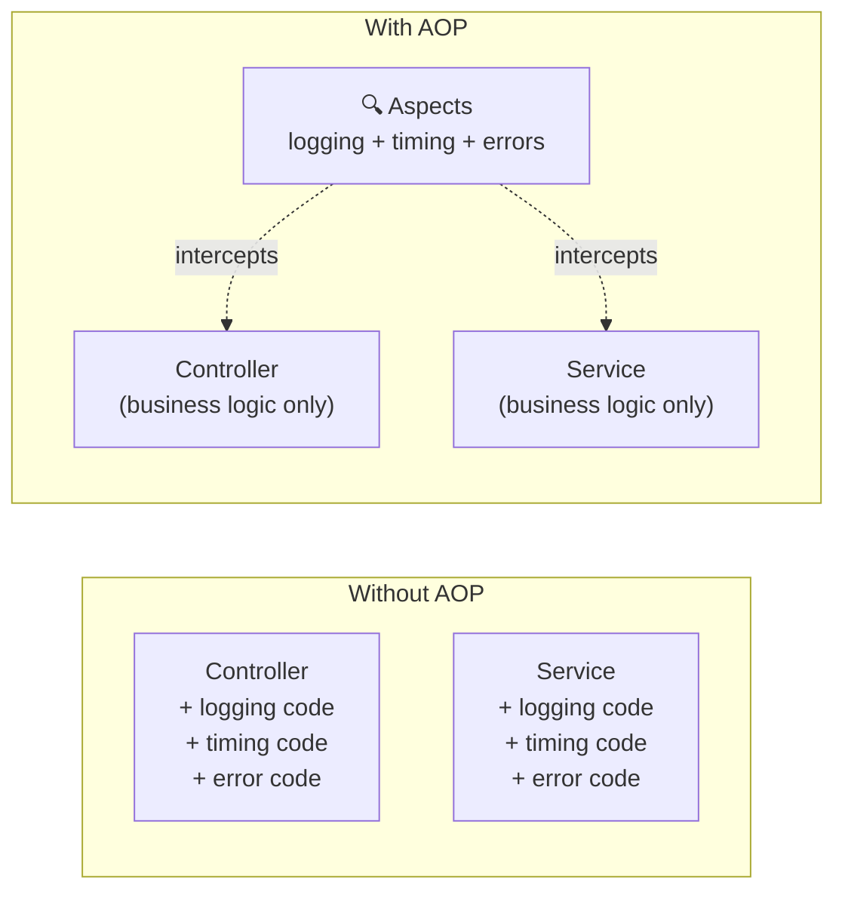
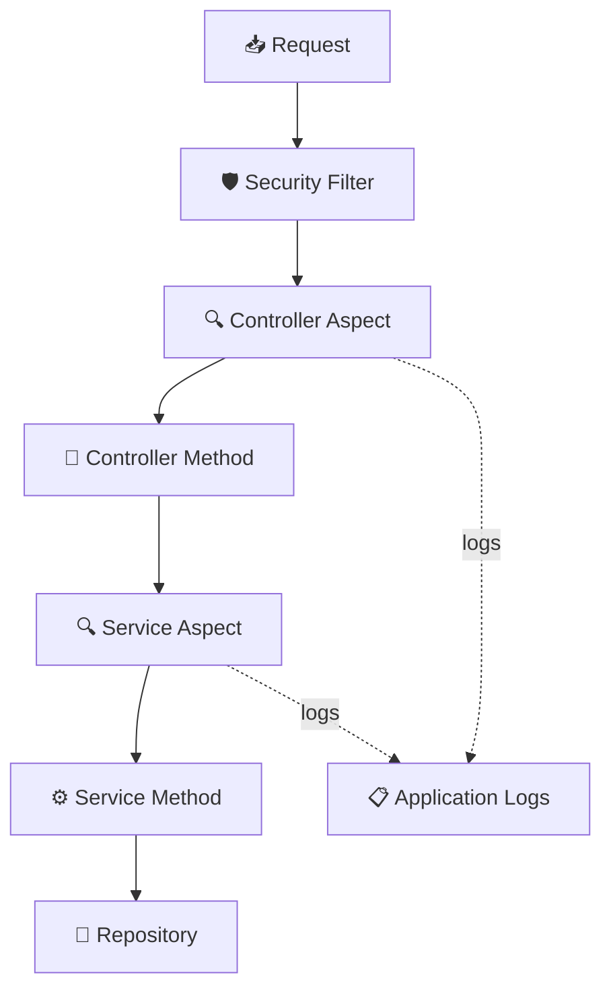
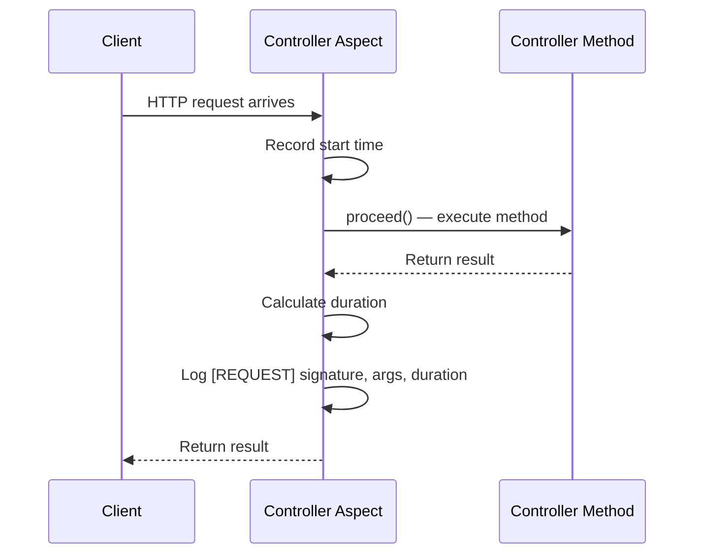
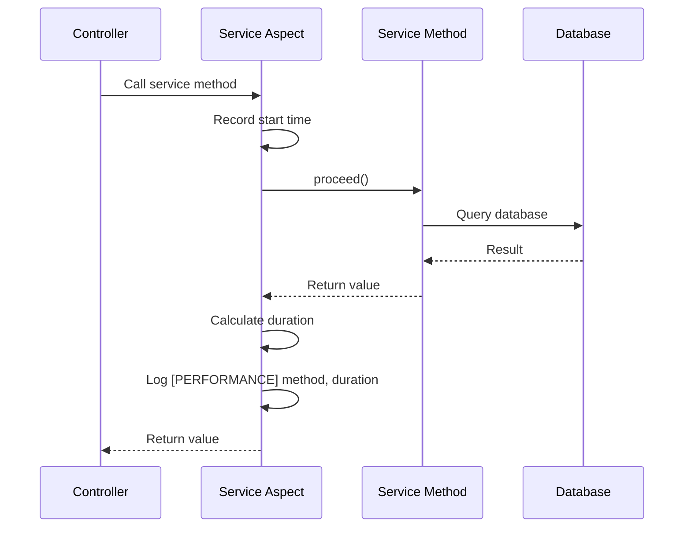
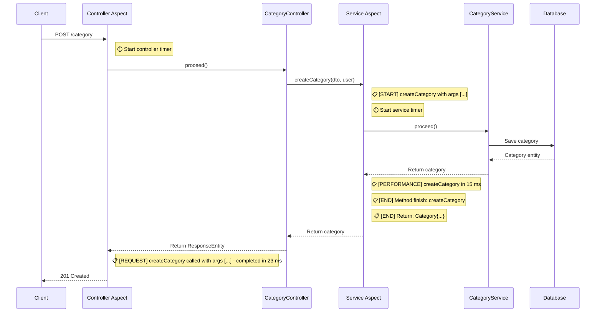
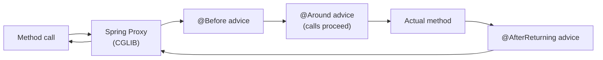

This document explains how Beyou uses Spring AOP to intercept controller and service method calls for logging, performance measurement, and error tracking — without modifying business code.

## What is AOP and Why We Use It

AOP (Aspect-Oriented Programming) lets you attach behavior to existing code without changing it. Instead of adding log statements inside every controller and service method, we define aspects that automatically intercept those calls.

This keeps business logic clean and ensures consistent observability across the entire backend.

## Architecture

Beyou has two aspect classes in the AOP package:

| Aspect | Targets | What it does |
|--------|---------|-------------|
| **ControllerLogging** | All @RestController classes | Logs every request with timing, catches and logs exceptions |
| **ServiceMethodsLogging** | All @Service classes | Logs method entry/exit, measures performance, catches and logs exceptions |

The aspects sit between the caller and the actual method — they execute before, after, or around the target method, adding observability without touching business code.

## Controller Aspect

The ControllerLogging aspect intercepts every method in classes annotated with @RestController.

### Pointcut

Targets all methods in all @RestController classes:

within(@org.springframework.web.bind.annotation.RestController *)

This means every endpoint in AuthenticationController, CategoryController, HabitController, TaskController, GoalController, RoutineController, ScheduleController, UserController, and all docs controllers is automatically intercepted.

### Advice: Request Logging (@Around)

Wraps every controller method call to measure execution time.

**Log format:**

[REQUEST] CategoryController.getCategories(..) called with args [..] - completed in 42 ms

**Log level:** INFO

This gives visibility into which endpoints are being called, what arguments they receive, and how long they take — without adding a single line of code to any controller.

### Advice: Exception Logging (@AfterThrowing)

Catches any exception thrown from a controller method and logs it at ERROR level.

**Log format:**

[EXCEPTION] Exception in CategoryController.createCategory(..): Category name already exists

**Log level:** ERROR

The exception continues to propagate normally to the GlobalExceptionHandler — the aspect only observes, it does not swallow or transform the error.

## Service Aspect

The ServiceMethodsLogging aspect intercepts every method in classes annotated with @Service, providing detailed lifecycle logging.

### Pointcut

Targets all methods in all @Service classes:

within(@org.springframework.stereotype.Service *)

This covers every service in the application — UserService, CategoryService, HabitService, TaskService, GoalService, RoutineService, ScheduleService, RefreshTokenService, PasswordResetService, and more.

### Advice: Method Entry (@Before)

Logs before every service method starts executing.

**Log format:**

[START] Starting method: createCategory with args [CreateCategoryDTO{name=Health, ...}, User{...}]

**Log level:** INFO

### Advice: Method Exit (@AfterReturning)

Logs after a service method completes successfully, including the return value.

**Log format:**

[END] Method finish: createCategory
[END] Return: Category{id=abc-123, name=Health, ...}

**Log level:** INFO

**Note:** Logging return values can expose sensitive data in logs (e.g., user objects with emails). In production, consider filtering sensitive fields or reducing log level to DEBUG.

### Advice: Performance Timing (@Around)

Measures how long each service method takes to execute.

**Log format:**

[PERFORMANCE] Method createCategory executed in 15 ms

**Log level:** INFO

This is valuable for identifying slow service methods during development and debugging.

### Advice: Exception Handling (@Around)

A separate @Around advice wraps service methods in try-catch to log exceptions.

**Log format:**

[ERROR] Exception in method CategoryService.createCategory(..): Duplicate name

**Log level:** ERROR

The exception is re-thrown after logging, preserving normal error propagation to the GlobalExceptionHandler.

## Complete Request Lifecycle with AOP

Here is what happens when a user creates a category, showing every log produced by the aspects:

## Log Prefix Reference

All aspect logs use prefixes for easy filtering with tools like grep or log management platforms:

| Prefix | Source | Level | Meaning |
|--------|--------|-------|---------|
| [REQUEST] | Controller Aspect | INFO | Full request with signature, args, and execution time |
| [EXCEPTION] | Controller Aspect | ERROR | Exception thrown from a controller |
| [START] | Service Aspect | INFO | Service method entry with args |
| [END] | Service Aspect | INFO | Service method exit with return value |
| [PERFORMANCE] | Service Aspect | INFO | Service method execution duration |
| [ERROR] | Service Aspect | ERROR | Exception caught in service method |

## How It Works Under the Hood

Spring AOP uses **proxy-based interception**. When Spring creates a bean, it wraps it in a proxy that intercepts method calls matching the aspect pointcuts.

**Key implications:**

- Only external calls are intercepted — if a service method calls another method in the same class, the aspect does not trigger (because it bypasses the proxy)
- AOP uses CGLIB proxies by default in Spring Boot (not JDK dynamic proxies)
- No special configuration needed — spring-boot-starter-aop auto-enables everything

## Configuration

No explicit AOP configuration exists. Spring Boot auto-enables AOP when the starter dependency is present:

spring-boot-starter-aop (in pom.xml)

The aspects are picked up by component scanning via @Aspect + @Component annotations. No @EnableAspectJAutoProxy is needed.

## Potential Improvements

| Area | Current State | Suggestion |
|------|--------------|------------|
| Log verbosity | All logs at INFO level | Move [START], [END], [PERFORMANCE] to DEBUG for production |
| Sensitive data | Return values logged fully | Filter or mask sensitive fields (emails, tokens) in log output |
| Repository logging | Not covered | Consider adding a repository aspect for query timing |
| Conditional logging | Always active | Add profile-based activation (e.g., only in dev/staging) |
| Structured logging | Plain text format | Consider JSON-structured logs for easier parsing in log platforms |
| Custom annotations | None | Add @Timed or @Logged annotations for selective method-level control |
