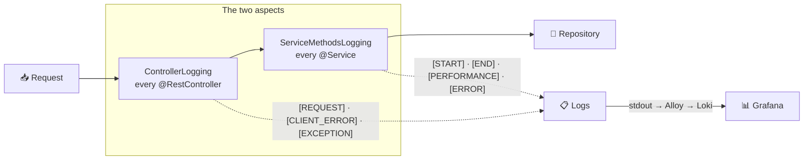

This document explains how Beyou uses Spring AOP for observability: what the two aspects log, how expected client errors are kept out of the error channel, and how the aspect output feeds (and deliberately stays out of) the GlitchTip error tracker.

## What AOP covers here, and what it doesn't

The AOP package holds exactly two aspects, and both do logging. Every other cross-cutting concern lives elsewhere: rate limiting and JWT validation are servlet filters, caching is Spring's `@Cacheable` annotations, transactions are `@Transactional`. One consequence worth knowing: rate-limited rejections happen before the controller is ever invoked, so a 429 never produces an aspect log line. Identity on the line is not an aspect either: a servlet filter puts the user id in the MDC and the log pattern prints it, so the aspects' lines carry it without knowing it exists.


```mermaid
flowchart LR
  subgraph aspects["The two aspects"]
    CL["ControllerLogging<br/>every @RestController"]
    SL["ServiceMethodsLogging<br/>every @Service"]
  end
  REQ["📥 Request"] --> CL --> SL --> DB["💾 Repository"]
  CL -.->|"[REQUEST] · [CLIENT_ERROR] · [EXCEPTION]"| LOG["📋 Logs"]
  SL -.->|"[START] · [END] · [PERFORMANCE] · [ERROR]"| LOG
  LOG -->|"stdout → Alloy → Loki"| MON["📊 Grafana"]
```

Both pointcuts key off the stock stereotype annotations (`@RestController`, `@Service`), so any new controller or service is woven automatically, wherever it lives. There are no custom annotations and no explicit AOP configuration; the starter (renamed `spring-boot-starter-aspectj` in Spring Boot 4) enables everything.

## ServiceMethodsLogging

Four advices wrap every service method:

| Advice | Level | What it emits |
|--------|-------|---------------|
| @Before | INFO | `[START] Starting method: createCategory with 2 arg(s)` |
| @AfterReturning | INFO / DEBUG | `[END] Method finish: createCategory` at INFO; the return value only at DEBUG |
| @Around (timing) | INFO | `[PERFORMANCE] Method createCategory exectued in 15 ms` |
| @Around (exceptions) | WARN / ERROR | See the routing section below; always rethrows |

The most important line in that table is the first one: **argument values are never logged, only the count**. An earlier version logged full argument objects, which put DTOs with passwords and e-mails into the log stream; the security audit flagged it and the aspect now counts instead. The same caution applies to return values, which only materialize at DEBUG.

Two smaller details for anyone grepping: the performance line's "exectued" typo is in the source, so grep for that spelling; and two separate `@Around` advices on the same pointcut mean each service call is proxied twice.

## ControllerLogging

Two advices wrap every controller method:

- `@Around` emits `[REQUEST] {full signature} - completed in {ms} ms` at INFO. It logs after `proceed()` returns, so a throwing controller method produces no `[REQUEST]` line at all; timing exists only for the success path.
- `@AfterThrowing` routes the failure: expected client errors become a WARN `[CLIENT_ERROR]` line with no stack trace, everything else becomes an ERROR `[EXCEPTION]` line with the full trace. The exception keeps propagating to the GlobalExceptionHandler either way; the aspect observes, never swallows.

## Expected-client-error routing

Both aspects share one routing decision, a static check in ServiceMethodsLogging. Six exception types are "expected": BusinessException (and every domain subclass), JwtNotFoundException, the three refresh-token exceptions, and IllegalArgumentException. These log at WARN with no stack trace, because a wrong password or an expired token is an ordinary Tuesday, not an incident.

That routing is also what keeps the error tracker clean: GlitchTip only turns log lines into events at ERROR level, so expected client noise never becomes an alert. Two subtleties are worth writing down:

- The check is a direct `instanceof` with no cause-chain walk, while the Sentry event filter walks up to 20 causes. A BusinessException re-wrapped by a transaction proxy would therefore log at ERROR with a full trace while still being dropped from GlitchTip. Divergent by design today, but coupled logic living in two places.
- The four token exceptions extend RuntimeException directly rather than BusinessException, which is why the list enumerates them explicitly.

## How the aspects meet GlitchTip

The Sentry SDK turns log lines into two things: breadcrumbs (the trail attached to an event) and events themselves. The aspects are handled differently for each:

- **Breadcrumbs**: both aspect loggers are excluded. Four INFO lines per request would flood the 100-breadcrumb budget with a call trace the event's stack already carries. The exclusion list is derived from the class names, so a rename moves the exclusion along.
- **Events**: deliberately not excluded. One unhandled fault is captured three times on its way out (service aspect, controller aspect, MVC resolver), and the SDK's deduplication collapses them. Filtering by logger name instead would mark the throwable as seen on the first capture and suppress the real event.

## Proxy mechanics and their traps

Spring AOP is proxy-based (CGLIB), which brings the classic caveat: a method calling another method on the same class bypasses the proxy, so neither logging nor `@Cacheable` nor `@Transactional` fires on the inner call. The snapshot scheduler documents this trap explicitly in its own code. The aspects also wrap the caching service beans, so a cached read carries the aspect proxies plus the cache interceptor.

## Log prefix reference

| Prefix | Source | Level | Meaning |
|--------|--------|-------|---------|
| [REQUEST] | Controller aspect | INFO | Full signature plus duration, success path only |
| [CLIENT_ERROR] | Controller aspect | WARN | Expected client error, no stack trace |
| [EXCEPTION] | Controller aspect | ERROR | Unexpected fault, full stack trace |
| [START] | Service aspect | INFO | Method entry with argument count |
| [END] | Service aspect | INFO / DEBUG | Method exit; return value at DEBUG only |
| [PERFORMANCE] | Service aspect | INFO | Duration ("exectued", per the source) |
| [ERROR] | Service aspect | ERROR | Unexpected fault, full stack trace |
| [LOG] | Domain services | varies | The hand-written convention inside business code |

These prefixes are what the Loki queries and the Beyou Logs dashboard filter on.

## Who a line belongs to

Every line carries the id of the user the request was for:

```
2026-08-21T08:31:33.536Z  INFO 1 --- [backend] [mcat-handler-61] [userId=3f1c9a2e-…] b.b.backend.AOP.ServiceMethodsLogging : [PERFORMANCE] Method history exectued in 12 ms
```

The value comes from the MDC, filled for the length of a request by `UserContextLogFilter`, and is printed by `logging.pattern.correlation`, the slot Spring Boot reserves for per-request identity inside its own default console and file patterns. The filter is a plain servlet filter rather than a link in the security chain, ordered after Spring Security's `FilterChainProxy` so the principal already exists, and ahead of the rate-limit filter so a 429 rejection is attributable even though no aspect ever sees it. Lines with no user in scope, startup and the snapshot scheduler among them, print `anonymous` rather than an empty field, so a log query has one line shape to parse instead of two.

The id is a surrogate key, and nothing a user wrote travels with it. That is what makes it safe in a channel where the aspects refuse to log arguments on purpose: the id says which account, the database says who. Sentry's Logback integration copies the MDC onto breadcrumbs and events, so the same id reaches GlitchTip and answers whether an incident is one account or every account.

Two kinds of line still read `anonymous` on an authenticated request, both because no id exists to attach at that point rather than by omission. `TokenService.validateToken` is logged by the service aspect from inside `SecurityFilter`, before the token has been turned into a user. The agent's SSE stream resumes on a reactor thread that no request-scoped filter runs on, which is why `AiAgentService` is handed the user id and logs it itself.

## Honest gaps

| Area | Current state | Note |
|------|--------------|------|
| Correlation IDs | User id, no request id | Every line carries `[userId=…]`, so a user's activity is one query. Nothing separates two concurrent requests from the same user, which still relies on thread name and timestamps |
| Failed-request timing | [REQUEST] only on success | A throwing endpoint leaves no duration record |
| Exception-message hygiene | Logged unescaped and uncapped | One controller sanitizes its messages at the source against log forging; the advice itself does not, so the same hole exists for any other message |
| Test coverage | One PII-regression test | ControllerLogging has a guard proving arguments never leak; ServiceMethodsLogging and the WARN/ERROR routing have no dedicated tests |
| Structured logging | Plain text | JSON logs would make the Loki queries sturdier than prefix-grepping |
