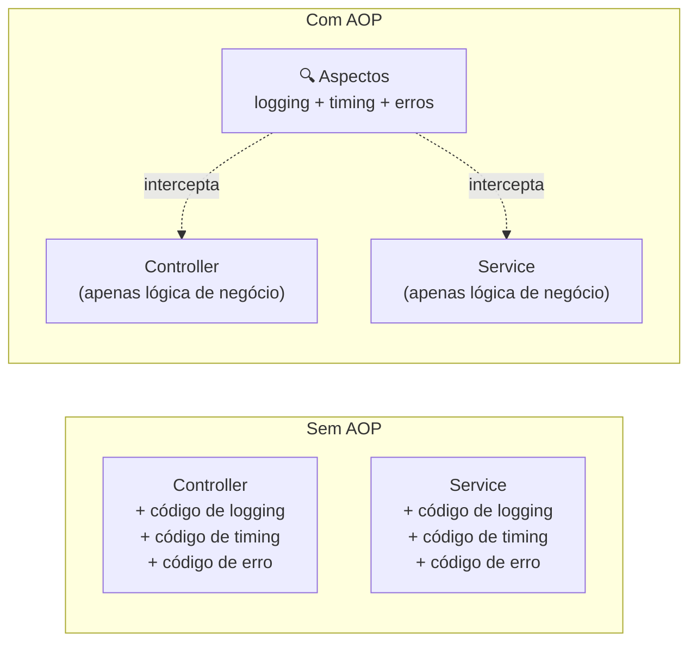
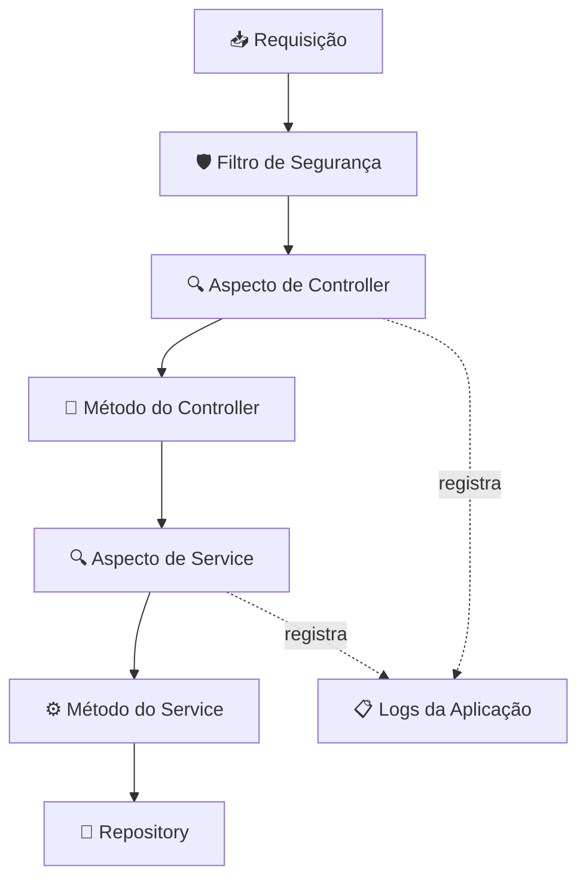
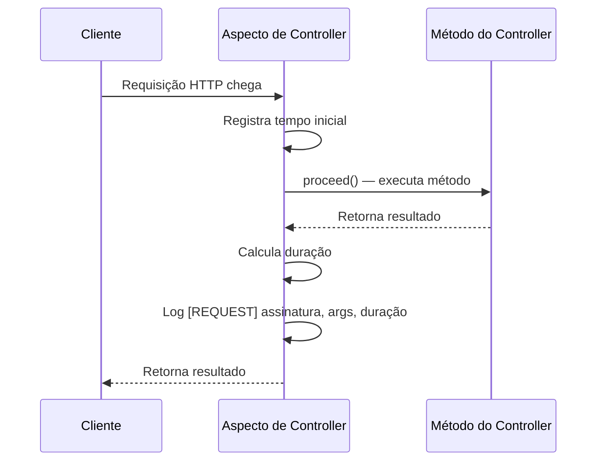
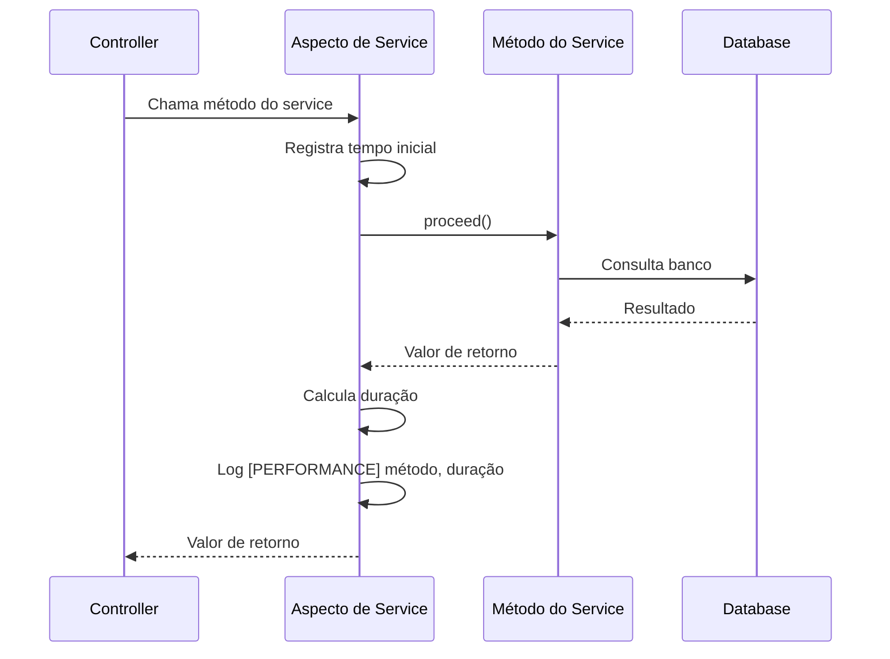
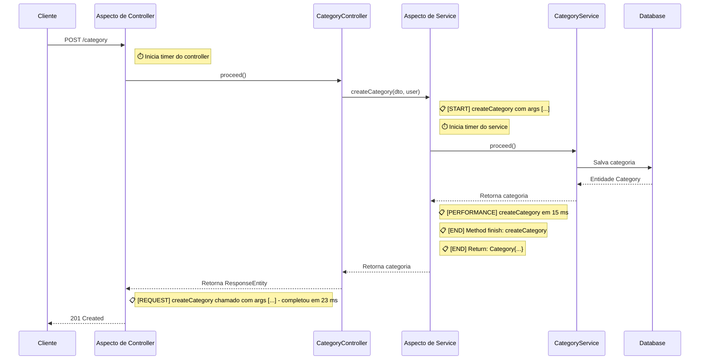
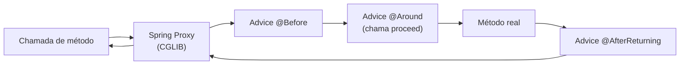

Este documento explica como o Beyou usa Spring AOP para interceptar chamadas de métodos em controllers e services para logging, medição de performance e rastreamento de erros — sem modificar o código de negócio.

## O que é AOP e Por Que Usamos

AOP (Aspect-Oriented Programming) permite adicionar comportamento a código existente sem alterá-lo. Em vez de adicionar instruções de log dentro de cada método de controller e service, definimos aspectos que automaticamente interceptam essas chamadas.

Isso mantém a lógica de negócio limpa e garante observabilidade consistente em todo o backend.

## Arquitetura

O Beyou tem duas classes de aspecto no pacote AOP:

| Aspecto | Alvos | O que faz |
|---------|-------|-----------|
| **ControllerLogging** | Todas as classes @RestController | Registra cada requisição com timing, captura e registra exceções |
| **ServiceMethodsLogging** | Todas as classes @Service | Registra entrada/saída de métodos, mede performance, captura e registra exceções |

Os aspectos ficam entre o chamador e o método real — executam antes, depois ou ao redor do método alvo, adicionando observabilidade sem tocar no código de negócio.

## Aspecto de Controller

O aspecto ControllerLogging intercepta cada método em classes anotadas com @RestController.

### Pointcut

Alvo: todos os métodos em todas as classes @RestController:

within(@org.springframework.web.bind.annotation.RestController *)

Isso significa que cada endpoint no AuthenticationController, CategoryController, HabitController, TaskController, GoalController, RoutineController, ScheduleController, UserController e todos os controllers de docs é automaticamente interceptado.

### Advice: Logging de Requisição (@Around)

Envolve cada chamada de método do controller para medir o tempo de execução.

**Formato do log:**

[REQUEST] CategoryController.getCategories(..) called with args [..] - completed in 42 ms

**Nível:** INFO

Isso dá visibilidade sobre quais endpoints estão sendo chamados, quais argumentos recebem e quanto tempo levam — sem adicionar uma única linha de código em nenhum controller.

### Advice: Logging de Exceção (@AfterThrowing)

Captura qualquer exceção lançada de um método do controller e registra no nível ERROR.

**Formato do log:**

[EXCEPTION] Exception in CategoryController.createCategory(..): Category name already exists

**Nível:** ERROR

A exceção continua a se propagar normalmente para o GlobalExceptionHandler — o aspecto apenas observa, não engole nem transforma o erro.

## Aspecto de Service

O aspecto ServiceMethodsLogging intercepta cada método em classes anotadas com @Service, fornecendo logging detalhado do ciclo de vida.

### Pointcut

Alvo: todos os métodos em todas as classes @Service:

within(@org.springframework.stereotype.Service *)

Isso cobre cada service na aplicação — UserService, CategoryService, HabitService, TaskService, GoalService, RoutineService, ScheduleService, RefreshTokenService, PasswordResetService e mais.

### Advice: Entrada do Método (@Before)

Registra antes de cada método de service começar a executar.

**Formato do log:**

[START] Starting method: createCategory with args [CreateCategoryDTO{name=Health, ...}, User{...}]

**Nível:** INFO

### Advice: Saída do Método (@AfterReturning)

Registra após um método de service completar com sucesso, incluindo o valor de retorno.

**Formato do log:**

[END] Method finish: createCategory
[END] Return: Category{id=abc-123, name=Health, ...}

**Nível:** INFO

**Nota:** Registrar valores de retorno pode expor dados sensíveis nos logs (ex: objetos de usuário com emails). Em produção, considere filtrar campos sensíveis ou reduzir o nível de log para DEBUG.

### Advice: Timing de Performance (@Around)

Mede quanto tempo cada método de service leva para executar.

**Formato do log:**

[PERFORMANCE] Method createCategory executed in 15 ms

**Nível:** INFO

Isso é valioso para identificar métodos de service lentos durante desenvolvimento e debugging.

### Advice: Tratamento de Exceção (@Around)

Um advice @Around separado envolve métodos de service em try-catch para registrar exceções.

**Formato do log:**

[ERROR] Exception in method CategoryService.createCategory(..): Duplicate name

**Nível:** ERROR

A exceção é relançada após o logging, preservando a propagação normal de erros para o GlobalExceptionHandler.

## Ciclo de Vida Completo de uma Requisição com AOP

Aqui está o que acontece quando um usuário cria uma categoria, mostrando cada log produzido pelos aspectos:

## Referência de Prefixos de Log

Todos os logs dos aspectos usam prefixos para fácil filtragem com ferramentas como grep ou plataformas de gerenciamento de logs:

| Prefixo | Origem | Nível | Significado |
|---------|--------|-------|------------|
| [REQUEST] | Aspecto de Controller | INFO | Requisição completa com assinatura, args e tempo de execução |
| [EXCEPTION] | Aspecto de Controller | ERROR | Exceção lançada de um controller |
| [START] | Aspecto de Service | INFO | Entrada do método de service com args |
| [END] | Aspecto de Service | INFO | Saída do método de service com valor de retorno |
| [PERFORMANCE] | Aspecto de Service | INFO | Duração de execução do método de service |
| [ERROR] | Aspecto de Service | ERROR | Exceção capturada no método de service |

## Como Funciona por Baixo dos Panos

Spring AOP usa **interceptação baseada em proxy**. Quando o Spring cria um bean, ele o envolve em um proxy que intercepta chamadas de métodos que correspondem aos pointcuts dos aspectos.

**Implicações importantes:**

- Apenas chamadas externas são interceptadas — se um método de service chama outro método na mesma classe, o aspecto não dispara (porque bypassa o proxy)
- AOP usa proxies CGLIB por padrão no Spring Boot (não proxies dinâmicos JDK)
- Nenhuma configuração especial necessária — spring-boot-starter-aop habilita tudo automaticamente

## Configuração

Nenhuma configuração explícita de AOP existe. Spring Boot habilita automaticamente AOP quando a dependência starter está presente:

spring-boot-starter-aop (no pom.xml)

Os aspectos são encontrados pelo component scanning via anotações @Aspect + @Component. Nenhum @EnableAspectJAutoProxy é necessário.

## Possíveis Melhorias

| Área | Estado Atual | Sugestão |
|------|-------------|----------|
| Verbosidade de log | Todos os logs no nível INFO | Mover [START], [END], [PERFORMANCE] para DEBUG em produção |
| Dados sensíveis | Valores de retorno logados integralmente | Filtrar ou mascarar campos sensíveis (emails, tokens) na saída de log |
| Logging de repository | Não coberto | Considerar adicionar aspecto de repository para timing de queries |
| Logging condicional | Sempre ativo | Adicionar ativação baseada em profile (ex: apenas em dev/staging) |
| Logs estruturados | Formato texto simples | Considerar logs JSON-structured para parsing mais fácil em plataformas de log |
| Anotações customizadas | Nenhuma | Adicionar anotações @Timed ou @Logged para controle seletivo por método |
