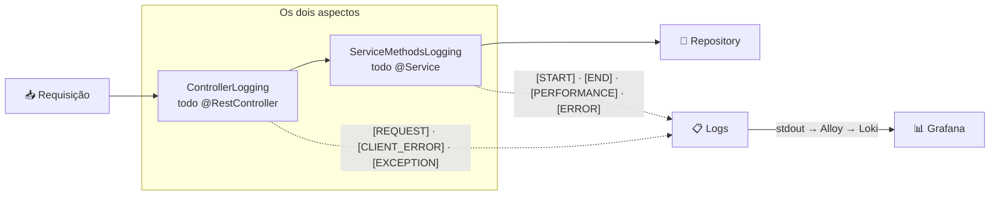

Este documento explica como o Beyou usa Spring AOP para observabilidade: o que os dois aspectos registram, como erros esperados de cliente ficam fora do canal de erro e como a saída dos aspectos alimenta (e deliberadamente fica fora do) rastreador de erros GlitchTip.

## O que o AOP cobre aqui, e o que não cobre

O pacote de AOP tem exatamente dois aspectos, e ambos fazem logging. Toda outra preocupação transversal vive em outro lugar: rate limiting e validação de JWT são filtros servlet, cache são as anotações `@Cacheable` do Spring, transações são `@Transactional`. Uma consequência que vale conhecer: rejeições por rate limit acontecem antes de o controller ser invocado, então um 429 nunca produz linha de log de aspecto.

```mermaid
flowchart LR
  subgraph aspects["Os dois aspectos"]
    CL["ControllerLogging<br/>todo @RestController"]
    SL["ServiceMethodsLogging<br/>todo @Service"]
  end
  REQ["📥 Requisição"] --> CL --> SL --> DB["💾 Repository"]
  CL -.->|"[REQUEST] · [CLIENT_ERROR] · [EXCEPTION]"| LOG["📋 Logs"]
  SL -.->|"[START] · [END] · [PERFORMANCE] · [ERROR]"| LOG
  LOG -->|"stdout → Alloy → Loki"| MON["📊 Grafana"]
```

Os dois pointcuts usam as anotações de estereótipo padrão (`@RestController`, `@Service`), então qualquer controller ou service novo é tecido automaticamente, onde quer que more. Não há anotações próprias nem configuração explícita de AOP; o starter (renomeado `spring-boot-starter-aspectj` no Spring Boot 4) habilita tudo.

## ServiceMethodsLogging

Quatro advices envolvem cada método de service:

| Advice | Nível | O que emite |
|--------|-------|-------------|
| @Before | INFO | `[START] Starting method: createCategory with 2 arg(s)` |
| @AfterReturning | INFO / DEBUG | `[END] Method finish: createCategory` em INFO; o valor de retorno só em DEBUG |
| @Around (tempo) | INFO | `[PERFORMANCE] Method createCategory exectued in 15 ms` |
| @Around (exceções) | WARN / ERROR | Ver a seção de roteamento abaixo; sempre relança |

A linha mais importante da tabela é a primeira: **valores de argumentos nunca são registrados, só a contagem**. Uma versão anterior registrava os objetos completos, o que colocava DTOs com senhas e e-mails no fluxo de logs; a auditoria de segurança apontou e o aspecto passou a contar. A mesma cautela vale para valores de retorno, que só se materializam em DEBUG.

Dois detalhes menores para quem for grepar: o erro de grafia "exectued" da linha de performance está no código-fonte, então grep por essa grafia; e dois advices `@Around` separados no mesmo pointcut significam que cada chamada de service passa por proxy duas vezes.

## ControllerLogging

Dois advices envolvem cada método de controller:

- O `@Around` emite `[REQUEST] {assinatura completa} - completed in {ms} ms` em INFO. Ele registra depois de `proceed()` retornar, então um método de controller que lança exceção não produz linha `[REQUEST]` nenhuma; a medição de tempo só existe no caminho de sucesso.
- O `@AfterThrowing` roteia a falha: erros esperados de cliente viram uma linha WARN `[CLIENT_ERROR]` sem stack trace, todo o resto vira uma linha ERROR `[EXCEPTION]` com o trace completo. A exceção continua propagando para o GlobalExceptionHandler de qualquer forma; o aspecto observa, nunca engole.

## Roteamento de erros esperados de cliente

Os dois aspectos dividem uma única decisão de roteamento, uma checagem estática no ServiceMethodsLogging. Seis tipos de exceção são "esperados": BusinessException (e cada subclasse de domínio), JwtNotFoundException, as três exceções de refresh token e IllegalArgumentException. Esses registram em WARN sem stack trace, porque uma senha errada ou um token expirado é uma terça-feira comum, não um incidente.

Esse roteamento também é o que mantém o rastreador de erros limpo: o GlitchTip só transforma linhas de log em eventos no nível ERROR, então o ruído esperado de cliente nunca vira alerta. Duas sutilezas valem registro:

- A checagem é um `instanceof` direto sem caminhar pela cadeia de causas, enquanto o filtro de eventos do Sentry caminha até 20 causas. Uma BusinessException re-embrulhada por um proxy de transação registraria em ERROR com trace completo e ainda assim seria descartada do GlitchTip. Divergente por escolha hoje, mas é lógica acoplada vivendo em dois lugares.
- As quatro exceções de token estendem RuntimeException diretamente, não BusinessException, e é por isso que a lista as enumera explicitamente.

## Onde os aspectos encontram o GlitchTip

O SDK do Sentry transforma linhas de log em duas coisas: breadcrumbs (a trilha anexada a um evento) e os próprios eventos. Os aspectos são tratados de forma diferente em cada uma:

- **Breadcrumbs**: os loggers dos dois aspectos são excluídos. Quatro linhas INFO por requisição inundariam o orçamento de 100 breadcrumbs com um rastro de chamadas que a stack do evento já carrega. A lista de exclusão deriva dos nomes das classes, então um rename leva a exclusão junto.
- **Eventos**: deliberadamente não excluídos. Uma falha não tratada é capturada três vezes na saída (aspecto de service, aspecto de controller, resolver do MVC), e a deduplicação do SDK as colapsa. Filtrar por nome de logger marcaria o throwable como visto na primeira captura e suprimiria o evento real.

## Mecânica de proxy e suas armadilhas

O Spring AOP é baseado em proxy (CGLIB), o que traz o alerta clássico: um método chamando outro método da mesma classe passa por fora do proxy, então nem o logging nem `@Cacheable` nem `@Transactional` disparam na chamada interna. O scheduler de snapshots documenta essa armadilha explicitamente no próprio código. Os aspectos também envolvem os beans do serviço de cache, então uma leitura cacheada carrega os proxies dos aspectos mais o interceptor de cache.

## Referência de prefixos de log

| Prefixo | Fonte | Nível | Significado |
|---------|-------|-------|-------------|
| [REQUEST] | Aspecto de controller | INFO | Assinatura completa com duração, só no sucesso |
| [CLIENT_ERROR] | Aspecto de controller | WARN | Erro esperado de cliente, sem stack trace |
| [EXCEPTION] | Aspecto de controller | ERROR | Falha inesperada, stack trace completo |
| [START] | Aspecto de service | INFO | Entrada do método com contagem de argumentos |
| [END] | Aspecto de service | INFO / DEBUG | Saída do método; valor de retorno só em DEBUG |
| [PERFORMANCE] | Aspecto de service | INFO | Duração ("exectued", conforme o código) |
| [ERROR] | Aspecto de service | ERROR | Falha inesperada, stack trace completo |
| [LOG] | Services de domínio | varia | A convenção manual dentro do código de negócio |

Esses prefixos são o que as consultas do Loki e o dashboard Beyou Logs filtram.

## Lacunas honestas

| Área | Estado atual | Nota |
|------|--------------|------|
| IDs de correlação | Nenhum | Sem MDC, sem request id; correlacionar as linhas de uma requisição depende de identidade de thread e timestamps |
| Tempo de requisições falhas | [REQUEST] só no sucesso | Um endpoint que lança exceção não deixa registro de duração |
| Higiene de mensagens de exceção | Registradas sem escape e sem limite | Um controller sanitiza suas mensagens na origem contra forja de log; o advice em si não, então o mesmo buraco existe para qualquer outra mensagem |
| Cobertura de testes | Um teste de regressão de PII | O ControllerLogging tem um guarda provando que argumentos nunca vazam; o ServiceMethodsLogging e o roteamento WARN/ERROR não têm testes dedicados |
| Logging estruturado | Texto puro | Logs em JSON deixariam as consultas do Loki mais firmes que grep de prefixo |
