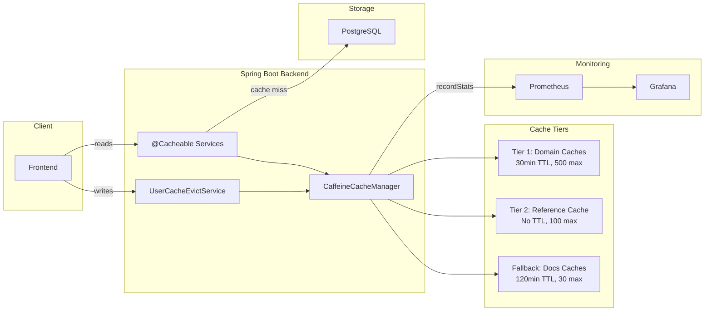
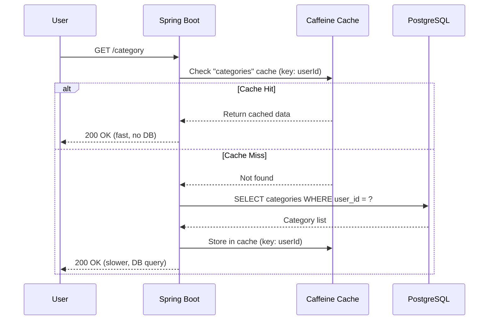
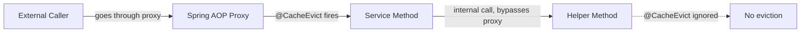

This document explains the caching architecture of Beyou, from how reads are cached to how writes invalidate stale data. It covers the cache tiers, the eviction strategy, the scheduled task cleanup, and the monitoring setup.

## Cache at a Glance



**Key design decisions:**

- Caffeine in-memory cache, no external infrastructure (no Redis)
- User-scoped keys for all domain caches, one cache entry per user per entity type
- Broad eviction on writes, all of a user's caches are cleared on any mutation
- Centralized eviction via `UserCacheEvictService`, single source of truth
- Two-tier configuration, short TTL for user data, permanent for static reference data
- Prometheus metrics via Micrometer `.recordStats()` for all caches

## Cache Names and Configuration

### Tier 1: Domain Caches (user-scoped, 30min TTL, 500 max entries)

| Cache Name | Service Method | Key | Returns |
|------------|---------------|-----|---------|
| `categories` | `CategoryService.getAllCategories(userId)` | `userId` | `List<CategoryResponseDTO>` |
| `habits` | `HabitService.getHabits(userId)` | `userId` | `List<HabitResponseDTO>` |
| `tasks` | `TaskService.getAllTasks(userId)` | `userId` | `List<TaskResponseDTO>` |
| `goals` | `GoalService.getAllGoals(userId)` | `userId` | `List<GoalResponseDTO>` |
| `routines` | `DiaryRoutineService.getAllDiaryRoutines(userId)` | `userId` | `List<DiaryRoutineResponseDTO>` |
| `routine` | `DiaryRoutineService.getDiaryRoutineById(id, userId)` | `userId + "_" + routineId` | `DiaryRoutineResponseDTO` |
| `todayRoutine` | `DiaryRoutineService.getTodayRoutineScheduled(userId)` | `userId` | `DiaryRoutineResponseDTO` |
| `schedules` | `ScheduleService.findAll(userId)` | `userId` | `List<ScheduleResponseDTO>` |

**Note on `todayRoutine`:** This method can return `null` when no routine is scheduled for today. The `@Cacheable` annotation uses `unless = "#result == null"` so null results are not cached, they always go to the database.

### Tier 2: Reference Cache (permanent, 100 max entries)

| Cache Name | Method | Key | Returns |
|------------|--------|-----|---------|
| `xpByLevel` | `XpByLevelRepository.findByLevel(level)` | `level` | `XpByLevel` |

This is a static lookup table seeded at startup (levels 1-100). It never changes at runtime, so it has no TTL. It gets evicted only on JVM restart.

### Fallback: Docs Caches (120min TTL, 30 max entries)

| Cache Name | Service | Purpose |
|------------|---------|---------|
| `apiTopics` / `apiTopic` | `ApiControllerService` | API documentation |
| `architectureTopics` / `architectureTopic` | `ArchitectureTopicService` | Architecture docs |
| `blogTopics` / `blogTopic` | `BlogTopicService` | Blog posts |
| `projectsTopics` / `projectsTopic` | `ProjectTopicService` | Project docs |

These caches are keyed by locale (and optionally by topic key). They are evicted when documentation is re-imported via the `/docs/admin/import` endpoints.

## How Reads Work



All cached methods return DTOs (Java records), not JPA entities. This avoids detached-entity issues and lazy-load exceptions from cached objects.

## How Eviction Works

### The Problem

A single user action can touch multiple entities. For example, checking a habit in a routine triggers XP calculations that update the User, the Routine, the Habit, and all linked Categories. That is potentially 5+ entities changing in one transaction.

### The Solution: Centralized Broad Eviction

Instead of surgically invalidating individual cache entries, all of a user's caches are cleared on any write operation via `UserCacheEvictService`:

```java
@Service
@RequiredArgsConstructor
public class UserCacheEvictService {

    private final CacheManager cacheManager;

    @Caching(evict = {
        @CacheEvict(cacheNames = "categories", key = "#userId"),
        @CacheEvict(cacheNames = "habits", key = "#userId"),
        @CacheEvict(cacheNames = "tasks", key = "#userId"),
        @CacheEvict(cacheNames = "goals", key = "#userId"),
        @CacheEvict(cacheNames = "routines", key = "#userId"),
        @CacheEvict(cacheNames = "todayRoutine", key = "#userId"),
        @CacheEvict(cacheNames = "schedules", key = "#userId")
    })
    public void evictAllUserCaches(UUID userId) {
        Cache routineCache = cacheManager.getCache("routine");
        if (routineCache != null) {
            routineCache.clear();
        }
    }
}
```

The `routine` cache uses a composite key (`userId_routineId`), so it cannot be evicted by userId alone via `@CacheEvict`. It is cleared programmatically via `CacheManager`.

### Eviction Points

Every service that mutates data calls `userCacheEvictService.evictAllUserCaches(userId)` as the last statement before returning:

| Service | Write Methods |
|---------|---------------|
| `CategoryService` | `createCategory`, `editCategory`, `deleteCategory` |
| `HabitService` | `createHabit`, `editHabit`, `deleteHabit` |
| `TaskService` | `createTask`, `editTask`, `deleteTask` |
| `GoalService` | `createGoal`, `editGoal`, `deleteGoal`, `checkGoal`, `increaseCurrentValue`, `decreaseCurrentValue` |
| `DiaryRoutineService` | `createDiaryRoutine`, `updateDiaryRoutine`, `deleteDiaryRoutine`, `checkAndUncheckGroup`, `skipOrUnskipGroup` |
| `ScheduleService` | `create`, `update`, `delete` |

Services that do not need their own eviction calls:

- `XpCalculatorService`, their callers (GoalService, DiaryRoutineService) handle eviction
- `CheckItemService`, called through DiaryRoutineService which handles eviction
- `RefreshUiDtoBuilder`, read-only

### Docs Cache Eviction

Docs caches are evicted via `@CacheEvict` on the `importFromGitHub()` method of each import service:

| Service | Evicted Caches |
|---------|---------------|
| `ApiDocsImportService` | `apiTopics`, `apiTopic` |
| `ArchitectureDocsImportService` | `architectureTopics`, `architectureTopic` |
| `BlogDocsImportService` | `blogTopics`, `blogTopic` |
| `ProjectDocsImportService` | `projectsTopics`, `projectsTopic` |

## Spring AOP Proxy Consideration

Spring's `@Cacheable` and `@CacheEvict` work through AOP proxies. This means:

- The annotations only work on **public methods** called from **outside the class**
- Internal self-calls (`this.someMethod()`) bypass the proxy and the cache annotations are ignored
- All `@CacheEvict` annotations in this project are placed on the public entry-point methods, not on internal helpers



## Scheduled Task Cleanup

`TaskService.getAllTasks()` previously had a side effect: it deleted one-time tasks marked for removal. This made it impossible to cache because the "read" was also doing writes.

The cleanup logic was moved to `TaskCleanupScheduler`:

```java
@Component
@RequiredArgsConstructor
public class TaskCleanupScheduler {

    @Scheduled(cron = "0 0 0 * * *")
    @Transactional
    public void cleanupMarkedTasks() {
        // Finds tasks with markedToDelete < today
        // Groups by userId
        // Removes from routine groups + deletes from DB
    }
}
```

- Runs daily at midnight (server time)
- `getAllTasks()` is now a pure read, safe to cache
- `@EnableScheduling` is on the `BackendApplication` entrypoint

## CacheConfig

```java
@Configuration
@EnableCaching
public class CacheConfig {

    @Bean
    public CacheManager cacheManager() {
        CaffeineCacheManager manager = new CaffeineCacheManager();

        // Global fallback (docs caches): 30 max, 120min TTL
        manager.setCaffeine(Caffeine.newBuilder()
            .maximumSize(30)
            .expireAfterWrite(Duration.ofMinutes(120))
            .recordStats());

        // Tier 1: Domain caches, 500 max, 30min TTL
        for (String cacheName : DOMAIN_CACHES) {
            manager.registerCustomCache(cacheName,
                Caffeine.newBuilder()
                    .maximumSize(500)
                    .expireAfterWrite(Duration.ofMinutes(30))
                    .recordStats()
                    .build());
        }

        // Tier 2: Reference cache, 100 max, no expiry
        manager.registerCustomCache("xpByLevel",
            Caffeine.newBuilder()
                .maximumSize(100)
                .recordStats()
                .build());

        return manager;
    }
}
```

## Monitoring

All caches have `.recordStats()` enabled, which exposes metrics to Prometheus via Micrometer automatically.

### Prometheus Metrics

| Metric | Description |
|--------|-------------|
| `cache_gets_total{result="hit"}` | Cache hits per cache |
| `cache_gets_total{result="miss"}` | Cache misses per cache |
| `cache_puts_total` | New entries stored per cache |
| `cache_evictions_total` | Entries evicted per cache |
| `cache_size` | Current number of entries per cache |

### Grafana Dashboard

The "Beyou, Cache" dashboard (`beyou-cache` UID) shows:

- Cache hit rate (%) per cache over time
- Cache hits vs misses (req/s)
- Total cache hit rate gauge (red/yellow/green thresholds)
- Cache size per cache
- Eviction rate per cache
- Put rate per cache

## Performance Impact

### Docs Endpoints

| Metric | Before Cache | After Cache | Improvement |
|--------|-------------|-------------|-------------|
| p50 latency | 21.90 ms | 5.32 ms | 75.7% faster |
| p95 latency | 84.10 ms | 33.02 ms | 60.7% faster |
| Throughput | 455 req/s | 974 req/s | 114% more |

### Domain Endpoints

| Metric | Before Cache | After Cache | Improvement |
|--------|-------------|-------------|-------------|
| p50 latency | 30.85 ms | 16.03 ms | 48.1% faster |
| p95 latency | 108.05 ms | 65.65 ms | 39.2% faster |
| Throughput | 257 req/s | 401 req/s | 55.6% more |

## What Could Be Improved

| Area | Current State | Recommendation | Priority |
|------|--------------|----------------|----------|
| Per-cache tuning | All domain caches share 500/30min config | Tune individually based on Grafana data | Low |
| Search caching | Search endpoint not cached | Cache common search queries | Medium |
| Cache warming | All caches cold after restart | Pre-warm XpByLevel on startup | Low |
| Routine cache eviction | `clear()` evicts all users' routines | Track user's routine IDs for targeted eviction | Low |
