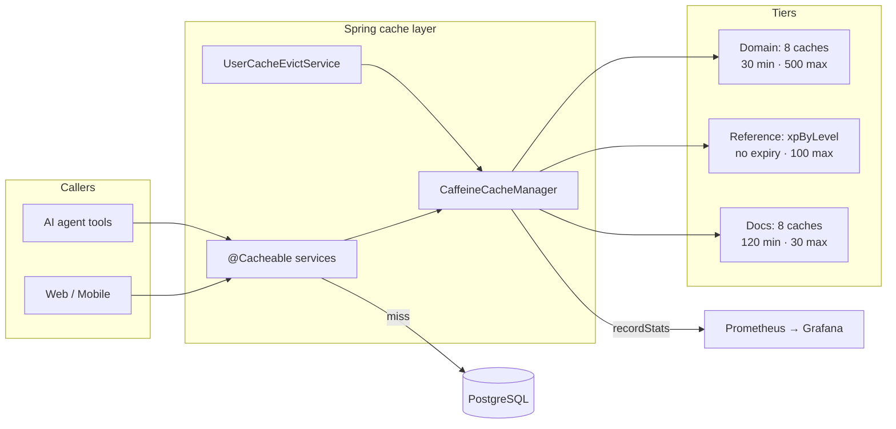

This document explains the caching architecture of Beyou: what is cached and for how long, how writes invalidate stale data, why the AI agent sees the same cache the REST API does, and which in-memory caches exist outside Spring's cache manager entirely.

## Cache at a glance

```mermaid
flowchart LR
  subgraph clients["Callers"]
    FE["Web / Mobile"]
    AG["AI agent tools"]
  end

  subgraph spring["Spring cache layer"]
    SC["@Cacheable services"]
    EC["UserCacheEvictService"]
    CM["CaffeineCacheManager"]
  end

  subgraph tiers["Tiers"]
    T1["Domain: 8 caches<br/>30 min · 500 max"]
    T2["Reference: xpByLevel<br/>no expiry · 100 max"]
    T3["Docs: 8 caches<br/>120 min · 30 max"]
  end

  FE --> SC
  AG --> SC
  SC --> CM
  EC --> CM
  CM --> T1
  CM --> T2
  CM --> T3
  SC -->|"miss"| DB[("PostgreSQL")]
  CM -->|"recordStats"| PR["Prometheus → Grafana"]
```

**Key design decisions:**

- Caffeine in memory, no external infrastructure. On a single host, Redis would add a network hop to save nothing.
- Domain caches are keyed per user: one entry per user per entity type.
- Writes evict broadly: any mutation drops all of that user's domain caches. Simple beats surgical here, and the code says so on purpose.
- TTLs and sizes live in code (CacheConfig), not in configuration files.
- Everything under the manager records stats for Prometheus.

## The three tiers

### Domain caches (30 min TTL, 500 entries max)

| Cache | Method | Key |
|-------|--------|-----|
| categories | CategoryService.getAllCategories | userId |
| habits | HabitService.getHabits | userId |
| tasks | TaskService.getAllTasks | userId |
| goals | GoalService.getAllGoals | userId |
| routines | DiaryRoutineService.getAllDiaryRoutines | userId |
| routine | DiaryRoutineService.getDiaryRoutineById | userId + "_" + routineId |
| todayRoutine | DiaryRoutineService.getTodayRoutineScheduled | userId, null results never cached |
| schedules | ScheduleService.findAll | userId |

All cached methods return DTOs, never JPA entities, so nothing lazy or detached ever comes out of a cache. The `routine` cache is the odd one: its composite key makes it the only domain cache Spring cannot evict per user, which shapes the whole eviction design below.

### Reference cache (no expiry)

`xpByLevel` caches the level curve, one entry per level, with the annotation sitting directly on the repository interface. The underlying table is seeded by a repeatable Flyway migration, so the cached values only change on restart after a reseed. No TTL is the honest configuration for data that changes by migration only.

### Docs caches (120 min TTL, 30 entries max)

Eight caches, two per docs area (list + detail), created lazily on first request and keyed by normalized locale (the blog list also keys by category and tag). The locale normalization exists because `?locale=EN`, `?locale=en`, and no locale at all must share one entry, and because a raw null key used to 400 every docs list request. These caches are only evicted by a docs import, which clears them wholesale.

## How eviction works

One user action can touch half the domain: checking a habit updates the habit, the routine, the user, and every linked category. Chasing individual entries would be fragile, so the design goes broad.

`UserCacheEvictService` has three entry points:

| Method | What it does | Who calls it |
|--------|-------------|--------------|
| evictAllUserCaches(userId) | Drops the user's entry in all 7 user-keyed caches, then clears the shared `routine` cache | Every interactive write |
| evictUserScopedCaches(userId) | The same 7 drops, without touching the shared cache | Batch jobs, per user in a loop |
| clearSharedRoutineCache() | `cache.clear()` on `routine`, all users | Batch jobs, once at the end |

The split exists for a scaling reason the code spells out: the day-close and snapshot batch jobs loop over many users, and calling the interactive method in that loop would wipe the shared routine cache once per user. A thousand users would mean a thousand full clears. The batch path drops per-user entries in the loop and clears the shared cache exactly once, and integration tests pin that behavior.

The honest cost of the design: because `routine` uses composite keys, one user editing one routine flushes every user's cached routine details. On a single-host deployment with a 30-minute TTL that is acceptable; it is also the first thing to revisit if routine reads ever get hot.

**Write paths that evict** (always inside the service method, after the write): category, habit, task, goal, and schedule create/edit/delete; goal check, increase, and decrease; routine create, update, delete, add/remove items; live check and skip; and snapshot check-ins, which also mutate XP. The AI agent needs no separate list, as the next section explains.

The eviction annotations are deliberately duplicated between the two user-scoped methods rather than delegated, because a self-invocation would bypass the proxy and silently evict nothing. The comment in the class warns that a cache added to one block must be added to the other.

## One cache, two front doors: REST and the AI agent

The agent's tools inject the same services the controllers use, so tool reads hit the same `@Cacheable` entries and tool writes run the same eviction. Consistency is by construction, not by discipline. Three details make it work:

- The cached read methods carry `@Transactional(readOnly = true)` specifically because agent tools run on a reactive thread where Open-Session-in-View does not apply.
- `getTodayRoutineScheduled` resolves "today" from the owner's timezone on the loaded data rather than from the request context, so it works off-request.
- The check/skip eviction lives on the outer service methods that both the controller and the tools funnel through, and an integration test exercises that seam directly so relocating the eviction breaks the build.

## Scheduled task cleanup

`getAllTasks` used to delete expired one-time tasks as a side effect, which made it uncacheable: the read was also a write. That logic moved to `TaskCleanupScheduler`, which runs daily and does the deleting in a transaction of its own. The read became pure, and the cache annotation became safe. It is a small story with a general moral: caching forces reads to be honest about being reads.

## Monitoring

Every cache under the manager records stats, and Spring Boot's auto-configuration binds them to Micrometer, which Prometheus scrapes from the management port. Grafana shows them in the Cache row of the service-health dashboard: hit rate per cache, hits vs misses, sizes, evictions, and puts.

One caveat the dashboards inherit: Boot binds the caches that exist at startup. The nine registered caches qualify; the eight docs caches are created lazily on first request, so they can be absent from the panels until someone thinks to look for them.

## The caches Spring doesn't manage

Several in-memory caches live outside the cache manager, invisible to the cache dashboard:

| Cache | Purpose | Config |
|-------|---------|--------|
| Rate-limit buckets | bucket4j buckets per tier | Caffeine, 10,000 max, 30 min after access |
| Login attempt counters | The per-account lockout | Caffeine, 50,000 max, expiry equals the lockout window, keyed by lowercased e-mail |
| Google public keys | ID-token verification | Cached internally by Google's verifier library |
| LLM provider cooldowns | The fallback chain skips a failing provider for a while | Plain map: 300 s after a 429, 30 s after other errors |
| Active stream counters | Caps concurrent agent SSE streams per user | Plain map |

The login-attempt cache carries a documented tradeoff: it is in-memory on purpose for a single-host deployment, which means a restart forgives all counters. The wrong-password path refreshes the window, so a persistent brute-forcer never ages out.

## Measured impact

The numbers from when the layer shipped, measured with load tests against the same endpoints before and after:

| Endpoints | p50 | p95 | Throughput |
|-----------|-----|-----|------------|
| Docs | 21.9 ms → 5.3 ms | 84.1 ms → 33.0 ms | 455 → 974 req/s |
| Domain | 30.9 ms → 16.0 ms | 108.1 ms → 65.7 ms | 257 → 401 req/s |

## What could be improved

| Area | Current state | Note |
|------|--------------|------|
| routine cache eviction | Global clear on any interactive routine write | Tracking a user's routine ids would allow targeted eviction; worth it only if routine reads get hot |
| Docs cache metrics | Lazily created, so possibly unbound | Registering them eagerly would make the dashboard complete |
| Per-cache tuning | All domain caches share 500 entries / 30 min | The Grafana data exists to tune individually; nothing has demanded it yet |
| Search caching | The docs search endpoint is uncached | Fine at current traffic, cheap win later |
