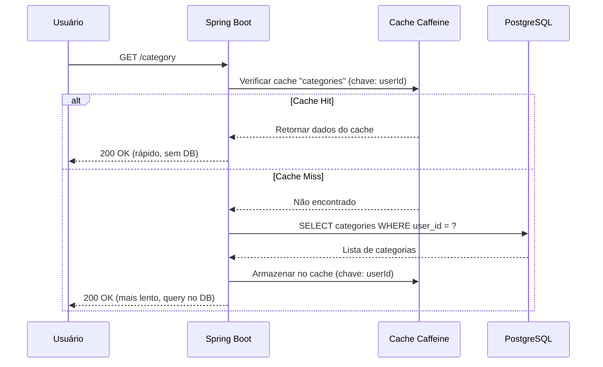
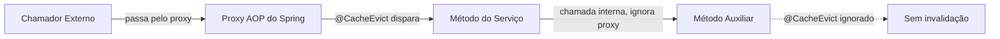

Este documento explica a arquitetura de cache do Beyou, desde como as leituras são cacheadas até como as escritas invalidam dados desatualizados. Cobre os níveis de cache, a estratégia de invalidação, a limpeza agendada de tarefas e o setup de monitoramento.

## Cache em Resumo

```mermaid
flowchart LR
  subgraph "Cliente"
    FE["Frontend"]
  end

  subgraph "Backend Spring Boot"
    SC["Serviços @Cacheable"]
    EC["UserCacheEvictService"]
    CM["CaffeineCacheManager"]
  end

  subgraph "Níveis de Cache"
    T1["Nível 1: Caches de Domínio\n30min TTL, 500 max"]
    T2["Nível 2: Cache de Referência\nSem TTL, 100 max"]
    T3["Fallback: Caches de Docs\n120min TTL, 30 max"]
  end

  subgraph "Armazenamento"
    DB["PostgreSQL"]
  end

  subgraph "Monitoramento"
    PR["Prometheus"]
    GR["Grafana"]
  end

  FE -->|leituras| SC
  FE -->|escritas| EC
  SC --> CM
  EC --> CM
  CM --> T1
  CM --> T2
  CM --> T3
  SC -->|cache miss| DB
  CM -->|.recordStats()| PR
  PR --> GR
```

**Decisões de design principais:**

- Cache em memória com Caffeine, sem infraestrutura externa (sem Redis)
- Chaves por usuário para todos os caches de domínio, uma entrada por usuário por tipo de entidade
- Invalidação ampla nas escritas, todos os caches de um usuário são limpos em qualquer mutação
- Invalidação centralizada via `UserCacheEvictService`, fonte única de verdade
- Configuração em dois níveis, TTL curto para dados de usuário, permanente para dados de referência estáticos
- Métricas Prometheus via Micrometer `.recordStats()` para todos os caches

## Nomes dos Caches e Configuração

### Nível 1: Caches de Domínio (por usuário, 30min TTL, 500 entradas max)

| Nome do Cache | Método do Serviço | Chave | Retorna |
|---------------|-------------------|-------|---------|
| `categories` | `CategoryService.getAllCategories(userId)` | `userId` | `List<CategoryResponseDTO>` |
| `habits` | `HabitService.getHabits(userId)` | `userId` | `List<HabitResponseDTO>` |
| `tasks` | `TaskService.getAllTasks(userId)` | `userId` | `List<TaskResponseDTO>` |
| `goals` | `GoalService.getAllGoals(userId)` | `userId` | `List<GoalResponseDTO>` |
| `routines` | `DiaryRoutineService.getAllDiaryRoutines(userId)` | `userId` | `List<DiaryRoutineResponseDTO>` |
| `routine` | `DiaryRoutineService.getDiaryRoutineById(id, userId)` | `userId + "_" + routineId` | `DiaryRoutineResponseDTO` |
| `todayRoutine` | `DiaryRoutineService.getTodayRoutineScheduled(userId)` | `userId` | `DiaryRoutineResponseDTO` |
| `schedules` | `ScheduleService.findAll(userId)` | `userId` | `List<ScheduleResponseDTO>` |

**Nota sobre `todayRoutine`:** Este método pode retornar `null` quando nenhuma rotina está agendada para hoje. A anotação `@Cacheable` usa `unless = "#result == null"` para que resultados nulos não sejam cacheados, eles sempre vão ao banco.

### Nível 2: Cache de Referência (permanente, 100 entradas max)

| Nome do Cache | Método | Chave | Retorna |
|---------------|--------|-------|---------|
| `xpByLevel` | `XpByLevelRepository.findByLevel(level)` | `level` | `XpByLevel` |

Tabela de lookup estática que é carregada na inicialização (níveis 1-100). Nunca muda em runtime, então não tem TTL. Só é invalidada no restart da JVM.

### Fallback: Caches de Docs (120min TTL, 30 entradas max)

| Nome do Cache | Serviço | Finalidade |
|---------------|---------|-----------|
| `apiTopics` / `apiTopic` | `ApiControllerService` | Documentação de API |
| `architectureTopics` / `architectureTopic` | `ArchitectureTopicService` | Docs de arquitetura |
| `blogTopics` / `blogTopic` | `BlogTopicService` | Posts do blog |
| `projectsTopics` / `projectsTopic` | `ProjectTopicService` | Docs de projetos |

Esses caches são chaveados por locale (e opcionalmente por chave do tópico). São invalidados quando a documentação é reimportada pelos endpoints `/docs/admin/import`.

## Como as Leituras Funcionam



Todos os métodos cacheados retornam DTOs (Java records), não entidades JPA. Isso evita problemas de entidade desanexada e exceções de lazy-load em objetos cacheados.

## Como a Invalidação Funciona

### O Problema

Uma única ação do usuário pode tocar em múltiplas entidades. Por exemplo, marcar um hábito numa rotina dispara cálculos de XP que atualizam o Usuário, a Rotina, o Hábito e todas as Categorias vinculadas. São potencialmente 5+ entidades mudando numa única transação.

### A Solução: Invalidação Ampla Centralizada

Em vez de invalidar cirurgicamente entradas individuais do cache, todos os caches de um usuário são limpos em qualquer operação de escrita via `UserCacheEvictService`:

```java
@Service
@RequiredArgsConstructor
public class UserCacheEvictService {

    private final CacheManager cacheManager;

    @Caching(evict = {
        @CacheEvict(cacheNames = "categories", key = "#userId"),
        @CacheEvict(cacheNames = "habits", key = "#userId"),
        @CacheEvict(cacheNames = "tasks", key = "#userId"),
        @CacheEvict(cacheNames = "goals", key = "#userId"),
        @CacheEvict(cacheNames = "routines", key = "#userId"),
        @CacheEvict(cacheNames = "todayRoutine", key = "#userId"),
        @CacheEvict(cacheNames = "schedules", key = "#userId")
    })
    public void evictAllUserCaches(UUID userId) {
        Cache routineCache = cacheManager.getCache("routine");
        if (routineCache != null) {
            routineCache.clear();
        }
    }
}
```

O cache `routine` usa uma chave composta (`userId_routineId`), então não pode ser invalidado só pelo userId via `@CacheEvict`. É limpo programaticamente via `CacheManager`.

### Pontos de Invalidação

Todo serviço que faz mutação chama `userCacheEvictService.evictAllUserCaches(userId)` como última instrução antes de retornar:

| Serviço | Métodos de Escrita |
|---------|-------------------|
| `CategoryService` | `createCategory`, `editCategory`, `deleteCategory` |
| `HabitService` | `createHabit`, `editHabit`, `deleteHabit` |
| `TaskService` | `createTask`, `editTask`, `deleteTask` |
| `GoalService` | `createGoal`, `editGoal`, `deleteGoal`, `checkGoal`, `increaseCurrentValue`, `decreaseCurrentValue` |
| `DiaryRoutineService` | `createDiaryRoutine`, `updateDiaryRoutine`, `deleteDiaryRoutine`, `checkAndUncheckGroup`, `skipOrUnskipGroup` |
| `ScheduleService` | `create`, `update`, `delete` |

Serviços que não precisam de chamada própria de invalidação:

- `XpCalculatorService`, quem o chama (GoalService, DiaryRoutineService) já faz a invalidação
- `CheckItemService`, chamado pelo DiaryRoutineService que já trata a invalidação
- `RefreshUiDtoBuilder`, somente leitura

### Invalidação dos Caches de Docs

Os caches de docs são invalidados via `@CacheEvict` no método `importFromGitHub()` de cada serviço de importação:

| Serviço | Caches Invalidados |
|---------|-------------------|
| `ApiDocsImportService` | `apiTopics`, `apiTopic` |
| `ArchitectureDocsImportService` | `architectureTopics`, `architectureTopic` |
| `BlogDocsImportService` | `blogTopics`, `blogTopic` |
| `ProjectDocsImportService` | `projectsTopics`, `projectsTopic` |

## Consideração sobre Proxy AOP do Spring

As anotações `@Cacheable` e `@CacheEvict` do Spring funcionam através de proxies AOP. Isso significa:

- As anotações só funcionam em **métodos públicos** chamados de **fora da classe**
- Chamadas internas (`this.alguMetodo()`) ignoram o proxy e as anotações de cache são ignoradas
- Todas as anotações `@CacheEvict` neste projeto estão nos métodos públicos de entrada, não em helpers internos



## Limpeza Agendada de Tarefas

`TaskService.getAllTasks()` anteriormente tinha um efeito colateral: deletava tarefas únicas marcadas pra remoção. Isso tornava impossível cachear porque a "leitura" também estava fazendo escritas.

A lógica de limpeza foi movida para `TaskCleanupScheduler`:

```java
@Component
@RequiredArgsConstructor
public class TaskCleanupScheduler {

    @Scheduled(cron = "0 0 0 * * *")
    @Transactional
    public void cleanupMarkedTasks() {
        // Busca tarefas com markedToDelete < hoje
        // Agrupa por userId
        // Remove dos grupos de rotina + deleta do DB
    }
}
```

- Roda diariamente à meia-noite (horário do servidor)
- `getAllTasks()` agora é uma leitura pura, seguro de cachear
- `@EnableScheduling` está no entrypoint `BackendApplication`

## CacheConfig

```java
@Configuration
@EnableCaching
public class CacheConfig {

    @Bean
    public CacheManager cacheManager() {
        CaffeineCacheManager manager = new CaffeineCacheManager();

        // Fallback global (caches de docs): 30 max, 120min TTL
        manager.setCaffeine(Caffeine.newBuilder()
            .maximumSize(30)
            .expireAfterWrite(Duration.ofMinutes(120))
            .recordStats());

        // Nível 1: Caches de domínio, 500 max, 30min TTL
        for (String cacheName : DOMAIN_CACHES) {
            manager.registerCustomCache(cacheName,
                Caffeine.newBuilder()
                    .maximumSize(500)
                    .expireAfterWrite(Duration.ofMinutes(30))
                    .recordStats()
                    .build());
        }

        // Nível 2: Cache de referência, 100 max, sem expiração
        manager.registerCustomCache("xpByLevel",
            Caffeine.newBuilder()
                .maximumSize(100)
                .recordStats()
                .build());

        return manager;
    }
}
```

## Monitoramento

Todos os caches têm `.recordStats()` habilitado, o que expõe métricas ao Prometheus via Micrometer automaticamente.

### Métricas Prometheus

| Métrica | Descrição |
|---------|-----------|
| `cache_gets_total{result="hit"}` | Cache hits por cache |
| `cache_gets_total{result="miss"}` | Cache misses por cache |
| `cache_puts_total` | Novas entradas armazenadas por cache |
| `cache_evictions_total` | Entradas invalidadas por cache |
| `cache_size` | Número atual de entradas por cache |

### Dashboard Grafana

O dashboard "Beyou, Cache" (UID `beyou-cache`) mostra:

- Taxa de acerto do cache (%) por cache ao longo do tempo
- Cache hits vs misses (req/s)
- Gauge de taxa total de acerto (limites vermelho/amarelo/verde)
- Tamanho do cache por cache
- Taxa de invalidação por cache
- Taxa de puts por cache

## Impacto na Performance

### Endpoints de Docs

| Métrica | Antes do Cache | Depois do Cache | Melhoria |
|---------|---------------|-----------------|----------|
| Latência p50 | 21.90 ms | 5.32 ms | 75.7% mais rápido |
| Latência p95 | 84.10 ms | 33.02 ms | 60.7% mais rápido |
| Throughput | 455 req/s | 974 req/s | 114% a mais |

### Endpoints de Domínio

| Métrica | Antes do Cache | Depois do Cache | Melhoria |
|---------|---------------|-----------------|----------|
| Latência p50 | 30.85 ms | 16.03 ms | 48.1% mais rápido |
| Latência p95 | 108.05 ms | 65.65 ms | 39.2% mais rápido |
| Throughput | 257 req/s | 401 req/s | 55.6% a mais |

## O Que Pode Ser Melhorado

| Área | Estado Atual | Recomendação | Prioridade |
|------|-------------|--------------|------------|
| Ajuste por cache | Todos os caches de domínio compartilham config 500/30min | Ajustar individualmente com base nos dados do Grafana | Baixa |
| Cache de busca | Endpoint de busca não é cacheado | Cachear queries de busca comuns | Média |
| Aquecimento do cache | Todos os caches frios após restart | Pré-aquecer XpByLevel na inicialização | Baixa |
| Invalidação do cache routine | `clear()` invalida rotinas de todos os usuários | Rastrear IDs das rotinas do usuário para invalidação direcionada | Baixa |
