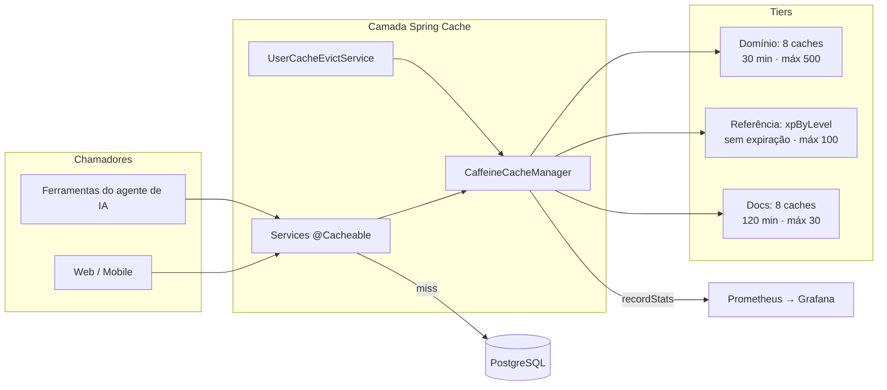

Este documento explica a arquitetura de cache do Beyou: o que é cacheado e por quanto tempo, como escritas invalidam dados velhos, por que o agente de IA enxerga o mesmo cache que a API REST e quais caches em memória existem completamente fora do gerenciador do Spring.

## Cache em uma olhada

```mermaid
flowchart LR
  subgraph clients["Chamadores"]
    FE["Web / Mobile"]
    AG["Ferramentas do agente de IA"]
  end

  subgraph spring["Camada Spring Cache"]
    SC["Services @Cacheable"]
    EC["UserCacheEvictService"]
    CM["CaffeineCacheManager"]
  end

  subgraph tiers["Tiers"]
    T1["Domínio: 8 caches<br/>30 min · máx 500"]
    T2["Referência: xpByLevel<br/>sem expiração · máx 100"]
    T3["Docs: 8 caches<br/>120 min · máx 30"]
  end

  FE --> SC
  AG --> SC
  SC --> CM
  EC --> CM
  CM --> T1
  CM --> T2
  CM --> T3
  SC -->|"miss"| DB[("PostgreSQL")]
  CM -->|"recordStats"| PR["Prometheus → Grafana"]
```

**Decisões de design centrais:**

- Caffeine em memória, sem infraestrutura externa. Em um único host, Redis acrescentaria um salto de rede para não economizar nada.
- Os caches de domínio são chaveados por usuário: uma entrada por usuário por tipo de entidade.
- Escritas evictam de forma ampla: qualquer mutação derruba todos os caches de domínio daquele usuário. Simples ganha de cirúrgico aqui, e o código diz isso de propósito.
- TTLs e tamanhos vivem em código (CacheConfig), não em arquivos de configuração.
- Tudo sob o gerenciador registra estatísticas para o Prometheus.

## Os três tiers

### Caches de domínio (TTL 30 min, máx 500 entradas)

| Cache | Método | Chave |
|-------|--------|-------|
| categories | CategoryService.getAllCategories | userId |
| habits | HabitService.getHabits | userId |
| tasks | TaskService.getAllTasks | userId |
| goals | GoalService.getAllGoals | userId |
| routines | DiaryRoutineService.getAllDiaryRoutines | userId |
| routine | DiaryRoutineService.getDiaryRoutineById | userId + "_" + routineId |
| todayRoutine | DiaryRoutineService.getTodayRoutineScheduled | userId, resultados nulos nunca são cacheados |
| schedules | ScheduleService.findAll | userId |

Todos os métodos cacheados devolvem DTOs, nunca entidades JPA, então nada lazy ou detached sai de um cache. O cache `routine` é o diferente: sua chave composta o torna o único cache de domínio que o Spring não consegue evictar por usuário, o que molda todo o design de evicção abaixo.

### Cache de referência (sem expiração)

O `xpByLevel` cacheia a curva de levels, uma entrada por level, com a anotação direto na interface do repositório. A tabela por baixo é semeada por uma migração repetível do Flyway, então os valores cacheados só mudam em um restart depois de um reseed. Sem TTL é a configuração honesta para dados que só mudam por migração.

### Caches de docs (TTL 120 min, máx 30 entradas)

Oito caches, dois por área de documentação (lista + detalhe), criados de forma preguiçosa no primeiro pedido e chaveados por locale normalizado (a lista do blog também chaveia por categoria e tag). A normalização de locale existe porque `?locale=EN`, `?locale=en` e nenhum locale precisam dividir uma entrada, e porque uma chave nula crua devolvia 400 em toda listagem de docs. Esses caches só são evictados por uma importação de docs, que os limpa por inteiro.

## Como a evicção funciona

Uma ação do usuário pode tocar metade do domínio: marcar um hábito atualiza o hábito, a rotina, o usuário e cada categoria ligada. Perseguir entradas individuais seria frágil, então o design vai no amplo.

O `UserCacheEvictService` tem três portas de entrada:

| Método | O que faz | Quem chama |
|--------|-----------|------------|
| evictAllUserCaches(userId) | Derruba a entrada do usuário nos 7 caches por usuário e então limpa o cache compartilhado `routine` | Toda escrita interativa |
| evictUserScopedCaches(userId) | As mesmas 7 quedas, sem tocar o cache compartilhado | Jobs em lote, por usuário no loop |
| clearSharedRoutineCache() | `cache.clear()` no `routine`, todos os usuários | Jobs em lote, uma vez ao final |

A separação existe por uma razão de escala que o código explica: os jobs de fechamento de dia e de snapshot percorrem muitos usuários, e chamar o método interativo nesse loop limparia o cache compartilhado de rotinas uma vez por usuário. Mil usuários significariam mil limpezas completas. O caminho de lote derruba entradas por usuário dentro do loop e limpa o compartilhado exatamente uma vez, e testes de integração fixam esse comportamento.

O custo honesto do design: como `routine` usa chaves compostas, um usuário editando uma rotina descarta o detalhe de rotina cacheado de todos os usuários. Em um deployment de host único com TTL de 30 minutos isso é aceitável; também é a primeira coisa a revisitar se leituras de rotina esquentarem.

**Caminhos de escrita que evictam** (sempre dentro do método de service, depois da escrita): create/edit/delete de categoria, hábito, tarefa, meta e schedule; check, increase e decrease de meta; create, update, delete e adição/remoção de itens de rotina; check e skip ao vivo; e os check-ins de snapshot, que também mexem em XP. O agente de IA não precisa de lista própria, como a próxima seção explica.

As anotações de evicção são deliberadamente duplicadas entre os dois métodos por usuário em vez de delegadas, porque uma auto-invocação passaria por fora do proxy e silenciosamente não evictaria nada. O comentário na classe avisa que um cache adicionado a um bloco precisa entrar no outro.

## Um cache, duas portas: REST e o agente de IA

As ferramentas do agente injetam os mesmos services que os controllers usam, então leituras de ferramenta acertam as mesmas entradas `@Cacheable` e escritas de ferramenta rodam a mesma evicção. A consistência é por construção, não por disciplina. Três detalhes fazem isso funcionar:

- Os métodos de leitura cacheados carregam `@Transactional(readOnly = true)` especificamente porque as ferramentas do agente rodam em uma thread reativa onde o Open-Session-in-View não vale.
- O `getTodayRoutineScheduled` resolve o "hoje" pelo timezone do dono a partir dos dados carregados, não do contexto da requisição, então funciona fora de uma requisição.
- A evicção de check/skip mora nos métodos externos de service por onde tanto o controller quanto as ferramentas passam, e um teste de integração exercita exatamente essa costura, então realocar a evicção quebra o build.

## Limpeza agendada de tarefas

O `getAllTasks` costumava apagar tarefas únicas expiradas como efeito colateral, o que o tornava impossível de cachear: a leitura também era escrita. Essa lógica foi para o `TaskCleanupScheduler`, que roda diariamente e apaga em transação própria. A leitura virou pura, e a anotação de cache virou segura. É uma história pequena com moral geral: cache obriga leituras a serem honestas sobre serem leituras.

## Monitoramento

Todo cache sob o gerenciador registra estatísticas, e a autoconfiguração do Spring Boot as liga ao Micrometer, que o Prometheus coleta da porta de management. O Grafana as mostra na linha de Cache do dashboard de saúde do serviço: taxa de acerto por cache, acertos contra erros, tamanhos, evicções e escritas.

Uma ressalva que os dashboards herdam: o Boot liga os caches que existem no startup. Os nove caches registrados se qualificam; os oito de docs são criados no primeiro pedido, então podem estar ausentes dos painéis até alguém sentir falta.

## Os caches que o Spring não gerencia

Vários caches em memória vivem fora do gerenciador, invisíveis ao dashboard de cache:

| Cache | Propósito | Config |
|-------|-----------|--------|
| Baldes de rate limit | Baldes bucket4j por faixa | Caffeine, máx 10.000, 30 min após acesso |
| Contadores de tentativa de login | O lockout por conta | Caffeine, máx 50.000, expiração igual à janela de lockout, chaveado por e-mail em minúsculas |
| Chaves públicas do Google | Verificação de ID token | Cacheadas internamente pela biblioteca do Google |
| Cooldowns de provedores de LLM | A cadeia de fallback pula um provedor falhando por um tempo | Mapa simples: 300 s após um 429, 30 s após outros erros |
| Contadores de streams ativos | Limita streams SSE simultâneos do agente por usuário | Mapa simples |

O cache de tentativas de login carrega um tradeoff documentado: é em memória de propósito para um deployment de host único, o que significa que um restart perdoa todos os contadores. O caminho de senha errada renova a janela, então um força-bruta persistente nunca envelhece para fora.

## Impacto medido

Os números de quando a camada entrou, medidos com testes de carga nos mesmos endpoints antes e depois:

| Endpoints | p50 | p95 | Vazão |
|-----------|-----|-----|-------|
| Docs | 21,9 ms → 5,3 ms | 84,1 ms → 33,0 ms | 455 → 974 req/s |
| Domínio | 30,9 ms → 16,0 ms | 108,1 ms → 65,7 ms | 257 → 401 req/s |

## O que pode melhorar

| Área | Estado atual | Nota |
|------|--------------|------|
| Evicção do cache routine | Limpeza global em qualquer escrita interativa de rotina | Rastrear os ids de rotina de um usuário permitiria evicção dirigida; só vale se leituras de rotina esquentarem |
| Métricas dos caches de docs | Criados de forma preguiçosa, possivelmente sem bind | Registrá-los de forma antecipada completaria o dashboard |
| Ajuste por cache | Todos os caches de domínio dividem 500 entradas / 30 min | Os dados do Grafana existem para ajustar individualmente; nada exigiu isso ainda |
| Cache da busca | O endpoint de busca de docs não é cacheado | Tranquilo no tráfego atual, ganho barato depois |
