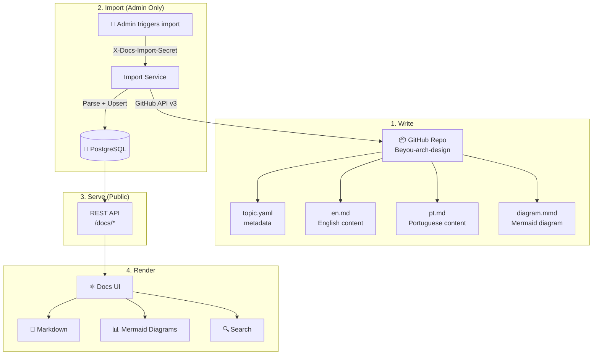
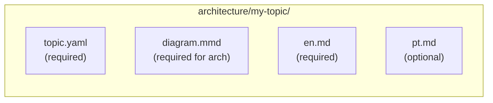
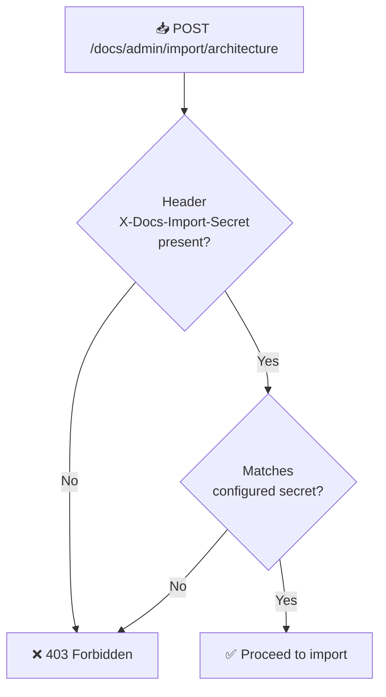
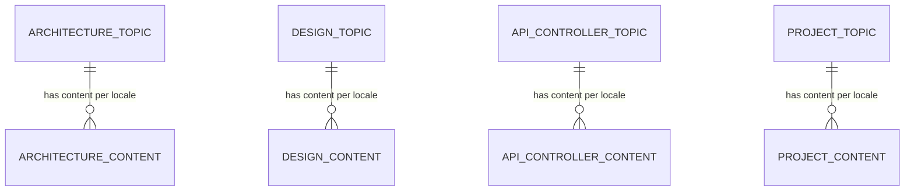
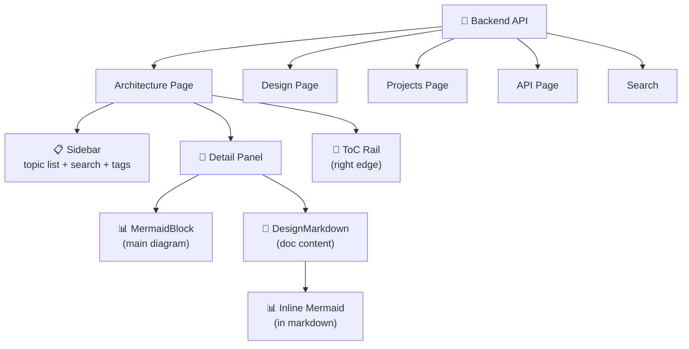

This document explains the full documentation pipeline in Beyou: how docs are written in a GitHub repo, imported into the database by admins, served via a public API, and rendered in the docs UI with Mermaid diagrams and markdown.

## The Pipeline

Documentation in Beyou follows a one-way pipeline: write in GitHub, import to DB, serve to UI.



## Doc Types

The system supports four documentation categories, each with its own GitHub directory, import endpoint, database tables, and API:

| Type | GitHub Path | Import Endpoint | API Endpoints | Content |
|------|-------------|-----------------|---------------|---------|
| **Architecture** | architecture/ | /docs/admin/import/architecture | /docs/architecture/topics | System design, diagrams, technical decisions |
| **Design** | design/ | /docs/admin/import/design | /docs/design/topics | UX flows, user journeys, design patterns |
| **API** | api/ | /docs/admin/import/api | /docs/api/controllers | OpenAPI specs, endpoint documentation |
| **Projects** | projects/ | /docs/admin/import/projects | /docs/projects/topics | Per-repo overviews, related topics |

## GitHub File Structure

Each topic is a directory inside its doc type folder. The file convention is:



### topic.yaml

Metadata for the topic:

| Field | Type | Required | Purpose |
|-------|------|----------|---------|
| key | string | Yes | Unique identifier (matches directory name) |
| orderIndex | integer | Yes | Sort order in the sidebar |
| status | string | Yes | ACTIVE, DRAFT, or ARCHIVED |
| tags | list of string | No | Filterable tags |
| projectKey | string | No | Links to a project topic |

### en.md / pt.md

Markdown content with YAML frontmatter:

| Field | Location | Required | Purpose |
|-------|----------|----------|---------|
| title | Frontmatter | Yes | Display title |
| summary | Frontmatter | Yes | One-line description |
| (body) | After frontmatter | Yes | Full markdown content |

Inline Mermaid diagrams are supported via fenced code blocks.

### diagram.mmd

Raw Mermaid code for the topic's main diagram. Rendered separately from the markdown content in a dedicated panel.

### API docs variant

API docs use a slightly different structure:

| File | Purpose |
|------|---------|
| controller.yaml | Metadata (key, orderIndex, status) |
| openapi.yaml | OpenAPI 3.0 specification |
| en.md / pt.md | Optional supplementary markdown |

## Admin Import Pipeline

The import is the core of the system — it pulls docs from GitHub and syncs them into the database.

### Security

The import endpoint is protected by the DocsImportSecretFilter:



- The secret is configured via the DOCS_IMPORT_SECRET environment variable
- The filter runs as a OncePerRequestFilter, positioned after Spring Security's UsernamePasswordAuthenticationFilter
- Also protects /actuator endpoints
- CORS preflight (OPTIONS) requests bypass the filter

**Important:** Regular read endpoints (/docs/architecture/topics, etc.) are public — no authentication required. Only the /docs/admin/* import endpoints require the secret.

### Import flow

```mermaid
sequenceDiagram
  participant ADM as Admin
  participant BE as Import Service
  participant GH as GitHub API
  participant PAR as Parser
  participant DB as Database

  rect rgba(59, 130, 246, 0.25)
  ADM->>BE: 🔐 POST /docs/admin/import/architecture
  BE->>GH: GET /repos/owner/name/contents/architecture/?ref=main
  GH-->>BE: Directory listing (topic folders)
  end

  rect rgba(16, 185, 129, 0.25)
  loop Each topic directory
    BE->>GH: GET .../contents/architecture/my-topic/
    GH-->>BE: File listing
    BE->>GH: GET topic.yaml (Base64 content)
    BE->>GH: GET diagram.mmd (Base64 content)
    BE->>GH: GET en.md (Base64 content)
    BE->>GH: GET pt.md (Base64 content)
    GH-->>BE: File contents
    BE->>PAR: Parse YAML metadata + markdown frontmatter
    PAR-->>BE: Structured topic data
  end
  end

  rect rgba(168, 85, 247, 0.25)
  BE->>DB: 🔄 Upsert topics (insert new, update existing)
  BE->>DB: 📦 Archive topics no longer in GitHub
  BE-->>ADM: { importedTopics: N, archivedTopics: M }
  end
```

### What happens during import

1. **Fetch directory** — Calls GitHub API v3 to list the contents of the doc type folder
2. **Fetch each topic** — For each subdirectory, fetches topic.yaml, diagram.mmd, en.md, pt.md
3. **Parse files** — YAML is parsed for metadata, markdown frontmatter is extracted for title/summary, body is stored as-is
4. **Base64 decode** — GitHub API returns file content as Base64, which is decoded before parsing
5. **Upsert** — If the topic key already exists in the database, it is updated. If new, it is inserted.
6. **Archive** — Topics that exist in the database but are no longer present in GitHub are marked as ARCHIVED

### Configuration

All import settings are in application.yaml, overridable via environment variables:

| Variable | Purpose | Default |
|----------|---------|---------|
| DOCS_IMPORT_REPO_OWNER | GitHub repo owner | AndDev741 |
| DOCS_IMPORT_REPO_NAME | GitHub repo name | beyou-arch-design |
| DOCS_IMPORT_BRANCH | Git branch to import from | main |
| DOCS_IMPORT_SECRET | Secret for admin endpoint | (required) |
| DOCS_IMPORT_GITHUB_TOKEN | GitHub API token (optional) | (none — uses unauthenticated rate limit) |

## Database Model

Each doc type has two tables: one for the topic and one for locale-specific content.



### Architecture topic tables

**docs_architecture_topic**

| Column | Type | Notes |
|--------|------|-------|
| id | UUID | Primary key |
| key | String | Unique, the topic directory name |
| orderIndex | Integer | Sort order |
| status | String | ACTIVE / DRAFT / ARCHIVED |
| tags | String | JSON array stored as text |
| projectKey | String | Optional link to a project topic |
| createdAt | Timestamp | Set on creation |
| updatedAt | Timestamp | Updated on import |

**docs_architecture_topic_content**

| Column | Type | Notes |
|--------|------|-------|
| id | UUID | Primary key |
| locale | String | "en" or "pt" |
| title | String | From markdown frontmatter |
| summary | String | From markdown frontmatter |
| diagramMermaid | Text | Raw Mermaid code from diagram.mmd |
| docMarkdown | Text | Full markdown body (without frontmatter) |
| topic_id | UUID | Foreign key to parent topic |

Other doc types follow the same pattern. API docs additionally store the OpenAPI spec in an apiCatalog field. Project docs store extra fields like repositoryUrl, designTopicKey, and architectureTopicKey.

## Public API

All read endpoints are public (no auth required) and support locale via query parameter.

### Architecture

| Endpoint | Method | Response |
|----------|--------|----------|
| /docs/architecture/topics?locale=en | GET | List of topics (key, title, summary, status, tags, updatedAt) |
| /docs/architecture/topics/{key}?locale=en | GET | Full detail (title, summary, status, tags, diagramMermaid, docMarkdown, projectKey, updatedAt) |

### Design, Projects, API

Same pattern — /docs/design/topics, /docs/projects/topics, /docs/api/controllers — with type-specific fields.

### Search

| Endpoint | Method | Parameters | Response |
|----------|--------|-----------|----------|
| /docs/search | GET | q (required, min 2 chars), locale, category (all/architecture/design/api/project), limit, offset | Paginated results with score and highlights |

Search behavior:

- Searches across title and summary of all active topics
- Score: 1.0 for title match, 0.5 for summary match
- Highlights matching text with mark tags
- Filters by locale and category
- Results sorted by score descending

## Docs UI Rendering

The docs UI fetches data from the public API and renders it with specialized components.



### Rendering stack

| Component | Purpose | Technology |
|-----------|---------|-----------|
| **DesignMarkdown** | Renders markdown with GFM support | react-markdown + remark-gfm |
| **MermaidBlock** | Renders the main diagram with maximize button | mermaid v11 + dialog |
| **MermaidRenderer** | Core Mermaid rendering with theme awareness | mermaid.initialize() with custom theme |
| **MermaidPreview** | Full-screen diagram with pan/zoom | Dialog + custom controls |

### Markdown features

The DesignMarkdown component handles:

- **Headings** — Auto-generated IDs (slugified) for ToC navigation
- **Mermaid blocks** — Fenced code blocks with language "mermaid" render as interactive diagrams
- **Tables** — Wrapped in horizontal scroll container for mobile
- **Inline code** — Styled with primary color background
- **Code blocks** — Syntax-highlighted with overflow scroll

### Theme integration

Mermaid diagrams automatically adapt to the current UI theme:

- Background, primary, and text colors extracted from the active theme
- Dark/light mode detection via luminance calculation
- Custom Mermaid config rebuilt on every theme change
- Font: Source Serif 4 (matches the docs UI typography)

## Architecture Page Features

The Architecture page is the most feature-rich docs viewer:

| Feature | How it works |
|---------|-------------|
| **Sidebar search** | Filters topics by title, summary, and tags (client-side) |
| **Tag filtering** | Click tags to filter sidebar; supports multiple active tags |
| **Topic selection** | Click topic in sidebar, URL syncs via ?topic= param |
| **Status badges** | ACTIVE (green), DRAFT (amber), ARCHIVED (gray) |
| **Reading time** | Estimated from markdown word count |
| **Relative dates** | "Today", "Yesterday", "Xd ago" — bilingual |
| **Main diagram** | MermaidBlock with maximize/fullscreen |
| **Inline diagrams** | Mermaid blocks inside markdown render as diagrams |
| **ToC rail** | Notion-style right-edge rail with line indicators; expands on hover to show heading text |
| **Stale-while-revalidate** | Previous content stays visible (dimmed) while new topic loads |

## Potential Improvements

| Area | Current State | Suggestion |
|------|--------------|------------|
| Import automation | Manual trigger via API call | Add GitHub webhook or scheduled cron to auto-import on push |
| Search depth | Title + summary only | Add full-text search across docMarkdown content |
| Version history | Only latest version stored | Track import history with diffs |
| Draft preview | Drafts visible in sidebar | Add a preview mode for DRAFT topics before publishing |
| Offline support | None | Cache API responses for offline reading |
| Edit from UI | Read-only | Add an editor mode that commits back to GitHub |
