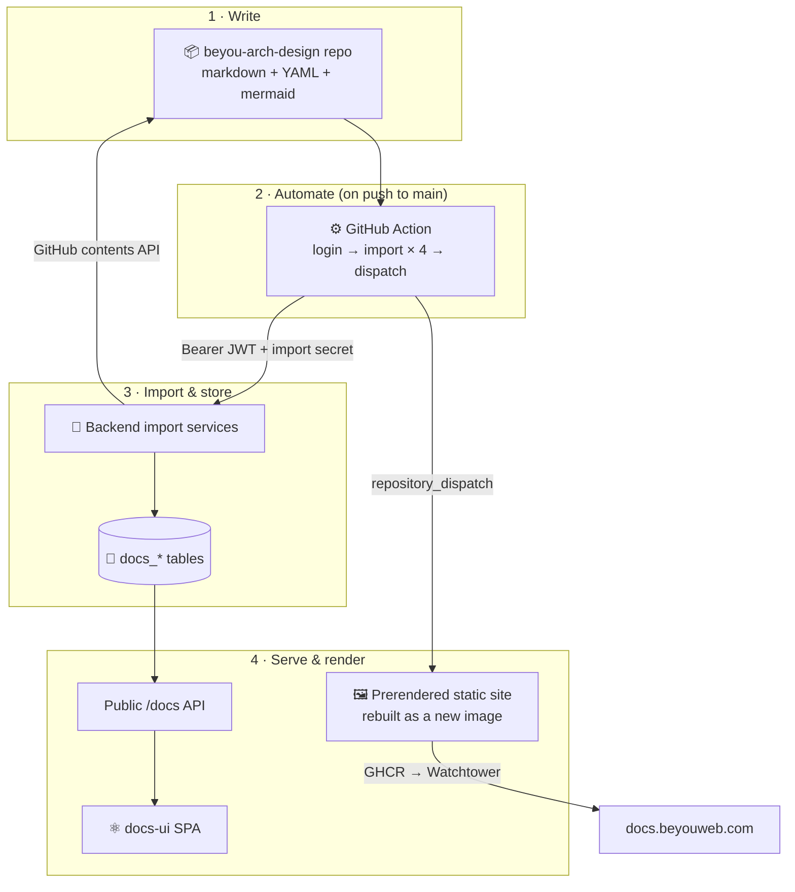

This document explains the pipeline that publishes the page you are reading: where content lives, how it reaches the database, how it is served and searched, and how the static docs site rebuilds itself when content changes.

## The pipeline

```mermaid
flowchart TD
  subgraph write["1 · Write"]
    GH["📦 beyou-arch-design repo<br/>markdown + YAML + mermaid"]
  end

  subgraph automate["2 · Automate (on push to main)"]
    WF["⚙️ GitHub Action<br/>login → import × 4 → dispatch"]
  end

  subgraph store["3 · Import & store"]
    BE["🍃 Backend import services"]
    DB[("🐘 docs_* tables")]
  end

  subgraph serve["4 · Serve & render"]
    API["Public /docs API"]
    UI["⚛️ docs-ui SPA"]
    PRE["🖼️ Prerendered static site<br/>rebuilt as a new image"]
  end

  GH --> WF
  WF -->|"Bearer JWT + import secret"| BE
  BE -->|"GitHub contents API"| GH
  BE --> DB
  DB --> API
  API --> UI
  WF -->|"repository_dispatch"| PRE
  PRE -->|"GHCR → Watchtower"| LIVE["docs.beyouweb.com"]
```

A content merge on main is the whole deployment: the workflow imports each area, and when all four succeed it dispatches the docs-ui build, which prerenders every route against the fresh API and ships a new image that Watchtower picks up. Content changes arrive as a new container, never as a restart.

## The four areas

Every area follows the same shape: one directory per topic, a YAML descriptor, and one markdown file per locale (`en.md`, `pt.md`; the locale is the filename).

| | architecture | blog | api | projects |
|---|---|---|---|---|
| Descriptor | topic.yaml | topic.yaml | controller.yaml | topic.yaml |
| Also mandatory | diagram.mmd | nothing else | openapi.yaml | diagram.mmd |
| At least one .md | yes | yes | yes | yes |
| Status values | ACTIVE, DRAFT, ARCHIVED | ACTIVE, ARCHIVED | ACTIVE, DRAFT, ARCHIVED | ACTIVE, DRAFT, ARCHIVED, PLANNING |

The blog descriptor is the rich one: category (TECHNICAL or PLANNING), tags, featured flag, publishedAt, author, cover emoji, and a cover color that must match a six-digit hex or it is silently dropped. Markdown frontmatter is a hand-rolled flat parser, not full YAML: only `title` and `summary` are read, unknown keys are ignored, and a missing closing fence fails the import. A file with no frontmatter is legal; the title falls back to the topic key.

Storage follows one repeated pattern: a topic row (identity, order, status) plus one content row per locale (title, summary, docMarkdown, and per area the mermaid diagram or the raw OpenAPI text). Two quirks worth knowing: the diagram is copied into every locale row, and the projects area keeps its relational fields (repository URL, linked topic keys) on the content row rather than the topic.

## The import

`POST /docs/admin/import/{area}` sits behind two independent gates: the request must carry a valid JWT (any authenticated user) and the `X-Docs-Import-Secret` header must match the configured secret in constant time. The workflow's comment memorizes the diagnostic: a 401 means the token was rejected, a 403 means the secret was.

The importer walks the GitHub contents API: list the area root, list each topic directory, fetch each file, base64-decode. Repo owner, name, branch, and path come from configuration and can be overridden per request. Then, per topic:

- **Upsert**: existing keys are updated in place, new keys inserted. A locale file that disappeared from the repo deletes its content row.
- **Archive**: after the walk, any topic in the table whose key was not seen this run flips to ARCHIVED. Nothing is ever hard-deleted, and re-adding the directory restores the status from its descriptor, so archiving is reversible by construction.
- The response reports both numbers, which is where the workflow's "N imported, M archived" lines come from. Imported counts every directory processed, not just new ones.

Each area imports in one transaction with its caches evicted at the end, so readers never see half an import. The four areas are four separate HTTP calls though: a failure mid-sequence leaves earlier areas committed and skips the site rebuild. And the failure mode is strict on purpose: one malformed topic directory aborts its whole area. A real example: a controller directory once shipped with only its openapi.yaml, and every import failed with `Missing controller.yaml in api/xp` until the metadata files landed.

One operational sharp edge: without a GitHub token configured, the importer runs against the anonymous rate limit of 60 requests per hour, and a full four-area run needs roughly 175 calls. The resulting failure surfaces as a generic "could not fetch" message. The token is not optional in practice.

## The automation

The `publish-docs` workflow triggers on any push to main touching the four content directories. Three steps, all curl:

1. **Sign in** with a dedicated import account and read the JWT from the `X-Access-Token` response header, masked in the logs.
2. **Import** each area in sequence with both auth headers; a non-200 aborts.
3. **Dispatch** a `docs-content-updated` event to the docs-ui repository (with a PAT, since the default workflow token cannot raise cross-repo events). The docs-ui CI then prerenders every route per locale against the public API and publishes the new image.

Runs are queued rather than cancelled under concurrency, for a subtle reason: the archive step of an older run finishing after a newer one could archive topics the newer run just imported.

## The public API

All read endpoints are public and locale-aware (`?locale=`, defaulting to English, falling back to English when a locale is missing). Lists return only ACTIVE topics sorted by orderIndex (the blog sorts by publish date instead); detail endpoints fetch by key.

| Area | List | Detail adds |
|------|------|-------------|
| /docs/architecture/topics | key, title, summary, order, status, tags, projectKey | diagramMermaid, docMarkdown |
| /docs/blog/topics | cover fields, category, tags, featured, author, dates | docMarkdown |
| /docs/api/controllers | key, title, summary, order | apiCatalog (the raw OpenAPI) |
| /docs/projects/topics | key, title, summary, order, status, tags | docMarkdown, diagram, repositoryUrl, linked topic keys |

Tags cross the wire as a JSON-encoded string, not an array; clients parse. One honesty note: only the list queries filter by status. An ARCHIVED or DRAFT topic remains fetchable by its direct URL, so archiving unlists content rather than unpublishing it.

## Search

`GET /docs/search` is a hybrid: a per-area SQL query narrows candidates by case-insensitive match on title and summary, then scoring, highlighting, sorting, and pagination happen in memory over the merged set. A title hit scores 1.0, a summary hit 0.5. Highlights come back as alternating plain and marked fragments that the client concatenates. The body of documents is never searched, only titles and summaries.

Reads are cached (two Caffeine caches per area, 120-minute TTL, dropped wholesale by each import); search is not.

## Rendering on the docs site

The docs UI fetches these endpoints and renders markdown with GFM support, inline mermaid blocks as live diagrams, the topic's main diagram in an expandable panel, and a right-edge table-of-contents rail. Mermaid colors are rebuilt from the active UI theme on every switch. Detail pages are addressed by path (`/architecture/{key}` under a locale prefix), and the architecture listing auto-opens its first topic. For crawlers, every route also exists as prerendered static HTML baked into the site image at build time, which is what keeps the content readable to search engines and AI crawlers that never run JavaScript.

## Known gaps and sharp edges

| Area | Issue |
|------|-------|
| Projects cross-link | The parser reads a `designTopicKey` field while every content file declares `blogTopicKey`, so the blog cross-link silently never reaches the UI. Parser and content need to agree |
| Search locale | The search endpoint skips the locale normalization the read endpoints use, so an uppercase or regional locale returns nothing |
| GitHub client | The import RestTemplate has no timeouts; a hung GitHub response holds the import transaction open |
| Duplication | Four near-identical import services with copied helpers and three copies of the frontmatter parser |
| Test coverage | Import tests exist for the architecture area only; blog, api, and projects imports are untested |
