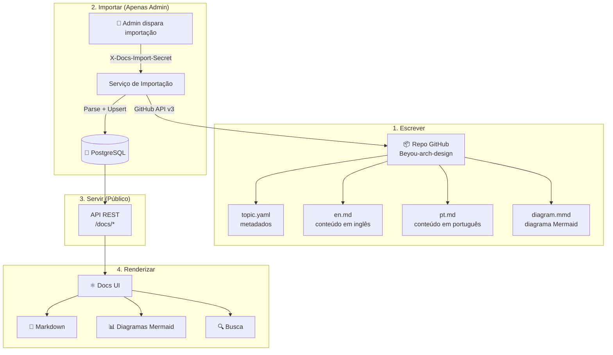
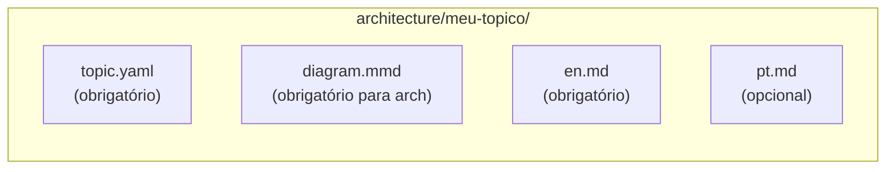
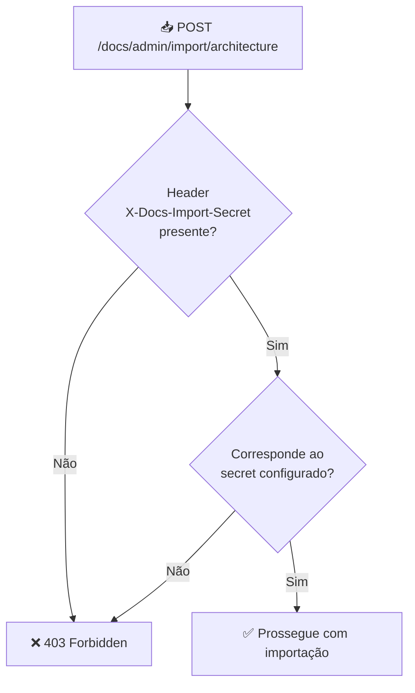
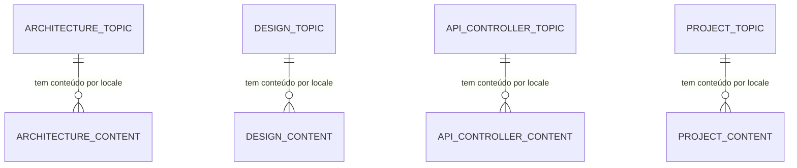
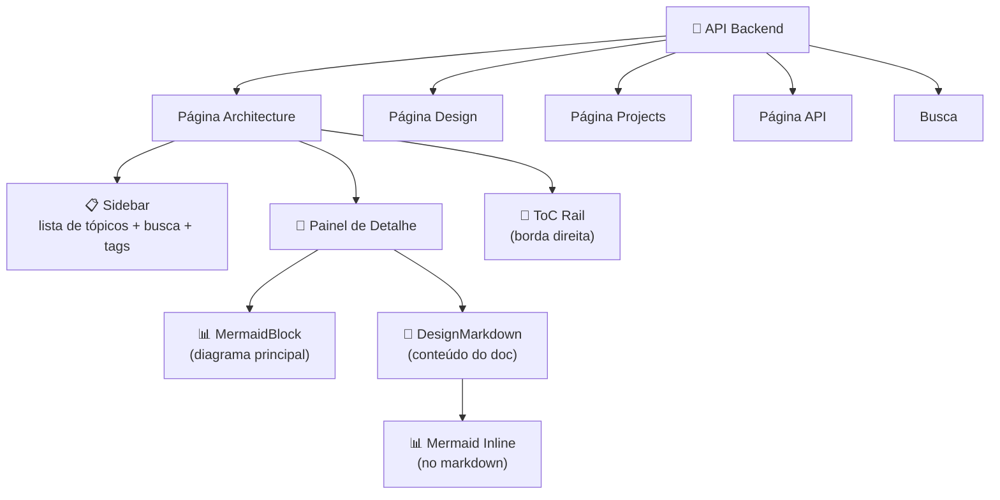

Este documento explica o pipeline completo de documentação no Beyou: como docs são escritos em um repo GitHub, importados para o banco por admins, servidos via API pública e renderizados na docs UI com diagramas Mermaid e markdown.

## O Pipeline

A documentação no Beyou segue um pipeline unidirecional: escrever no GitHub, importar para o DB, servir para a UI.



## Tipos de Doc

O sistema suporta quatro categorias de documentação, cada uma com seu próprio diretório no GitHub, endpoint de importação, tabelas no banco e API:

| Tipo | Caminho GitHub | Endpoint de Importação | Endpoints da API | Conteúdo |
|------|---------------|----------------------|------------------|----------|
| **Architecture** | architecture/ | /docs/admin/import/architecture | /docs/architecture/topics | Design de sistema, diagramas, decisões técnicas |
| **Design** | design/ | /docs/admin/import/design | /docs/design/topics | Fluxos UX, jornadas de usuário, padrões de design |
| **API** | api/ | /docs/admin/import/api | /docs/api/controllers | Specs OpenAPI, documentação de endpoints |
| **Projects** | projects/ | /docs/admin/import/projects | /docs/projects/topics | Visões gerais por repo, tópicos relacionados |

## Estrutura de Arquivos no GitHub

Cada tópico é um diretório dentro da pasta do seu tipo de doc. A convenção de arquivos é:



### topic.yaml

Metadados do tópico:

| Campo | Tipo | Obrigatório | Propósito |
|-------|------|-------------|-----------|
| key | string | Sim | Identificador único (corresponde ao nome do diretório) |
| orderIndex | integer | Sim | Ordem de exibição na sidebar |
| status | string | Sim | ACTIVE, DRAFT ou ARCHIVED |
| tags | lista de string | Não | Tags filtráveis |
| projectKey | string | Não | Link para um tópico de projeto |

### en.md / pt.md

Conteúdo markdown com frontmatter YAML:

| Campo | Localização | Obrigatório | Propósito |
|-------|------------|-------------|-----------|
| title | Frontmatter | Sim | Título de exibição |
| summary | Frontmatter | Sim | Descrição em uma linha |
| (corpo) | Após frontmatter | Sim | Conteúdo markdown completo |

Diagramas Mermaid inline são suportados via blocos de código cercados.

### diagram.mmd

Código Mermaid bruto para o diagrama principal do tópico. Renderizado separadamente do conteúdo markdown em um painel dedicado.

### Variante para docs de API

Docs de API usam uma estrutura ligeiramente diferente:

| Arquivo | Propósito |
|---------|-----------|
| controller.yaml | Metadados (key, orderIndex, status) |
| openapi.yaml | Especificação OpenAPI 3.0 |
| en.md / pt.md | Markdown complementar opcional |

## Pipeline de Importação Admin

A importação é o núcleo do sistema — ela puxa docs do GitHub e sincroniza no banco de dados.

### Segurança

O endpoint de importação é protegido pelo DocsImportSecretFilter:



- O secret é configurado via variável de ambiente DOCS_IMPORT_SECRET
- O filtro roda como OncePerRequestFilter, posicionado após o UsernamePasswordAuthenticationFilter do Spring Security
- Também protege endpoints /actuator
- Requisições preflight CORS (OPTIONS) passam sem verificação

**Importante:** Endpoints de leitura regulares (/docs/architecture/topics, etc.) são públicos — sem autenticação necessária. Apenas os endpoints /docs/admin/* de importação requerem o secret.

### Fluxo de importação

```mermaid
sequenceDiagram
  participant ADM as Admin
  participant BE as Serviço de Importação
  participant GH as GitHub API
  participant PAR as Parser
  participant DB as Database

  rect rgba(59, 130, 246, 0.25)
  ADM->>BE: 🔐 POST /docs/admin/import/architecture
  BE->>GH: GET /repos/owner/name/contents/architecture/?ref=main
  GH-->>BE: Listagem do diretório (pastas de tópicos)
  end

  loop Cada diretório de tópico
    BE->>GH: GET .../contents/architecture/meu-topico/
    GH-->>BE: Listagem de arquivos
    BE->>GH: GET topic.yaml (conteúdo Base64)
    BE->>GH: GET diagram.mmd (conteúdo Base64)
    BE->>GH: GET en.md (conteúdo Base64)
    BE->>GH: GET pt.md (conteúdo Base64)
    GH-->>BE: Conteúdos dos arquivos
    BE->>PAR: Parse metadados YAML + frontmatter do markdown
    PAR-->>BE: Dados estruturados do tópico
  end

  rect rgba(168, 85, 247, 0.25)
  BE->>DB: 🔄 Upsert tópicos (inserir novos, atualizar existentes)
  BE->>DB: 📦 Arquivar tópicos que não estão mais no GitHub
  BE-->>ADM: { importedTopics: N, archivedTopics: M }
  end
```

### O que acontece durante a importação

1. **Buscar diretório** — Chama a GitHub API v3 para listar o conteúdo da pasta do tipo de doc
2. **Buscar cada tópico** — Para cada subdiretório, busca topic.yaml, diagram.mmd, en.md, pt.md
3. **Parsear arquivos** — YAML é parseado para metadados, frontmatter do markdown é extraído para title/summary, corpo é armazenado como está
4. **Decodificar Base64** — A GitHub API retorna conteúdo de arquivo como Base64, que é decodificado antes do parsing
5. **Upsert** — Se a key do tópico já existe no banco, é atualizado. Se novo, é inserido.
6. **Arquivar** — Tópicos que existem no banco mas não estão mais presentes no GitHub são marcados como ARCHIVED

### Configuração

Todas as configurações de importação estão no application.yaml, sobrescrevíveis via variáveis de ambiente:

| Variável | Propósito | Padrão |
|----------|-----------|--------|
| DOCS_IMPORT_REPO_OWNER | Dono do repo GitHub | AndDev741 |
| DOCS_IMPORT_REPO_NAME | Nome do repo GitHub | beyou-arch-design |
| DOCS_IMPORT_BRANCH | Branch git para importar | main |
| DOCS_IMPORT_SECRET | Secret para endpoint admin | (obrigatório) |
| DOCS_IMPORT_GITHUB_TOKEN | Token da GitHub API (opcional) | (nenhum — usa rate limit não autenticado) |

## Modelo do Banco de Dados

Cada tipo de doc tem duas tabelas: uma para o tópico e uma para conteúdo específico por locale.



### Tabelas de architecture topic

**docs_architecture_topic**

| Coluna | Tipo | Notas |
|--------|------|-------|
| id | UUID | Chave primária |
| key | String | Único, nome do diretório do tópico |
| orderIndex | Integer | Ordem de exibição |
| status | String | ACTIVE / DRAFT / ARCHIVED |
| tags | String | Array JSON armazenado como texto |
| projectKey | String | Link opcional para um tópico de projeto |
| createdAt | Timestamp | Definido na criação |
| updatedAt | Timestamp | Atualizado na importação |

**docs_architecture_topic_content**

| Coluna | Tipo | Notas |
|--------|------|-------|
| id | UUID | Chave primária |
| locale | String | "en" ou "pt" |
| title | String | Do frontmatter do markdown |
| summary | String | Do frontmatter do markdown |
| diagramMermaid | Text | Código Mermaid bruto do diagram.mmd |
| docMarkdown | Text | Corpo completo do markdown (sem frontmatter) |
| topic_id | UUID | Chave estrangeira para o tópico pai |

Outros tipos de doc seguem o mesmo padrão. Docs de API adicionalmente armazenam a spec OpenAPI em um campo apiCatalog. Docs de projeto armazenam campos extras como repositoryUrl, designTopicKey e architectureTopicKey.

## API Pública

Todos os endpoints de leitura são públicos (sem auth) e suportam locale via query parameter.

### Architecture

| Endpoint | Método | Resposta |
|----------|--------|----------|
| /docs/architecture/topics?locale=en | GET | Lista de tópicos (key, title, summary, status, tags, updatedAt) |
| /docs/architecture/topics/{key}?locale=en | GET | Detalhe completo (title, summary, status, tags, diagramMermaid, docMarkdown, projectKey, updatedAt) |

### Design, Projects, API

Mesmo padrão — /docs/design/topics, /docs/projects/topics, /docs/api/controllers — com campos específicos do tipo.

### Busca

| Endpoint | Método | Parâmetros | Resposta |
|----------|--------|-----------|----------|
| /docs/search | GET | q (obrigatório, mín 2 chars), locale, category (all/architecture/design/api/project), limit, offset | Resultados paginados com score e destaques |

Comportamento da busca:

- Busca em título e resumo de todos os tópicos ativos
- Score: 1.0 para match no título, 0.5 para match no resumo
- Destaca texto correspondente com tags mark
- Filtra por locale e categoria
- Resultados ordenados por score decrescente

## Renderização na Docs UI

A docs UI busca dados da API pública e renderiza com componentes especializados.



### Stack de renderização

| Componente | Propósito | Tecnologia |
|-----------|---------|-----------|
| **DesignMarkdown** | Renderiza markdown com suporte GFM | react-markdown + remark-gfm |
| **MermaidBlock** | Renderiza diagrama principal com botão de maximizar | mermaid v11 + dialog |
| **MermaidRenderer** | Renderização Mermaid core com awareness de tema | mermaid.initialize() com tema customizado |
| **MermaidPreview** | Diagrama em tela cheia com pan/zoom | Dialog + controles customizados |

### Funcionalidades de markdown

O componente DesignMarkdown trata:

- **Headings** — IDs auto-gerados (slugificados) para navegação do ToC
- **Blocos Mermaid** — Blocos de código cercados com linguagem "mermaid" renderizam como diagramas interativos
- **Tabelas** — Envolvidas em container com scroll horizontal para mobile
- **Código inline** — Estilizado com background na cor primária
- **Blocos de código** — Syntax-highlighted com scroll de overflow

### Integração de tema

Diagramas Mermaid se adaptam automaticamente ao tema atual da UI:

- Cores de background, primária e texto extraídas do tema ativo
- Detecção de modo dark/light via cálculo de luminância
- Config Mermaid customizada reconstruída a cada mudança de tema
- Fonte: Source Serif 4 (corresponde à tipografia da docs UI)

## Funcionalidades da Página Architecture

A página Architecture é o viewer de docs mais completo:

| Funcionalidade | Como funciona |
|---------------|-------------|
| **Busca na sidebar** | Filtra tópicos por título, resumo e tags (client-side) |
| **Filtro por tags** | Clique em tags para filtrar sidebar; suporta múltiplas tags ativas |
| **Seleção de tópico** | Clique no tópico na sidebar, URL sincroniza via param ?topic= |
| **Badges de status** | ACTIVE (verde), DRAFT (âmbar), ARCHIVED (cinza) |
| **Tempo de leitura** | Estimado pela contagem de palavras do markdown |
| **Datas relativas** | "Hoje", "Ontem", "Xd atrás" — bilíngue |
| **Diagrama principal** | MermaidBlock com maximizar/tela cheia |
| **Diagramas inline** | Blocos Mermaid dentro do markdown renderizam como diagramas |
| **ToC rail** | Rail estilo Notion na borda direita com indicadores de linha; expande ao hover para mostrar texto dos headings |
| **Stale-while-revalidate** | Conteúdo anterior permanece visível (escurecido) enquanto novo tópico carrega |

## Possíveis Melhorias

| Área | Estado Atual | Sugestão |
|------|-------------|----------|
| Automação da importação | Disparo manual via chamada API | Adicionar webhook do GitHub ou cron agendado para auto-importar no push |
| Profundidade da busca | Apenas título + resumo | Adicionar busca full-text no conteúdo docMarkdown |
| Histórico de versões | Apenas versão mais recente armazenada | Rastrear histórico de importação com diffs |
| Preview de draft | Drafts visíveis na sidebar | Adicionar modo preview para tópicos DRAFT antes de publicar |
| Suporte offline | Nenhum | Cachear respostas da API para leitura offline |
| Edição pela UI | Somente leitura | Adicionar modo editor que commita de volta para o GitHub |
