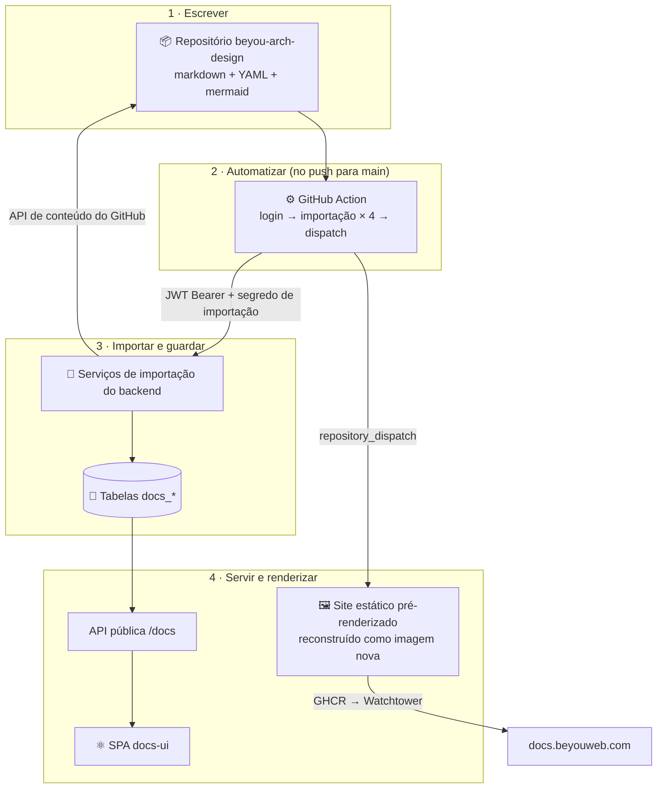

Este documento explica o pipeline que publica a página que você está lendo: onde o conteúdo vive, como chega ao banco, como é servido e buscado, e como o site estático de docs se reconstrói quando o conteúdo muda.

## O pipeline

```mermaid
flowchart TD
  subgraph write["1 · Escrever"]
    GH["📦 Repositório beyou-arch-design<br/>markdown + YAML + mermaid"]
  end

  subgraph automate["2 · Automatizar (no push para main)"]
    WF["⚙️ GitHub Action<br/>login → importação × 4 → dispatch"]
  end

  subgraph store["3 · Importar e guardar"]
    BE["🍃 Serviços de importação do backend"]
    DB[("🐘 Tabelas docs_*")]
  end

  subgraph serve["4 · Servir e renderizar"]
    API["API pública /docs"]
    UI["⚛️ SPA docs-ui"]
    PRE["🖼️ Site estático pré-renderizado<br/>reconstruído como imagem nova"]
  end

  GH --> WF
  WF -->|"JWT Bearer + segredo de importação"| BE
  BE -->|"API de conteúdo do GitHub"| GH
  BE --> DB
  DB --> API
  API --> UI
  WF -->|"repository_dispatch"| PRE
  PRE -->|"GHCR → Watchtower"| LIVE["docs.beyouweb.com"]
```

Um merge de conteúdo na main é o deploy inteiro: o workflow importa cada área e, quando as quatro passam, dispara o build do docs-ui, que pré-renderiza cada rota contra a API fresca e publica uma imagem nova que o Watchtower pega. Mudança de conteúdo chega como container novo, nunca como restart.

## As quatro áreas

Toda área segue a mesma forma: um diretório por tópico, um descritor YAML e um arquivo markdown por idioma (`en.md`, `pt.md`; o idioma é o nome do arquivo).

| | architecture | blog | api | projects |
|---|---|---|---|---|
| Descritor | topic.yaml | topic.yaml | controller.yaml | topic.yaml |
| Também obrigatório | diagram.mmd | nada mais | openapi.yaml | diagram.mmd |
| Pelo menos um .md | sim | sim | sim | sim |
| Valores de status | ACTIVE, DRAFT, ARCHIVED | ACTIVE, ARCHIVED | ACTIVE, DRAFT, ARCHIVED | ACTIVE, DRAFT, ARCHIVED, PLANNING |

O descritor do blog é o rico: categoria (TECHNICAL ou PLANNING), tags, flag de destaque, publishedAt, autor, emoji de capa e uma cor de capa que precisa casar com um hex de seis dígitos ou é descartada em silêncio. O frontmatter do markdown é um parser plano feito à mão, não YAML completo: só `title` e `summary` são lidos, chaves desconhecidas são ignoradas e uma cerca de fechamento faltando falha a importação. Um arquivo sem frontmatter é legal; o título cai para a chave do tópico.

O armazenamento segue um padrão repetido: uma linha de tópico (identidade, ordem, status) mais uma linha de conteúdo por idioma (título, resumo, docMarkdown e, por área, o diagrama mermaid ou o texto cru do OpenAPI). Duas curiosidades que valem saber: o diagrama é copiado em cada linha de idioma, e a área de projects guarda seus campos relacionais (URL do repositório, chaves de tópicos ligados) na linha de conteúdo, não no tópico.

## A importação

O `POST /docs/admin/import/{area}` fica atrás de duas portas independentes: a requisição precisa de um JWT válido (qualquer usuário autenticado) e o header `X-Docs-Import-Secret` precisa casar com o segredo configurado em tempo constante. O comentário do workflow memoriza o diagnóstico: 401 significa que o token foi rejeitado, 403 que o segredo foi.

O importador caminha pela API de conteúdo do GitHub: lista a raiz da área, lista cada diretório de tópico, busca cada arquivo, decodifica o base64. Dono, nome, branch e caminho do repositório vêm da configuração e podem ser sobrescritos por requisição. Depois, por tópico:

- **Upsert**: chaves existentes são atualizadas no lugar, novas são inseridas. Um arquivo de idioma que sumiu do repositório apaga sua linha de conteúdo.
- **Arquivamento**: depois da caminhada, qualquer tópico da tabela cuja chave não apareceu nesta rodada vira ARCHIVED. Nada é apagado de verdade, e recolocar o diretório restaura o status do descritor, então arquivar é reversível por construção.
- A resposta reporta os dois números, que é de onde vêm as linhas "N imported, M archived" do workflow. O contador de importados conta cada diretório processado, não só os novos.

Cada área importa em uma transação, com seus caches evictados ao final, então leitores nunca veem meia importação. As quatro áreas são quatro chamadas HTTP separadas, porém: uma falha no meio deixa as áreas anteriores commitadas e pula a reconstrução do site. E o modo de falha é rígido de propósito: um diretório de tópico malformado aborta a área inteira. Um exemplo real: um diretório de controller já chegou só com o openapi.yaml, e toda importação falhou com `Missing controller.yaml in api/xp` até os arquivos de metadados chegarem.

Uma borda operacional afiada: sem um token do GitHub configurado, o importador roda no limite anônimo de 60 requisições por hora, e uma rodada completa das quatro áreas precisa de cerca de 175 chamadas. A falha aparece como um genérico "could not fetch". Na prática, o token não é opcional.

## A automação

O workflow `publish-docs` dispara em qualquer push na main que toque os quatro diretórios de conteúdo. Três passos, todos curl:

1. **Login** com uma conta dedicada de importação, lendo o JWT do header de resposta `X-Access-Token`, mascarado nos logs.
2. **Importação** de cada área em sequência com os dois headers de autenticação; um não-200 aborta.
3. **Dispatch** de um evento `docs-content-updated` para o repositório do docs-ui (com um PAT, já que o token padrão do workflow não levanta eventos entre repositórios). O CI do docs-ui então pré-renderiza cada rota por idioma contra a API pública e publica a imagem nova.

Execuções entram em fila em vez de serem canceladas sob concorrência, por uma razão sutil: o passo de arquivamento de uma execução velha terminando depois de uma nova poderia arquivar tópicos que a nova acabou de importar.

## A API pública

Todos os endpoints de leitura são públicos e cientes de idioma (`?locale=`, padrão inglês, caindo para inglês quando um idioma falta). Listas devolvem só tópicos ACTIVE ordenados por orderIndex (o blog ordena por data de publicação); detalhes buscam por chave.

| Área | Lista | O detalhe adiciona |
|------|-------|--------------------|
| /docs/architecture/topics | chave, título, resumo, ordem, status, tags, projectKey | diagramMermaid, docMarkdown |
| /docs/blog/topics | campos de capa, categoria, tags, destaque, autor, datas | docMarkdown |
| /docs/api/controllers | chave, título, resumo, ordem | apiCatalog (o OpenAPI cru) |
| /docs/projects/topics | chave, título, resumo, ordem, status, tags | docMarkdown, diagrama, repositoryUrl, chaves ligadas |

As tags cruzam o fio como uma string JSON, não um array; os clientes fazem o parse. Uma nota de honestidade: só as consultas de lista filtram por status. Um tópico ARCHIVED ou DRAFT continua alcançável pela URL direta, então arquivar tira da lista, não do ar.

## Busca

O `GET /docs/search` é híbrido: uma consulta SQL por área afunila candidatos por casamento sem caixa em título e resumo, e então pontuação, destaque, ordenação e paginação acontecem em memória sobre o conjunto unido. Acerto no título pontua 1.0, no resumo 0.5. Os destaques voltam como fragmentos alternados de texto puro e marcado, que o cliente concatena. O corpo dos documentos nunca é buscado, só títulos e resumos.

Leituras são cacheadas (dois caches Caffeine por área, TTL de 120 minutos, derrubados por inteiro a cada importação); a busca não é.

## Renderização no site de docs

O docs UI busca esses endpoints e renderiza markdown com suporte a GFM, blocos mermaid inline como diagramas vivos, o diagrama principal do tópico em um painel expansível e um trilho de sumário na borda direita. As cores do mermaid são reconstruídas do tema ativo a cada troca. Páginas de detalhe são endereçadas por caminho (`/architecture/{chave}` sob um prefixo de idioma), e a listagem de arquitetura abre seu primeiro tópico automaticamente. Para os crawlers, cada rota também existe como HTML estático pré-renderizado dentro da imagem do site, construído no build, que é o que mantém o conteúdo legível para buscadores e crawlers de IA que nunca rodam JavaScript.

## Lacunas conhecidas e bordas afiadas

| Área | Problema |
|------|----------|
| Cross-link de projects | O parser lê um campo `designTopicKey` enquanto todos os arquivos de conteúdo declaram `blogTopicKey`, então o link cruzado para o blog nunca chega à UI. Parser e conteúdo precisam concordar |
| Locale da busca | O endpoint de busca pula a normalização de idioma que os endpoints de leitura usam, então um locale maiúsculo ou regional devolve nada |
| Cliente do GitHub | O RestTemplate da importação não tem timeouts; uma resposta travada do GitHub segura a transação aberta |
| Duplicação | Quatro serviços de importação quase idênticos com helpers copiados e três cópias do parser de frontmatter |
| Cobertura de testes | Testes de importação existem só para a área de arquitetura; blog, api e projects estão sem testes |
