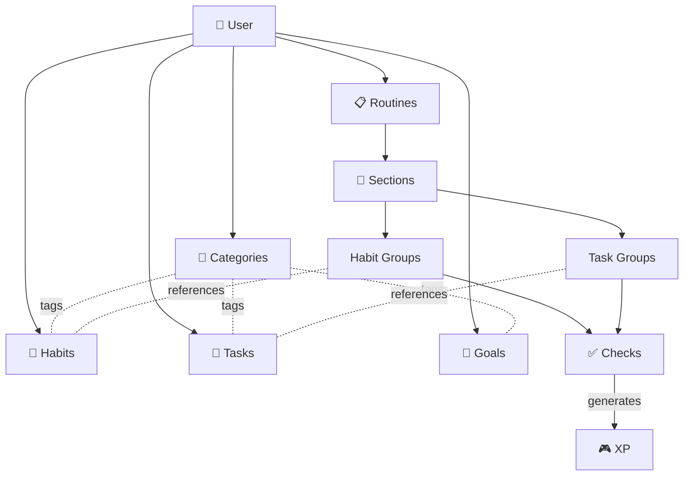
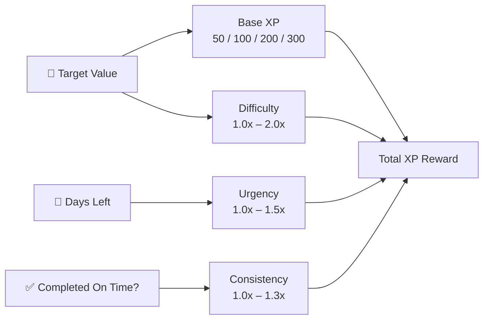
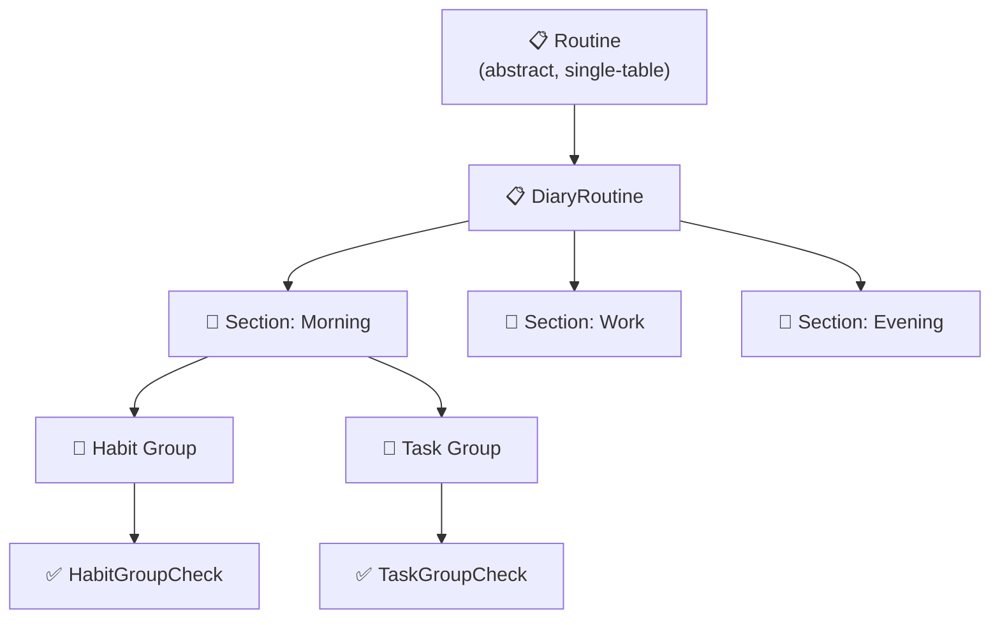
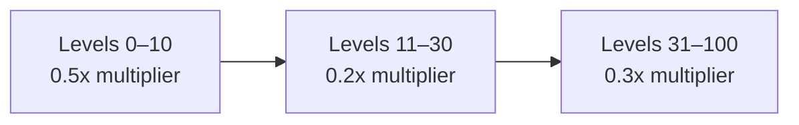
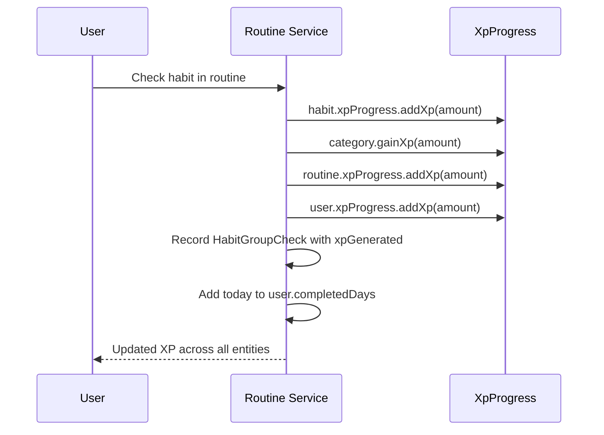
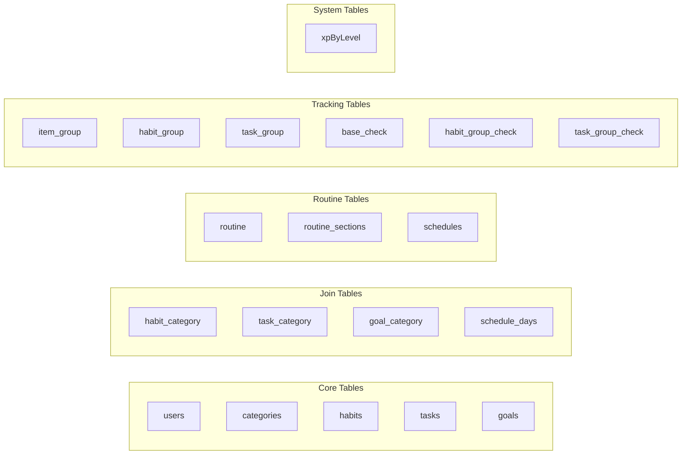

This document covers every entity in the Beyou domain, explaining both what it does for the user and how it is structured in the database. The goal is to give contributors a clear mental model of the data layer before reading or writing code.

## The Big Picture

Beyou's domain revolves around a simple idea: a user creates habits, tasks, and goals, organizes them into categories, and executes them through daily routines. Every action generates XP that levels up the user, the habit, the category, and the routine — creating a gamification loop that rewards consistency.

## User

**Product role** — The central entity. Every piece of data in Beyou belongs to a user. The user has a profile (name, photo, motivational phrase), preferences (theme, language, dashboard widgets), and a gamification state (XP, level, constance streak).

**Key fields**

| Field | Type | Notes |
|-------|------|-------|
| id | UUID | Auto-generated |
| name | String | Min 2 chars |
| email | String | Unique, validated |
| password | String | Min 6 chars, hashed |
| isGoogleAccount | boolean | True for OAuth users |
| perfilPhrase / perfilPhraseAuthor | String | Optional motivational quote |
| perfilPhoto | String | Profile photo URL |
| themeInUse | String | Current theme preference |
| languageInUse | String | en or pt |
| widgetsIdInUse | List of String | Active dashboard widget IDs |
| isTutorialCompleted | boolean | Onboarding flag |
| maxConstance | Integer | Highest streak ever achieved |
| completedDays | Set of LocalDate | Days with completed routine activity |
| userRole | UserRole enum | Always USER |
| constanceConfiguration | ConstanceConfiguration enum | ANY or COMPLETE |

**Embedded:** XpProgress (xp, level, actualLevelXp, nextLevelXp)

**Relationships**

- Owns Categories, Habits, Tasks, Goals, Routines (OneToMany, cascade all, orphan removal)

**Business logic**

- getCurrentConstance(referenceDate) calculates the current streak by walking backwards through completedDays from the most recent date. This powers the streak counter on the dashboard.
- Implements Spring Security UserDetails for authentication.

## Category

**Product role** — Categories let users organize their habits, tasks, and goals by topic (e.g., "Health", "Career", "Personal"). Categories also earn XP, so users can see which area of their life they are investing the most effort into.

**Key fields**

| Field | Type | Notes |
|-------|------|-------|
| id | UUID | Auto-generated |
| name | String | Min 2, max 256 chars |
| description | String | Max 256 chars, optional |
| iconId | String | Icon identifier |

**Embedded:** XpProgress

**Relationships**

- Belongs to a User (ManyToOne)
- Tagged to Habits, Tasks, Goals (ManyToMany, inverse side via join tables habit_category, task_category, goal_category)

**Business logic**

- gainXp / loseXp methods delegate to XpProgress with a level provider function that looks up the XpByLevel table.

## Habit

**Product role** — A habit is a behavior the user wants to track and improve over time. Each habit has its own level and XP progression, encouraging the user to keep showing up. Habits are assigned importance and difficulty ratings that influence XP rewards.

**Key fields**

| Field | Type | Notes |
|-------|------|-------|
| id | UUID | Auto-generated |
| name | String | Min 2, max 256 chars |
| description | String | Max 256, optional |
| iconId | String | Icon identifier |
| importance | Integer | 1–4 scale |
| dificulty | Integer | 1–4 scale |
| motivationalPhrase | String | Max 256, optional |
| constance | int | Current streak counter, starts at 0 |

**Embedded:** XpProgress

**Relationships**

- Belongs to a User (ManyToOne)
- Tagged by Categories (ManyToMany, owning side, join table habit_category)
- Referenced by HabitGroups inside routines (OneToMany, cascade all, no orphan removal)

## Task

**Product role** — Tasks are concrete actions the user needs to do. Unlike habits, tasks can be one-time (e.g., "Buy groceries") or recurring. One-time tasks support soft deletion via a markedToDelete date, giving the system a grace period before permanent removal.

**Key fields**

| Field | Type | Notes |
|-------|------|-------|
| id | UUID | Auto-generated |
| name | String | Optional |
| description | String | Optional |
| iconId | String | Optional |
| importance | Integer | Optional, 1–4 scale |
| dificulty | Integer | Optional, 1–4 scale |
| oneTimeTask | boolean | True for non-recurring tasks |
| markedToDelete | LocalDate | Soft delete timestamp |

**Relationships**

- Belongs to a User (ManyToOne)
- Tagged by Categories (ManyToMany, owning side, join table task_category)

**Note** — Tasks do not have their own XP progression. They earn XP indirectly when checked inside a routine.

## Goal

**Product role** — Goals are target-based objectives with a measurable target (e.g., "Run 100 km", "Read 12 books"). Users track progress via currentValue / targetValue and earn a calculated XP reward upon completion.

**Key fields**

| Field | Type | Notes |
|-------|------|-------|
| id | UUID | Auto-generated |
| name | String | Required |
| iconId | String | Required |
| description | String | Optional |
| targetValue | Double | The numeric target |
| unit | String | Measurement unit (km, books, etc.) |
| currentValue | Double | Current progress |
| complete | Boolean | Completion flag |
| motivation | String | Optional motivational text |
| startDate | LocalDate | When the goal starts |
| endDate | LocalDate | Deadline |
| xpReward | double | Calculated XP on completion |
| completeDate | LocalDate | When it was completed |
| status | GoalStatus enum | NOT_STARTED, IN_PROGRESS, COMPLETED |
| term | GoalTerm enum | SHORT_TERM, MEDIUM_TERM, LONG_TERM |

**Relationships**

- Belongs to a User (ManyToOne)
- Tagged by Categories (ManyToMany, owning side, join table goal_category)

**XP calculation** — GoalXpCalculator computes the reward based on four factors:

- Base XP scales with target value (50 for small goals, 300 for large ones)
- Difficulty multiplier rewards harder goals (up to 2.0x for targets over 200)
- Urgency multiplier rewards tight deadlines (1.5x for goals due within 7 days)
- Consistency multiplier rewards completing before the deadline (1.3x)

## Routine

**Product role** — Routines are the core daily execution tool. A user defines a routine with sections (e.g., "Morning", "Work", "Evening"), each containing habit and task groups. Every day, the user opens their routine and checks off items, generating XP across all related entities.

**Inheritance** — Routine is an abstract base class using JPA single-table inheritance. Currently the only concrete type is DiaryRoutine (daily routine with sections).

### Routine (abstract base)

| Field | Type | Notes |
|-------|------|-------|
| id | UUID | Auto-generated |
| name | String | Required |
| iconId | String | Optional |

**Embedded:** XpProgress

**Relationships**

- Belongs to a User (ManyToOne)
- Linked to a Schedule (OneToOne, optional)

### DiaryRoutine

Extends Routine. Adds:

- routineSections (OneToMany, cascade all, ordered by orderIndex ASC)

### RoutineSection

**Product role** — Sections divide a routine into time blocks. Each section can have a start/end time and be marked as favorite.

| Field | Type | Notes |
|-------|------|-------|
| id | UUID | Auto-generated |
| name | String | Required |
| iconId | String | Optional |
| startTime | LocalTime | Optional |
| endTime | LocalTime | Optional |
| orderIndex | int | Position within the routine |
| favorite | Boolean | Optional |

**Relationships**

- Belongs to a Routine (ManyToOne)
- Contains TaskGroups and HabitGroups (OneToMany, cascade all, orphan removal)

## Schedule

**Product role** — A schedule defines which days of the week a routine is active. This determines whether a routine appears on the user's dashboard for a given day.

| Field | Type | Notes |
|-------|------|-------|
| id | UUID | Auto-generated |
| days | Set of WeekDay | Stored in schedule_days join table |

**WeekDay enum** — Monday, Tuesday, Wednesday, Thursday, Friday, Saturday, Sunday

## Item Groups and Checks

**Product role** — When a habit or task is placed inside a routine section, it becomes a "group" — a trackable instance that can be checked or skipped each day. Each check generates a historical record with date, time, and XP earned.

### ItemGroup (abstract base)

Uses JPA joined inheritance strategy.

| Field | Type | Notes |
|-------|------|-------|
| id | UUID | Auto-generated |
| startTime | LocalTime | Optional |
| endTime | LocalTime | Optional |

**Concrete types:**

- **HabitGroup** — references a Habit (ManyToOne), tracks via HabitGroupChecks (OneToMany, cascade all)
- **TaskGroup** — references a Task (ManyToOne), tracks via TaskGroupChecks (OneToMany, cascade all)

### BaseCheck (abstract base)

Uses JPA joined inheritance strategy.

| Field | Type | Notes |
|-------|------|-------|
| id | UUID | Auto-generated |
| checkDate | LocalDate | When the check happened |
| checkTime | LocalTime | Time of the check |
| checked | boolean | Was it completed? |
| skipped | Boolean | Was it skipped? |
| xpGenerated | double | XP earned from this check |

**Concrete types:**

- **HabitGroupCheck** — belongs to a HabitGroup
- **TaskGroupCheck** — belongs to a TaskGroup

## XP Progression System

**Product role** — Every entity that can earn XP (User, Category, Habit, Routine) shares the same embedded XpProgress component. This creates a consistent leveling experience across the app.

### XpProgress (embeddable)

| Field | Type | Notes |
|-------|------|-------|
| xp | double | Total accumulated XP |
| level | int | Current level |
| actualLevelXp | double | XP threshold for current level |
| nextLevelXp | double | XP threshold for next level |

**Level-up logic** — When xp reaches nextLevelXp, the level increments and boundaries recalculate from the XpByLevel table. The reverse happens when XP is removed.

### XpByLevel table

Seeded at application startup by XpByLevelSeeder. Defines 101 levels (0–100) with progressive difficulty:

Formula per level: xp += (level + 1) * 100 * multiplier

Early levels are fast to encourage new users. Mid levels slow down. Late levels require sustained effort.

### XP flow on a routine check

## Inheritance Strategies

The domain uses two JPA inheritance strategies:

| Strategy | Used by | How it works |
|----------|---------|-------------|
| **Single Table** | Routine → DiaryRoutine | One table for all routine types, with a discriminator column. Fast queries, but nullable columns for type-specific fields. |
| **Joined** | ItemGroup → HabitGroup / TaskGroup, BaseCheck → HabitGroupCheck / TaskGroupCheck | Base table + child tables joined by foreign key. Cleaner schema, slightly more joins. |

## Cascade and Deletion Rules

Understanding cascades is critical for avoiding orphan data or accidental deletions.

| Parent | Children | Cascade | Orphan Removal |
|--------|----------|---------|----------------|
| User | Categories, Habits, Routines, Goals | ALL | Yes — deleting a user removes everything |
| DiaryRoutine | RoutineSections | ALL | No |
| RoutineSection | HabitGroups, TaskGroups | ALL | Yes — removing a section cleans up its groups |
| Habit | HabitGroups | ALL | No — deleting a habit does not remove it from routines automatically |
| HabitGroup | HabitGroupChecks | ALL | No — check history is preserved |
| TaskGroup | TaskGroupChecks | ALL | No — check history is preserved |

## Database Tables Summary

All primary keys are UUIDs. Timestamps (createdAt, updatedAt) are set via JPA lifecycle callbacks (@PrePersist, @PreUpdate).
