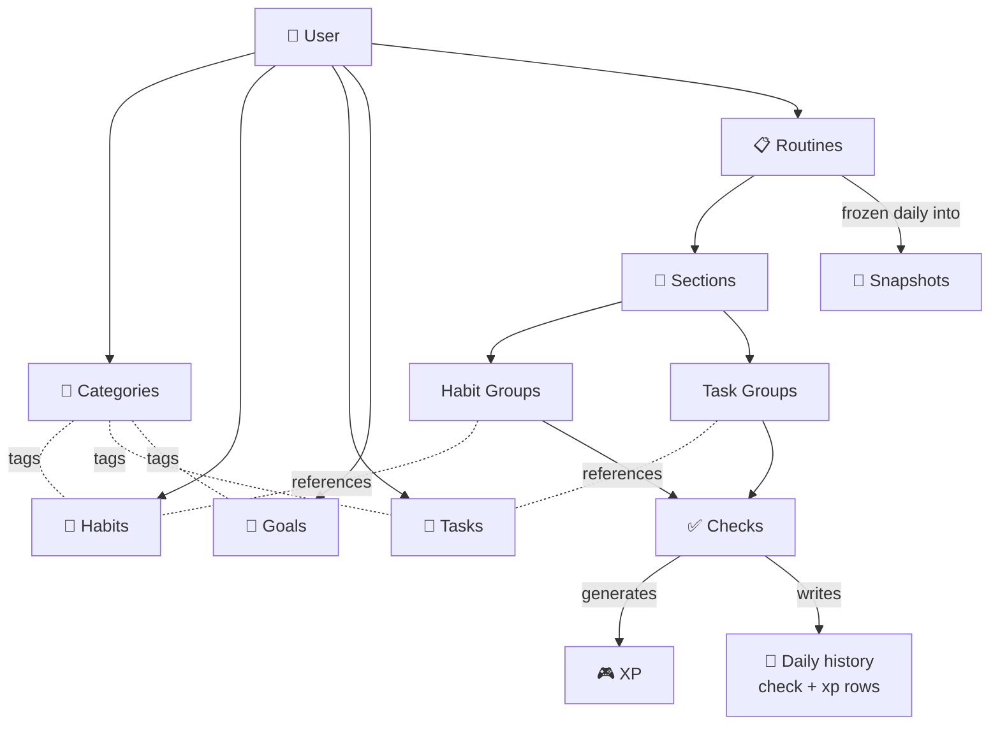
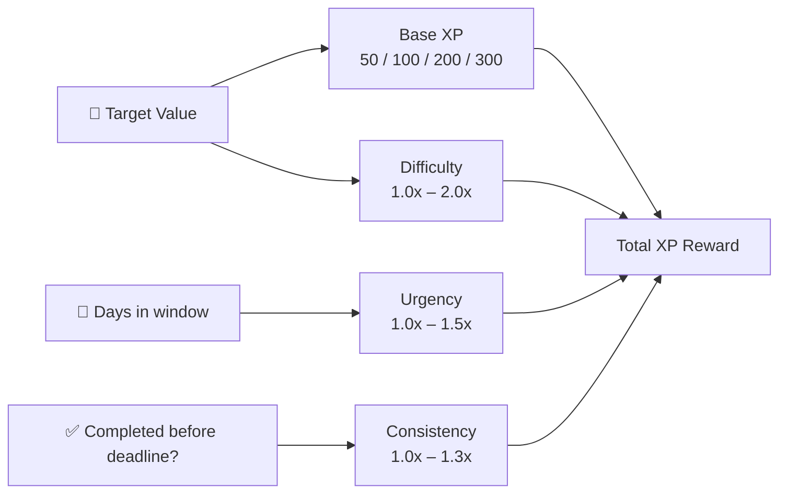
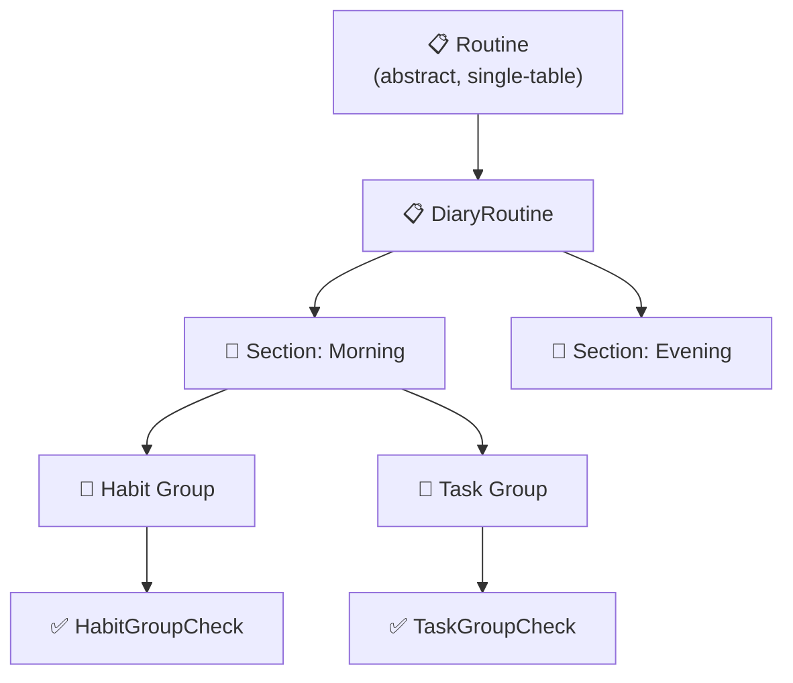
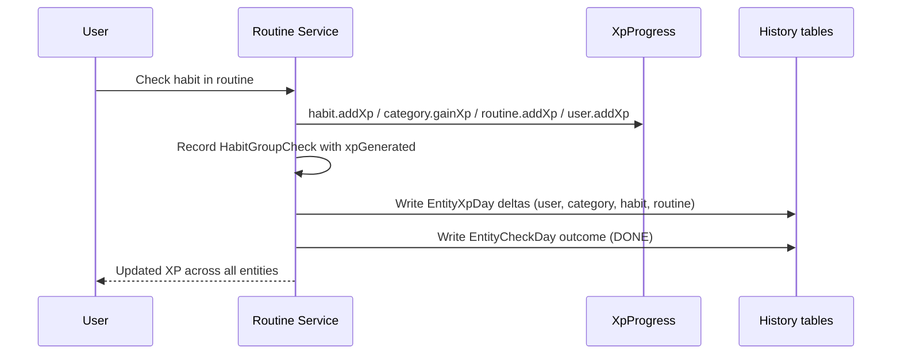
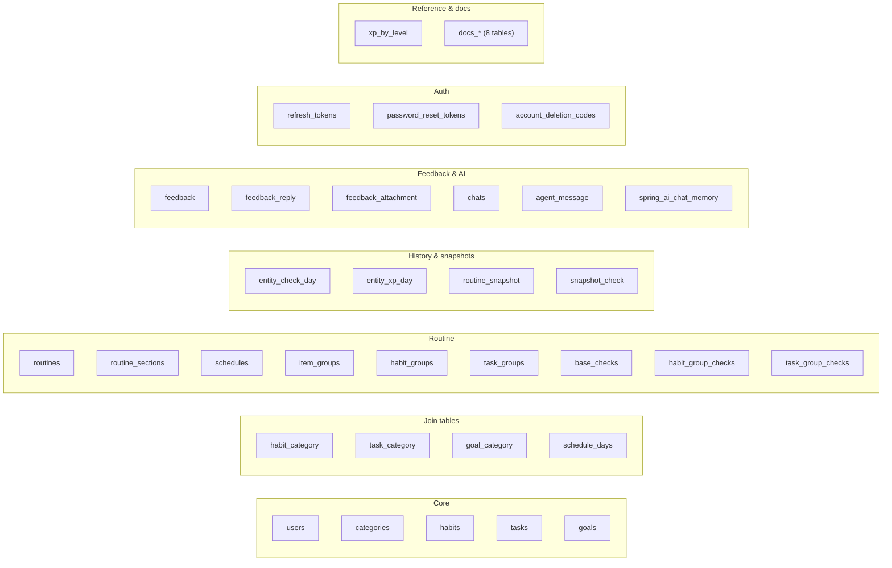

This document covers every entity in the Beyou domain, explaining what each one does for the user and how it is structured in the database. The goal is a clear mental model of the data layer before reading or writing code.

One ground rule shapes everything here: the schema belongs to Flyway. Migrations under `db/migration/` create and evolve every table, and Hibernate runs with `ddl-auto: validate` in every environment, so an entity mapping that disagrees with the migrations fails at startup instead of silently rewriting the schema.

## The big picture

Beyou's domain revolves around a simple idea: a user creates habits, tasks, and goals, organizes them into categories, and executes them through daily routines. Every check generates XP and writes history. Around that core loop sit four supporting families: daily history rows, immutable routine snapshots, feedback threads, and the AI agent's chats.


```mermaid
flowchart TD
  U["👤 User"]
  U --> CAT["📂 Categories"]
  U --> HAB["💪 Habits"]
  U --> TSK["📝 Tasks"]
  U --> GOL["🎯 Goals"]
  U --> RTN["📋 Routines"]

  CAT -.-|"tags"| HAB
  CAT -.-|"tags"| TSK
  CAT -.-|"tags"| GOL

  RTN --> SEC["📑 Sections"]
  SEC --> HG["Habit Groups"]
  SEC --> TG["Task Groups"]
  HG -.-|"references"| HAB
  TG -.-|"references"| TSK

  HG --> CHK["✅ Checks"]
  TG --> CHK
  CHK -->|"generates"| XP["🎮 XP"]
  CHK -->|"writes"| HIST["📅 Daily history<br/>check + xp rows"]
  RTN -->|"frozen daily into"| SNAP["🧊 Snapshots"]
```

## User

**Product role**: the central entity. Every piece of data in Beyou belongs to a user. The user has a profile (name, photo, motivational phrase), preferences (theme, language, timezone, dashboard widgets), a gamification state (XP, level, streaks), and two small text fields the AI agent uses as memory.

**Key fields**

| Field | Type | Notes |
|-------|------|-------|
| id | UUID | Auto-generated |
| name | String | |
| email | String | Unique |
| password | String | BCrypt hash |
| isGoogleAccount | boolean | True for OAuth users |
| emailVerified | boolean | New accounts confirm by e-mail before first login |
| verificationToken / verificationTokenExpiry | String / LocalDateTime | Verification state lives as columns here, not in a separate entity |
| perfilPhrase / perfilPhraseAuthor | String | Optional motivational quote |
| perfilPhoto | String (512) | Path to the stored photo file; bytes live on disk, not in the database |
| themeInUse / languageInUse | String | Preferences |
| timezone | String | Required, defaults to UTC. Drives snapshot dates and daily history |
| widgetsIdInUse | List of String | Active dashboard widget IDs |
| isTutorialCompleted | boolean | Onboarding flag |
| userContext | String (2000) | The AI agent's global memory about this user |
| xpDecayStrategy | XpDecayStrategy enum | GRADUAL, FLAT, or TIME_WINDOW; how late check-ins lose XP |
| maxConstance | Integer | Highest streak ever achieved |
| completedDays | Set of LocalDate | Days with completed routine activity |
| userRole | UserRole enum | USER or ADMIN (admin only by manual database update) |
| constanceConfiguration | ConstanceConfiguration enum | ANY or COMPLETE |

**Embedded**: XpProgress and CheckProgress (both described below).

**Relationships**: the user owns six collections, all OneToMany with cascade ALL and orphan removal: categories, habits, tasks, goals, routines, and routine snapshots. Account deletion works entirely through this cascade; the tasks collection was added precisely to close a gap in it.

**Business logic**: implements Spring Security's UserDetails. Streak calculation used to live here as a walk over completedDays; it now belongs to UserStreakService in the checkday package, on top of the daily history rows.

## Category

**Product role**: categories organize habits, tasks, and goals by life area ("Health", "Career"). Categories earn XP too, so users can see where they invest the most effort.

**Key fields**: name, description, iconId, timestamps.

**Embedded**: XpProgress only. Deliberately no CheckProgress: a category earns XP but is never itself checked.

**Relationships**

- Belongs to a User (ManyToOne).
- Tagged to Habits, Tasks, and Goals as the inverse side of three ManyToMany joins (habit_category, task_category, goal_category).

## Habit

**Product role**: a behavior the user wants to build. Each habit has its own level and XP progression, plus a streak record, so showing up keeps paying.

**Key fields**

| Field | Type | Notes |
|-------|------|-------|
| name / description / iconId | String | |
| importance | Integer | 1 to 4 |
| dificulty | Integer | 1 to 4. Yes, misspelled: it is the real field, column, and wire-format name |
| motivationalPhrase | String | Optional |

**Embedded**: XpProgress and CheckProgress. The old standalone `constance` counter is gone; CheckProgress replaced it.

**Relationships**

- Belongs to a User (ManyToOne).
- Tagged by Categories (ManyToMany, owning side, join table habit_category).
- Referenced by HabitGroups inside routines (OneToMany, cascade ALL, no orphan removal).

## Task

**Product role**: a concrete action. Unlike habits, tasks can be one-time ("Buy groceries"). One-time tasks get a soft-delete date after being checked, giving the system a grace period before a scheduler removes them.

**Key fields**

| Field | Type | Notes |
|-------|------|-------|
| name / description / iconId | String | |
| importance / dificulty | Integer | 1 to 4, same spelling as Habit |
| oneTimeTask | boolean | True for non-recurring tasks |
| markedToDelete | LocalDate | Set on completion of one-time tasks; TaskCleanupScheduler collects them |

**Embedded**: CheckProgress only. A task carries no XP of its own; checking one feeds the user, the routine, and the categories.

**Relationships**: belongs to a User (ManyToOne); tagged by Categories (ManyToMany, owning side, join table task_category).

## Goal

**Product role**: a measurable objective ("Run 100 km"). Progress is currentValue against targetValue, and completion pays a calculated XP reward.

**Key fields**

| Field | Type | Notes |
|-------|------|-------|
| name / iconId / description | String | |
| targetValue / currentValue | Double | The measurable part |
| unit | String | km, books, etc. |
| complete | Boolean | Completion flag |
| motivation | String | Optional |
| startDate / endDate | LocalDate | Window and deadline |
| xpReward | double | Calculated on completion |
| completeDate | LocalDate | |
| status | GoalStatus enum | NOT_STARTED, IN_PROGRESS, COMPLETED (stored as strings) |
| term | GoalTerm enum | SHORT_TERM, MEDIUM_TERM, LONG_TERM |

**Relationships**: belongs to a User (ManyToOne); tagged by Categories (ManyToMany, owning side, join table goal_category).

**Invariant worth knowing**: constructing a goal with status COMPLETED silently downgrades it to IN_PROGRESS. Only the explicit complete endpoint pays XP, so nobody can post a pre-completed goal and farm a reward.

**XP calculation**: GoalXpCalculator multiplies four factors.


```mermaid
flowchart LR
  TV["🎯 Target Value"] --> BASE["Base XP<br/>50 / 100 / 200 / 300"]
  TV --> DIFF["Difficulty<br/>1.0x – 2.0x"]
  DL["📅 Days in window"] --> URG["Urgency<br/>1.0x – 1.5x"]
  CD["✅ Completed before deadline?"] --> CON["Consistency<br/>1.0x – 1.3x"]
  BASE --> TOTAL["Total XP Reward"]
  DIFF --> TOTAL
  URG --> TOTAL
  CON --> TOTAL
```

- Base XP scales with target value: 50 under 10, 100 under 50, 200 under 200, 300 above.
- Difficulty rewards bigger targets, up to 2.0x at 200+.
- Urgency rewards tight windows: 1.5x for 7 days or less, 1.2x up to 30.
- Finishing before the deadline multiplies by 1.3x.

## The two shared components

Two embeddables carry the gamification state, and which entities embed which is a design decision in itself.

### XpProgress

| Field | Type | Notes |
|-------|------|-------|
| xp | double | Total accumulated XP |
| level | int | Current level |
| actualLevelXp / nextLevelXp | double | Boundaries of the current level |

Embedded by **User, Category, Habit, and Routine**: the four things that level up. `addXp` and `removeXp` walk the level curve in both directions through a level-lookup function, and cap at the top level.

### CheckProgress

| Field | Type | Notes |
|-------|------|-------|
| check_current_streak / check_best_streak | int | Streaks |
| check_total_check_ins | int | Lifetime count |
| check_first_check_in_date / check_last_check_in_date | LocalDate | Nullable bounds |

Embedded by **User, Habit, Task, and Routine**: the four things that get checked. Category is excluded on purpose, and Task appears here despite having no XP.

## Routine

**Product role**: the daily execution tool. A routine has sections ("Morning", "Work", "Evening"), each holding habit and task groups. Checking items generates XP across every related entity.

**Inheritance**: Routine is an abstract base using single-table inheritance with a `dtype` discriminator. DiaryRoutine is the only concrete type today.


```mermaid
flowchart TD
  R["📋 Routine<br/>(abstract, single-table)"]
  R --> DR["📋 DiaryRoutine"]
  DR --> RS1["📑 Section: Morning"]
  DR --> RS2["📑 Section: Evening"]
  RS1 --> HG1["💪 Habit Group"]
  RS1 --> TG1["📝 Task Group"]
  HG1 --> HC["✅ HabitGroupCheck"]
  TG1 --> TC["✅ TaskGroupCheck"]
```

### Routine (abstract base)

Fields: name, iconId. Embeds XpProgress and CheckProgress.

**Relationships**

- Belongs to a User (ManyToOne).
- Owns a Schedule (OneToOne, nullable, cascade REMOVE, owning side). Deliberately no orphan removal: unscheduling sets the reference to null and deletes the schedule row explicitly.

### DiaryRoutine

Extends Routine, adding routineSections (OneToMany, cascade ALL, orphan removal, ordered by orderIndex).

### RoutineSection

Fields: name, iconId, startTime, endTime, orderIndex, favorite.

**Relationships**: belongs to a Routine (ManyToOne); contains HabitGroups and TaskGroups (OneToMany, cascade ALL, orphan removal). One quirk to be aware of: these collections are unidirectional and mapped through join tables (routine_sections_habit_groups, routine_sections_task_groups), while ItemGroup also carries its own routine_section_id column. The section-to-group link is effectively mapped twice.

## Schedule

**Product role**: which days of the week a routine is active, which decides whether it appears on the dashboard for a given day.

The entity is minimal: an id plus a set of WeekDay enums stored in the schedule_days collection table. The foreign key lives on the routine's side. One gotcha: the enum identifiers are capitalized words (Monday, Tuesday, ...), not SCREAMING_CASE, and they are stored as strings, so every consumer has to match that casing.

## Item groups and checks

**Product role**: placing a habit or task inside a routine section creates a "group", the trackable instance that gets checked or skipped each day. Each check is a historical record with date, time, and the XP it generated.

**ItemGroup** (abstract, joined inheritance): startTime, endTime, and the ManyToOne back to its section. Concrete types HabitGroup (references a Habit) and TaskGroup (references a Task), each owning their check collections (cascade ALL, no orphan removal, so history survives).

**BaseCheck** (abstract, joined inheritance): checkDate, checkTime, checked, skipped, xpGenerated. Concrete types HabitGroupCheck and TaskGroupCheck, each owned by their group.

## Daily history: EntityCheckDay and EntityXpDay

**Product role**: the dashboard's history and progress widgets need per-day answers ("what happened to this habit on Tuesday?", "how much XP did this category earn this week?"). Walking the raw check tables for that is expensive and fragile, so two dedicated history tables record one row per entity per day.

**EntityCheckDay** (table entity_check_day): one outcome per entity per day, unique on (owner_type, owner_id, day).

- Outcomes: DONE, SKIPPED, MISSED, NOT_SCHEDULED, NOT_IN_ROUTINE. Only DONE advances a streak.
- Owner types: HABIT, TASK, ROUTINE, USER.
- The owner reference is a bare UUID with no foreign key, on purpose: history must outlive the routine or habit it was recorded through. The user reference is a real FK with cascade delete, so account deletion still sweeps it.

**EntityXpDay** (table entity_xp_day): the net XP delta per entity per day, same uniqueness pattern.

- The value is signed: unchecking an item produces a negative delta. Summing an owner's rows reproduces its XpProgress total.
- Owner types: USER, CATEGORY, HABIT, ROUTINE. Exactly the four XpProgress carriers, and deliberately different from the check-day set (this one has CATEGORY and no TASK).
- These rows feed the /xp/history endpoint, which returns dense series: one entry per day of the window, zeros included, so charts never skip days.

## Routine snapshots

**Product role**: routines change. Sections get renamed, habits get removed, whole routines get deleted. Without snapshots, yesterday's view of your day would silently rewrite itself. So every scheduled day, each routine is frozen into an immutable copy, and past days render exactly as they looked.

**RoutineSnapshot** (table routine_snapshot): unique per (routine, day).

- References the routine and, denormalized, the user, so a whole day loads in one query.
- Copies routineName and routineIconId, and stores structureJson: the full section/item tree as JSON, kept verbatim for rendering.
- Owns its SnapshotChecks (cascade ALL, orphan removal).

**SnapshotCheck** (table snapshot_check): one row per habit or task group in the frozen routine.

- Denormalized copies of the item's name, icon, difficulty, and importance, plus its section name.
- originalItemId and originalGroupId are loose UUIDs with no foreign keys, the same pattern as the history tables: the snapshot must survive edits and deletions of what it points at.
- Mutable state: checked, skipped, checkTime, xpGenerated. Item type is HABIT or TASK.

**Late check-ins and XP decay**: checking a past day through a snapshot still pays XP, but decayed according to the user's chosen XpDecayStrategy:

| Strategy | Behavior |
|----------|----------|
| GRADUAL | 0.8x one day late, then 0.6x, 0.4x, and 0.2x from four days on |
| FLAT | 0.5x no matter how late |
| TIME_WINDOW | Full XP up to two days late, nothing after |

The snapshot scheduler runs per timezone, using each account's own timezone column, so a routine is frozen at that user's midnight rather than the server's.

## Feedback

**Product role**: users report bugs and ask for features inside the app; an admin reads, replies, and tracks status.

- **Feedback** (table feedback): belongs to a User, holds the body text plus an embedded FeedbackContext (screen, app version, platform, language, theme) captured at send time. Category is BUG, FEATURE_REQUEST, or OTHER; status is OPEN, TAKING_CARE, or CLOSED and only the admin ever sees or changes it.
- **FeedbackReply**: a threaded reply. The author reference is nullable on purpose, so a reply survives its author's account deletion.
- **FeedbackAttachment**: a screenshot index row (width, height, size). The JPEG bytes live on disk under the upload directory, not in the database.

## AI agent chats

**Product role**: the agent chat that can create routines and answer questions keeps its conversations in the domain, with two layers of memory.

- **Chat** (table chats): belongs to a User, has a title and userContextInChat, a 1000-character chat-scoped memory the model rewrites as the conversation evolves. The user entity carries the 2000-character global counterpart (userContext).
- **AgentMessage** (table agent_message): deliberately has no JPA relationship to Chat, just a chatId column with the cascade owned by a database FK. Each message stores its role, a JSON array of content segments, and a sequenceId, unique per chat, which makes ordering explicit instead of timestamp-dependent.
- Spring AI manages its own spring_ai_chat_memory table for the model's short-term window; it has no JPA entity.

## Auth and account entities

Three small hash-holding entities back the security flows, all ManyToOne to User:

| Entity | Table | What it holds |
|--------|-------|---------------|
| RefreshToken | refresh_tokens | Hash of the 15-day refresh token, expiry, revokedAt |
| PasswordResetToken | password_reset_tokens | Hash of the reset token, expiry, usedAt |
| AccountDeletionCode | account_deletion_codes | BCrypt hash of a six-digit code, expiry, usedAt, and an attempts counter that kills the code after a few wrong guesses |

E-mail verification is the exception: it lives as columns on the users table rather than as its own entity.

## XP progression system

### The level curve

XpByLevel (table xp_by_level) is a pure reference table: one row per level, holding the XP threshold to reach it. It is seeded by a repeatable Flyway migration with a quadratic curve:

```
threshold(level) = round(50 × level²)
```

Levels run 0 to 100. Early levels come fast (level 2 costs 200 XP), late ones demand sustained effort (level 100 sits at 500,000). Lookups are cached per level, and XpProgress walks this curve in both directions when XP is added or removed.

### XP flow on a routine check


```mermaid
sequenceDiagram
  participant U as User
  participant R as Routine Service
  participant X as XpProgress
  participant H as History tables

  U->>R: Check habit in routine
  R->>X: habit.addXp / category.gainXp / routine.addXp / user.addXp
  R->>R: Record HabitGroupCheck with xpGenerated
  R->>H: Write EntityXpDay deltas (user, category, habit, routine)
  R->>H: Write EntityCheckDay outcome (DONE)
  R-->>U: Updated XP across all entities
```

## Inheritance strategies

| Strategy | Used by | How it works |
|----------|---------|-------------|
| **Single table** | Routine → DiaryRoutine | One table with a dtype discriminator. Fast queries; tolerable NOT NULL embedded columns only because there is a single subclass. |
| **Joined** | ItemGroup → HabitGroup / TaskGroup, BaseCheck → HabitGroupCheck / TaskGroupCheck | Base table plus child tables joined by foreign key. Cleaner schema, one more join per query. |

## Cascade and deletion rules

Understanding the cascades matters most at account deletion, which relies on them end to end.

| Parent | Children | Cascade | Orphan removal |
|--------|----------|---------|----------------|
| User | Categories, Habits, Tasks, Goals, Routines, RoutineSnapshots | ALL | Yes. Deleting a user removes everything |
| User (DB level) | EntityCheckDay, EntityXpDay rows | ON DELETE CASCADE | Handled by the database FK |
| DiaryRoutine | RoutineSections | ALL | Yes |
| RoutineSection | HabitGroups, TaskGroups | ALL | Yes |
| Routine | Schedule | REMOVE | No. Unscheduling is explicit |
| Habit | HabitGroups | ALL | No. Deleting a habit does not silently rewrite routines |
| HabitGroup / TaskGroup | Checks | ALL | No. Check history is preserved |
| RoutineSnapshot | SnapshotChecks | ALL | Yes |

## Database tables summary


```mermaid
flowchart LR
  subgraph core["Core"]
    users
    categories
    habits
    tasks
    goals
  end

  subgraph joins["Join tables"]
    habit_category
    task_category
    goal_category
    schedule_days
  end

  subgraph routine["Routine"]
    routines
    routine_sections
    schedules
    item_groups
    habit_groups
    task_groups
    base_checks
    habit_group_checks
    task_group_checks
  end

  subgraph history["History & snapshots"]
    entity_check_day
    entity_xp_day
    routine_snapshot
    snapshot_check
  end

  subgraph support["Feedback & AI"]
    feedback
    feedback_reply
    feedback_attachment
    chats
    agent_message
    spring_ai_chat_memory
  end

  subgraph auth["Auth"]
    refresh_tokens
    password_reset_tokens
    account_deletion_codes
  end

  subgraph system["Reference & docs"]
    xp_by_level
    docs_tables["docs_* (8 tables)"]
  end
```

All primary keys are UUIDs except xp_by_level, whose key is the level itself. Timestamps are set via JPA lifecycle callbacks. The docs_* tables follow one repeated pattern: a topic root with a unique key plus a per-locale content row, imported from the beyou-arch-design repository.
