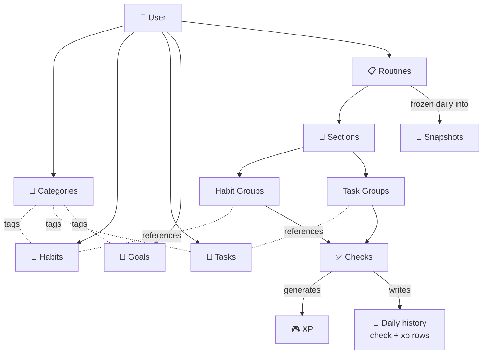
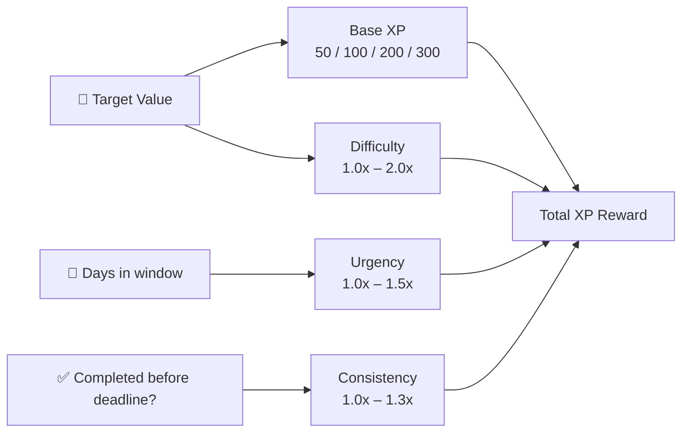
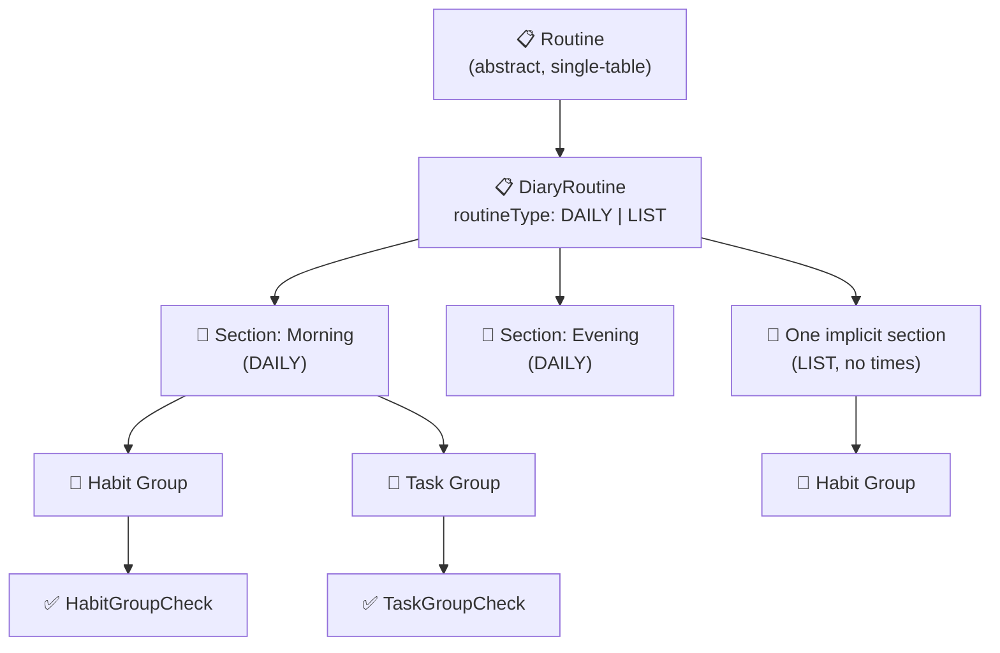
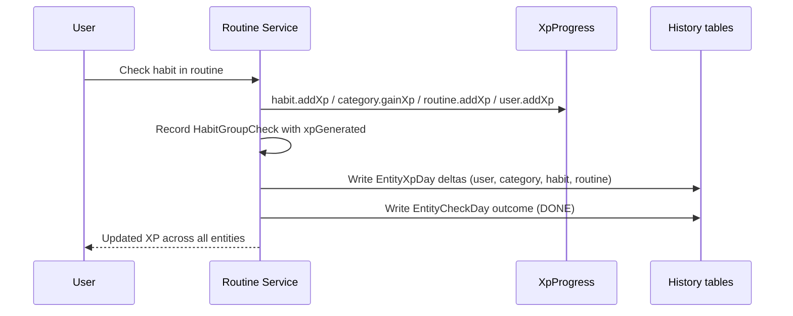
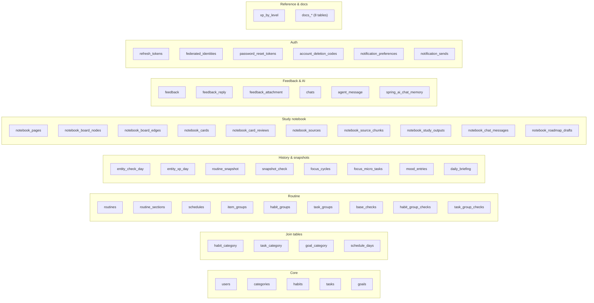

This document covers every entity in the Beyou domain, explaining what each one does for the user and how it is structured in the database. The goal is a clear mental model of the data layer before reading or writing code.

One ground rule shapes everything here: the schema belongs to Flyway. Migrations under `db/migration/` create and evolve every table, and Hibernate runs with `ddl-auto: validate` in every environment, so an entity mapping that disagrees with the migrations fails at startup instead of silently rewriting the schema.

## The big picture

Beyou's domain revolves around a simple idea: a user creates habits, tasks, and goals, organizes them into categories, and executes them through daily routines. Every check generates XP and writes history. Around that core loop sit the supporting families: daily history rows, immutable routine snapshots, the Focus Mode's cycles and micro-tasks, mood entries and the journal, the study notebook, feedback threads, and the AI agent's chats.


```mermaid
flowchart TD
  U["👤 User"]
  U --> CAT["📂 Categories"]
  U --> HAB["💪 Habits"]
  U --> TSK["📝 Tasks"]
  U --> GOL["🎯 Goals"]
  U --> RTN["📋 Routines"]

  CAT -.-|"tags"| HAB
  CAT -.-|"tags"| TSK
  CAT -.-|"tags"| GOL

  RTN --> SEC["📑 Sections"]
  SEC --> HG["Habit Groups"]
  SEC --> TG["Task Groups"]
  HG -.-|"references"| HAB
  TG -.-|"references"| TSK

  HG --> CHK["✅ Checks"]
  TG --> CHK
  CHK -->|"generates"| XP["🎮 XP"]
  CHK -->|"writes"| HIST["📅 Daily history<br/>check + xp rows"]
  RTN -->|"frozen daily into"| SNAP["🧊 Snapshots"]
```

## User

**Product role**: the central entity. Every piece of data in Beyou belongs to a user. The user has a profile (name, photo, motivational phrase), preferences (theme, language, timezone, dashboard widgets), a gamification state (XP, level, streaks), and two small text fields the AI agent uses as memory.

**Key fields**

| Field | Type | Notes |
|-------|------|-------|
| id | UUID | Auto-generated |
| name | String | |
| email | String | Unique |
| password | String | BCrypt hash |
| isGoogleAccount | boolean | True for OAuth users. Means Google specifically, not federation in general: an account created through another provider has this false |
| emailVerified | boolean | New accounts confirm by e-mail before first login |
| verificationToken / verificationTokenExpiry | String / LocalDateTime | Verification state lives as columns here, not in a separate entity |
| verificationTokenSentAt | Instant | When the last verification mail went out, read by the resend cooldown. An Instant against the LocalDateTime beside it because it is compared to a clock and never displayed. Null means no mail on record, which is how every row predating the column reads, and how a row whose send failed is reset |
| perfilPhrase / perfilPhraseAuthor | String | Optional motivational quote |
| perfilPhoto | String (512) | The Google CDN avatar URL, set at OAuth sign-in. NOT a path to an uploaded photo: an upload writes `{upload-dir}/user-photos/{userId}.jpg` and never touches this column, so it stays null for accounts that never signed in with Google. A profile is served the file first and this second, and removal has to clear both |
| themeInUse / languageInUse | String | Preferences |
| timezone | String | Required. The account's IANA zone, taken from the client at signup and falling back to UTC. Every date the app ever writes is resolved against it |
| timezoneSource | TimezoneSource enum | DEFAULT, DETECTED or EXPLICIT: whether the zone above was ever actually chosen. Only DEFAULT may be corrected automatically |
| widgetsIdInUse | List of String | Active dashboard widget IDs |
| isTutorialCompleted | boolean | Onboarding flag |
| userContext | String (2000) | The AI agent's global memory about this user |
| xpDecayStrategy | XpDecayStrategy enum | GRADUAL, FLAT, or TIME_WINDOW; how late check-ins lose XP |
| maxConstance | Integer | Highest streak ever achieved |
| completedDays | Set of LocalDate | Days with completed routine activity |
| userRole | UserRole enum | USER or ADMIN (admin only by manual database update) |
| constanceConfiguration | ConstanceConfiguration enum | ANY or COMPLETE |

**Embedded**: XpProgress and CheckProgress (both described below).

**Relationships**: the user owns six collections, all OneToMany with cascade ALL and orphan removal: categories, habits, tasks, goals, routines, and routine snapshots. Account deletion works entirely through this cascade; the tasks collection was added precisely to close a gap in it.

**Business logic**: implements Spring Security's UserDetails. Streak calculation used to live here as a walk over completedDays; it now belongs to UserStreakService in the checkday package, on top of the daily history rows.

## Category

**Product role**: categories organize habits, tasks, and goals by life area ("Health", "Career"). Categories earn XP too, so users can see where they invest the most effort.

**Key fields**: name, description, iconId, timestamps.

**Embedded**: XpProgress only. Deliberately no CheckProgress: a category earns XP but is never itself checked.

**Relationships**

- Belongs to a User (ManyToOne).
- Tagged to Habits, Tasks, and Goals as the inverse side of three ManyToMany joins (habit_category, task_category, goal_category).

## Habit

**Product role**: a behavior the user wants to build. Each habit has its own level and XP progression, plus a streak record, so showing up keeps paying.

**Key fields**

| Field | Type | Notes |
|-------|------|-------|
| name / description / iconId | String | |
| importance | Integer | 1 to 5 |
| dificulty | Integer | 1 to 5. Yes, misspelled: it is the real field, column, and wire-format name |
| motivationalPhrase | String | Optional |

**Embedded**: XpProgress and CheckProgress. The old standalone `constance` counter is gone; CheckProgress replaced it.

**Relationships**

- Belongs to a User (ManyToOne).
- Tagged by Categories (ManyToMany, owning side, join table habit_category).
- Referenced by HabitGroups inside routines (OneToMany, cascade ALL, no orphan removal).

## Task

**Product role**: a concrete action. Unlike habits, tasks can be one-time ("Buy groceries"). One-time tasks get a soft-delete date after being checked, giving the system a grace period before a scheduler removes them.

**Key fields**

| Field | Type | Notes |
|-------|------|-------|
| name / description / iconId | String | |
| importance / dificulty | Integer, nullable | Optional, unlike on a Habit: 1 to 5 when set, null when the user chose nothing. A missing value counts as 1 in the check XP formula. Same misspelling as Habit on the column; the wire accepts both spellings |
| oneTimeTask | boolean | True for non-recurring tasks |
| markedToDelete | LocalDate | Set on completion of one-time tasks; TaskCleanupScheduler collects them |

**Embedded**: CheckProgress only. A task carries no XP of its own; checking one feeds the user, the routine, and the categories.

**Relationships**: belongs to a User (ManyToOne); tagged by Categories (ManyToMany, owning side, join table task_category).

## Goal

**Product role**: a measurable objective ("Run 100 km"). Progress is currentValue against targetValue, and completion pays a calculated XP reward.

**Key fields**

| Field | Type | Notes |
|-------|------|-------|
| name / iconId / description | String | |
| targetValue / currentValue | Double | The measurable part |
| unit | String | km, books, etc. |
| complete | Boolean | Completion flag |
| motivation | String | Optional |
| startDate / endDate | LocalDate | Window and deadline |
| xpReward | double | Calculated on completion |
| completeDate | LocalDate | |
| status | GoalStatus enum | NOT_STARTED, IN_PROGRESS, COMPLETED (stored as strings) |
| term | GoalTerm enum | SHORT_TERM, MEDIUM_TERM, LONG_TERM |
| parentId | UUID, nullable | The goal this one sits under. Null for a top-level goal |
| archivedAt | Instant, nullable | When the goal was put away. Null while active. Not a status (see Archiving) |

**Relationships**: belongs to a User (ManyToOne); tagged by Categories (ManyToMany, owning side, join table goal_category); optionally nested under another Goal (ManyToOne to itself, `parent_id`, lazy, with a read-only mirror column so the id reaches the response without touching the relation).

**Nesting**: a goal may hang under another goal, three levels at most: a big goal, a medium one under it, a small one under that. The tree is a single nullable self-reference, not a second entity, because every read already loads all of a user's goals in one query and both clients assemble the tree from `parentId` in shared code. The rules live once, in `GoalService.resolveParent`, and the pickers on web and mobile only pre-filter what it would refuse: the parent must be the same user's (GOAL_NOT_OWNED), must not be the goal itself or a descendant (GOAL_PARENT_CYCLE), and the chain must fit in three levels counting both the ancestors above the new parent and the subtree already under the goal (GOAL_DEPTH_EXCEEDED). A parent is a normal goal with its own target, unit and XP; the sub-goal summary shown on cards is computed on the client. The one server-side link between levels: the first increment on a sub-goal moves a NOT_STARTED parent to IN_PROGRESS, the same way a goal's own first increment does.

**Archiving**: a goal can be put away without being deleted. It is a nullable `archived_at` timestamp and not a fourth GoalStatus, because status carries the complete/status invariant below and a finished goal and an abandoned one both archive: archiving moves no XP and leaves status, complete and xpReward alone. `PUT /goal/archive` takes the state wanted, not a toggle. The sub-goals go with the goal, all stamped with the same instant, and that instant is how restoring knows what came along: it clears the goal and exactly the descendants carrying it, so a sub-goal archived on its own earlier stays archived. Nothing new goes under an archived goal (GOAL_PARENT_ARCHIVED), but an existing link survives an edit, since every edit sends the parent back. `GET /goal` still returns archived goals with the field set, so the list stays one cached query, and each screen filters: the goals page shows them only under its Archived view, and the viewer, the dashboard and the parent pickers leave them out. On the server the daily briefing, the category card's goal list and the agent's plans skip them. A sub-goal restored on its own under a parent still archived shows as a top-level goal, the way a deleted parent's children do.

**Invariant worth knowing**: constructing a goal with status COMPLETED silently downgrades it to IN_PROGRESS. Only the explicit complete endpoint pays XP, so nobody can post a pre-completed goal and farm a reward. Nesting changes none of that: a parent pays its own XP on its own completion, whatever its children did.

**XP calculation**: GoalXpCalculator multiplies four factors.


```mermaid
flowchart LR
  TV["🎯 Target Value"] --> BASE["Base XP<br/>50 / 100 / 200 / 300"]
  TV --> DIFF["Difficulty<br/>1.0x – 2.0x"]
  DL["📅 Days in window"] --> URG["Urgency<br/>1.0x – 1.5x"]
  CD["✅ Completed before deadline?"] --> CON["Consistency<br/>1.0x – 1.3x"]
  BASE --> TOTAL["Total XP Reward"]
  DIFF --> TOTAL
  URG --> TOTAL
  CON --> TOTAL
```

- Base XP scales with target value: 50 under 10, 100 under 50, 200 under 200, 300 above.
- Difficulty rewards bigger targets, up to 2.0x at 200+.
- Urgency rewards tight windows: 1.5x for 7 days or less, 1.2x up to 30.
- Finishing before the deadline multiplies by 1.3x.

## The two shared components

Two embeddables carry the gamification state, and which entities embed which is a design decision in itself.

### XpProgress

| Field | Type | Notes |
|-------|------|-------|
| xp | double | Total accumulated XP |
| level | int | Current level |
| actualLevelXp / nextLevelXp | double | Boundaries of the current level |

Embedded by **User, Category, Habit, and Routine**: the four things that level up. `addXp` and `removeXp` walk the level curve in both directions through a level-lookup function, and cap at the top level.

### CheckProgress

| Field | Type | Notes |
|-------|------|-------|
| check_current_streak / check_best_streak | int | Streaks |
| check_total_check_ins | int | Lifetime count |
| check_first_check_in_date / check_last_check_in_date | LocalDate | Nullable bounds |

Embedded by **User, Habit, Task, and Routine**: the four things that get checked. Category is excluded on purpose, and Task appears here despite having no XP.

## Routine

**Product role**: the daily execution tool, in one of two shapes. A **daily** routine has sections ("Morning", "Work", "Evening"), each holding habit and task groups with their own time windows. A **list** routine drops both: a flat, ordered checklist the user ticks off whenever they like during the day. Checking items generates XP across every related entity, identically for the two.

**Inheritance**: Routine is an abstract base using single-table inheritance with a `dtype` discriminator. DiaryRoutine is the only concrete type, and the shape is a `routineType` column (DAILY or LIST) rather than a second subclass. That was deliberate: the whole check path casts the routine it reaches through the item's section to DiaryRoutine on every branch, and the snapshot writer, the day-close resolver and the schedule service are all typed to it. A column leaves every one of those untouched, so a list routine is scheduled, snapshotted, checked, streaked and levelled by exactly the code that already serves a daily one. `routines_routine_type_check` mirrors the enum; adding a value in Java without adding it there makes every write of the new kind fail.

A list routine still stores its items in **one** RoutineSection, created server-side with null start and end times. That section is an internal representation and never reaches a client: the API takes and returns a flat `items` array instead.


```mermaid
flowchart TD
  R["📋 Routine<br/>(abstract, single-table)"]
  R --> DR["📋 DiaryRoutine<br/>routineType: DAILY | LIST"]
  DR --> RS1["📑 Section: Morning<br/>(DAILY)"]
  DR --> RS2["📑 Section: Evening<br/>(DAILY)"]
  DR --> LS["📑 One implicit section<br/>(LIST, no times)"]
  RS1 --> HG1["💪 Habit Group"]
  RS1 --> TG1["📝 Task Group"]
  LS --> HG2["💪 Habit Group"]
  HG1 --> HC["✅ HabitGroupCheck"]
  TG1 --> TC["✅ TaskGroupCheck"]
```

### Routine (abstract base)

Fields: name, iconId, routineType. Embeds XpProgress and CheckProgress.

`routineType` is never null: the migration that added it defaults to DAILY, so every routine written before the list shape existed, and every client that has never heard of the field, keeps exactly the behaviour it had. Read it through `isList()` / `isDaily()` rather than comparing the enum at call sites — those two are the seam, and what a reader greps for to find everywhere the shapes actually diverge.

**Relationships**

- Belongs to a User (ManyToOne).
- Owns a Schedule (OneToOne, nullable, cascade REMOVE, owning side). Deliberately no orphan removal: unscheduling sets the reference to null and deletes the schedule row explicitly.

### DiaryRoutine

Extends Routine, adding routineSections (OneToMany, cascade ALL, orphan removal, ordered by orderIndex).

### RoutineSection

Fields: name, iconId, startTime, endTime, orderIndex, favorite.

The times are nullable, and a list routine's single section leaves both null. Its name and icon follow the routine's own, because the column is NOT NULL and because that name is what the snapshot writer copies onto every SnapshotCheck — a history row reading "Errands" is at least true.

**Relationships**: belongs to a Routine (ManyToOne); contains HabitGroups and TaskGroups (OneToMany, cascade ALL, orphan removal). One quirk to be aware of: these collections are unidirectional and mapped through join tables (routine_sections_habit_groups, routine_sections_task_groups), while ItemGroup also carries its own routine_section_id column. The section-to-group link is effectively mapped twice.

## Schedule

**Product role**: which days of the week a routine is active, which decides whether it appears on the dashboard for a given day.

The entity is minimal: an id plus a set of WeekDay enums stored in the schedule_days collection table. The foreign key lives on the routine's side. One gotcha: the enum identifiers are capitalized words (Monday, Tuesday, ...), not SCREAMING_CASE, and they are stored as strings, which is also what a CHECK constraint on the table enforces and what every response emits. Incoming JSON is the one place that forgives a mismatch — any letter case, and the Portuguese day names, resolve to the same constant — because an agent tool call that guessed SCREAMING_CASE used to cost an entire LLM round trip to correct.

## Item groups and checks

**Product role**: placing a habit or task inside a routine section creates a "group", the trackable instance that gets checked or skipped each day. Each check is a historical record with date, time, and the XP it generated.

**ItemGroup** (abstract, joined inheritance): startTime, endTime, orderIndex, and the ManyToOne back to its section. `orderIndex` is read only by list routines, which have no times to sort by; a daily routine orders its items by startTime in both clients and ignores the column, though it is written for both so the two shapes share one merge path. Concrete types HabitGroup (references a Habit) and TaskGroup (references a Task), each owning their check collections (cascade ALL, no orphan removal, so history survives).

**BaseCheck** (abstract, joined inheritance): checkDate, checkTime, checked, skipped, xpGenerated. Concrete types HabitGroupCheck and TaskGroupCheck, each owned by their group.

## Daily history: EntityCheckDay and EntityXpDay

**Product role**: the dashboard's history and progress widgets need per-day answers ("what happened to this habit on Tuesday?", "how much XP did this category earn this week?"). Walking the raw check tables for that is expensive and fragile, so two dedicated history tables record one row per entity per day.

**EntityCheckDay** (table entity_check_day): one outcome per entity per day, unique on (owner_type, owner_id, day).

- Outcomes: DONE, SKIPPED, MISSED, NOT_SCHEDULED, NOT_IN_ROUTINE. Only DONE advances a streak.
- Owner types: HABIT, TASK, ROUTINE, USER.
- The owner reference is a bare UUID with no foreign key, on purpose: history must outlive the routine or habit it was recorded through. The user reference is a real FK with cascade delete, so account deletion still sweeps it.

**EntityXpDay** (table entity_xp_day): the net XP delta per entity per day, same uniqueness pattern.

- The value is signed: unchecking an item produces a negative delta. Summing an owner's rows reproduces its XpProgress total.
- Owner types: USER, CATEGORY, HABIT, ROUTINE. Exactly the four XpProgress carriers, and deliberately different from the check-day set (this one has CATEGORY and no TASK).
- These rows feed the /xp/history endpoint, which returns dense series: one entry per day of the window, zeros included, so charts never skip days.

## Routine snapshots

**Product role**: routines change. Sections get renamed, habits get removed, whole routines get deleted. Without snapshots, yesterday's view of your day would silently rewrite itself. So every scheduled day, each routine is frozen into an immutable copy, and past days render exactly as they looked.

**RoutineSnapshot** (table routine_snapshot): unique per (routine, day).

- References the routine and, denormalized, the user, so a whole day loads in one query.
- Copies routineName and routineIconId, and stores structureJson: the full section/item tree as JSON, kept verbatim for rendering.
- Owns its SnapshotChecks (cascade ALL, orphan removal).

**SnapshotCheck** (table snapshot_check): one row per habit or task group in the frozen routine.

- Denormalized copies of the item's name, icon, difficulty, and importance, plus its section name.
- Difficulty and importance are always a number here, even for a task that left its own unset: the snapshot columns are not nullable, so the missing-counts-as-1 rule is applied on the way in rather than by every reader afterwards.
- originalItemId and originalGroupId are loose UUIDs with no foreign keys, the same pattern as the history tables: the snapshot must survive edits and deletions of what it points at.
- Mutable state: checked, skipped, checkTime, xpGenerated. Item type is HABIT or TASK.

**Late check-ins and XP decay**: checking a past day through a snapshot still pays XP, but decayed according to the user's chosen XpDecayStrategy:

| Strategy | Behavior |
|----------|----------|
| GRADUAL | 0.8x one day late, then 0.6x, 0.4x, and 0.2x from four days on |
| FLAT | 0.5x no matter how late |
| TIME_WINDOW | Full XP up to two days late, nothing after |

The snapshot scheduler runs per timezone, using each account's own timezone column, so a routine is frozen at that user's midnight rather than the server's.

## Focus Mode history

**Product role**: the Focus Mode is the screen that stays open while the person executes the day, one item at a time, with a pomodoro timer and a short list of small things to do between cycles. Its history answers a different question from the snapshots — not "what did I do" but "how did I execute it".

**FocusCycle** (table focus_cycles): one row per COMPLETED cycle.

- One row per cycle rather than one per sitting, and that is the load-bearing decision. A sitting has no reliable end: the app can be killed, the tab closed, the phone can die, and an "open session" row would need reconciling forever by something that has to guess. A completed cycle is a fact that never needs closing, and "four pomodoros today" is a count over rows.
- Nothing is written for an abandoned cycle. The feature has no failure state by design, so there is nothing to record.
- `kind` is POMODORO, SHORT_BREAK or LONG_BREAK, stored as a varchar mirrored by a CHECK constraint (the V19/V25 pattern). `minutes` is bounded 1..180 by a CHECK too, restating the client's own clamp where it cannot be bypassed.
- `item_group_id` is nullable and `ON DELETE SET NULL`: a cycle can run with nothing selected, and deleting a routine must not erase the fact that somebody focused for 25 minutes that morning.
- `cycle_date` is the OWNER's local day, resolved from their timezone, like every other dated row here.
- `notebook_page_id` (added in V34) names the study notebook page the cycle was run on, when it started from one. A plain id, not an association: nothing here reads the page, and the notebook only sums POMODORO minutes by page id. `ON DELETE SET NULL` for the same reason as the item group.

**FocusMicroTask** (table focus_micro_tasks): a small thing done alongside one routine item, on one day.

- Scoped to a routine ITEM (`item_group_id NOT NULL`, cascade on delete), not to a sitting. Changing item does not carry the list over.
- `pinned` is a template flag. Selecting another item creates a row for that name there too, so a pinned "stretch" walked across four items leaves four rows, one per item, each independently tickable. The pinned set is derived from the user's own rows where `pinned = true` — no second table to keep in step — and pinning is a property of the NAME: pin it anywhere and it is pinned everywhere, unpin it anywhere and it stops being a template everywhere.
- `UNIQUE (user, day, item, name)` is what makes materialising a template idempotent: the list read for an item creates the missing pinned rows first, and the second read creates nothing. The set is capped at the 50 most recently pinned names, because that read runs on a GET and inserts rows. Deleting a pinned row also unpins the NAME — otherwise the next read brought it straight back.
- Both writers of an item's list (the add and that materialising read) take a transaction-scoped advisory lock on (user, item) before reading it. Without it, two requests landing together both read the list before either committed, both inserted, and the second died on the unique constraint as a 409. That was not hypothetical: the phone's text field submitted on Done and again on the blur Done caused, and prod logged the pair 6 ms apart. An advisory lock rather than a row lock, because the row that decides the race does not exist yet. The ordinary read, with nothing to materialise, takes no lock.
- `done_at` is a timestamp rather than a boolean, so "done" carries when. Null is open.
- `order_index` is the position in that item's list, scoped to (user, day, item). Rows written before ordering existed carry 0, and `created_at` stays the tiebreaker in the query, so a list nobody has dragged comes back in the order it was written. Reordering sends the WHOLE list rather than one move: the client already holds what it is showing, and two clients dragging at once then land on one of the two orders instead of an interleaving neither asked for.

**How it reaches the snapshot**: the day's snapshot response joins both tables on `SnapshotCheck.originalGroupId`, so each check row carries the micro-tasks created for that habit or task and the count of pomodoros run on it. Two reads for the day, joined in memory — never one lookup per check row, which would be an N+1 sized by the routine on the history screen.

## Mood entries and the journal

**Product role**: how a day felt, and anything the person wanted to keep about it. Habits, goals and routines all record what was DONE. None of them records how it went.

**MoodEntry** (table mood_entries): one row per user per day, added in V31.

- `UNIQUE (user_id, entry_date)` carries the model. A day has one mood, so recording again is an update, and every reader (the week strip, the month calendar, the streak count) can trust that one date means one row.
- Writes go through a native `INSERT ... ON CONFLICT DO UPDATE` rather than read-then-save. Two taps on the dashboard widget half a second apart both pass any check the application could make. The loser then hits the unique constraint INSIDE a transaction, which poisons it, so there is nothing left to retry with. Letting Postgres settle the conflict means there is no race to recover from.
- **Two write verbs, and the difference matters.** `PUT /mood/{date}` replaces the entry including the note. `PATCH /mood/{date}` sets the level and has no field that could carry a note, so the dashboard widget and the assistant, which both use PATCH, cannot delete writing they never loaded. A single upsert route would have made losing a diary entry a one-tap accident: journal in the morning, tap a face at night, writing gone.
- `mood` is an integer 1..5 with a CHECK mirroring the scale, not a varchar enum like V19 and V27. This one is genuinely ordinal, since the week average is arithmetic on it, and the labels are translated in the clients. It is `integer` and not `smallint` because the entity field is an `Integer` and Hibernate's `ddl-auto: validate` refuses to boot on int2-against-INTEGER.
- `note` is `text` with no length limit in the column. The 4000-character cap lives in the DTO, where exceeding it is a validation error the client can show rather than a truncation nobody can undo.
- `entry_date` is the OWNER's local day, resolved through `UserDateResolver` before the write, like every other dated row here. Days after the owner's today are refused in the service with `MOOD_FUTURE_DATE`, so the calendar's disabled cells are a convenience rather than the enforcement. Past days stay editable.
- `ON DELETE CASCADE`. A journal is not history worth keeping past the account that wrote it, and this is the most personal data the product stores.
- **No XP and no link to the gamification tables.** Paying for a feeling turns the scale into something to farm, and a farmed scale describes nothing. The only streak shown is counted client-side from these rows.
- Deliberately not cached, unlike the other domains. Every read is a date range, so a `@Cacheable` keyed on the user would serve one range's answer for another, and a composite key would need its own eviction path on every write.

**Privacy**: the note is the one place in the product where somebody writes at length for themselves. It never reaches browser storage (the `mood` slice is on the web persist blacklist and mobile redux is in-memory), the account export carries every entry with the words intact, and the assistant's read tool returns dates, levels and whether a day has a note, never the note itself.

## Study notebook

**Product role**: where somebody organises a subject they are learning. A topic is laid out as a roadmap board, every node opens a page of notes, sources attach to pages for a grounded study AI, and flashcards come back on a spaced schedule. Nine tables arrived together in V34, every one cascading from `users`. The rules and the class that owns each are in the [study notebook topic](/architecture/study-notebook).

**NotebookPage** (table notebook_pages): everything is a page, a topic included.

| Field | Type | Notes |
|-------|------|-------|
| id | UUID | |
| user_id | UUID | Owner, cascade |
| kind | NotebookPageKind | TOPIC or PAGE, varchar with a CHECK |
| parent_id | UUID | Null only on a topic. Cascade: deleting a page deletes its subtree |
| topic_id | UUID | The root topic, stored on the row so a topic's tree is one indexed read. Null on the topic itself |
| title / icon / description | varchar 255 / 64 / 512 | |
| content | text | The BlockNote document as JSON. Text and not JSONB, like every other JSON this schema stores, because nothing queries inside it |
| content_text | text | Plain text extracted on the server by `BlockText` on every save, never taken from the client. What the AI reads and the export ships |
| status | NotebookStatus | TO_STUDY, STUDYING or DONE. Stored, written only by `NotebookProgressService` |
| status_manual | boolean | Set by hand on a page whose board has nodes. False lets the nodes decide |
| position | integer | Order among siblings in the tree |
| goal_id / category_id / habit_id | UUID | Optional links on a topic, each `ON DELETE SET NULL`. The category receives the topic's XP |
| done_xp_at | timestamptz | When the 15 XP for finishing was paid. Set once and never cleared, so done, undone, done pays once |
| last_opened_at | timestamptz | Feeds "continue studying". Written by an UPDATE query that never loads the row dirty |
| study_goal | varchar(300) | The study room's goal for the page, sent ahead of the passages with every answer. Added in V36 |
| study_scope | varchar(16) | Whose notes the study AI reads: PAGE (the page and the pages above, the default), SUBTREE or TOPIC. CHECK-constrained |
| study_setup_at | timestamptz | When the study room was last set up; null opens it on its setup screen |

A CHECK constraint holds the shape: a TOPIC has no parent and no topic, a PAGE has both. The entity is `@DynamicUpdate`, so the autosave and a status change landing in the same moment each write only their own columns.

**NotebookBoardNode** (notebook_board_nodes) and **NotebookBoardEdge** (notebook_board_edges): one board per page, keyed by `board_page_id`.

- A node is PAGE (`page_id` set, the page it opens) or SECTION (`page_id` null, a labelled band with `width` and `height`), enforced by a CHECK.
- `page_id` is the node's own column and does not reuse the tree, because a linked node opens a page whose home is in another topic. `UNIQUE (board_page_id, page_id)` puts a page on a board once.
- Positions are `x` and `y` in board pixels.
- An edge joins two nodes of the same board, once per direction (`UNIQUE (source_node_id, target_node_id)`, plus a CHECK against self-loops). Edges only order nodes.

**NotebookCard** (notebook_cards) and **NotebookCardReview** (notebook_card_reviews):

- A card has `front`, `back`, an optional `source_label`, and the SM-2 state: `due_on` (a date in the owner's timezone), `interval_days` (capped at 365), `ease` (2.5 to start, floor 1.3), `reps` and `lapses`.
- A review row records `rating` (AGAIN, HARD, GOOD, EASY), `review_date` in the owner's timezone and `xp_paid`. The review streak counts distinct review days. `POST /notebook/reviews/finish` pays the day's unpaid rows, 30 at most, and there is no back pay for a day that was never collected.

**NotebookSource** (notebook_sources) and the chunks (notebook_source_chunks):

- A source is PDF, LINK or TEXT, attached to one page and readable from every page below it. `status` is PENDING, READING, READY or FAILED, with `progress` 0 to 100 and an `error_key` when it failed. `enabled` switches it off without deleting it.
- The PDF itself is never stored. Its text survives in the chunks, page by page, so there is no file on disk to clean up when an account goes.
- A chunk holds about 1000 characters of `content`, its `ordinal` and the PDF `page_number`. `search` is a generated `tsvector` (`simple` config, GIN index) for the full-text fallback, and `embedding` is a `real[]` with the `embedding_model` that made it. No JPA entity maps this table: `SourceChunkStore` reads and writes it with plain SQL. No pgvector either; the study notebook topic explains why.

**NotebookStudyOutput** (notebook_study_outputs) and **NotebookChatMessage** (notebook_chat_messages):

- An output is OVERVIEW, SUMMARY, STUDY_GUIDE or QUIZ. `content` is markdown inside JSON for the first three and the questions with their answers for a quiz, which never leave the server until grading. `score` and `total` hold the last grading, and `passed_at` the first pass, the moment the 20 XP was paid. A page keeps one OVERVIEW.
- A chat message has `role` USER or ASSISTANT, its `content`, and the answer's `citations` as JSON.

**NotebookRoadmapDraft** (notebook_roadmap_drafts), added in V35:

- A "New topic with AI" draft, kept until a topic is created from it or the person deletes it. `status` is DRAFTING while the model writes it in the background, then READY or FAILED with an `error_key`.
- `request` is what was asked for, `result` the drafted nodes and `choices` the person's ticks, one per node, all JSON in `text`. `started_at` is when the current model call began, for the dialog's timer.
- Only a DRAFTING row receives a result, so deleting a draft mid-call is final. At most 20 per person.

## FederatedIdentity

**Product role**: one external identity an account may be entered through, beyond the
password and Google. Added in V29.

Identity is the pair `(issuer, subject)` and nothing else. Both come from a verified ID
token and neither can be reassigned to a different person by anyone but that issuer. The
address the provider claimed is kept as a record of what was said, never as a way to find
a user, because a provider that could reach an account by asserting its address could
reach every account.

**Key fields**

| Field | Type | Notes |
|-------|------|-------|
| id | UUID | Auto-generated |
| user | User | ON DELETE CASCADE, so account deletion is never blocked by a link |
| issuer | String | The `iss` claim, compared byte-for-byte, never normalised |
| subject | String | The `sub` claim. UNIQUE together with issuer |
| emailAtLink | String | What the provider claimed at link time. Recorded, never queried |
| createdAt | LocalDateTime | |
| lastLoginAt | LocalDateTime | Touched on every sign-in through this identity |

Google rows appear lazily rather than by backfill: its subject was never stored, so the
row is written on the account's next Google sign-in. See the security document for the
resolution rule these rows feed.

## Feedback

**Product role**: users report bugs and ask for features inside the app; an admin reads, replies, and tracks status.

- **Feedback** (table feedback): belongs to a User, holds the body text plus an embedded FeedbackContext (screen, app version, platform, language, theme) captured at send time. Category is BUG, FEATURE_REQUEST, or OTHER; status is OPEN, TAKING_CARE, or CLOSED and only the admin ever sees or changes it.
- **FeedbackReply**: a threaded reply. The author reference is nullable on purpose, so a reply survives its author's account deletion.
- **FeedbackAttachment**: a screenshot index row (width, height, size). The JPEG bytes live on disk under the upload directory, not in the database.

## AI agent chats

**Product role**: the agent chat that can create routines and answer questions keeps its conversations in the domain, with two layers of memory.

- **Chat** (table chats): belongs to a User, has a title and userContextInChat, a 1000-character chat-scoped memory the model rewrites as the conversation evolves. The user entity carries the 2000-character global counterpart (userContext).
- **AgentMessage** (table agent_message): deliberately has no JPA relationship to Chat, just a chatId column with the cascade owned by a database FK. Each message stores its role, a JSON array of content segments, and a sequenceId, unique per chat, which makes ordering explicit instead of timestamp-dependent.
- Spring AI manages its own spring_ai_chat_memory table for the model's short-term window; it has no JPA entity.

## Auth and account entities

Five small entities hang off the account. Three hold hashes for the security flows, all ManyToOne to User; the other two hold a preference and a log of the mail that preference allowed:

| Entity | Table | What it holds |
|--------|-------|---------------|
| RefreshToken | refresh_tokens | Hash of the 15-day refresh token, expiry, revokedAt |
| PasswordResetToken | password_reset_tokens | Hash of the reset token, expiry, usedAt |
| AccountDeletionCode | account_deletion_codes | BCrypt hash of a six-digit code, expiry, usedAt, and an attempts counter that kills the code after a few wrong guesses |
| NotificationPreferences | notification_preferences | Whether the account may be sent engagement mail, plus the token an unsubscribe link carries. OneToOne rather than ManyToOne, keyed by the user's own id via `@MapsId` so the key and the association cannot disagree |
| NotificationSend | notification_sends | One row per engagement mail actually sent: the kind, and the RECIPIENT'S local date rather than the server's. A UNIQUE constraint on (user, kind, day) is what stops the hourly pass mailing the same thing twice; the same rows answer the per-account gap and the global daily cap |

E-mail verification is the exception: it lives as columns on the users table rather than as its own entity. That also means the token sits there in plaintext, unlike the reset and deletion tokens beside it, which are stored as BCrypt hashes.

The unsubscribe token is stored raw too, and that one is a decision rather than an inheritance. The three above are one-shot secrets, so a hash is free. An unsubscribe token is stable — every engagement mail for the rest of the account's life links to it — and a hash cannot be un-hashed to build that link, so hashing would force a new token per send and kill the link in every message already delivered. A row's absence means the account has never been mailed and never opened the setting; readers must treat that as opted in.

Unlike the three token tables, this one has no expiry and no single-use marker: a preference is not spent by being used.

## XP progression system

### The level curve

XpByLevel (table xp_by_level) is a pure reference table: one row per level, holding the XP threshold to reach it. It is seeded by a repeatable Flyway migration with a quadratic curve:

```
threshold(level) = round(50 × level²)
```

Levels run 0 to 100. Early levels come fast (level 2 costs 200 XP), late ones demand sustained effort (level 100 sits at 500,000). Lookups are cached per level, and XpProgress walks this curve in both directions when XP is added or removed.

### XP flow on a routine check


```mermaid
sequenceDiagram
  participant U as User
  participant R as Routine Service
  participant X as XpProgress
  participant H as History tables

  U->>R: Check habit in routine
  R->>X: habit.addXp / category.gainXp / routine.addXp / user.addXp
  R->>R: Record HabitGroupCheck with xpGenerated
  R->>H: Write EntityXpDay deltas (user, category, habit, routine)
  R->>H: Write EntityCheckDay outcome (DONE)
  R-->>U: Updated XP across all entities
```

## Inheritance strategies

| Strategy | Used by | How it works |
|----------|---------|-------------|
| **Single table** | Routine → DiaryRoutine | One table with a dtype discriminator. Fast queries; tolerable NOT NULL embedded columns only because there is a single subclass. |
| **Joined** | ItemGroup → HabitGroup / TaskGroup, BaseCheck → HabitGroupCheck / TaskGroupCheck | Base table plus child tables joined by foreign key. Cleaner schema, one more join per query. |

## Daily Briefing

**Product role**: the dialog a user meets on the first dashboard open of a new day. What is still open from yesterday, and what today holds.

**DailyBriefing** (table daily_briefing): at most one row per user per day, added in V32.

- **Most of the briefing is not stored here.** The facts it shows, what was missed yesterday, which open goals are closest to their date and at what pace, and where the streak stands, are recomputed from the live tables on every read. They cost about ten indexed queries, flat in the size of the routine, and the user can change them from inside the dialog itself. Caching them would mean either a stale panel or an invalidation hook on every check path, and both are worse than asking again.
- The narrative is the opposite. It costs an LLM call against a free-tier chain with cooldown windows, it is prose rather than data, and nothing the user does during the day makes yesterday's recap wrong enough to pay for it again. So it is written once per day and read from here afterwards.
- **The journal never reaches this row or the model.** The prose is written from mood levels and their trend; the text a user writes in the diary stays in `mood_entries`, and the dialog reads yesterday's entry from the mood API itself.
- `UNIQUE (user_id, briefing_date)` carries the model. The service reads before it writes, but two clients opening within the same second both get past that read, and the constraint is what makes the loser retry against the winner's row instead of paying for a second paragraph.
- `narrative_status` is `PENDING | READY | UNAVAILABLE`, a varchar with a CHECK, following V19 and V27. None of the three means something went wrong. The facts half always answers, so a null narrative is an ordinary state, and the clients render their own translated copy.
- Generated **on demand**, at the first dashboard open, and deliberately not in the nightly day-close pass. That pass walks every account that exists. A model call inside it would spend the quota of people who open the app on people who do not, and it would write the "today" half at 02:00, before anything about today had happened. An account that never opens the dialog creates no row at all.
- `briefing_date` is the account's own day, resolved through `UserDateResolver` like every other date in this schema.
- **No new write path for the items themselves.** Each open item carries the `snapshotId` and `snapshotCheckId` that `POST /routine/snapshot/check` and `/skip` already take. The retroactive rules (XP decay, the outcome stamped on the snapshot's own date, the ownership check) stay in the one service that already enforces them.

## Cascade and deletion rules

Understanding the cascades matters most at account deletion, which relies on them end to end.

| Parent | Children | Cascade | Orphan removal |
|--------|----------|---------|----------------|
| User | Categories, Habits, Tasks, Goals, Routines, RoutineSnapshots | ALL | Yes. Deleting a user removes everything |
| User (DB level) | EntityCheckDay, EntityXpDay rows | ON DELETE CASCADE | Handled by the database FK |
| DiaryRoutine | RoutineSections | ALL | Yes |
| RoutineSection | HabitGroups, TaskGroups | ALL | Yes |
| Routine | Schedule | REMOVE | No. Unscheduling is explicit |
| Habit | HabitGroups | ALL | No. Deleting a habit does not silently rewrite routines |
| HabitGroup / TaskGroup | Checks | ALL | No. Check history is preserved |
| Goal (DB level) | Sub-goals | ON DELETE SET NULL | Children are promoted to top level, never deleted with the parent. The UI says so before the delete |
| RoutineSnapshot | SnapshotChecks | ALL | Yes |
| User (DB level) | DailyBriefing rows | ON DELETE CASCADE | Handled by the database FK. A briefing is derived data with no meaning past the account |
| User (DB level) | Every notebook table | ON DELETE CASCADE | Account deletion takes the whole notebook |
| NotebookPage (DB level) | Child pages, board nodes and edges, cards and their reviews, sources and their chunks, outputs, chat messages | ON DELETE CASCADE | Deleting a page deletes its subtree. A page linked onto its boards from another topic has its home elsewhere and stays; only the node goes |
| NotebookPage (DB level) | FocusCycle.notebook_page_id | ON DELETE SET NULL | The minutes stay on the record |
| Goal / Category / Habit (DB level) | A topic's links | ON DELETE SET NULL | The links decorate a topic. Deleting the goal must not delete a notebook |

## Database tables summary


```mermaid
flowchart LR
  subgraph core["Core"]
    users
    categories
    habits
    tasks
    goals
  end

  subgraph joins["Join tables"]
    habit_category
    task_category
    goal_category
    schedule_days
  end

  subgraph routine["Routine"]
    routines
    routine_sections
    schedules
    item_groups
    habit_groups
    task_groups
    base_checks
    habit_group_checks
    task_group_checks
  end

  subgraph history["History & snapshots"]
    entity_check_day
    entity_xp_day
    routine_snapshot
    snapshot_check
    focus_cycles
    focus_micro_tasks
    mood_entries
    daily_briefing
  end

  subgraph notebook["Study notebook"]
    notebook_pages
    notebook_board_nodes
    notebook_board_edges
    notebook_cards
    notebook_card_reviews
    notebook_sources
    notebook_source_chunks
    notebook_study_outputs
    notebook_chat_messages
    notebook_roadmap_drafts
  end

  subgraph support["Feedback & AI"]
    feedback
    feedback_reply
    feedback_attachment
    chats
    agent_message
    spring_ai_chat_memory
  end

  subgraph auth["Auth"]
    refresh_tokens
    federated_identities
    password_reset_tokens
    account_deletion_codes
    notification_preferences
    notification_sends
  end

  subgraph system["Reference & docs"]
    xp_by_level
    docs_tables["docs_* (8 tables)"]
  end
```

All primary keys are UUIDs except xp_by_level, whose key is the level itself. Timestamps are set via JPA lifecycle callbacks. The docs_* tables follow one repeated pattern: a topic root with a unique key plus a per-locale content row, imported from the beyou-arch-design repository.
