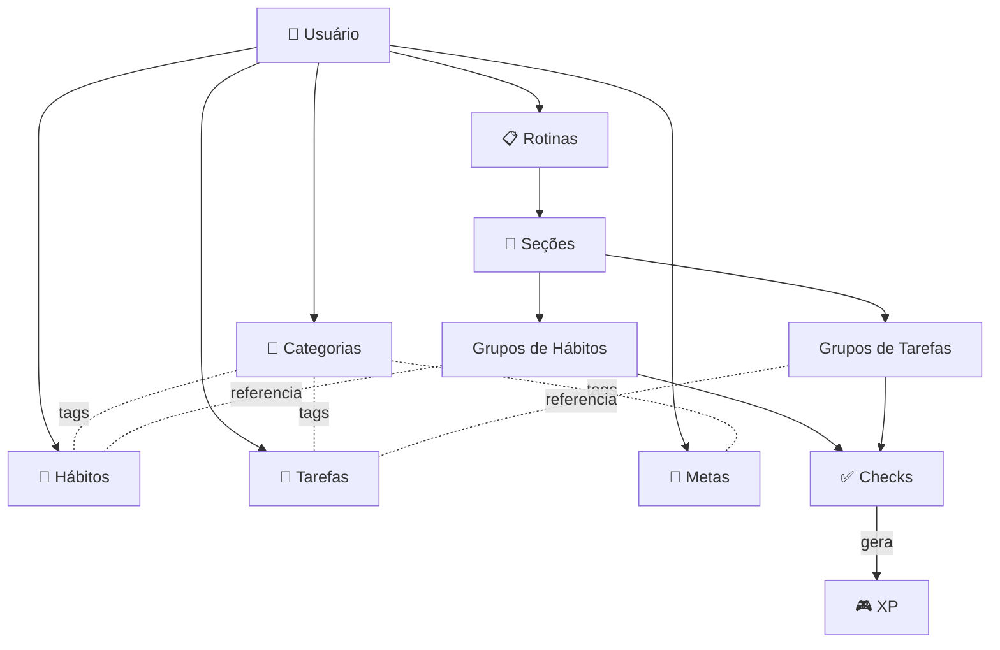
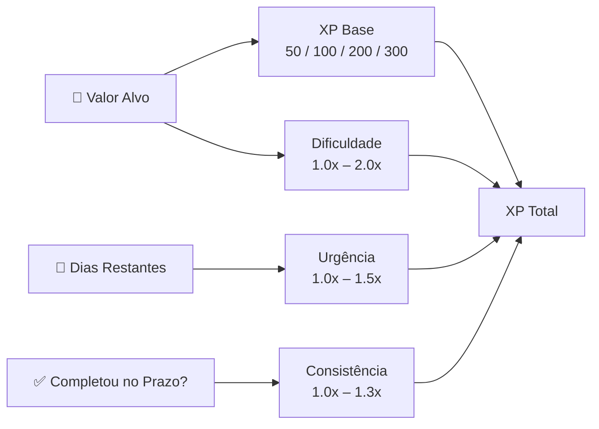
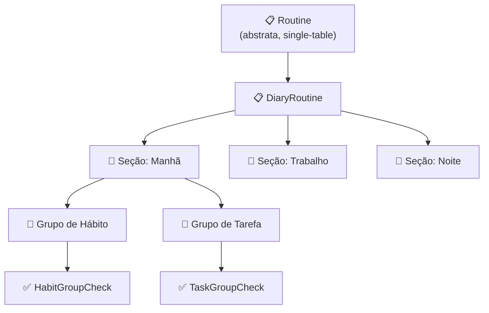
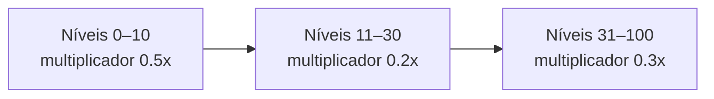
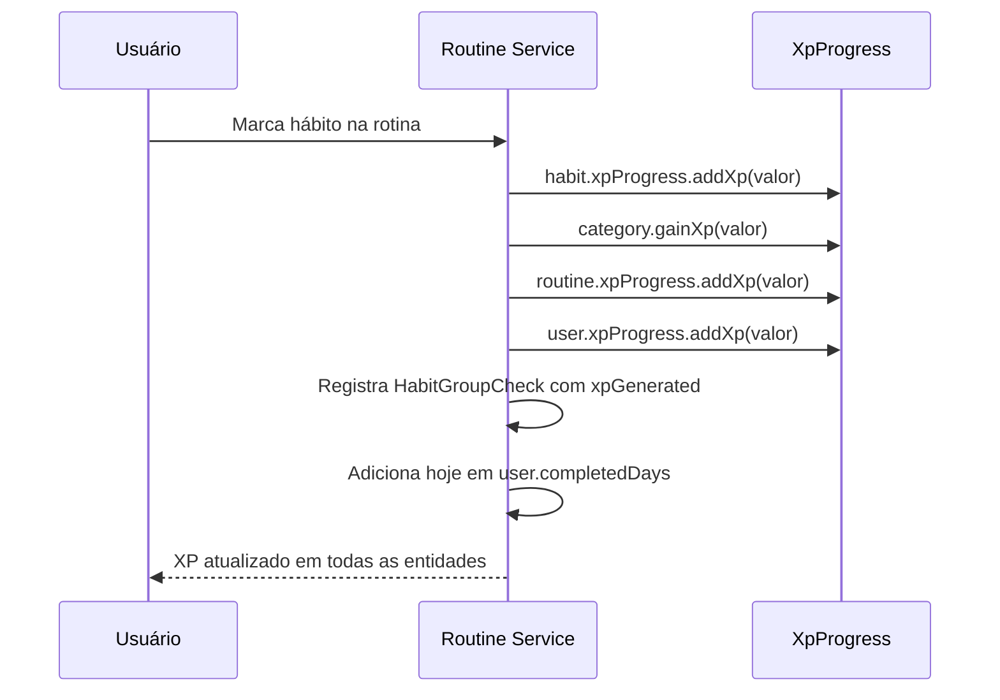
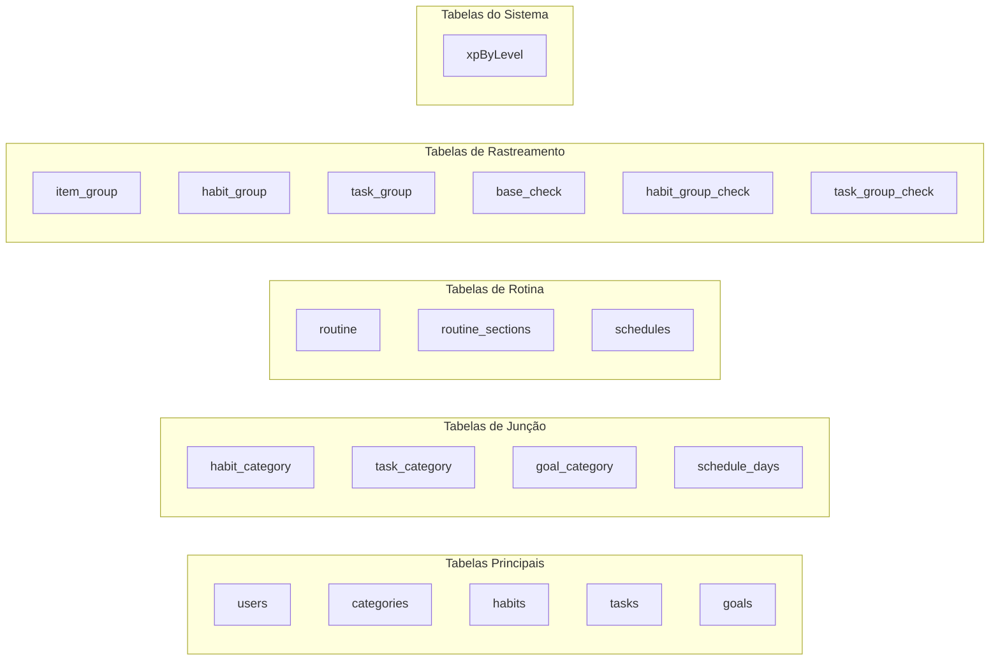

Este documento cobre todas as entidades do domínio Beyou, explicando tanto o que ela faz para o usuário quanto como é estruturada no banco de dados. O objetivo é dar aos colaboradores um modelo mental claro da camada de dados antes de ler ou escrever código.

## Visão Geral

O domínio do Beyou gira em torno de uma ideia simples: o usuário cria hábitos, tarefas e metas, organiza em categorias e executa através de rotinas diárias. Cada ação gera XP que evolui o nível do usuário, do hábito, da categoria e da rotina — criando um loop de gamificação que recompensa a consistência.

## User

**Papel no produto** — A entidade central. Todo dado no Beyou pertence a um usuário. O usuário tem um perfil (nome, foto, frase motivacional), preferências (tema, idioma, widgets do dashboard) e um estado de gamificação (XP, nível, constância).

**Campos principais**

| Campo | Tipo | Notas |
|-------|------|-------|
| id | UUID | Auto-gerado |
| name | String | Mín 2 caracteres |
| email | String | Único, validado |
| password | String | Mín 6 caracteres, hash |
| isGoogleAccount | boolean | True para usuários OAuth |
| perfilPhrase / perfilPhraseAuthor | String | Citação motivacional opcional |
| perfilPhoto | String | URL da foto de perfil |
| themeInUse | String | Preferência de tema atual |
| languageInUse | String | en ou pt |
| widgetsIdInUse | Lista de String | IDs dos widgets ativos no dashboard |
| isTutorialCompleted | boolean | Flag de onboarding |
| maxConstance | Integer | Maior streak já alcançado |
| completedDays | Set de LocalDate | Dias com atividade de rotina completada |
| userRole | UserRole enum | Sempre USER |
| constanceConfiguration | ConstanceConfiguration enum | ANY ou COMPLETE |

**Embutido:** XpProgress (xp, level, actualLevelXp, nextLevelXp)

**Relacionamentos**

- Possui Categories, Habits, Tasks, Goals, Routines (OneToMany, cascade all, orphan removal)

**Lógica de negócio**

- getCurrentConstance(referenceDate) calcula a constância atual percorrendo completedDays de trás para frente a partir da data mais recente. Isso alimenta o contador de streak no dashboard.
- Implementa Spring Security UserDetails para autenticação.

## Category

**Papel no produto** — Categorias permitem que os usuários organizem seus hábitos, tarefas e metas por tema (ex: "Saúde", "Carreira", "Pessoal"). Categorias também ganham XP, então o usuário pode ver em qual área da vida está investindo mais esforço.

**Campos principais**

| Campo | Tipo | Notas |
|-------|------|-------|
| id | UUID | Auto-gerado |
| name | String | Mín 2, máx 256 caracteres |
| description | String | Máx 256, opcional |
| iconId | String | Identificador do ícone |

**Embutido:** XpProgress

**Relacionamentos**

- Pertence a um User (ManyToOne)
- Vinculada a Habits, Tasks, Goals (ManyToMany, lado inverso via join tables habit_category, task_category, goal_category)

**Lógica de negócio**

- Métodos gainXp / loseXp delegam para o XpProgress com uma função provider que consulta a tabela XpByLevel.

## Habit

**Papel no produto** — Um hábito é um comportamento que o usuário quer rastrear e melhorar ao longo do tempo. Cada hábito tem sua própria progressão de nível e XP, incentivando o usuário a manter a consistência. Hábitos recebem classificações de importância e dificuldade que influenciam as recompensas de XP.

**Campos principais**

| Campo | Tipo | Notas |
|-------|------|-------|
| id | UUID | Auto-gerado |
| name | String | Mín 2, máx 256 caracteres |
| description | String | Máx 256, opcional |
| iconId | String | Identificador do ícone |
| importance | Integer | Escala 1–4 |
| dificulty | Integer | Escala 1–4 |
| motivationalPhrase | String | Máx 256, opcional |
| constance | int | Contador de streak atual, inicia em 0 |

**Embutido:** XpProgress

**Relacionamentos**

- Pertence a um User (ManyToOne)
- Categorizado por Categories (ManyToMany, lado proprietário, join table habit_category)
- Referenciado por HabitGroups dentro de rotinas (OneToMany, cascade all, sem orphan removal)

## Task

**Papel no produto** — Tarefas são ações concretas que o usuário precisa fazer. Diferente dos hábitos, tarefas podem ser únicas (ex: "Comprar mantimentos") ou recorrentes. Tarefas únicas suportam soft delete via data markedToDelete, dando ao sistema um período de graça antes da remoção permanente.

**Campos principais**

| Campo | Tipo | Notas |
|-------|------|-------|
| id | UUID | Auto-gerado |
| name | String | Opcional |
| description | String | Opcional |
| iconId | String | Opcional |
| importance | Integer | Opcional, escala 1–4 |
| dificulty | Integer | Opcional, escala 1–4 |
| oneTimeTask | boolean | True para tarefas não recorrentes |
| markedToDelete | LocalDate | Timestamp de soft delete |

**Relacionamentos**

- Pertence a um User (ManyToOne)
- Categorizada por Categories (ManyToMany, lado proprietário, join table task_category)

**Nota** — Tarefas não têm sua própria progressão de XP. Elas ganham XP indiretamente quando marcadas como concluídas dentro de uma rotina.

## Goal

**Papel no produto** — Metas são objetivos baseados em alvos mensuráveis (ex: "Correr 100 km", "Ler 12 livros"). Usuários acompanham o progresso via currentValue / targetValue e ganham uma recompensa de XP calculada ao completar.

**Campos principais**

| Campo | Tipo | Notas |
|-------|------|-------|
| id | UUID | Auto-gerado |
| name | String | Obrigatório |
| iconId | String | Obrigatório |
| description | String | Opcional |
| targetValue | Double | O alvo numérico |
| unit | String | Unidade de medida (km, livros, etc.) |
| currentValue | Double | Progresso atual |
| complete | Boolean | Flag de conclusão |
| motivation | String | Texto motivacional opcional |
| startDate | LocalDate | Quando a meta começa |
| endDate | LocalDate | Prazo final |
| xpReward | double | XP calculado na conclusão |
| completeDate | LocalDate | Quando foi completada |
| status | GoalStatus enum | NOT_STARTED, IN_PROGRESS, COMPLETED |
| term | GoalTerm enum | SHORT_TERM, MEDIUM_TERM, LONG_TERM |

**Relacionamentos**

- Pertence a um User (ManyToOne)
- Categorizada por Categories (ManyToMany, lado proprietário, join table goal_category)

**Cálculo de XP** — GoalXpCalculator computa a recompensa com base em quatro fatores:

- XP base escala com o valor alvo (50 para metas pequenas, 300 para grandes)
- Multiplicador de dificuldade recompensa metas mais difíceis (até 2.0x para alvos acima de 200)
- Multiplicador de urgência recompensa prazos curtos (1.5x para metas com prazo de até 7 dias)
- Multiplicador de consistência recompensa completar antes do prazo (1.3x)

## Routine

**Papel no produto** — Rotinas são a ferramenta principal de execução diária. O usuário define uma rotina com seções (ex: "Manhã", "Trabalho", "Noite"), cada uma contendo grupos de hábitos e tarefas. Todo dia, o usuário abre sua rotina e marca itens como feitos, gerando XP em todas as entidades relacionadas.

**Herança** — Routine é uma classe base abstrata usando herança single-table do JPA. Atualmente o único tipo concreto é DiaryRoutine (rotina diária com seções).

### Routine (base abstrata)

| Campo | Tipo | Notas |
|-------|------|-------|
| id | UUID | Auto-gerado |
| name | String | Obrigatório |
| iconId | String | Opcional |

**Embutido:** XpProgress

**Relacionamentos**

- Pertence a um User (ManyToOne)
- Vinculada a um Schedule (OneToOne, opcional)

### DiaryRoutine

Estende Routine. Adiciona:

- routineSections (OneToMany, cascade all, ordenado por orderIndex ASC)

### RoutineSection

**Papel no produto** — Seções dividem uma rotina em blocos de tempo. Cada seção pode ter horário de início/fim e ser marcada como favorita.

| Campo | Tipo | Notas |
|-------|------|-------|
| id | UUID | Auto-gerado |
| name | String | Obrigatório |
| iconId | String | Opcional |
| startTime | LocalTime | Opcional |
| endTime | LocalTime | Opcional |
| orderIndex | int | Posição dentro da rotina |
| favorite | Boolean | Opcional |

**Relacionamentos**

- Pertence a uma Routine (ManyToOne)
- Contém TaskGroups e HabitGroups (OneToMany, cascade all, orphan removal)

## Schedule

**Papel no produto** — Um schedule define quais dias da semana uma rotina está ativa. Isso determina se a rotina aparece no dashboard do usuário em um determinado dia.

| Campo | Tipo | Notas |
|-------|------|-------|
| id | UUID | Auto-gerado |
| days | Set de WeekDay | Armazenado na join table schedule_days |

**Enum WeekDay** — Monday, Tuesday, Wednesday, Thursday, Friday, Saturday, Sunday

## Item Groups e Checks

**Papel no produto** — Quando um hábito ou tarefa é colocado dentro de uma seção da rotina, ele se torna um "grupo" — uma instância rastreável que pode ser marcada como feita ou pulada a cada dia. Cada check gera um registro histórico com data, hora e XP ganho.

### ItemGroup (base abstrata)

Usa estratégia de herança joined do JPA.

| Campo | Tipo | Notas |
|-------|------|-------|
| id | UUID | Auto-gerado |
| startTime | LocalTime | Opcional |
| endTime | LocalTime | Opcional |

**Tipos concretos:**

- **HabitGroup** — referencia um Habit (ManyToOne), rastreia via HabitGroupChecks (OneToMany, cascade all)
- **TaskGroup** — referencia uma Task (ManyToOne), rastreia via TaskGroupChecks (OneToMany, cascade all)

### BaseCheck (base abstrata)

Usa estratégia de herança joined do JPA.

| Campo | Tipo | Notas |
|-------|------|-------|
| id | UUID | Auto-gerado |
| checkDate | LocalDate | Quando o check aconteceu |
| checkTime | LocalTime | Hora do check |
| checked | boolean | Foi completado? |
| skipped | Boolean | Foi pulado? |
| xpGenerated | double | XP ganho neste check |

**Tipos concretos:**

- **HabitGroupCheck** — pertence a um HabitGroup
- **TaskGroupCheck** — pertence a um TaskGroup

## Sistema de Progressão de XP

**Papel no produto** — Toda entidade que pode ganhar XP (User, Category, Habit, Routine) compartilha o mesmo componente embutido XpProgress. Isso cria uma experiência de evolução consistente em todo o app.

### XpProgress (embutível)

| Campo | Tipo | Notas |
|-------|------|-------|
| xp | double | XP total acumulado |
| level | int | Nível atual |
| actualLevelXp | double | Limiar de XP para o nível atual |
| nextLevelXp | double | Limiar de XP para o próximo nível |

**Lógica de level-up** — Quando xp atinge nextLevelXp, o nível incrementa e os limites recalculam a partir da tabela XpByLevel. O inverso acontece quando XP é removido.

### Tabela XpByLevel

Semeada na inicialização da aplicação pelo XpByLevelSeeder. Define 101 níveis (0–100) com dificuldade progressiva:

Fórmula por nível: xp += (level + 1) * 100 * multiplicador

Níveis iniciais são rápidos para encorajar novos usuários. Níveis médios desaceleram. Níveis altos exigem esforço sustentado.

### Fluxo de XP ao marcar item na rotina

## Estratégias de Herança

O domínio usa duas estratégias de herança JPA:

| Estratégia | Usado por | Como funciona |
|------------|-----------|---------------|
| **Single Table** | Routine → DiaryRoutine | Uma tabela para todos os tipos de rotina, com coluna discriminadora. Consultas rápidas, mas colunas anuláveis para campos específicos de tipo. |
| **Joined** | ItemGroup → HabitGroup / TaskGroup, BaseCheck → HabitGroupCheck / TaskGroupCheck | Tabela base + tabelas filhas unidas por chave estrangeira. Schema mais limpo, um pouco mais de joins. |

## Regras de Cascade e Deleção

Entender cascatas é crítico para evitar dados órfãos ou deleções acidentais.

| Pai | Filhos | Cascade | Orphan Removal |
|-----|--------|---------|----------------|
| User | Categories, Habits, Routines, Goals | ALL | Sim — deletar um usuário remove tudo |
| DiaryRoutine | RoutineSections | ALL | Não |
| RoutineSection | HabitGroups, TaskGroups | ALL | Sim — remover uma seção limpa seus grupos |
| Habit | HabitGroups | ALL | Não — deletar um hábito não o remove das rotinas automaticamente |
| HabitGroup | HabitGroupChecks | ALL | Não — histórico de checks é preservado |
| TaskGroup | TaskGroupChecks | ALL | Não — histórico de checks é preservado |

## Resumo das Tabelas do Banco

Todas as chaves primárias são UUIDs. Timestamps (createdAt, updatedAt) são definidos via callbacks de ciclo de vida JPA (@PrePersist, @PreUpdate).
