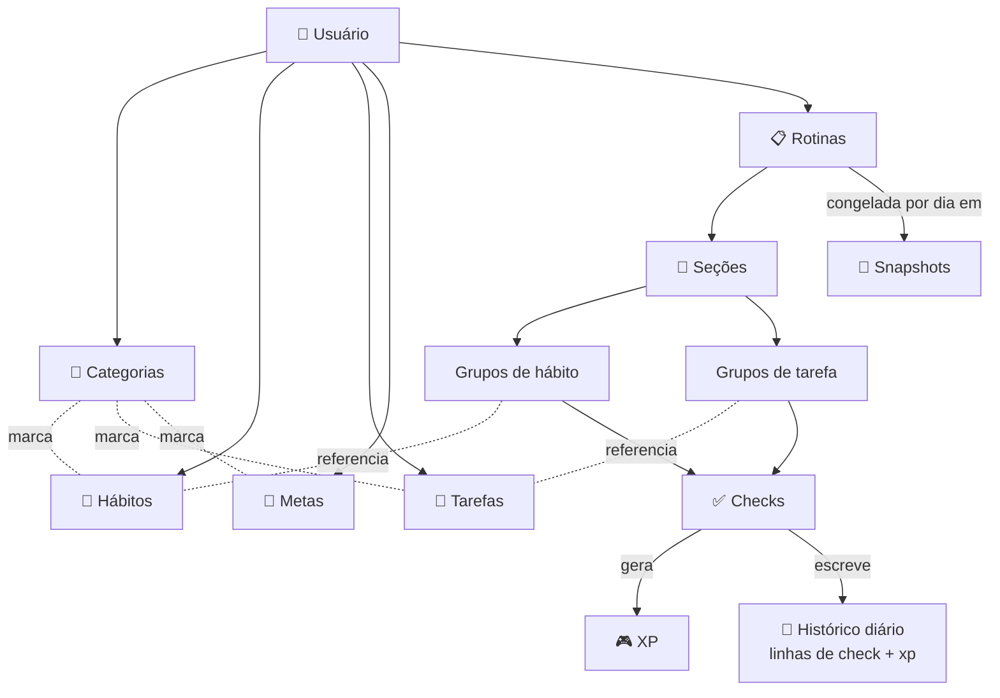
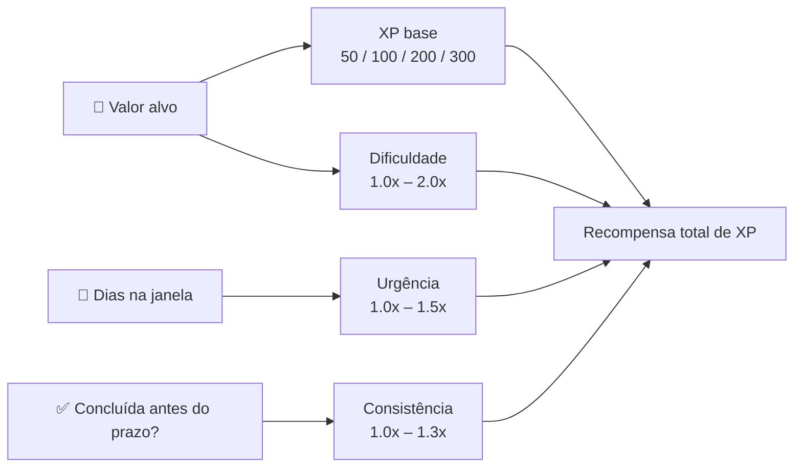
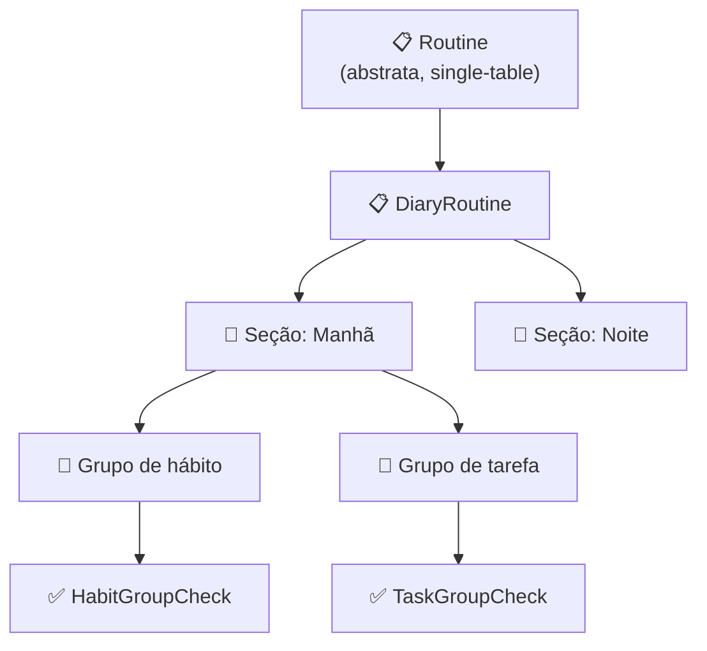
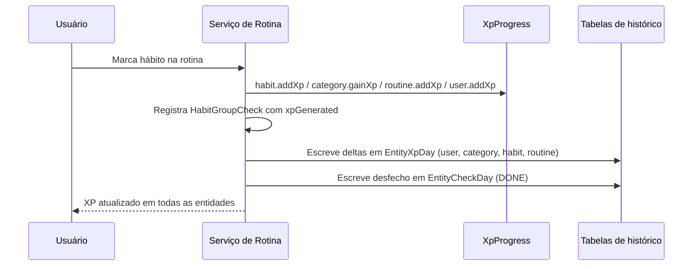
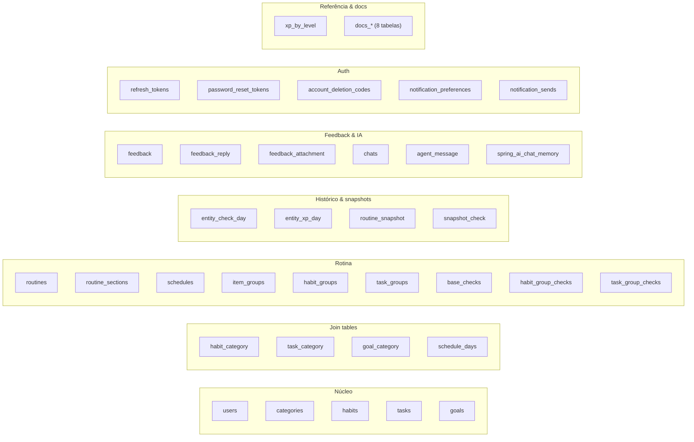

Este documento cobre cada entidade do domínio do Beyou, explicando o que cada uma faz pelo usuário e como está estruturada no banco de dados. O objetivo é um modelo mental claro da camada de dados antes de ler ou escrever código.

Uma regra de base molda tudo aqui: o schema pertence ao Flyway. As migrações em `db/migration/` criam e evoluem cada tabela, e o Hibernate roda com `ddl-auto: validate` em todos os ambientes, então um mapeamento de entidade que discorde das migrações falha no startup em vez de reescrever o schema em silêncio.

## O quadro geral

O domínio do Beyou gira em torno de uma ideia simples: o usuário cria hábitos, tarefas e metas, os organiza em categorias e os executa em rotinas diárias. Cada check gera XP e escreve histórico. Ao redor desse ciclo central ficam quatro famílias de apoio: as linhas de histórico diário, os snapshots imutáveis de rotina, as threads de feedback e os chats do agente de IA.


```mermaid
flowchart TD
  U["👤 Usuário"]
  U --> CAT["📂 Categorias"]
  U --> HAB["💪 Hábitos"]
  U --> TSK["📝 Tarefas"]
  U --> GOL["🎯 Metas"]
  U --> RTN["📋 Rotinas"]

  CAT -.-|"marca"| HAB
  CAT -.-|"marca"| TSK
  CAT -.-|"marca"| GOL

  RTN --> SEC["📑 Seções"]
  SEC --> HG["Grupos de hábito"]
  SEC --> TG["Grupos de tarefa"]
  HG -.-|"referencia"| HAB
  TG -.-|"referencia"| TSK

  HG --> CHK["✅ Checks"]
  TG --> CHK
  CHK -->|"gera"| XP["🎮 XP"]
  CHK -->|"escreve"| HIST["📅 Histórico diário<br/>linhas de check + xp"]
  RTN -->|"congelada por dia em"| SNAP["🧊 Snapshots"]
```

## User

**Papel no produto**: a entidade central. Cada dado do Beyou pertence a um usuário. O usuário tem perfil (nome, foto, frase motivacional), preferências (tema, idioma, timezone, widgets do dashboard), estado de gamificação (XP, level, streaks) e dois pequenos campos de texto que o agente de IA usa como memória.

**Campos principais**

| Campo | Tipo | Notas |
|-------|------|-------|
| id | UUID | Gerado automaticamente |
| name | String | |
| email | String | Único |
| password | String | Hash BCrypt |
| isGoogleAccount | boolean | True para contas OAuth |
| emailVerified | boolean | Contas novas confirmam por e-mail antes do primeiro login |
| verificationToken / verificationTokenExpiry | String / LocalDateTime | O estado de verificação vive como colunas aqui, sem entidade própria |
| verificationTokenSentAt | Instant | Quando o último e-mail de verificação saiu, lido pelo cooldown do reenvio. Um Instant contra o LocalDateTime ao lado porque é comparado a um relógio e nunca exibido. Null significa nenhum e-mail registrado, que é como toda linha anterior à coluna se lê, e como fica uma linha cujo envio falhou |
| perfilPhrase / perfilPhraseAuthor | String | Citação motivacional opcional |
| perfilPhoto | String (512) | A URL do avatar no CDN do Google, gravada no login OAuth. NÃO é o caminho de uma foto enviada: o upload escreve `{upload-dir}/user-photos/{userId}.jpg` e nunca toca nesta coluna, então ela fica nula em contas que nunca entraram com o Google. O perfil serve o arquivo primeiro e esta coluna depois, e remover tem que limpar os dois |
| themeInUse / languageInUse | String | Preferências |
| timezone | String | Obrigatório. O fuso IANA da conta, vindo do cliente no cadastro e caindo em UTC quando não vem. Toda data que o app escreve é resolvida contra ele |
| timezoneSource | enum TimezoneSource | DEFAULT, DETECTED ou EXPLICIT: se o fuso acima chegou a ser escolhido por alguém. Só DEFAULT pode ser corrigido automaticamente |
| widgetsIdInUse | Lista de String | IDs dos widgets ativos do dashboard |
| isTutorialCompleted | boolean | Flag do onboarding |
| userContext | String (2000) | A memória global do agente de IA sobre este usuário |
| xpDecayStrategy | Enum XpDecayStrategy | GRADUAL, FLAT ou TIME_WINDOW; como check-ins atrasados perdem XP |
| maxConstance | Integer | Maior streak já alcançado |
| completedDays | Set de LocalDate | Dias com atividade de rotina completada |
| userRole | Enum UserRole | USER ou ADMIN (admin só por update manual no banco) |
| constanceConfiguration | Enum ConstanceConfiguration | ANY ou COMPLETE |

**Embutidos**: XpProgress e CheckProgress (ambos descritos abaixo).

**Relacionamentos**: o usuário possui seis coleções, todas OneToMany com cascade ALL e orphan removal: categorias, hábitos, tarefas, metas, rotinas e snapshots de rotina. A exclusão de conta funciona inteiramente por esse cascade; a coleção de tarefas foi adicionada justamente para fechar uma brecha nele.

**Lógica de negócio**: implementa o UserDetails do Spring Security. O cálculo de streak, que antes vivia aqui como uma caminhada sobre completedDays, agora pertence ao UserStreakService no pacote checkday, em cima das linhas de histórico diário.

## Category

**Papel no produto**: categorias organizam hábitos, tarefas e metas por área da vida ("Saúde", "Carreira"). Categorias também ganham XP, então o usuário vê onde investe mais esforço.

**Campos principais**: name, description, iconId, timestamps.

**Embutido**: apenas XpProgress. Deliberadamente sem CheckProgress: uma categoria ganha XP, mas nunca é marcada.

**Relacionamentos**

- Pertence a um User (ManyToOne).
- Marcada em Habits, Tasks e Goals como lado inverso de três joins ManyToMany (habit_category, task_category, goal_category).

## Habit

**Papel no produto**: um comportamento que o usuário quer construir. Cada hábito tem seu próprio level e progressão de XP, mais um registro de streak, então continuar aparecendo segue valendo a pena.

**Campos principais**

| Campo | Tipo | Notas |
|-------|------|-------|
| name / description / iconId | String | |
| importance | Integer | 1 a 4 |
| dificulty | Integer | 1 a 4. Sim, com erro de grafia: é o nome real do campo, da coluna e do formato de rede |
| motivationalPhrase | String | Opcional |

**Embutidos**: XpProgress e CheckProgress. O antigo contador avulso `constance` se foi; o CheckProgress o substituiu.

**Relacionamentos**

- Pertence a um User (ManyToOne).
- Marcado por Categories (ManyToMany, lado dono, join table habit_category).
- Referenciado por HabitGroups dentro de rotinas (OneToMany, cascade ALL, sem orphan removal).

## Task

**Papel no produto**: uma ação concreta. Diferente dos hábitos, tarefas podem ser únicas ("Comprar mantimentos"). Tarefas únicas recebem uma data de soft-delete ao serem marcadas, dando ao sistema um período de carência antes de um scheduler removê-las.

**Campos principais**

| Campo | Tipo | Notas |
|-------|------|-------|
| name / description / iconId | String | |
| importance / dificulty | Integer | 1 a 4, mesma grafia do Habit |
| oneTimeTask | boolean | True para tarefas não recorrentes |
| markedToDelete | LocalDate | Definido ao completar tarefas únicas; o TaskCleanupScheduler as recolhe |

**Embutido**: apenas CheckProgress. Uma tarefa não carrega XP próprio; marcá-la alimenta o usuário, a rotina e as categorias.

**Relacionamentos**: pertence a um User (ManyToOne); marcada por Categories (ManyToMany, lado dono, join table task_category).

## Goal

**Papel no produto**: um objetivo mensurável ("Correr 100 km"). O progresso é currentValue contra targetValue, e a conclusão paga uma recompensa de XP calculada.

**Campos principais**

| Campo | Tipo | Notas |
|-------|------|-------|
| name / iconId / description | String | |
| targetValue / currentValue | Double | A parte mensurável |
| unit | String | km, livros, etc. |
| complete | Boolean | Flag de conclusão |
| motivation | String | Opcional |
| startDate / endDate | LocalDate | Janela e prazo |
| xpReward | double | Calculado na conclusão |
| completeDate | LocalDate | |
| status | Enum GoalStatus | NOT_STARTED, IN_PROGRESS, COMPLETED (guardados como string) |
| term | Enum GoalTerm | SHORT_TERM, MEDIUM_TERM, LONG_TERM |

**Relacionamentos**: pertence a um User (ManyToOne); marcada por Categories (ManyToMany, lado dono, join table goal_category).

**Invariante que vale conhecer**: construir uma meta com status COMPLETED a rebaixa silenciosamente para IN_PROGRESS. Só o endpoint explícito de conclusão paga XP, então ninguém consegue postar uma meta pré-completada para colher recompensa.

**Cálculo de XP**: o GoalXpCalculator multiplica quatro fatores.


```mermaid
flowchart LR
  TV["🎯 Valor alvo"] --> BASE["XP base<br/>50 / 100 / 200 / 300"]
  TV --> DIFF["Dificuldade<br/>1.0x – 2.0x"]
  DL["📅 Dias na janela"] --> URG["Urgência<br/>1.0x – 1.5x"]
  CD["✅ Concluída antes do prazo?"] --> CON["Consistência<br/>1.0x – 1.3x"]
  BASE --> TOTAL["Recompensa total de XP"]
  DIFF --> TOTAL
  URG --> TOTAL
  CON --> TOTAL
```

- O XP base escala com o valor alvo: 50 abaixo de 10, 100 abaixo de 50, 200 abaixo de 200, 300 acima.
- A dificuldade recompensa alvos maiores, até 2.0x a partir de 200.
- A urgência recompensa janelas curtas: 1.5x para 7 dias ou menos, 1.2x até 30.
- Terminar antes do prazo multiplica por 1.3x.

## Os dois componentes compartilhados

Dois embutíveis carregam o estado de gamificação, e quais entidades embutem qual é uma decisão de design por si só.

### XpProgress

| Campo | Tipo | Notas |
|-------|------|-------|
| xp | double | XP total acumulado |
| level | int | Level atual |
| actualLevelXp / nextLevelXp | double | Fronteiras do level atual |

Embutido por **User, Category, Habit e Routine**: as quatro coisas que sobem de level. `addXp` e `removeXp` caminham pela curva de levels nas duas direções através de uma função de consulta, com teto no último level.

### CheckProgress

| Campo | Tipo | Notas |
|-------|------|-------|
| check_current_streak / check_best_streak | int | Streaks |
| check_total_check_ins | int | Contagem de toda a vida |
| check_first_check_in_date / check_last_check_in_date | LocalDate | Limites, anuláveis |

Embutido por **User, Habit, Task e Routine**: as quatro coisas que são marcadas. Category fica de fora de propósito, e Task aparece aqui mesmo sem ter XP.

## Routine

**Papel no produto**: a ferramenta de execução diária. Uma rotina tem seções ("Manhã", "Trabalho", "Noite"), cada uma com grupos de hábitos e tarefas. Marcar itens gera XP em cada entidade relacionada.

**Herança**: Routine é uma base abstrata com herança single-table e discriminador `dtype`. DiaryRoutine é o único tipo concreto hoje.


```mermaid
flowchart TD
  R["📋 Routine<br/>(abstrata, single-table)"]
  R --> DR["📋 DiaryRoutine"]
  DR --> RS1["📑 Seção: Manhã"]
  DR --> RS2["📑 Seção: Noite"]
  RS1 --> HG1["💪 Grupo de hábito"]
  RS1 --> TG1["📝 Grupo de tarefa"]
  HG1 --> HC["✅ HabitGroupCheck"]
  TG1 --> TC["✅ TaskGroupCheck"]
```

### Routine (base abstrata)

Campos: name, iconId. Embute XpProgress e CheckProgress.

**Relacionamentos**

- Pertence a um User (ManyToOne).
- Possui um Schedule (OneToOne, anulável, cascade REMOVE, lado dono). Deliberadamente sem orphan removal: desagendar zera a referência e apaga a linha do schedule explicitamente.

### DiaryRoutine

Estende Routine, adicionando routineSections (OneToMany, cascade ALL, orphan removal, ordenadas por orderIndex).

### RoutineSection

Campos: name, iconId, startTime, endTime, orderIndex, favorite.

**Relacionamentos**: pertence a uma Routine (ManyToOne); contém HabitGroups e TaskGroups (OneToMany, cascade ALL, orphan removal). Uma peculiaridade para conhecer: essas coleções são unidirecionais e mapeadas por join tables (routine_sections_habit_groups, routine_sections_task_groups), enquanto o ItemGroup também carrega sua própria coluna routine_section_id. O vínculo seção-grupo está, na prática, mapeado duas vezes.

## Schedule

**Papel no produto**: em quais dias da semana uma rotina está ativa, o que decide se ela aparece no dashboard de um dado dia.

A entidade é mínima: um id mais um conjunto de enums WeekDay guardados na tabela de coleção schedule_days. A chave estrangeira vive do lado da rotina. Uma pegadinha: os identificadores do enum são palavras capitalizadas (Monday, Tuesday, ...), sem SCREAMING_CASE, e são guardados como string — grafia que uma CHECK constraint na tabela também exige e que toda resposta devolve. O JSON de entrada é o único lugar que perdoa divergência: qualquer caixa, e os nomes em português, resolvem para a mesma constante, porque uma chamada de tool do agente que chutava SCREAMING_CASE custava uma ida e volta inteira ao LLM para se corrigir.

## Grupos de itens e checks

**Papel no produto**: colocar um hábito ou tarefa dentro de uma seção de rotina cria um "grupo", a instância rastreável que é marcada ou pulada a cada dia. Cada check é um registro histórico com data, hora e o XP que gerou.

**ItemGroup** (abstrata, herança joined): startTime, endTime e o ManyToOne de volta à seção. Tipos concretos HabitGroup (referencia um Habit) e TaskGroup (referencia uma Task), cada um dono das suas coleções de checks (cascade ALL, sem orphan removal, então o histórico sobrevive).

**BaseCheck** (abstrata, herança joined): checkDate, checkTime, checked, skipped, xpGenerated. Tipos concretos HabitGroupCheck e TaskGroupCheck, cada um pertencente ao seu grupo.

## Histórico diário: EntityCheckDay e EntityXpDay

**Papel no produto**: os widgets de histórico e progresso do dashboard precisam de respostas por dia ("o que aconteceu com este hábito na terça?", "quanto XP esta categoria ganhou nesta semana?"). Varrer as tabelas cruas de checks para isso é caro e frágil, então duas tabelas dedicadas de histórico guardam uma linha por entidade por dia.

**EntityCheckDay** (tabela entity_check_day): um desfecho por entidade por dia, único em (owner_type, owner_id, day).

- Desfechos: DONE, SKIPPED, MISSED, NOT_SCHEDULED, NOT_IN_ROUTINE. Só DONE avança um streak.
- Tipos de dono: HABIT, TASK, ROUTINE, USER.
- A referência ao dono é um UUID solto, sem chave estrangeira, de propósito: o histórico precisa sobreviver à rotina ou hábito pelo qual foi registrado. A referência ao usuário é uma FK de verdade com cascade delete, então a exclusão de conta ainda o varre.

**EntityXpDay** (tabela entity_xp_day): o delta líquido de XP por entidade por dia, mesmo padrão de unicidade.

- O valor tem sinal: desmarcar um item produz um delta negativo. Somar as linhas de um dono reproduz o total do seu XpProgress.
- Tipos de dono: USER, CATEGORY, HABIT, ROUTINE. Exatamente os quatro portadores de XpProgress, e deliberadamente diferente do conjunto do check-day (este tem CATEGORY e não tem TASK).
- Essas linhas alimentam o endpoint /xp/history, que devolve séries densas: uma entrada por dia da janela, zeros incluídos, para os gráficos nunca pularem dias.

## Snapshots de rotina

**Papel no produto**: rotinas mudam. Seções são renomeadas, hábitos são removidos, rotinas inteiras são apagadas. Sem snapshots, a visão de ontem do seu dia se reescreveria em silêncio. Então, a cada dia agendado, cada rotina é congelada em uma cópia imutável, e os dias passados renderizam exatamente como eram.

**RoutineSnapshot** (tabela routine_snapshot): único por (rotina, dia).

- Referencia a rotina e, desnormalizado, o usuário, para o dia inteiro carregar em uma consulta.
- Copia routineName e routineIconId, e guarda structureJson: a árvore completa de seções e itens em JSON, mantida ao pé da letra para renderização.
- Possui seus SnapshotChecks (cascade ALL, orphan removal).

**SnapshotCheck** (tabela snapshot_check): uma linha por grupo de hábito ou tarefa da rotina congelada.

- Cópias desnormalizadas do nome, ícone, dificuldade e importância do item, mais o nome da seção.
- originalItemId e originalGroupId são UUIDs soltos, sem chaves estrangeiras, o mesmo padrão das tabelas de histórico: o snapshot precisa sobreviver a edições e exclusões daquilo que aponta.
- Estado mutável: checked, skipped, checkTime, xpGenerated. O tipo do item é HABIT ou TASK.

**Check-ins atrasados e decaimento de XP**: marcar um dia passado por um snapshot ainda paga XP, mas decaído conforme a XpDecayStrategy escolhida pelo usuário:

| Estratégia | Comportamento |
|------------|---------------|
| GRADUAL | 0.8x com um dia de atraso, depois 0.6x, 0.4x e 0.2x de quatro dias em diante |
| FLAT | 0.5x não importa o atraso |
| TIME_WINDOW | XP cheio até dois dias de atraso, nada depois |

O scheduler de snapshots roda por timezone, usando a coluna de timezone de cada conta, então uma rotina é congelada na meia-noite daquele usuário, não na do servidor.

## Feedback

**Papel no produto**: usuários reportam bugs e pedem funcionalidades dentro do app; um admin lê, responde e acompanha o status.

- **Feedback** (tabela feedback): pertence a um User, guarda o texto mais um FeedbackContext embutido (tela, versão do app, plataforma, idioma, tema) capturado no envio. A categoria é BUG, FEATURE_REQUEST ou OTHER; o status é OPEN, TAKING_CARE ou CLOSED e só o admin o vê ou altera.
- **FeedbackReply**: uma resposta na thread. A referência ao autor é anulável de propósito, para a resposta sobreviver à exclusão da conta do autor.
- **FeedbackAttachment**: uma linha-índice de screenshot (largura, altura, tamanho). Os bytes do JPEG vivem em disco, no diretório de uploads, fora do banco.

## Chats do agente de IA

**Papel no produto**: o chat do agente, que cria rotinas e responde perguntas, mantém as conversas no domínio, com duas camadas de memória.

- **Chat** (tabela chats): pertence a um User, tem título e userContextInChat, uma memória de 1000 caracteres do escopo do chat que o modelo reescreve conforme a conversa evolui. A entidade do usuário carrega o equivalente global de 2000 caracteres (userContext).
- **AgentMessage** (tabela agent_message): deliberadamente sem relacionamento JPA com o Chat, só uma coluna chatId com o cascade por conta de uma FK do banco. Cada mensagem guarda o papel, um array JSON de segmentos de conteúdo e um sequenceId, único por chat, que torna a ordenação explícita em vez de dependente de timestamp.
- O Spring AI gerencia sua própria tabela spring_ai_chat_memory para a janela de curto prazo do modelo; ela não tem entidade JPA.

## Entidades de auth e conta

Cinco pequenas entidades pendem da conta. Três guardam hashes para os fluxos de segurança, todas ManyToOne para User; as outras duas guardam uma preferência e um log do e-mail que essa preferência permitiu:

| Entidade | Tabela | O que guarda |
|----------|--------|--------------|
| RefreshToken | refresh_tokens | Hash do refresh token de 15 dias, expiração, revokedAt |
| PasswordResetToken | password_reset_tokens | Hash do token de reset, expiração, usedAt |
| AccountDeletionCode | account_deletion_codes | Hash BCrypt de um código de seis dígitos, expiração, usedAt e um contador de tentativas que mata o código depois de alguns erros |
| NotificationPreferences | notification_preferences | Se a conta pode receber e-mail de engajamento, mais o token que um link de cancelamento carrega. OneToOne em vez de ManyToOne, chaveada pelo próprio id do usuário via `@MapsId` para que a chave e a associação não possam divergir |
| NotificationSend | notification_sends | Uma linha por e-mail de engajamento efetivamente enviado: o tipo e a data local de QUEM RECEBE, não a do servidor. Uma constraint UNIQUE em (usuário, tipo, dia) é o que impede a passada horária de enviar a mesma coisa duas vezes; as mesmas linhas respondem ao intervalo por conta e ao teto diário global |

A verificação de e-mail é a exceção: vive como colunas na tabela users em vez de entidade própria. Isso também quer dizer que o token fica ali em texto plano, ao contrário dos tokens de reset e de exclusão ao lado, que são guardados como hash BCrypt.

O token de cancelamento também é guardado cru, e esse é uma decisão, não uma herança. Os três acima são segredos de uso único, então o hash é de graça. Um token de cancelamento é estável — todo e-mail de engajamento pelo resto da vida da conta aponta para ele — e um hash não pode ser desfeito para montar esse link, então hashear forçaria um token novo por envio e mataria o link de toda mensagem já entregue. A ausência de linha significa que a conta nunca recebeu e-mail e nunca abriu a configuração; quem lê tem que tratar isso como opt-in.

Diferente das três tabelas de token, esta não tem expiração nem marca de uso único: uma preferência não é gasta ao ser usada.

## Sistema de progressão de XP

### A curva de levels

XpByLevel (tabela xp_by_level) é uma tabela de referência pura: uma linha por level, com o limiar de XP para alcançá-lo. É semeada por uma migração repetível do Flyway com uma curva quadrática:

```
limiar(level) = round(50 × level²)
```

Os levels vão de 0 a 100. Os primeiros vêm rápido (o level 2 custa 200 XP), os últimos exigem esforço sustentado (o level 100 fica em 500.000). As consultas são cacheadas por level, e o XpProgress caminha por essa curva nas duas direções quando XP entra ou sai.

### Fluxo de XP em um check de rotina


```mermaid
sequenceDiagram
  participant U as Usuário
  participant R as Serviço de Rotina
  participant X as XpProgress
  participant H as Tabelas de histórico

  U->>R: Marca hábito na rotina
  R->>X: habit.addXp / category.gainXp / routine.addXp / user.addXp
  R->>R: Registra HabitGroupCheck com xpGenerated
  R->>H: Escreve deltas em EntityXpDay (user, category, habit, routine)
  R->>H: Escreve desfecho em EntityCheckDay (DONE)
  R-->>U: XP atualizado em todas as entidades
```

## Estratégias de herança

| Estratégia | Usada por | Como funciona |
|------------|-----------|---------------|
| **Single table** | Routine → DiaryRoutine | Uma tabela com discriminador dtype. Consultas rápidas; colunas embutidas NOT NULL só toleráveis porque há uma única subclasse. |
| **Joined** | ItemGroup → HabitGroup / TaskGroup, BaseCheck → HabitGroupCheck / TaskGroupCheck | Tabela base mais tabelas filhas unidas por chave estrangeira. Schema mais limpo, um join a mais por consulta. |

## Regras de cascade e exclusão

Entender os cascades importa acima de tudo na exclusão de conta, que depende deles de ponta a ponta.

| Pai | Filhos | Cascade | Orphan removal |
|-----|--------|---------|----------------|
| User | Categories, Habits, Tasks, Goals, Routines, RoutineSnapshots | ALL | Sim. Apagar um usuário remove tudo |
| User (nível de banco) | Linhas de EntityCheckDay, EntityXpDay | ON DELETE CASCADE | Por conta da FK do banco |
| DiaryRoutine | RoutineSections | ALL | Sim |
| RoutineSection | HabitGroups, TaskGroups | ALL | Sim |
| Routine | Schedule | REMOVE | Não. Desagendar é explícito |
| Habit | HabitGroups | ALL | Não. Apagar um hábito não reescreve rotinas em silêncio |
| HabitGroup / TaskGroup | Checks | ALL | Não. O histórico de checks é preservado |
| RoutineSnapshot | SnapshotChecks | ALL | Sim |

## Resumo das tabelas do banco


```mermaid
flowchart LR
  subgraph core["Núcleo"]
    users
    categories
    habits
    tasks
    goals
  end

  subgraph joins["Join tables"]
    habit_category
    task_category
    goal_category
    schedule_days
  end

  subgraph routine["Rotina"]
    routines
    routine_sections
    schedules
    item_groups
    habit_groups
    task_groups
    base_checks
    habit_group_checks
    task_group_checks
  end

  subgraph history["Histórico & snapshots"]
    entity_check_day
    entity_xp_day
    routine_snapshot
    snapshot_check
  end

  subgraph support["Feedback & IA"]
    feedback
    feedback_reply
    feedback_attachment
    chats
    agent_message
    spring_ai_chat_memory
  end

  subgraph auth["Auth"]
    refresh_tokens
    password_reset_tokens
    account_deletion_codes
    notification_preferences
    notification_sends
  end

  subgraph system["Referência & docs"]
    xp_by_level
    docs_tables["docs_* (8 tabelas)"]
  end
```

Todas as chaves primárias são UUIDs, exceto a de xp_by_level, cuja chave é o próprio level. Os timestamps são definidos por callbacks de ciclo de vida do JPA. As tabelas docs_* seguem um padrão repetido: uma raiz de tópico com chave única mais uma linha de conteúdo por idioma, importadas do repositório beyou-arch-design.
