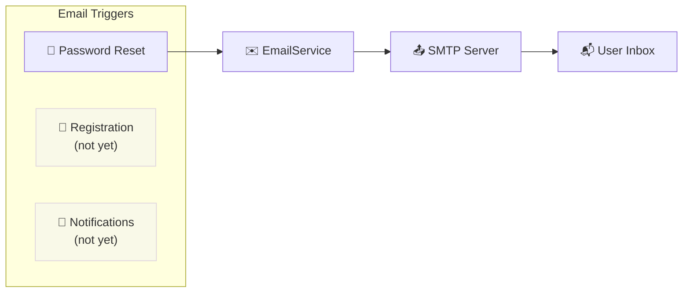
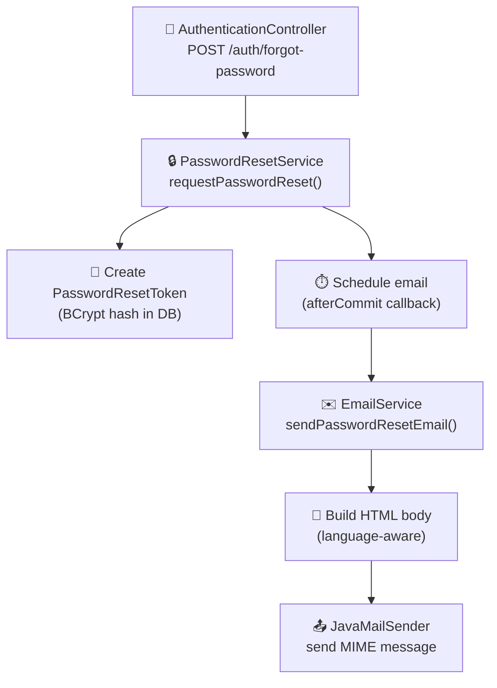
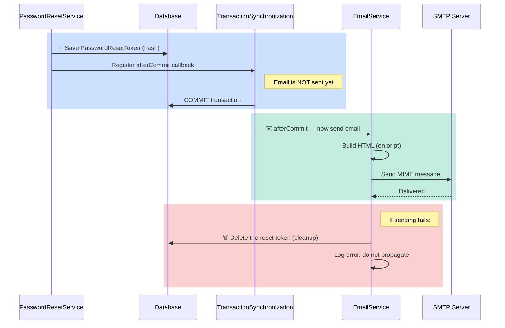
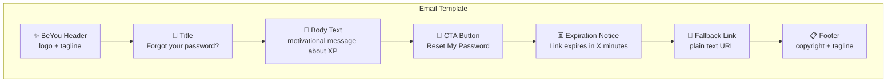
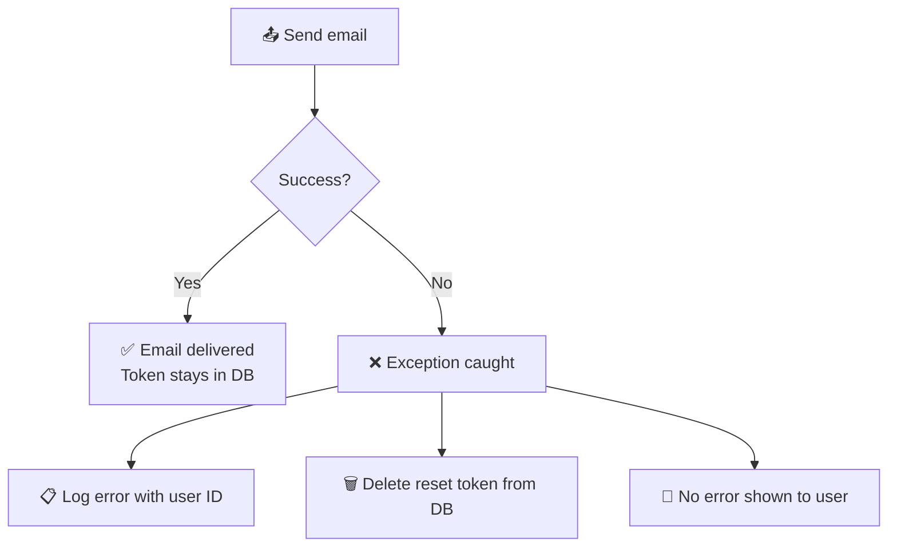

This document covers the email infrastructure in Beyou: what triggers emails, how they are built, how they are sent safely, and what the templates look like.

## Current Scope

Email is currently used for **one purpose only**: password reset. There are no registration confirmation emails, no notification emails, and no marketing emails. The entire email system lives in a single service class.

## Architecture

The email system is minimal and intentional — one service, no external queue, no template engine.

| Component | What it is |
|-----------|-----------|
| **EmailService** | Single @Service class in the notification package. One public method. |
| **PasswordResetService** | The only caller. Schedules email delivery after database transaction commits. |
| **JavaMailSender** | Spring's mail sender, configured via application.yaml SMTP properties. |
| **HTML templates** | Inline Java text blocks inside EmailService. Bilingual (en/pt). |

## Email Delivery Flow

The most important design decision is **transaction-safe delivery**: the email is only sent after the reset token is committed to the database. This prevents a scenario where the user receives a reset link but the token doesn't exist yet.

### Why afterCommit?

| Scenario | Without afterCommit | With afterCommit |
|----------|-------------------|-----------------|
| Email sent, DB commits | Works | Works |
| Email sent, DB rolls back | User gets link to a token that doesn't exist | Never happens — email waits for commit |
| Email fails | Token exists but user never got the link | Token is cleaned up from DB |

If no active transaction exists (edge case), the email is sent immediately as a fallback.

## SMTP Configuration

All SMTP settings are externalized via environment variables:

| Variable | Purpose | Example |
|----------|---------|---------|
| MAIL_HOST | SMTP server hostname | smtp.gmail.com |
| MAIL_PORT | SMTP port | 587 |
| MAIL_USERNAME | SMTP authentication username | beyou@example.com |
| MAIL_PASSWORD | SMTP authentication password | app-specific-password |
| MAIL_FROM | Sender email address (defaults to MAIL_USERNAME) | noreply@beyou.app |

**Security settings:**

- SMTP authentication enabled (auth: true)
- StartTLS enabled (encrypted connection)
- Standard for production SMTP providers (Gmail, SendGrid, AWS SES, etc.)

## HTML Email Templates

Templates are inline Java text blocks inside EmailService — no external template engine (Thymeleaf, FreeMarker, etc.). This keeps the system simple with zero additional dependencies.

### Template structure

Both languages follow the same layout:

### Bilingual support

The language is determined from the user's languageInUse preference stored in the database:

| User language | Template used | Subject line |
|--------------|--------------|-------------|
| pt, pt-BR, pt-PT | Portuguese | Redefina sua senha BeYou |
| en, null, anything else | English | Reset your BeYou password |

**Language detection logic:**

- null or blank → English (default)
- Starts with "pt" → Portuguese
- Anything else → English

### Template parameters

Each template receives three dynamic values:

| Parameter | Value | Used in |
|-----------|-------|---------|
| Reset link | Full URL with token | CTA button href, fallback link |
| TTL in minutes | From config (default 30) | Expiration notice |
| Current year | Auto-calculated | Footer copyright |

### Design

The templates use email-safe inline CSS with:

- Primary blue (#0082E1) for CTA button and accents
- White card on light gray background
- Rounded corners and shadows (supported in modern email clients)
- Responsive max-width (520px)
- Emoji in subject line and headers for personality

## Error Handling

**Key behavior:**

- Email failures are caught and logged at the PasswordResetService level
- The failed reset token is cleaned up from the database
- The user sees no error — the endpoint always returns 200 OK (to prevent user enumeration)
- The user can simply request another reset email

## What EmailService Does NOT Do

Understanding the boundaries helps contributors know where to add new email functionality:

| Feature | Status | Notes |
|---------|--------|-------|
| Password reset email | Implemented | Only current use case |
| Registration confirmation | Not implemented | Users can log in immediately after registration |
| Email verification | Not implemented | No email verification flow exists |
| Notification emails | Not implemented | No habit reminders, goal alerts, etc. |
| Async queue | Not used | Emails sent on the application thread (deferred, but synchronous) |
| Template engine | Not used | Inline HTML text blocks, no Thymeleaf/FreeMarker |
| Retry on failure | Not implemented | Single attempt, cleanup on failure |
| Email logging/tracking | Not implemented | No delivery tracking or open tracking |

## Potential Improvements

| Area | Current State | Suggestion |
|------|--------------|------------|
| Template management | Inline Java text blocks | Extract to HTML files or a template engine for easier editing |
| Async sending | Synchronous on afterCommit | Use @Async or a message queue for non-blocking email delivery |
| Retry logic | Single attempt | Add retry with exponential backoff for transient SMTP failures |
| Welcome email | None | Send a welcome email on registration with onboarding tips |
| Notification system | None | Add habit reminders, goal deadline alerts, streak alerts |
| Email preview | None | Add a dev endpoint to preview email templates without sending |
| Delivery tracking | None | Consider integration with an email provider API (SendGrid, SES) for delivery status |
