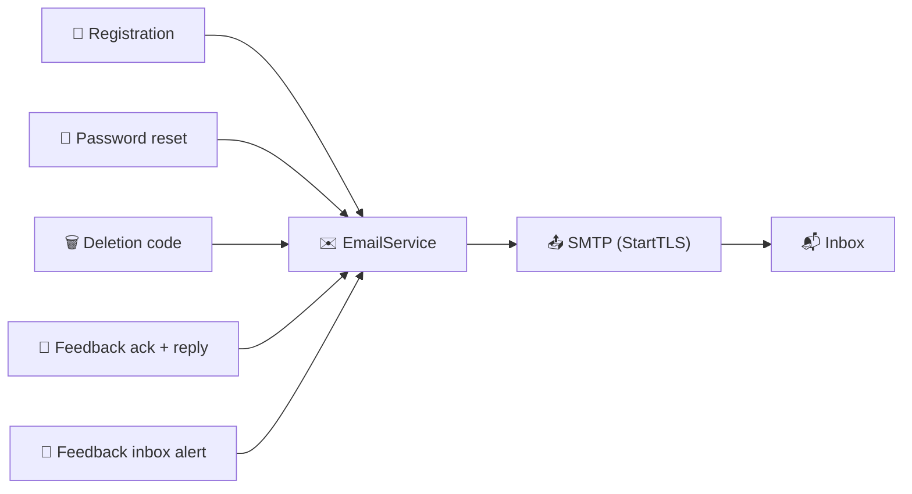

This document covers the e-mail subsystem: which mails exist, how each one is kept transaction-safe, how failures are handled per flow, and how the templates are built and localized.

## What gets sent

The system sends exactly six e-mails, all owned by one service class in the notification package:

| # | Mail | Trigger | Contains |
|---|------|---------|----------|
| 1 | Registration verification | New account created, or a resend requested | Button link to the verify page, 24-hour expiry notice |
| 2 | Password reset | Forgot-password request | Button link to the reset page, TTL in minutes |
| 3 | Account deletion code | Deletion requested | Six digits, deliberately no link and no button: a deletion must not be one click away from an inbox |
| 4 | Feedback acknowledgement | User submits feedback | Echo of the category and the submitted text |
| 5 | Feedback reply | Admin replies | The reply plus the original quoted back |
| 6 | Feedback inbox alert | User submits feedback | A link to the admin console, and nothing else |

Just as deliberate is what never sends: a feedback status change mails nobody (there is no listener, so no future endpoint can e-mail by accident), Google sign-ups get nothing (Google already verified the address), and nothing announces password-reset completion or the account's actual deletion.

The inbox alert is the only mail addressed to the operator rather than to a user, and its emptiness is the design. It carries a link and no category, no submitter and none of the submitted text: feedback can be personal, and copying it into a mail provider to save one click is a bad trade. Who receives it is whoever holds ROLE_ADMIN at the moment of the submission, minus the submitter, so an admin writing feedback gets the ordinary receipt and no second mail about themselves. One submission therefore produces one receipt plus one message per admin, each addressed individually — a shared To: line would show every admin the others' addresses.

```mermaid
flowchart LR
  REG["📝 Registration"] --> ES["✉️ EmailService"]
  PR["🔑 Password reset"] --> ES
  DEL["🗑️ Deletion code"] --> ES
  FB["💬 Feedback ack + reply"] --> ES
  FBA["🔔 Feedback inbox alert"] --> ES
  ES --> SMTP["📤 SMTP (StartTLS)"] --> INBOX["📬 Inbox"]
```

## Three ways to decouple from the transaction

Every mail must wait for its database transaction to commit; a reset link pointing at a token that rolled back would be worse than no mail. The codebase reaches that goal three different ways, and the differences matter:

| Flow | Mechanism | Thread |
|------|-----------|--------|
| Feedback ack, reply and inbox alert | @Async listener on an AFTER_COMMIT transactional event | Background |
| Password reset, deletion code | Hand-registered afterCommit synchronization | The request thread: the HTTP response waits on SMTP |
| Registration verification | Plain @Async event listener, no transaction phase | Background |
| Verification resend | Hand-registered afterCommit synchronization | The request thread: the HTTP response waits on SMTP |

The registration path deserves its own warning label: it is only correct because `registerUser` carries no `@Transactional`, so the save has already committed when the event publishes. Adding `@Transactional` to that method would silently reintroduce the send-before-commit race the other flows guard against.

No executor is configured; `@Async` rides the virtual-thread default. Unbounded, no queue, no retry anywhere.

## When SMTP fails

Each flow answers the failure differently, and the differences are the design:

- **Password reset**: the error is logged and the token row is deleted, so the 5-minute cooldown cannot strand a user waiting on a link that never left the building.
- **Deletion code**: same idea, sharper edge. The code row is discarded through a REQUIRES_NEW helper, because the discard runs after commit where a plain repository call would join a dead transaction. Nobody got the code, so nobody should sit out the cooldown.
- **Feedback mails**: logged and swallowed. The submission or reply survives; the receipt is best-effort. The receipt and the inbox alert sit in separate try blocks on purpose, and the alert catches again per recipient, so one dead mailbox costs one message rather than hiding a submission from the console.
- **Registration verification**: nothing catches it. The exception dies in the async handler's default logging, and the user row and its token stay. That used to be unrecoverable — login refuses unverified accounts with EMAIL_NOT_VERIFIED, the email column is unique so registering again is refused too, and after 24 hours the token expired with nothing able to issue another. The only repair was an UPDATE by hand.
- **Verification resend**: the cure for the line above, and it answers failure the way the deletion code does. The send runs in `afterCommit`, and a throw clears the account's `verificationTokenSentAt` through a REQUIRES_NEW helper, so nobody sits out a cooldown for a mail that never left. Worth saying plainly: this only catches SMTP refusing the handoff. A message the provider accepts and then bounces, or files as spam, throws nothing anywhere — which is why a second attempt the user can ask for matters more than any amount of failure logging.

There is no retry, no outbox, and no delivery tracking anywhere. What makes the swallowed failures visible is the logging pipeline: every failure logs at ERROR, and ERROR log lines become GlitchTip events. The error tracker is the retry bell.

Two operational notes, both the result of a fix rather than a design choice. Spring's mail health indicator is off: it opened a real authenticated SMTP session on every hit of `/actuator/health`, uncached, which handed the uptime monitor's verdict to the mail provider. It was also redundant, since a failed send already logs at ERROR and every ERROR is already a GlitchTip event. And all three JavaMail timeouts are pinned at 5s, because the default is to wait forever: the reset and deletion sends run synchronously inside `afterCommit`, before the JDBC connection returns to the pool, so an unanswered SMTP session used to hold both the user's request and one of Hikari's ten connections indefinitely.

## SMTP configuration

| Variable | Purpose |
|----------|---------|
| MAIL_HOST / MAIL_PORT | SMTP server, StartTLS enabled, auth on |
| MAIL_USERNAME / MAIL_PASSWORD | Credentials |
| MAIL_FROM | Sender address, defaults to MAIL_USERNAME |

Mail is not optional. The four core values ship without defaults, and the from-address resolution fails bean creation when the variables are missing entirely, so the app does not boot without a mail environment. Empty values boot and then fail per-send. The only sanctioned no-SMTP mode is the e2e profile, which sidesteps mail instead of disabling it: registration auto-verifies and skips the event, and the deletion code is returned in the response body. Both escape hatches are blocked in production by the boot validator.

## Templates and languages

No template engine and no template files: each mail body is an inline Java text block, HTML only, formatted with String.formatted. With two languages per mail that makes eleven hardcoded templates sharing the same header, the brand blue, and the year-stamped footer — eleven and not twelve because the inbox alert is English only. Every other template branches on the reader's language because a user reads it; that one is addressed to whoever operates the product, runs two sentences, and its payload is a URL.

Language selection is a two-branch decision per mail: anything starting with "pt" gets Portuguese, everything else (including null) gets English. The interesting part is where each flow reads the language from:

- The feedback acknowledgement prefers the language captured in the submission's UI context over the profile preference, because the receipt lands immediately and the profile field stays null until the user ever opens settings. Reading the profile first used to send every new account an English receipt.
- The feedback reply prefers the current profile preference, because a reply can land days later, when the captured context is stale.

User-authored and admin-authored text is HTML-escaped before interpolation, so a feedback body cannot inject markup into its own receipt.

## Cooldowns and rate limits

Two independent layers throttle the mail-producing endpoints:

| Flow | Service-level cooldown | Rate-limit bucket |
|------|------------------------|-------------------|
| Password reset | 5 min between requests per account; each new token invalidates the previous | 5 / 15 min per IP (auth tier) |
| Deletion code | 60 seconds, in seconds on purpose: the user is waiting on-screen and resend must work in the same sitting | 10 / hour per user |
| Registration | None | 5 / 15 min per IP (auth tier) |
| Verification resend | 60 seconds per account, in seconds for the same reason as the deletion code: the user is on the login screen reading "email not verified" and the button beside it has to work now. Each new token invalidates the previous, so one inbox never holds two live links | 5 / 15 min per IP (auth tier) |
| Feedback | None | 10 / hour per user |

One configuration nit carried here for honesty: the yaml default for the reset TTL is 15 minutes, while the env template still ships 30. The yaml wins unless the operator copies the template value.

## Test coverage

No test ever speaks SMTP. The feedback flows mock the JavaMailSender itself and assert on captured messages (recipients, subject, body, and the load-bearing case: a submission survives a throwing send). The deletion flow mocks the EmailService and pins the six-digit format, the hash-only storage, and the discard-on-failure behavior. The inbox alert has its own suite, asserting per recipient rather than by counting sends: every admin alerted exactly once, the submitter never alerted about their own message, no feedback text anywhere in the body, and a throwing receipt still leaving the console alerted. The resend flow arrived with its own suite, and one detail there is worth copying rather than rediscovering: it is the only mail test that is NOT `@Transactional`, because the send hangs off `afterCommit` and a test transaction that rolls back never commits, so every assertion about a mail going out would have passed against a service that sends nothing. Its negative assertions read the stored row rather than counting invocations, since the registration mail is async and racing it makes a coin toss of `verifyNoInteractions`. The one gap left: the password-reset flow has no dedicated test of its own, so its token-cleanup-on-failure behavior rides on code review alone.

## What could be improved

| Area | Current state | Note |
|------|--------------|------|
| Retry | Single attempt everywhere | An outbox table or provider-side retry would remove the GlitchTip-as-retry-bell pattern |
| Reset/deletion sending thread | Request thread waits on SMTP | Moving to the async listener pattern the feedback flows use would cut response latency |
| Templates | Eleven inline HTML blocks | Extracting shared chrome would shrink the duplication; a template engine is still overkill |
| Reset flow tests | None | The only mail flow without direct coverage |
| Verification token at rest | Stored in plaintext on the users row | The reset token is a BCrypt hash in `{UUID}.{raw}` form; a database read hands out email verification for free. Aligning the two breaks every link already sitting in an inbox, so it wants its own change |
