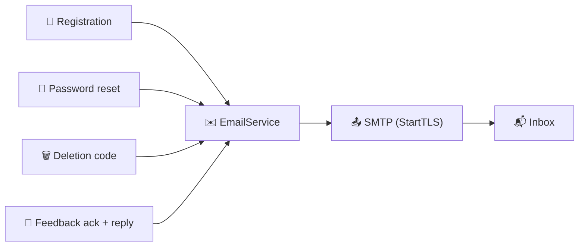

This document covers the e-mail subsystem: which mails exist, how each one is kept transaction-safe, how failures are handled per flow, and how the templates are built and localized.

## What gets sent

The system sends exactly five e-mails, all owned by one service class in the notification package:

| # | Mail | Trigger | Contains |
|---|------|---------|----------|
| 1 | Registration verification | New account created | Button link to the verify page, 24-hour expiry notice |
| 2 | Password reset | Forgot-password request | Button link to the reset page, TTL in minutes |
| 3 | Account deletion code | Deletion requested | Six digits, deliberately no link and no button: a deletion must not be one click away from an inbox |
| 4 | Feedback acknowledgement | User submits feedback | Echo of the category and the submitted text |
| 5 | Feedback reply | Admin replies | The reply plus the original quoted back |

Just as deliberate is what never sends: a feedback status change mails nobody (there is no listener, so no future endpoint can e-mail by accident), Google sign-ups get nothing (Google already verified the address), and nothing announces password-reset completion or the account's actual deletion.

```mermaid
flowchart LR
  REG["📝 Registration"] --> ES["✉️ EmailService"]
  PR["🔑 Password reset"] --> ES
  DEL["🗑️ Deletion code"] --> ES
  FB["💬 Feedback ack + reply"] --> ES
  ES --> SMTP["📤 SMTP (StartTLS)"] --> INBOX["📬 Inbox"]
```

## Three ways to decouple from the transaction

Every mail must wait for its database transaction to commit; a reset link pointing at a token that rolled back would be worse than no mail. The codebase reaches that goal three different ways, and the differences matter:

| Flow | Mechanism | Thread |
|------|-----------|--------|
| Feedback ack + reply | @Async listener on an AFTER_COMMIT transactional event | Background |
| Password reset, deletion code | Hand-registered afterCommit synchronization | The request thread: the HTTP response waits on SMTP |
| Registration verification | Plain @Async event listener, no transaction phase | Background |

The registration path deserves its own warning label: it is only correct because `registerUser` carries no `@Transactional`, so the save has already committed when the event publishes. Adding `@Transactional` to that method would silently reintroduce the send-before-commit race the other flows guard against.

No executor is configured; `@Async` rides the virtual-thread default. Unbounded, no queue, no retry anywhere.

## When SMTP fails

Each flow answers the failure differently, and the differences are the design:

- **Password reset**: the error is logged and the token row is deleted, so the 5-minute cooldown cannot strand a user waiting on a link that never left the building.
- **Deletion code**: same idea, sharper edge. The code row is discarded through a REQUIRES_NEW helper, because the discard runs after commit where a plain repository call would join a dead transaction. Nobody got the code, so nobody should sit out the cooldown.
- **Feedback mails**: logged and swallowed. The submission or reply survives; the receipt is best-effort.
- **Registration verification**: nothing catches it. The exception dies in the async handler's default logging, the user row and its token stay, and here is the real gap: login refuses unverified accounts with EMAIL_NOT_VERIFIED, and no resend endpoint exists. A lost verification mail strands the account.

There is no retry, no outbox, and no delivery tracking anywhere. What makes the swallowed failures visible is the logging pipeline: every failure logs at ERROR, and ERROR log lines become GlitchTip events. The error tracker is the retry bell.

One operational side effect: Spring's mail health indicator is on, so a dead SMTP server flips `/actuator/health` to DOWN.

## SMTP configuration

| Variable | Purpose |
|----------|---------|
| MAIL_HOST / MAIL_PORT | SMTP server, StartTLS enabled, auth on |
| MAIL_USERNAME / MAIL_PASSWORD | Credentials |
| MAIL_FROM | Sender address, defaults to MAIL_USERNAME |

Mail is not optional. The four core values ship without defaults, and the from-address resolution fails bean creation when the variables are missing entirely, so the app does not boot without a mail environment. Empty values boot and then fail per-send. The only sanctioned no-SMTP mode is the e2e profile, which sidesteps mail instead of disabling it: registration auto-verifies and skips the event, and the deletion code is returned in the response body. Both escape hatches are blocked in production by the boot validator.

## Templates and languages

No template engine and no template files: each mail body is an inline Java text block, HTML only, formatted with String.formatted. With two languages per mail that makes ten hardcoded templates sharing the BeYou header, the brand blue, and the year-stamped footer.

Language selection is a two-branch decision per mail: anything starting with "pt" gets Portuguese, everything else (including null) gets English. The interesting part is where each flow reads the language from:

- The feedback acknowledgement prefers the language captured in the submission's UI context over the profile preference, because the receipt lands immediately and the profile field stays null until the user ever opens settings. Reading the profile first used to send every new account an English receipt.
- The feedback reply prefers the current profile preference, because a reply can land days later, when the captured context is stale.

User-authored and admin-authored text is HTML-escaped before interpolation, so a feedback body cannot inject markup into its own receipt.

## Cooldowns and rate limits

Two independent layers throttle the mail-producing endpoints:

| Flow | Service-level cooldown | Rate-limit bucket |
|------|------------------------|-------------------|
| Password reset | 5 min between requests per account; each new token invalidates the previous | 5 / 15 min per IP (auth tier) |
| Deletion code | 60 seconds, in seconds on purpose: the user is waiting on-screen and resend must work in the same sitting | 10 / hour per user |
| Registration | None | 5 / 15 min per IP (auth tier) |
| Feedback | None | 10 / hour per user |

One configuration nit carried here for honesty: the yaml default for the reset TTL is 15 minutes, while the env template still ships 30. The yaml wins unless the operator copies the template value.

## Test coverage

No test ever speaks SMTP. The feedback flows mock the JavaMailSender itself and assert on captured messages (recipients, subject, body, and the load-bearing case: a submission survives a throwing send). The deletion flow mocks the EmailService and pins the six-digit format, the hash-only storage, and the discard-on-failure behavior. The one gap: the password-reset flow has no dedicated test of its own, so its token-cleanup-on-failure behavior rides on code review alone.

## What could be improved

| Area | Current state | Note |
|------|--------------|------|
| Verification resend | No endpoint | The one failure mode that strands an account; the top candidate |
| Retry | Single attempt everywhere | An outbox table or provider-side retry would remove the GlitchTip-as-retry-bell pattern |
| Reset/deletion sending thread | Request thread waits on SMTP | Moving to the async listener pattern the feedback flows use would cut response latency |
| Templates | Ten inline HTML blocks | Extracting shared chrome would shrink the duplication; a template engine is still overkill |
| Reset flow tests | None | The only mail flow without direct coverage |
