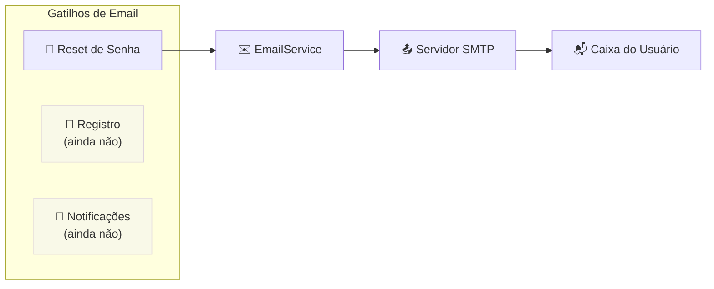
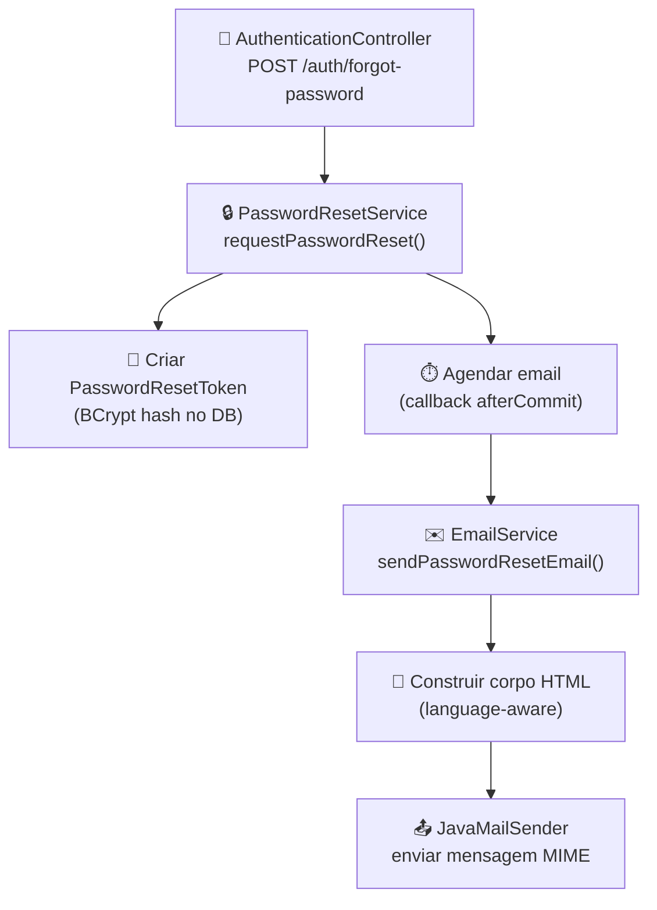
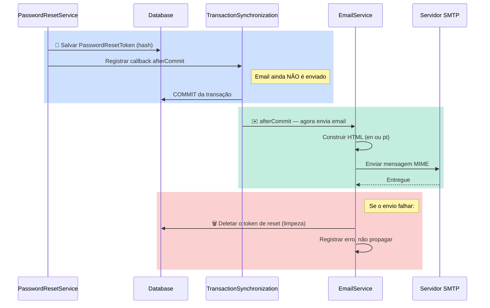
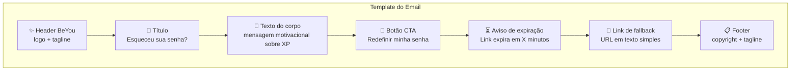
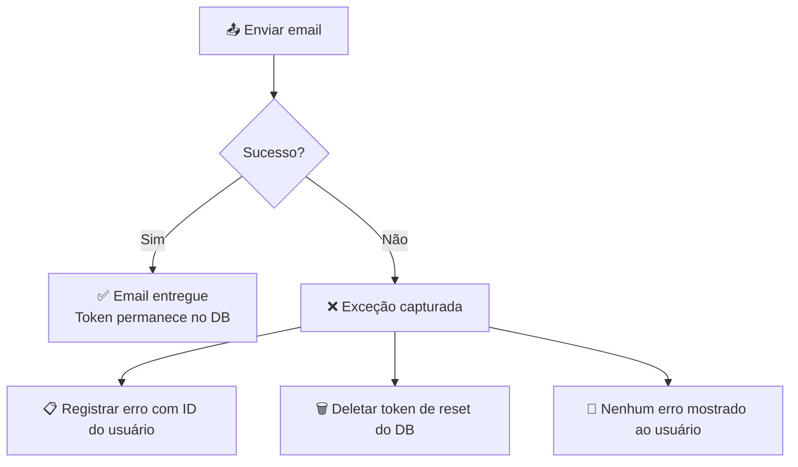

Este documento cobre a infraestrutura de email do Beyou: o que dispara emails, como são construídos, como são enviados de forma segura e como são os templates.

## Escopo Atual

Email é atualmente usado para **um único propósito**: reset de senha. Não há emails de confirmação de registro, emails de notificação ou emails de marketing. Todo o sistema de email vive em uma única classe de serviço.

## Arquitetura

O sistema de email é mínimo e intencional — um serviço, sem fila externa, sem engine de template.

| Componente | O que é |
|-----------|---------|
| **EmailService** | Única classe @Service no pacote notification. Um método público. |
| **PasswordResetService** | O único chamador. Agenda a entrega do email após o commit da transação no banco. |
| **JavaMailSender** | Sender de email do Spring, configurado via propriedades SMTP no application.yaml. |
| **Templates HTML** | Text blocks Java inline dentro do EmailService. Bilíngues (en/pt). |

## Fluxo de Entrega de Email

A decisão de design mais importante é a **entrega transaction-safe**: o email só é enviado após o token de reset ser commitado no banco de dados. Isso previne um cenário onde o usuário recebe um link de reset mas o token ainda não existe.

### Por que afterCommit?

| Cenário | Sem afterCommit | Com afterCommit |
|---------|----------------|-----------------|
| Email enviado, DB commita | Funciona | Funciona |
| Email enviado, DB faz rollback | Usuário recebe link para token que não existe | Nunca acontece — email espera o commit |
| Email falha | Token existe mas usuário nunca recebeu o link | Token é limpo do DB |

Se não houver transação ativa (caso extremo), o email é enviado imediatamente como fallback.

## Configuração SMTP

Todas as configurações SMTP são externalizadas via variáveis de ambiente:

| Variável | Propósito | Exemplo |
|----------|-----------|---------|
| MAIL_HOST | Hostname do servidor SMTP | smtp.gmail.com |
| MAIL_PORT | Porta SMTP | 587 |
| MAIL_USERNAME | Username de autenticação SMTP | beyou@example.com |
| MAIL_PASSWORD | Senha de autenticação SMTP | app-specific-password |
| MAIL_FROM | Endereço do remetente (padrão: MAIL_USERNAME) | noreply@beyou.app |

**Configurações de segurança:**

- Autenticação SMTP habilitada (auth: true)
- StartTLS habilitado (conexão encriptada)
- Padrão para provedores SMTP de produção (Gmail, SendGrid, AWS SES, etc.)

## Templates HTML de Email

Os templates são text blocks Java inline dentro do EmailService — sem engine de template externo (Thymeleaf, FreeMarker, etc.). Isso mantém o sistema simples com zero dependências adicionais.

### Estrutura do template

Ambos os idiomas seguem o mesmo layout:

### Suporte bilíngue

O idioma é determinado pela preferência languageInUse do usuário armazenada no banco:

| Idioma do usuário | Template usado | Assunto |
|-------------------|---------------|---------|
| pt, pt-BR, pt-PT | Português | Redefina sua senha BeYou |
| en, null, qualquer outro | Inglês | Reset your BeYou password |

**Lógica de detecção de idioma:**

- null ou vazio → Inglês (padrão)
- Começa com "pt" → Português
- Qualquer outro → Inglês

### Parâmetros do template

Cada template recebe três valores dinâmicos:

| Parâmetro | Valor | Usado em |
|-----------|-------|---------|
| Link de reset | URL completa com token | href do botão CTA, link de fallback |
| TTL em minutos | Da config (padrão 30) | Aviso de expiração |
| Ano atual | Calculado automaticamente | Copyright do footer |

### Design

Os templates usam CSS inline email-safe com:

- Azul primário (#0082E1) para botão CTA e acentos
- Card branco em fundo cinza claro
- Bordas arredondadas e sombras (suportados em clientes de email modernos)
- Max-width responsivo (520px)
- Emoji no assunto e headers para personalidade

## Tratamento de Erros

**Comportamento principal:**

- Falhas de email são capturadas e registradas no nível do PasswordResetService
- O token de reset falho é limpo do banco de dados
- O usuário não vê erro — o endpoint sempre retorna 200 OK (para prevenir enumeração de usuários)
- O usuário pode simplesmente solicitar outro email de reset

## O que o EmailService NÃO Faz

Entender os limites ajuda contribuidores a saber onde adicionar nova funcionalidade de email:

| Funcionalidade | Status | Notas |
|---------------|--------|-------|
| Email de reset de senha | Implementado | Único caso de uso atual |
| Confirmação de registro | Não implementado | Usuários podem logar imediatamente após registro |
| Verificação de email | Não implementado | Nenhum fluxo de verificação de email existe |
| Emails de notificação | Não implementado | Sem lembretes de hábitos, alertas de metas, etc. |
| Fila assíncrona | Não usado | Emails enviados na thread da aplicação (diferidos, mas síncronos) |
| Engine de template | Não usado | Text blocks HTML inline, sem Thymeleaf/FreeMarker |
| Retry em falha | Não implementado | Tentativa única, limpeza em caso de falha |
| Logging/tracking de email | Não implementado | Sem tracking de entrega ou abertura |

## Possíveis Melhorias

| Área | Estado Atual | Sugestão |
|------|-------------|----------|
| Gerenciamento de templates | Text blocks Java inline | Extrair para arquivos HTML ou engine de template para edição mais fácil |
| Envio assíncrono | Síncrono no afterCommit | Usar @Async ou fila de mensagens para entrega não-bloqueante |
| Lógica de retry | Tentativa única | Adicionar retry com backoff exponencial para falhas SMTP transitórias |
| Email de boas-vindas | Nenhum | Enviar email de boas-vindas no registro com dicas de onboarding |
| Sistema de notificação | Nenhum | Adicionar lembretes de hábitos, alertas de prazo de metas, alertas de streak |
| Preview de email | Nenhum | Adicionar endpoint dev para visualizar templates sem enviar |
| Tracking de entrega | Nenhum | Considerar integração com API de provedor de email (SendGrid, SES) para status de entrega |
