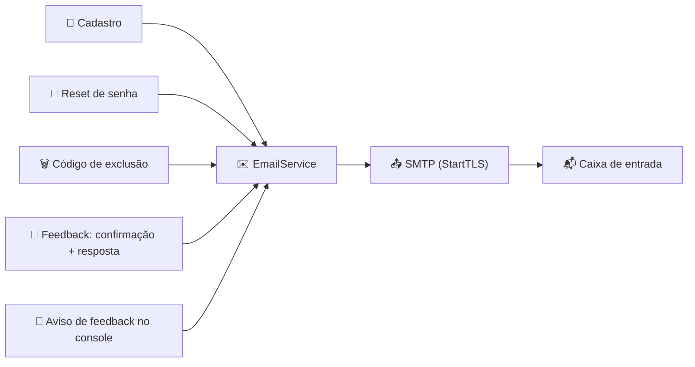

Este documento cobre o subsistema de e-mail: quais mensagens existem, como cada uma é mantida segura em relação à transação, como falhas são tratadas por fluxo e como os templates são construídos e localizados.

## O que é enviado

O sistema envia exatamente seis e-mails, todos de uma única classe de serviço no pacote de notificação:

| # | E-mail | Gatilho | Contém |
|---|--------|---------|--------|
| 1 | Verificação de cadastro | Conta nova criada, ou um reenvio pedido | Botão com link para a página de verificação, aviso de expiração em 24 horas |
| 2 | Redefinição de senha | Pedido de esqueci-a-senha | Botão com link para a página de reset, TTL em minutos |
| 3 | Código de exclusão de conta | Exclusão solicitada | Seis dígitos, deliberadamente sem link e sem botão: uma exclusão não pode estar a um clique de uma caixa de entrada |
| 4 | Confirmação de feedback | Usuário envia feedback | Eco da categoria e do texto enviado |
| 5 | Resposta de feedback | Admin responde | A resposta mais o original citado de volta |
| 6 | Aviso de feedback no console | Usuário envia feedback | Um link para o console de admin, e nada além disso |

Igualmente deliberado é o que nunca é enviado: uma mudança de status de feedback não avisa ninguém (não existe listener, então nenhum endpoint futuro pode enviar e-mail por acidente), cadastros via Google não recebem nada (o Google já verificou o endereço) e nada anuncia a conclusão do reset de senha nem a exclusão efetiva da conta.

O aviso é o único e-mail endereçado a quem opera o produto, e não a um usuário, e o vazio dele é o projeto. Leva um link e nenhuma categoria, nenhum remetente e nada do texto enviado: feedback pode ser pessoal, e copiar isso para dentro de um provedor de e-mail só para poupar um clique é um mau negócio. Quem recebe é quem tem ROLE_ADMIN no momento do envio, menos quem escreveu, então um admin que manda feedback recebe o recibo de sempre e nenhuma segunda mensagem sobre si mesmo. Um envio produz, portanto, um recibo mais uma mensagem por admin, cada uma endereçada individualmente — um To: compartilhado mostraria a cada admin o endereço dos outros.

```mermaid
flowchart LR
  REG["📝 Cadastro"] --> ES["✉️ EmailService"]
  PR["🔑 Reset de senha"] --> ES
  DEL["🗑️ Código de exclusão"] --> ES
  FB["💬 Feedback: confirmação + resposta"] --> ES
  FBA["🔔 Aviso de feedback no console"] --> ES
  ES --> SMTP["📤 SMTP (StartTLS)"] --> INBOX["📬 Caixa de entrada"]
```

## Três jeitos de desacoplar da transação

Todo e-mail precisa esperar o commit da sua transação; um link de reset apontando para um token que sofreu rollback seria pior que nenhum e-mail. O código chega a esse objetivo de três formas diferentes, e as diferenças importam:

| Fluxo | Mecanismo | Thread |
|-------|-----------|--------|
| Confirmação, resposta e aviso de feedback | Listener @Async em evento transacional AFTER_COMMIT | Segundo plano |
| Reset de senha, código de exclusão | Sincronização afterCommit registrada à mão | A thread da requisição: a resposta HTTP espera o SMTP |
| Verificação de cadastro | Listener @Async comum, sem fase transacional | Segundo plano |
| Reenvio de verificação | Sincronização afterCommit registrada à mão | A thread da requisição: a resposta HTTP espera o SMTP |

O caminho do cadastro merece etiqueta de aviso própria: ele só é correto porque o `registerUser` não carrega `@Transactional`, então o save já commitou quando o evento é publicado. Adicionar `@Transactional` àquele método reintroduziria em silêncio a corrida de enviar-antes-do-commit que os outros fluxos evitam.

Nenhum executor é configurado; o `@Async` usa o padrão de virtual threads. Sem limite, sem fila, sem retry em lugar nenhum.

## Quando o SMTP falha

Cada fluxo responde à falha de um jeito, e as diferenças são o design:

- **Reset de senha**: o erro é registrado e a linha do token é apagada, para o cooldown de 5 minutos não deixar um usuário preso esperando um link que nunca saiu do prédio.
- **Código de exclusão**: mesma ideia, borda mais afiada. A linha do código é descartada por um helper REQUIRES_NEW, porque o descarte roda depois do commit, onde uma chamada comum de repositório entraria em uma transação morta. Ninguém recebeu o código, então ninguém deveria cumprir o cooldown.
- **E-mails de feedback**: registrados e engolidos. O envio ou a resposta sobrevivem; o recibo é melhor esforço. O recibo e o aviso ficam em blocos try separados de propósito, e o aviso captura de novo a cada destinatário, então uma caixa morta custa uma mensagem em vez de esconder um envio do console.
- **Verificação de cadastro**: nada captura a falha. A exceção morre no log padrão do handler assíncrono, e a linha do usuário e seu token ficam. Isso era irrecuperável — o login recusa contas não verificadas com EMAIL_NOT_VERIFIED, a coluna de e-mail é única então cadastrar de novo também é recusado, e depois de 24 horas o token expirava sem nada capaz de emitir outro. O único conserto era um UPDATE na mão.
- **Reenvio de verificação**: a cura da linha acima, e responde à falha como o código de exclusão. O envio roda em `afterCommit`, e uma exceção limpa o `verificationTokenSentAt` da conta por um helper REQUIRES_NEW, então ninguém cumpre cooldown por um e-mail que nunca saiu. Vale dizer sem rodeio: isso só pega o SMTP recusando a entrega. Uma mensagem que o provedor aceita e depois devolve, ou que cai no spam, não lança exceção em lugar nenhum — e é por isso que uma segunda tentativa que o usuário pode pedir importa mais do que qualquer quantidade de log de falha.

Não há retry, outbox nem rastreio de entrega em lugar nenhum. O que torna as falhas engolidas visíveis é o pipeline de logs: toda falha registra em ERROR, e linhas ERROR viram eventos no GlitchTip. O rastreador de erros é o sino do retry.

Duas notas operacionais, ambas resultado de correção e não de escolha de design. O indicador de saúde de mail do Spring está desligado: ele abria uma sessão SMTP autenticada de verdade a cada acesso ao `/actuator/health`, sem cache, o que entregava ao provedor de e-mail o veredito do monitor de uptime. Era redundante também, já que um envio que falha registra em ERROR e todo ERROR já é evento no GlitchTip. E os três timeouts do JavaMail estão fixados em 5s, porque o padrão é esperar para sempre: os envios de reset e de exclusão rodam de forma síncrona dentro do `afterCommit`, antes de a conexão JDBC voltar ao pool, então uma sessão SMTP sem resposta segurava tanto a request do usuário quanto uma das dez conexões do Hikari por tempo indeterminado.

## Configuração de SMTP

| Variável | Propósito |
|----------|-----------|
| MAIL_HOST / MAIL_PORT | Servidor SMTP, StartTLS habilitado, auth ligado |
| MAIL_USERNAME / MAIL_PASSWORD | Credenciais |
| MAIL_FROM | Endereço remetente, padrão MAIL_USERNAME |

E-mail não é opcional. Os quatro valores centrais vêm sem defaults, e a resolução do remetente falha na criação do bean quando as variáveis estão ausentes, então o app não sobe sem um ambiente de mail. Valores vazios sobem e falham a cada envio. O único modo sem SMTP sancionado é o perfil e2e, que contorna o e-mail em vez de desligá-lo: o cadastro auto-verifica e pula o evento, e o código de exclusão volta no corpo da resposta. As duas saídas de emergência são bloqueadas em produção pelo validador de boot.

## Templates e idiomas

Sem engine de template e sem arquivos de template: cada corpo é um text block Java inline, só HTML, formatado com String.formatted. Com dois idiomas por mensagem, isso dá onze templates hardcoded dividindo o mesmo cabeçalho, o azul da marca e o rodapé com o ano — onze e não doze porque o aviso do console é só em inglês. Todos os outros templates escolhem idioma porque quem lê é um usuário; esse é endereçado a quem opera o produto, tem duas frases, e o conteúdo dele é uma URL.

A escolha de idioma é uma decisão de dois ramos por mensagem: qualquer coisa começando com "pt" recebe português, todo o resto (incluindo nulo) recebe inglês. A parte interessante é de onde cada fluxo lê o idioma:

- A confirmação de feedback prefere o idioma capturado no contexto de UI do envio ao invés da preferência do perfil, porque o recibo chega na hora e o campo do perfil fica nulo até o usuário abrir as configurações. Ler o perfil primeiro mandava um recibo em inglês para toda conta nova.
- A resposta de feedback prefere a preferência atual do perfil, porque uma resposta pode chegar dias depois, quando o contexto capturado já envelheceu.

Texto escrito por usuário ou admin passa por escape de HTML antes da interpolação, então um corpo de feedback não consegue injetar markup no próprio recibo.

## Cooldowns e rate limits

Duas camadas independentes controlam os endpoints que produzem e-mail:

| Fluxo | Cooldown no service | Balde de rate limit |
|-------|---------------------|---------------------|
| Reset de senha | 5 min entre pedidos por conta; cada token novo invalida o anterior | 5 / 15 min por IP (faixa auth) |
| Código de exclusão | 60 segundos, em segundos de propósito: o usuário espera na tela e o reenvio precisa funcionar na mesma sentada | 10 / hora por usuário |
| Cadastro | Nenhum | 5 / 15 min por IP (faixa auth) |
| Reenvio de verificação | 60 segundos por conta, em segundos pelo mesmo motivo do código de exclusão: o usuário está na tela de login lendo "e-mail não verificado" e o botão ao lado precisa funcionar agora. Cada token novo invalida o anterior, então uma caixa de entrada nunca guarda dois links vivos | 5 / 15 min por IP (faixa auth) |
| Feedback | Nenhum | 10 / hora por usuário |

Uma minúcia de configuração registrada por honestidade: o default do yaml para o TTL do reset é 15 minutos, enquanto o template de env ainda entrega 30. O yaml vence, a menos que o operador copie o valor do template.

## Cobertura de testes

Nenhum teste fala SMTP. Os fluxos de feedback mockam o próprio JavaMailSender e verificam as mensagens capturadas (destinatários, assunto, corpo e o caso que sustenta tudo: um envio de feedback sobrevive a um send que lança exceção). O fluxo de exclusão mocka o EmailService e fixa o formato de seis dígitos, o armazenamento só do hash e o descarte em caso de falha. O aviso do console tem suíte própria, verificando por destinatário em vez de contar envios: cada admin avisado exatamente uma vez, quem escreveu nunca avisado sobre a própria mensagem, nenhum texto de feedback no corpo, e um recibo que lança exceção ainda deixando o console avisado. O fluxo de reenvio chegou com suíte própria, e um detalhe dela vale copiar em vez de redescobrir: é o único teste de e-mail que NÃO é `@Transactional`, porque o envio pendura no `afterCommit` e uma transação de teste que faz rollback nunca commita, então toda verificação de e-mail enviado passaria contra um serviço que não envia nada. As verificações negativas dela leem a linha guardada em vez de contar invocações, já que o e-mail de cadastro é assíncrono e disputar com ele transforma o `verifyNoInteractions` em cara ou coroa. A lacuna que resta: o fluxo de reset de senha não tem teste dedicado, então a limpeza do token em falha de envio depende só de revisão de código.

## O que pode melhorar

| Área | Estado atual | Nota |
|------|--------------|------|
| Retry | Tentativa única em tudo | Uma tabela de outbox ou retry no provedor removeria o padrão do GlitchTip-como-sino |
| Thread de envio de reset/exclusão | A requisição espera o SMTP | Migrar para o padrão de listener assíncrono dos fluxos de feedback cortaria a latência |
| Templates | Onze blocos HTML inline | Extrair o chrome compartilhado reduziria a duplicação; engine de template segue exagero |
| Testes do fluxo de reset | Nenhum | O único fluxo de e-mail sem cobertura direta |
| Token de verificação em repouso | Guardado em texto plano na linha do usuário | O token de reset é um hash BCrypt no formato `{UUID}.{raw}`; uma leitura do banco entrega verificação de e-mail de graça. Alinhar os dois quebra todo link que já está numa caixa de entrada, então pede mudança própria |
