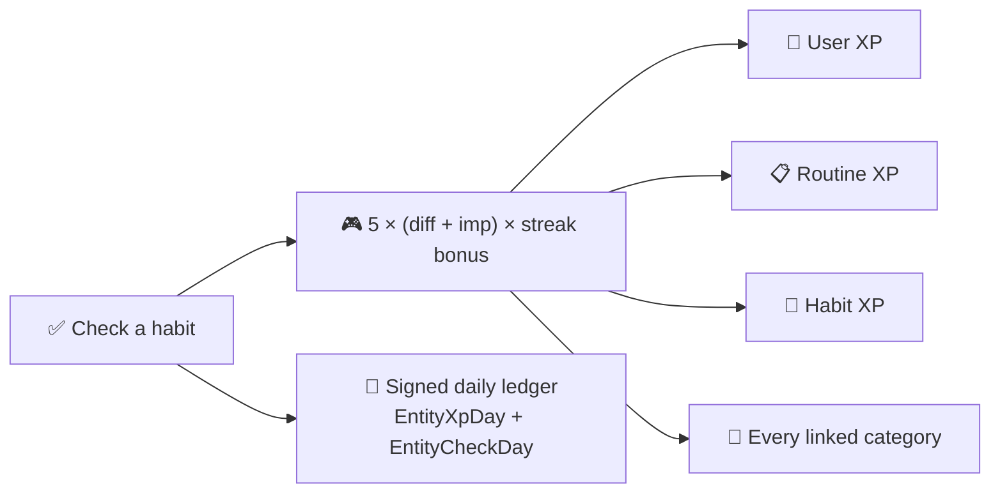

Everything in Beyou's gamification serves one behavior: showing up daily. This document explains the exact mechanics, formula by formula, including where the numbers come from and what deliberately does not exist.

## The check-in formula

One static calculator produces every earned XP amount:

```
xp = round( 5 × (difficulty + importance) × (1 + min(streak × 1%, 50%)) )
```

Difficulty and importance are clamped to 1 through 5, so the base range is 10 to 50, and the streak bonus (one percent per consecutive day, capped at fifty percent after day 50) stretches the ceiling to 75. The streak used is the one standing before today's check, so a check never feeds its own multiplier. An earlier formula multiplied difficulty by importance and swung 10 to 250; the additive version keeps a hard habit worth five times a trivial one instead of twenty-five.

The amount fans out whole, not split:



Tasks play by slightly different rules: a task carries no XP of its own, and a task with no categories earns nothing at all, since there would be nobody to pay besides the user and routine and the design routes task credit through life areas. One-time tasks never build streaks and never write history rows; they are checked once and scheduled for cleanup.

Unchecking removes exactly the stored generated amount rather than recomputing, so tuning the constants later can never desync a removal from its original award.

## Levels

The curve is one line: reaching level L costs round(50 × L²) XP, levels 0 through 100. Level 2 costs 200, level 10 costs 5,000, level 100 sits at 500,000. Early levels are hours apart, late ones are seasons apart. Four things level independently on this curve: the user, each category, each habit, and each routine.

New habits and categories can start with a head start: the experience question at creation seeds BEGINNER at level 0, INTERMEDIARY at level 5, ADVANCED at level 8, so someone who already runs marathons does not grind a running habit from zero.

## Streaks

Streak logic follows one philosophy: **only a real miss breaks a streak**. Every day gets an outcome, and the outcomes are not symmetric:

| Outcome | Effect on a streak |
|---------|--------------------|
| DONE | Counts and continues |
| SKIPPED | Continues without counting: an honest "not today" is not a failure |
| NOT_SCHEDULED / NOT_IN_ROUTINE | Continues without counting |
| MISSED | Breaks |

Nothing increments a counter. Streaks are re-derived by walking the daily outcome rows backwards from the owner's own today, which is what made the old fragile counters retireable: a derived streak cannot drift.

Two parallel systems share that walk. Each habit, task, and routine has its own streak (current, best, total check-ins) stored as scalars and recomputed on every change, with the best-streak as a ratchet that only rises. The account streak, the "constance" on the dashboard, walks the user's completed days against what was scheduled, and the user chooses what "completed" means: ANY (checking anything today counts) or COMPLETE (every item in the day's routine checked or skipped). Both readings work the same on a list routine as on a sectioned one: a list stores its items in a single internal section, so the walk that counts them never had to learn a second shape.

**The day-close job** is what turns absence into outcomes. An hourly scheduler, working per timezone, closes yesterday during a grace window in the small hours (a window rather than an exact hour, because daylight-saving jumps once skipped the closing hour entirely and left a day permanently open). It writes one row for each owner that has none, insert-only, so a real check landing during the race can never be overwritten by an absence. Routines are deliberately excluded from day-close: no presence writer exists for them, so every routine row would be a false miss.

**Dormancy** softens long gaps: a streak with nothing scheduled or completed for 14 days reports as dormant rather than broken, and the UI shows a pause instead of a zero. Checking anything clears it instantly.

## Which day a check belongs to

Every number above depends on a question the code has to answer before it can do anything: what day is it, for this person? One resolver answers it, `UserDateResolver`, and eleven call sites go through it — the check paths, the streak walk, the XP ledger, the snapshot hour, the day-close hour. It reads the timezone stored on the account, never the server's.

That makes the stored zone the single most load-bearing string on a user row. Get it wrong and the day boundary sits in the wrong place, so an evening check-in is filed under tomorrow, the snapshot photographs a day that is still running, and the day-close stamps a miss on a day nobody missed. None of it is recoverable afterwards: `entity_check_day` and `entity_xp_day` carry a date and no clock time, so a row written on the wrong day is indistinguishable from one written correctly, and the day-close is insert-only by design.

For a long time nothing set it. The column defaulted to `UTC` and no signup path overrode it, so every account ran on the UTC calendar wherever its owner was. The obstacle to fixing that was not detection, which is a one-line browser call, but consent: `UTC` was simultaneously the default and a perfectly valid answer, so nothing could tell an untouched account from someone who had chosen UTC on purpose, and a blind correction would have overwritten the second group.

`timezone_source` separates the two, and each value carries a different permission:

| Value | Meaning – What may change it |
|---|---|
| `DEFAULT` – nobody has ever answered | A client-detected zone adopts over it, silently, once |
| `DETECTED` – a client reported the device's zone | Nothing automatic. A mismatch surfaces as a suggestion |
| `EXPLICIT` – a person picked it | Nothing but another explicit pick |

`DETECTED` is deliberately not re-adopted. A laptop opened in another country would otherwise move a travelling user's day boundary under them, and every date that account has ever written is resolved against that boundary. Offering it as a question is the honest form; deciding it is not.

The rule lives on the server, in the one method that writes the column, rather than in the two clients. A buggy client cannot overwrite a real answer that way, and web and mobile cannot drift into disagreeing about when a day starts.

Signup now carries the detected zone on all four paths, so new accounts are right from creation. Accounts that predate that are corrected on their next boot, once, while they are still `DEFAULT`.

## Late check-ins and decay

Past days live in routine snapshots, and checking one still pays, but through a decay chosen by the user:

| Strategy | Multiplier |
|----------|-----------|
| GRADUAL | 0.8 one day late, then 0.6, 0.4, 0.2 from day four on |
| FLAT | 0.5 regardless of delay |
| TIME_WINDOW | Full XP up to two days late, nothing after |

Late checks never receive a streak bonus (the streak was already broken by the miss), and difficulty and importance come frozen from the snapshot, not from the habit as it is today. What a late check does do is repair history: the missed day flips to DONE and the streak walk reconnects across it, so two five-day runs separated by one repaired miss become an eleven-day streak, a behavior pinned by tests. Unchecking flips the day back and leaves the best-streak record standing. When the original habit or routine has since been deleted, the XP still pays out in shrinking tiers: full distribution, then user plus routine, then user alone.

## Goals

Goals pay once, through the explicit complete endpoint, calculated from target size, difficulty, urgency, and finishing before the deadline (the full factor table lives in the domain model topic). The reward goes to the user and the goal's categories; goals themselves have no level. Completing is a toggle: un-completing takes the XP back and returns the goal to in-progress. Progress updates pay nothing, which is what makes a fake pre-completed goal worthless. Nested goals keep the same rule at every level: a sub-goal pays when it is completed, its parent pays when it is completed, and there is no bonus for finishing a whole tree, for the same reason the pomodoro pays nothing on top of the check it wraps. The only thing a sub-goal does to its parent is start it: the first increment on a child moves a NOT_STARTED parent to IN_PROGRESS.

## The ledger

Every XP movement, in both directions, writes a signed delta into a per-owner per-day ledger, upserted with in-database addition so concurrent check-ins queue instead of overwriting. Summing an owner's rows reproduces its total exactly; unchecking makes the day give the XP back rather than remembering a high-water mark. The ledger feeds the XP history endpoint, which returns dense series (a value for every day of the window, zeros included) for the dashboard's charts. The parallel outcome table does the same for checks. Both tables use owner references without foreign keys on purpose: history must outlive whatever produced it.

## The celebration layer

The frontends detect moments by comparison, not by backend flags: a check response carries fresh totals, the client compares against the previous level and streak, and a crossing pushes a celebration into a queue. Level-ups celebrate any rise; streak milestones celebrate crossing 7, 14, 21, 30, 60, 90, or 100 days, lowest crossed first. The "+N XP" float over a checked item shows the real generated amount, decay and all.

## What deliberately does not exist

No daily completion bonus, no routine-completion payout, no weekly recap XP. The four XP paths (habit check, task check, snapshot check, goal completion) and their four reversals are the whole economy. Skips cannot be placed in the future, since an unbounded forward skip would make a streak unbreakable.
