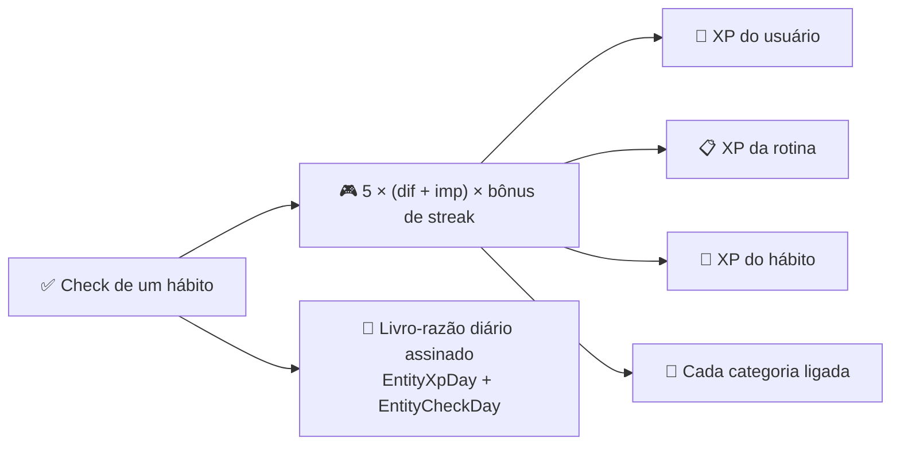

Tudo na gamificação do Beyou serve a um comportamento: aparecer todo dia. Este documento explica a mecânica exata, fórmula por fórmula, incluindo de onde os números vêm, o que deliberadamente não existe e as três inconsistências reais encontradas ao verificar o código para esta página.

## A fórmula do check-in

Um único calculador estático produz todo XP ganho:

```
xp = round( 5 × (dificuldade + importância) × (1 + min(streak × 1%, 50%)) )
```

Dificuldade e importância são presas entre 1 e 5, então a faixa base é 10 a 50, e o bônus de streak (um por cento por dia consecutivo, com teto de cinquenta por cento no dia 50) estica o máximo até 75. O streak usado é o que estava de pé antes do check de hoje, então um check nunca alimenta o próprio multiplicador. Uma fórmula anterior multiplicava dificuldade por importância e oscilava de 10 a 250; a versão aditiva mantém um hábito difícil valendo cinco vezes um trivial, em vez de vinte e cinco.

O valor se espalha inteiro, sem divisão:



Tarefas jogam com regras um pouco diferentes: uma tarefa não carrega XP próprio, e uma tarefa sem categorias não ganha nada, já que não haveria a quem pagar além do usuário e da rotina, e o design roteia o crédito de tarefas pelas áreas da vida. Tarefas únicas nunca constroem streak e nunca escrevem linhas de histórico; são marcadas uma vez e agendadas para limpeza.

Desmarcar remove exatamente o valor gerado que ficou guardado, sem recomputar, então ajustar as constantes depois nunca dessincroniza uma remoção do prêmio original.

## Levels

A curva é uma linha: alcançar o level L custa round(50 × L²) de XP, do 0 ao 100. O level 2 custa 200, o 10 custa 5.000, o 100 fica em 500.000. Os primeiros levels distam horas; os últimos, estações. Quatro coisas sobem de level nessa curva de forma independente: o usuário, cada categoria, cada hábito e cada rotina.

Hábitos e categorias novos podem nascer com vantagem: a pergunta de experiência na criação semeia BEGINNER no level 0, INTERMEDIARY no 5, ADVANCED no 8, para quem já corre maratona não moer um hábito de corrida do zero.

## Streaks

A lógica de streak segue uma filosofia: **só uma falta real quebra um streak**. Todo dia ganha um desfecho, e os desfechos não são simétricos:

| Desfecho | Efeito no streak |
|----------|------------------|
| DONE | Conta e continua |
| SKIPPED | Continua sem contar: um "hoje não" honesto não é fracasso |
| NOT_SCHEDULED / NOT_IN_ROUTINE | Continua sem contar |
| MISSED | Quebra |

Nada incrementa contador. Streaks são re-derivados caminhando pelas linhas de desfecho diário de trás para frente a partir do hoje do próprio dono, e foi isso que aposentou os contadores frágeis antigos: um streak derivado não deriva à toa.

Dois sistemas paralelos dividem essa caminhada. Cada hábito, tarefa e rotina tem seu próprio streak (atual, recorde, total de check-ins) guardado como escalares e recomputado a cada mudança, com o recorde funcionando como catraca que só sobe. O streak da conta, a "constância" do dashboard, caminha pelos dias completados do usuário contra o que estava agendado, e o usuário escolhe o que "completado" significa: ANY (marcar qualquer coisa no dia conta) ou COMPLETE (todo item de toda seção marcado ou pulado).

**O job de fechamento do dia** é o que transforma ausência em desfecho. Um scheduler de hora em hora, por timezone, fecha o dia de ontem numa janela de tolerância de madrugada (janela, e não hora exata, porque o horário de verão uma vez pulou a hora de fechamento e deixou um dia aberto para sempre). Ele escreve uma linha para cada dono que não tem nenhuma, só inserção, então um check real chegando durante a corrida nunca é sobrescrito por uma ausência. Rotinas ficam deliberadamente fora do fechamento: não existe escritor de presença para elas, então toda linha de rotina seria uma falta falsa.

**A dormência** suaviza pausas longas: um streak sem nada agendado nem completado por 14 dias aparece como dormente em vez de quebrado, e a UI mostra uma pausa em vez de um zero. Marcar qualquer coisa a limpa na hora.

## Check-ins atrasados e decaimento

Dias passados vivem nos snapshots de rotina, e marcar um ainda paga, mas por um decaimento que o usuário escolhe:

| Estratégia | Multiplicador |
|------------|---------------|
| GRADUAL | 0,8 com um dia de atraso, depois 0,6, 0,4 e 0,2 do quarto dia em diante |
| FLAT | 0,5 seja qual for o atraso |
| TIME_WINDOW | XP cheio até dois dias de atraso, nada depois |

Checks atrasados nunca recebem bônus de streak (o streak já tinha quebrado na falta), e dificuldade e importância vêm congeladas do snapshot, não do hábito como ele é hoje. O que um check atrasado faz é reparar a história: o dia perdido vira DONE e a caminhada do streak reconecta por cima dele, então duas sequências de cinco dias separadas por uma falta reparada viram um streak de onze dias, comportamento fixado em teste. Desmarcar devolve o dia e deixa o recorde de pé. Quando o hábito ou a rotina originais já foram apagados, o XP ainda paga em camadas que encolhem: distribuição completa, depois usuário mais rotina, depois só o usuário.

## Metas

Metas pagam uma vez, pelo endpoint explícito de conclusão, calculadas por tamanho do alvo, dificuldade, urgência e terminar antes do prazo (a tabela completa de fatores vive no tópico do modelo de domínio). A recompensa vai para o usuário e as categorias da meta; metas não têm level próprio. Completar é um toggle: descompletar devolve o XP e retorna a meta a em-progresso. Atualizações de progresso não pagam nada, e é isso que torna uma meta falsa pré-completada inútil.

## O livro-razão

Todo movimento de XP, nas duas direções, escreve um delta com sinal em um razão por dono e por dia, gravado com soma dentro do banco para check-ins simultâneos entrarem na fila em vez de se sobrescreverem. Somar as linhas de um dono reproduz seu total exato; desmarcar faz o dia devolver o XP em vez de lembrar a marca d'água. O razão alimenta o endpoint de histórico de XP, que devolve séries densas (um valor para cada dia da janela, zeros incluídos) para os gráficos do dashboard. A tabela paralela de desfechos faz o mesmo para os checks. As duas tabelas usam referências de dono sem chave estrangeira de propósito: a história precisa sobreviver ao que a produziu.

## A camada de celebração

Os frontends detectam momentos por comparação, não por flag do backend: a resposta de um check traz os totais frescos, o cliente compara com o level e o streak anteriores, e um cruzamento empurra uma celebração para a fila. Level-ups celebram qualquer subida; marcos de streak celebram cruzar 7, 14, 21, 30, 60, 90 ou 100 dias, o menor cruzado primeiro. O "+N XP" flutuando sobre o item marcado mostra o valor real gerado, decaimento incluído.

## O que deliberadamente não existe

Sem bônus de dia completo, sem pagamento por rotina completa, sem XP de resumo semanal. Os quatro caminhos de XP (check de hábito, check de tarefa, check de snapshot, conclusão de meta) e suas quatro reversões são a economia inteira. Skips não podem ser colocados no futuro, já que um skip adiantado sem limite tornaria um streak inquebrável.

## Achados honestos

Escrever esta página contra o código expôs inconsistências reais, listadas aqui até serem corrigidas:

| Achado | Consequência |
|--------|--------------|
| As sementes de experiência antecedem a curva atual: INTERMEDIARY começa no level 5 com 750 de XP contra um piso de 1.250, ADVANCED no 8 com 1.800 contra 3.200 | Ambos começam abaixo do piso do próprio level, então o primeiro desmarque os derruba (5 → 3, 8 → 6) |
| Descompletar uma meta recomputa a recompensa em vez de ler a guardada, e o fator de pontualidade depende de quando a recomputação roda | Complete antes do prazo, descomplete depois, e cerca de um quarto do pagamento fica para trás permanentemente |
| O razão de XP registra check-ins atrasados na data de hoje, enquanto a tabela de desfechos os registra na data do snapshot | As duas histórias discordam em qualquer check atrasado, e desmarcar um dia antigo pode renderizar uma barra negativa em hoje |
| Retroagir um skip sobre um dia fechado como MISSED o reescreve para SKIPPED | Um streak quebrado semanas atrás pode ser reparado retroativamente sem fazer nada; os próprios comentários do código nomeiam o buraco |
