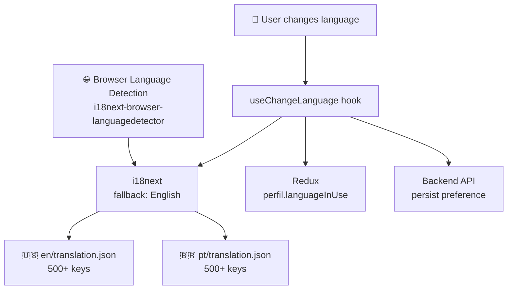
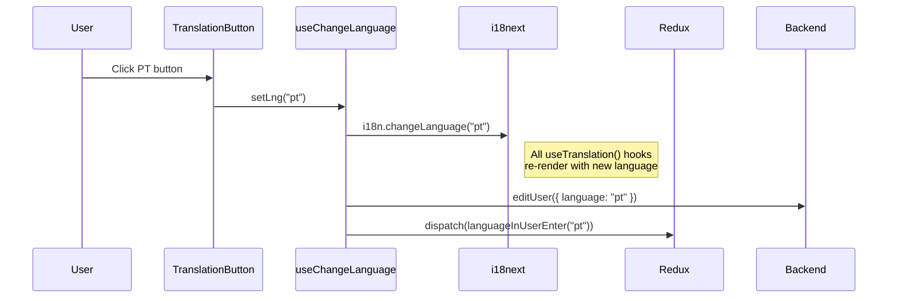
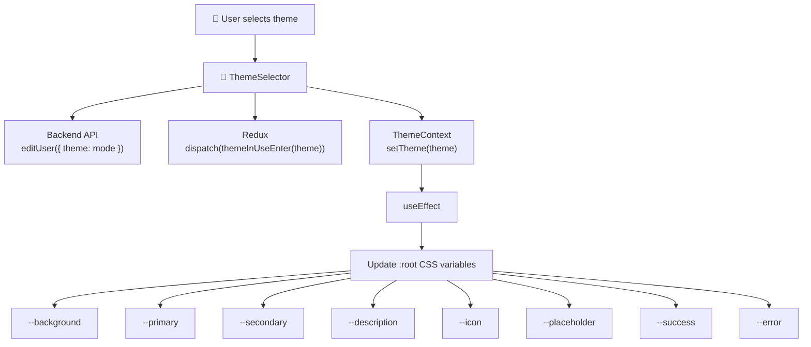
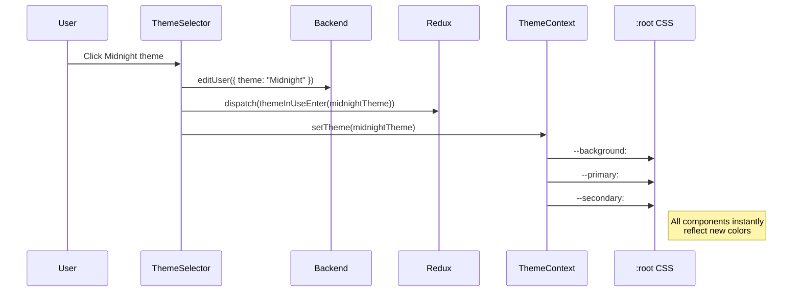
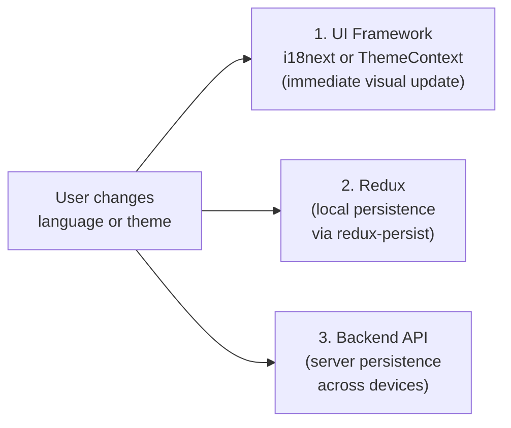

This document covers the two personalization systems in the Beyou frontend: language (i18n with English and Portuguese) and visual theme (9 color themes with CSS variable injection).

## Language System (i18n)

### Architecture

### Configuration

- **Library:** i18next + react-i18next
- **Detection:** i18next-browser-languagedetector (auto-detects from browser settings)
- **Fallback:** English if detection fails or language unsupported
- **Languages:** English (en) and Portuguese (pt, pt-BR)
- **Interpolation:** escapeValue disabled (React handles XSS)

### Translation file structure

Both en/translation.json and pt/translation.json use a flat key structure with 500+ keys:

| Category | Example Keys |
|----------|-------------|
| Auth | Login, Register, ForgotPasswordTitle, PasswordMismatch |
| Validation | YupNameRequired, YupMinimumName, YupMaxName |
| Pages | YourCategories, YourHabits, Your Goals |
| Actions | created successfully, edited successfully, Logout |
| Errors | WrongPassOrEmailError, GoogleLoginError, UnexpectedError |
| Themes | beYou, beYouDark, Sunset, Amethyst, Midnight, Cyberpunk |
| Greetings | GoodMorning, GoodAfternoon, GoodEvening |

Theme names in translation keys must match the theme.mode values so the theme selector displays the correct localized name.

### Language change flow

Three systems are updated in parallel:

1. **i18next** — immediate UI update, all translated strings re-render
2. **Backend** — persists preference so it survives across devices
3. **Redux** — persists locally via redux-persist so it survives page refreshes

### Language restoration on login

When a user logs in, the backend returns their saved languageInUse. The frontend dispatches it to Redux, and the dashboard's useChangeLanguage hook applies it to i18next. This ensures the app immediately switches to the user's preferred language.

## Theme System

### Architecture

### Available themes

Beyou has 9 themes, each defining 8 color variables:

| Theme | Mode | Background | Primary | Style |
|-------|------|-----------|---------|-------|
| **beYou** | beYou | #FFFFFF | #0082E1 | Light blue on white |
| **beYou Dark** | beYouDark | #18181B | #0082E1 | Blue on dark gray |
| **Sunset** | Sunset | #FFF3E0 | #FB923C | Orange warm light |
| **Amethyst** | Amethyst | #F5F3FF | #8B5CF6 | Purple light |
| **Midnight** | Midnight | #0F172A | #60A5FA | Blue on navy |
| **Cyberpunk** | Cyberpunk | #0D0C1D | #D946EF | Pink on dark |
| **Mocha** | Mocha | #FAF3E0 | #B45309 | Brown warm light |
| **Polar** | Polar | #1E293B | #0EA5E9 | Cyan on slate |
| **Late Latte** | Late Latte | #2C1E1E | #947347 | Gold on dark brown |

### ThemeContext

The ThemeContext is a React context that wraps the entire app via ThemeProvider:

1. Reads the user's saved theme from Redux (perfil.themeInUse)
2. If no saved theme, checks OS preference via matchMedia("(prefers-color-scheme: dark)")
3. Falls back to defaultLight
4. On every theme change, updates CSS custom properties on :root

**Priority:** User preference > OS dark mode > defaultLight

### CSS variable integration

All components use Tailwind CSS classes that reference CSS variables:

| Variable | Used by | Tailwind Class |
|----------|---------|---------------|
| --background | Page backgrounds, cards | bg-background |
| --primary | Buttons, links, accents | bg-primary, text-primary |
| --secondary | Text, headings | text-secondary |
| --description | Muted text | text-description |
| --icon | Icon colors | text-icon |
| --success | Success states | text-success |
| --error | Error states, validation | text-error, border-error |

Tailwind is configured with these CSS variables in tailwind.config.js, so every color-related class automatically adapts to the active theme.

### Theme change flow

### Theme selector UI

The ThemeSelector renders a grid of theme previews. Each preview is a split rectangle showing the theme's background (left half) and primary color (right half), with a border in the primary color. Clicking a preview triggers the three-way sync (API + Redux + Context).

### Theme restoration on login

Same as language: the backend returns themeInUse as a mode string. The frontend looks up the matching theme object from the themes array and dispatches it. ThemeContext reacts and updates CSS variables immediately.

## How They Work Together

Both systems follow the same three-way sync pattern:

This ensures:

- **Instant UI response** — no loading state when switching
- **Survives page refresh** — redux-persist restores from localStorage
- **Survives device change** — backend stores the preference
- **Works offline** — redux-persist applies even without API connection
