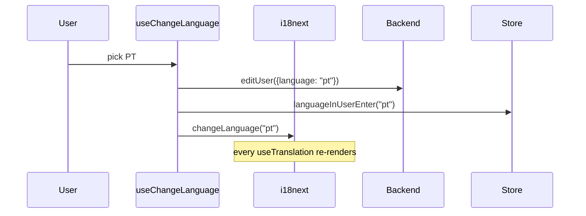
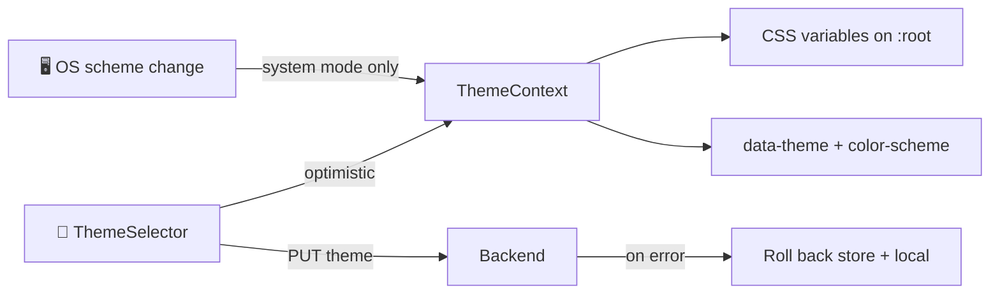

This document covers the two personalization systems: language (English and Portuguese via i18next) and the visual theme. Both live in shared packages so the web and mobile apps read the same sources, and both sync to the backend so preferences follow the account.

## Language

### Setup

i18next with the browser language detector, exactly two languages (en, pt), English as fallback. The translation JSONs live in the shared `packages/i18n`; the web app's local translations folder holds only the init file. The icon picker keeps its own locale files in the icons package, since icon search keywords are a separate concern from UI copy.

### Searching for an icon in your own language

Icon search is translated separately from UI copy, and in two pieces. `packages/icons/src/i18n/{en,pt}.json` holds what belongs to a language: the category names, a few keywords per category, and a small set of query aliases. `packages/icons/src/data/curated.json` holds the vocabulary itself — for each icon that people actually reach for, the words they would type in either language, in one place rather than two files that drift apart.

Both languages are searched at once. Someone with the interface in Portuguese still finds an icon by typing the English word, which is what people do when the English name is the one they know.

Matching is anchored to the start of a term or of a word inside it, never the middle. That boundary is the whole reason the feature behaves: `bolo` (cake) is a substring of `símbolo`, and while search compared raw substrings against one blob of text per icon, typing it returned all 3600 entries in alphabetical order. Terms are also ranked in tiers — the icon's own name, then single words of a longer name, then the category it belongs to — so an exact hit on the icon cannot be tied by the group around it.

Uncurated icons are still reachable by their English name and through their category, so the tail of the catalogue is browsable rather than invisible.

Interpolation escaping is off, which is safe here for a specific reason: every translated string reaches the DOM through React's rendering, and the app contains no raw-HTML injection points for them to leak through.

### The change flow, and one deliberate no-op

```mermaid
sequenceDiagram
  participant U as User
  participant H as useChangeLanguage
  participant I as i18next
  participant BE as Backend
  participant ST as Store

  U->>H: pick PT
  H->>BE: editUser({language: "pt"})
  H->>ST: languageInUserEnter("pt")
  H->>I: changeLanguage("pt")
  Note over I: every useTranslation re-renders
```

The hook has one rule worth knowing: an empty language is a no-op. A brand-new account carries an empty languageInUse, and passing that empty string to i18next would reset the UI to the fallback, clobbering whatever the user picked on the login screen before the account existed. So the account value wins when present, and the detector-cached choice survives when it is not. The dashboard applies the account language read-only on load; the language switcher is the only writer, updating backend, store, and i18next together.

## Theme

### The model: two bases, five accent packs

The old system was nine standalone themes, each owning every color. The current model splits the decision in two:

- **Base**: light or dark (plus "system", which resolves against the OS and follows it live through a media-query listener).
- **Accent pack**: beyou (the default blue), amethyst, sunset, forest, cyber. A pack redefines only the four accent tokens; neutrals and surfaces belong to the base.

The stored preference is the string `mode:pack` ("dark:cyber", "system:beyou"), and that exact string is what the backend keeps in themeInUse. Ten concrete combinations exist for screens that iterate them.

The nine legacy names still resolve through a migration map (beYou to light:beyou, Midnight to dark:beyou, Cyberpunk to dark:cyber, and so on), and anything unrecognized falls back to system:beyou rather than throwing, so an account that last picked a theme in the old world lands somewhere sensible.

### Tokens and CSS variables

A single token map (bg, surfaces, borders, three text tiers, xp and flame pairs, success, danger, shadow, and the four accent tokens) is the contract. One shared function turns a theme into CSS variables, and it emits every color twice: as hex, and as raw RGB channels. The channels are not decoration; Tailwind needs them to generate opacity variants, and without them classes like `bg-accent/10` silently never exist. Web Tailwind maps every token through those channel variables; the old model's names (background, primary, description) survive as aliases while the migration finishes.

### Switching

```mermaid
flowchart LR
  SEL["🎨 ThemeSelector"] -->|"optimistic"| CTX["ThemeContext"]
  CTX --> VARS["CSS variables on :root"]
  CTX --> DATA["data-theme + color-scheme"]
  SEL -->|"PUT theme"| BE["Backend"]
  BE -->|"on error"| ROLLBACK["Roll back store + local"]
  OS["🖥️ OS scheme change"] -->|"system mode only"| CTX
```

Switching writes the variables onto the document root, sets a `data-theme` attribute (so plain CSS like scrollbars and selection colors can react), and sets the native `color-scheme` so built-in controls match. There is no class toggling; the Tailwind dark-mode class configuration is vestigial.

The write path is optimistic with a real rollback: the UI applies immediately, the backend PUT follows, and a server error rolls back both the store and the local preference with a toast. The rollback exists because the earlier behavior, keeping the new theme on screen while the account silently kept the old one, meant the next boot undid the user's choice with no explanation.

### Persistence and precedence

The local preference lives in its own localStorage key, deliberately outside redux-persist, because the profile slice is blacklisted as PII and the theme must survive without it. Its job is to be the fallback below the account: a theme picked on the login page carries into a fresh session and even into a new account. Once the profile loads, the account theme wins; when the account has none, the local choice stays rather than resetting to the OS default. Account deletion's storage sweep explicitly preserves this key, treating the theme as a machine setting rather than account data.

### Reduced motion

Two layers: a global CSS rule collapses all animation and transition durations under prefers-reduced-motion, and the framer-motion components (celebrations, XP float, tutorial, onboarding wizard, agent panel) additionally swap transforms for fades through the useReducedMotion hook.

### Mobile

The mobile app imports the same theme package: same tokens, same preference string, same legacy migration. Only the application mechanism differs; instead of document-level CSS variables, the tokens feed NativeWind's variable system on the root view, with the OS scheme resolved through React Native's own hook.
