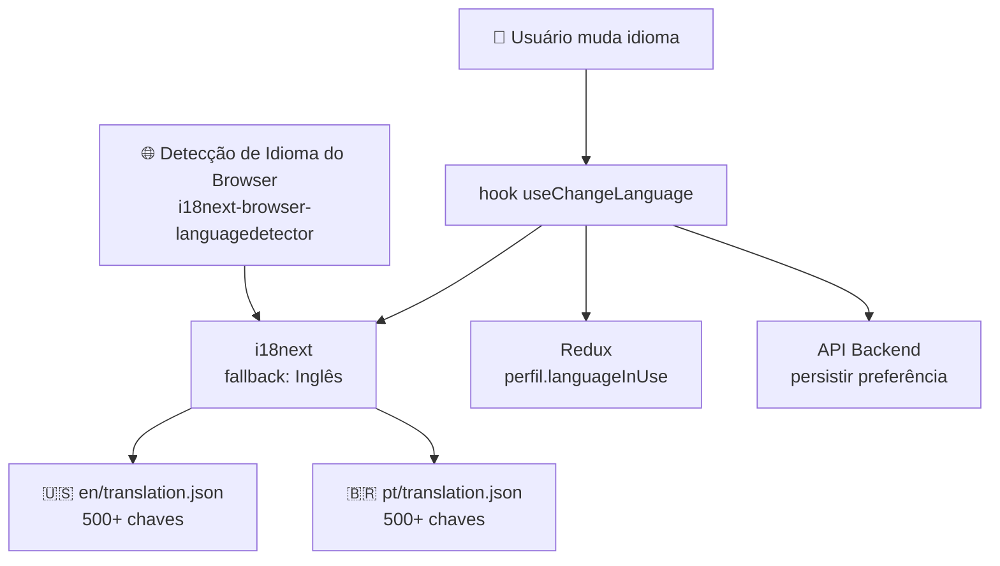
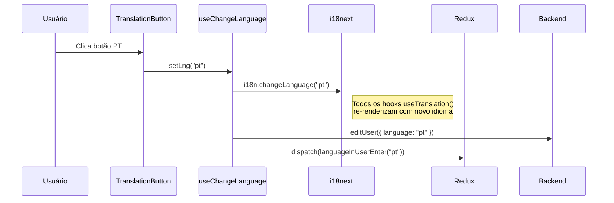
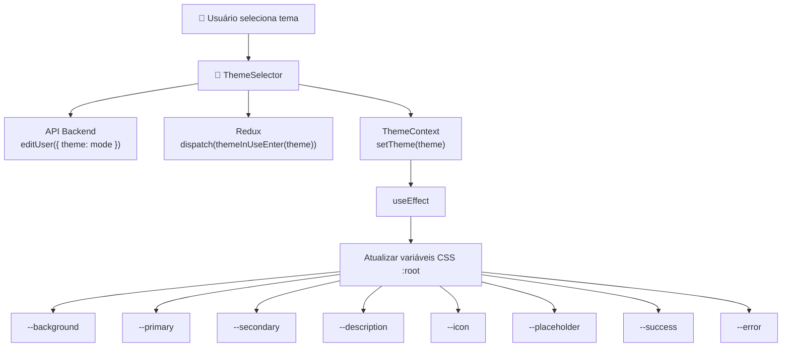
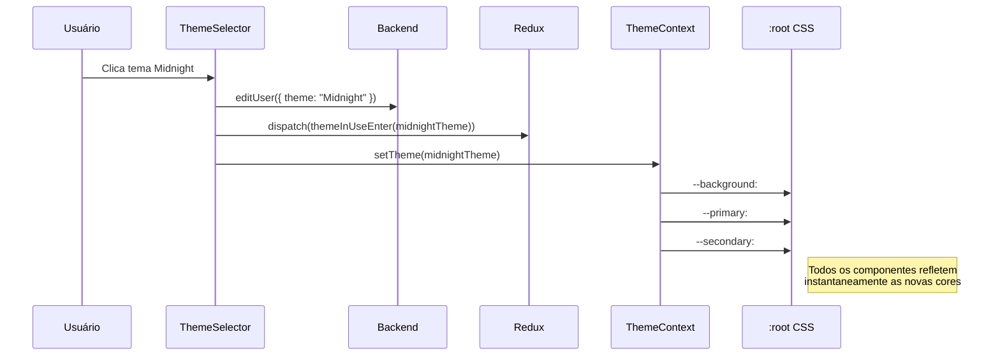
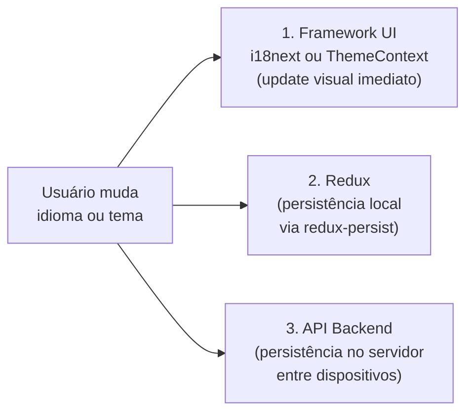

Este documento cobre os dois sistemas de personalização no frontend Beyou: idioma (i18n com inglês e português) e tema visual (9 temas de cores com injeção de variáveis CSS).

## Sistema de Idioma (i18n)

### Arquitetura

### Configuração

- **Biblioteca:** i18next + react-i18next
- **Detecção:** i18next-browser-languagedetector (auto-detecta do browser)
- **Fallback:** Inglês se detecção falhar ou idioma não suportado
- **Idiomas:** Inglês (en) e Português (pt, pt-BR)
- **Interpolação:** escapeValue desabilitado (React trata XSS)

### Estrutura do arquivo de tradução

Ambos en/translation.json e pt/translation.json usam estrutura de chave flat com 500+ chaves:

| Categoria | Exemplos de Chaves |
|-----------|-------------------|
| Auth | Login, Register, ForgotPasswordTitle, PasswordMismatch |
| Validação | YupNameRequired, YupMinimumName, YupMaxName |
| Páginas | YourCategories, YourHabits, Your Goals |
| Ações | created successfully, edited successfully, Logout |
| Erros | WrongPassOrEmailError, GoogleLoginError, UnexpectedError |
| Temas | beYou, beYouDark, Sunset, Amethyst, Midnight, Cyberpunk |
| Saudações | GoodMorning, GoodAfternoon, GoodEvening |

Nomes de temas nas chaves de tradução devem corresponder aos valores theme.mode para que o seletor de tema exiba o nome localizado correto.

### Fluxo de mudança de idioma

Três sistemas são atualizados em paralelo:

1. **i18next** — update imediato da UI, todas as strings traduzidas re-renderizam
2. **Backend** — persiste preferência para sobreviver entre dispositivos
3. **Redux** — persiste localmente via redux-persist para sobreviver a refreshes de página

### Restauração de idioma no login

Quando o usuário faz login, o backend retorna o languageInUse salvo. O frontend dispara para o Redux, e o hook useChangeLanguage do dashboard aplica ao i18next. Isso garante que o app imediatamente mude para o idioma preferido do usuário.

## Sistema de Tema

### Arquitetura

### Temas disponíveis

Beyou tem 9 temas, cada um definindo 8 variáveis de cor:

| Tema | Mode | Background | Primary | Estilo |
|------|------|-----------|---------|--------|
| **beYou** | beYou | #FFFFFF | #0082E1 | Azul claro no branco |
| **beYou Dark** | beYouDark | #18181B | #0082E1 | Azul no cinza escuro |
| **Sunset** | Sunset | #FFF3E0 | #FB923C | Laranja quente claro |
| **Amethyst** | Amethyst | #F5F3FF | #8B5CF6 | Roxo claro |
| **Midnight** | Midnight | #0F172A | #60A5FA | Azul no navy |
| **Cyberpunk** | Cyberpunk | #0D0C1D | #D946EF | Rosa no escuro |
| **Mocha** | Mocha | #FAF3E0 | #B45309 | Marrom quente claro |
| **Polar** | Polar | #1E293B | #0EA5E9 | Ciano no slate |
| **Late Latte** | Late Latte | #2C1E1E | #947347 | Dourado no marrom escuro |

### ThemeContext

O ThemeContext é um React context que envolve todo o app via ThemeProvider:

1. Lê o tema salvo do usuário do Redux (perfil.themeInUse)
2. Se não há tema salvo, verifica preferência do OS via matchMedia("(prefers-color-scheme: dark)")
3. Fallback para defaultLight
4. A cada mudança de tema, atualiza propriedades CSS customizadas no :root

**Prioridade:** Preferência do usuário > Dark mode do OS > defaultLight

### Integração com variáveis CSS

Todos os componentes usam classes Tailwind CSS que referenciam variáveis CSS:

| Variável | Usado por | Classe Tailwind |
|----------|---------|----------------|
| --background | Fundos de página, cards | bg-background |
| --primary | Botões, links, acentos | bg-primary, text-primary |
| --secondary | Texto, títulos | text-secondary |
| --description | Texto mutado | text-description |
| --icon | Cores de ícone | text-icon |
| --success | Estados de sucesso | text-success |
| --error | Estados de erro, validação | text-error, border-error |

Tailwind é configurado com essas variáveis CSS no tailwind.config.js, então toda classe relacionada a cor se adapta automaticamente ao tema ativo.

### Fluxo de mudança de tema

### UI do seletor de tema

O ThemeSelector renderiza uma grid de previews de temas. Cada preview é um retângulo dividido mostrando o background do tema (metade esquerda) e cor primária (metade direita), com borda na cor primária. Clicar em um preview dispara a sincronização tripla (API + Redux + Context).

## Como Funcionam Juntos

Ambos os sistemas seguem o mesmo padrão de sincronização tripla:

Isso garante:

- **Resposta UI instantânea** — sem estado de loading ao trocar
- **Sobrevive refresh de página** — redux-persist restaura do localStorage
- **Sobrevive troca de dispositivo** — backend armazena a preferência
- **Funciona offline** — redux-persist aplica mesmo sem conexão com API
