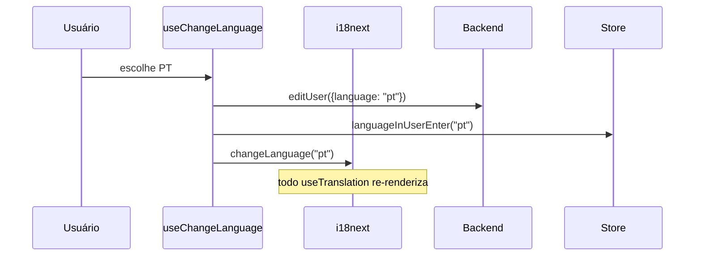
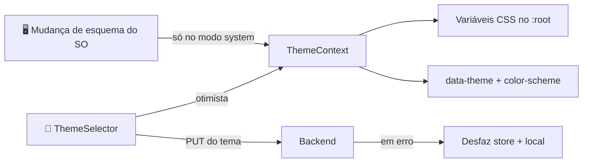

Este documento cobre os dois sistemas de personalização: idioma (inglês e português via i18next) e o tema visual. Os dois vivem em pacotes compartilhados, então web e mobile leem as mesmas fontes, e os dois sincronizam com o backend para as preferências seguirem a conta.

## Idioma

### Montagem

i18next com o detector de idioma do navegador, exatamente dois idiomas (en, pt), inglês como fallback. Os JSONs de tradução vivem no compartilhado `packages/i18n`; a pasta local de traduções do web guarda só o arquivo de inicialização. O seletor de ícones mantém arquivos de idioma próprios no pacote de ícones, já que palavras-chave de busca de ícone são uma preocupação separada do texto da UI.

O escape de interpolação fica desligado, o que é seguro aqui por uma razão específica: toda string traduzida chega ao DOM pela renderização do React, e o app não tem pontos de injeção de HTML cru por onde elas vazariam.

### O fluxo de troca, e um no-op deliberado

```mermaid
sequenceDiagram
  participant U as Usuário
  participant H as useChangeLanguage
  participant I as i18next
  participant BE as Backend
  participant ST as Store

  U->>H: escolhe PT
  H->>BE: editUser({language: "pt"})
  H->>ST: languageInUserEnter("pt")
  H->>I: changeLanguage("pt")
  Note over I: todo useTranslation re-renderiza
```

O hook tem uma regra que vale conhecer: idioma vazio é um no-op. Uma conta recém-criada carrega languageInUse vazio, e passar essa string vazia ao i18next resetaria a UI para o fallback, atropelando o que o usuário escolheu na tela de login antes de a conta existir. Então o valor da conta vence quando presente, e a escolha cacheada pelo detector sobrevive quando não. O dashboard aplica o idioma da conta em modo leitura ao carregar; o seletor de idioma é o único escritor, atualizando backend, store e i18next juntos.

## Tema

### O modelo: duas bases, cinco pacotes de acento

O sistema antigo era nove temas independentes, cada um dono de todas as cores. O modelo atual divide a decisão em duas:

- **Base**: light ou dark (mais "system", que resolve contra o sistema operacional e o acompanha ao vivo por um listener de media query).
- **Pacote de acento**: beyou (o azul padrão), amethyst, sunset, forest, cyber. Um pacote redefine só os quatro tokens de acento; neutros e superfícies pertencem à base.

A preferência guardada é a string `mode:pack` ("dark:cyber", "system:beyou"), e essa string exata é o que o backend mantém em themeInUse. Existem dez combinações concretas para telas que as percorrem.

Os nove nomes antigos ainda resolvem por um mapa de migração (beYou para light:beyou, Midnight para dark:beyou, Cyberpunk para dark:cyber, e assim por diante), e qualquer coisa não reconhecida cai para system:beyou em vez de lançar erro, então uma conta que escolheu tema pela última vez no mundo antigo pousa em um lugar razoável.

### Tokens e variáveis CSS

Um único mapa de tokens (fundo, superfícies, bordas, três níveis de texto, os pares de xp e chama, sucesso, perigo, sombra e os quatro tokens de acento) é o contrato. Uma função compartilhada transforma um tema em variáveis CSS, e ela emite cada cor duas vezes: como hex e como canais RGB crus. Os canais não são decoração; o Tailwind precisa deles para gerar variantes de opacidade, e sem eles classes como `bg-accent/10` simplesmente nunca existem. O Tailwind do web mapeia cada token por essas variáveis de canal; os nomes do modelo antigo (background, primary, description) sobrevivem como aliases enquanto a migração termina.

### A troca

```mermaid
flowchart LR
  SEL["🎨 ThemeSelector"] -->|"otimista"| CTX["ThemeContext"]
  CTX --> VARS["Variáveis CSS no :root"]
  CTX --> DATA["data-theme + color-scheme"]
  SEL -->|"PUT do tema"| BE["Backend"]
  BE -->|"em erro"| ROLLBACK["Desfaz store + local"]
  OS["🖥️ Mudança de esquema do SO"] -->|"só no modo system"| CTX
```

A troca escreve as variáveis na raiz do documento, define um atributo `data-theme` (para CSS puro, como barra de rolagem e seleção, poder reagir) e define o `color-scheme` nativo para os controles embutidos acompanharem. Não há alternância de classe; a configuração de classe de modo escuro do Tailwind é vestigial.

O caminho de escrita é otimista com rollback de verdade: a UI aplica na hora, o PUT ao backend segue, e um erro do servidor desfaz a store e a preferência local com um toast. O rollback existe porque o comportamento anterior, manter o tema novo na tela enquanto a conta guardava o antigo em silêncio, fazia o próximo boot desfazer a escolha do usuário sem explicação.

### Persistência e precedência

A preferência local vive em uma chave própria do localStorage, deliberadamente fora do redux-persist, porque o slice de perfil está na blacklist como PII e o tema precisa sobreviver sem ele. O papel dela é ser o fallback abaixo da conta: um tema escolhido na tela de login carrega para uma sessão nova e até para uma conta nova. Quando o perfil carrega, o tema da conta vence; quando a conta não tem nenhum, a escolha local fica em vez de resetar para o padrão do sistema. A varredura de storage da exclusão de conta preserva explicitamente essa chave, tratando o tema como configuração da máquina, não dado da conta.

### Movimento reduzido

Duas camadas: uma regra CSS global colapsa todas as durações de animação e transição sob prefers-reduced-motion, e os componentes de framer-motion (celebrações, XP float, tutorial, assistente de onboarding, painel do agente) ainda trocam transformações por fades pelo hook useReducedMotion.

### Mobile

O app mobile importa o mesmo pacote de tema: mesmos tokens, mesma string de preferência, mesma migração de legado. Só o mecanismo de aplicação difere; em vez de variáveis CSS no documento, os tokens alimentam o sistema de variáveis do NativeWind na view raiz, com o esquema do sistema resolvido pelo hook do próprio React Native.
