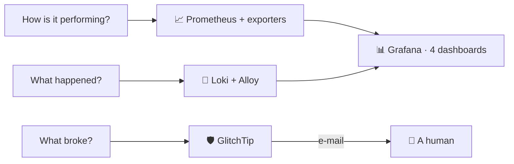

The [infrastructure topic](/architecture/infrastructure) shows where this runs; this one explains how it works. The design splits observability into three questions with three owners, all carried by a single Compose overlay that is byte-identical in development and production: what you debug locally is what runs deployed.

## The overlay

One file adds ten services: Prometheus, Grafana, Loki, Alloy, GlitchTip with its own Postgres and Valkey, and three exporters (cAdvisor for containers, node-exporter for the host, postgres-exporter for the app database). Everything binds to loopback by default, every service carries the same bounded log rotation, and two env vars refuse to default: Grafana's admin credentials and GlitchTip's secret key, because an earlier template shipped a Grafana that came up as admin/admin.

GlitchTip's datastores live on their own isolated network; only the collector itself is dual-homed, which is precisely what lets it probe the backend's management port for uptime checks while its database stays unreachable from the app network.

## Prometheus

The scrape config is a template rendered at container start (Prometheus does not expand environment variables, and the mount is read-only, so a tiny entrypoint script substitutes the port and token values before handing over to the real binary). Ten jobs cover the backend's actuator, GlitchTip, Loki, Alloy, Grafana, Watchtower (bearer-authenticated), the three exporters, and Prometheus itself, every 15 seconds.

Two deliberate absences shape it. There are no alerting rules and no Alertmanager: alerting belongs to GlitchTip, and Prometheus stays a pure observation layer. And the lifecycle endpoints stay disabled, because the loopback binding is not protection when the tunnel daemon runs on the same host and can reach 127.0.0.1.

The self-scrapes matter more than they look: a dead log pipeline fails silent (ingestion just stops), so `up` for Loki and Alloy, plus Alloy's dropped-entries counter, are the only honest signals that logs were actually lost.

## Grafana

Version-pinned with a story attached: Grafana's bundled Drilldown apps update themselves, and a previous minor version broke when a plugin update assumed a newer module runtime. A pinned Grafana with unpinned plugins is a slow-motion version conflict, so the pin gets reviewed, not removed.

Datasources are provisioned read-only, and Loki is reachable only through Grafana's server-side proxy, which is what keeps an unauthenticated Loki API off the network. Four dashboards are provisioned from files, and the two big ones are generated by Python scripts committed next to the JSON, so panel layouts are code, not click history:

| Dashboard | Covers |
|-----------|--------|
| Service Health (68 panels) | JVM, GC, HTTP percentiles, Hikari pool, Caffeine caches, repositories, scheduled tasks |
| Containers (32 panels) | Per-container resources, scrape-target status, the host, the app database, log volume |
| AI Agent (32 panels) | Model calls and tokens per provider, tool usage (including destructive and XP-awarding counts), fallback hops, chain exhaustion |
| Logs | Volume and error charts plus a filterable live browser |

## Loki and Alloy

Alloy discovers containers through the Docker socket and keeps only those whose Compose project matches the beyou prefix, then labels each stream with just the service and project names: no container ids, no image tags, because every distinct label combination is a separate stream. The config has no processing pipeline at all; Loki detects log levels server-side (JSON, logfmt, and plain-text keywords with one detector), and raw lines stay grep-able. Retention is 30 days, enforced by the compactor, matching the error tracker's retention to the day.

Backend lines carry the caller's user id as a `[userId=…]` field, and it stays a field. Promoting it to a stream label would mint one stream per account, which is exactly the cardinality that makes a Loki install expensive, so queries extract it at read time with `pattern` instead.

The known failure mode is written into the config itself: the project filter derives from the checkout directory name, so deploying from a directory that does not start with "beyou" silently stops all log flow.

Browser logs are deliberately not collected. That is GlitchTip's job, and the documentation warns explicitly against closing the gap by exposing a Loki push endpoint to the internet.

## GlitchTip

One all-in-one container (web, worker, and migrations together) with Postgres and Valkey behind it. Four projects split the reporting surfaces: backend, web, mobile, and a DSN-less infra project that exists purely so a database container outage is not mailed under the backend's name.

Everything in it is created and reconciled by a bootstrap script that treats itself, not the UI, as the source of truth: the organization, the team, the four projects, twelve uptime monitors probing container addresses from inside the network (the backend's health endpoint, the web frontend's port, both databases, Valkey, Loki, Alloy, Prometheus, Grafana, optionally Watchtower, and GlitchTip's own health for the status page), one heartbeat monitor, and four alert rules. Exactly one rule per project, because the uptime notification path joins through the project and a second rule would mail every event twice.

The heartbeat is the subtle one. The snapshot scheduler checks in only after a completed cycle, and GlitchTip alerts when 90 minutes pass without a check-in. The check is inverted on purpose: a wedged scheduler keeps the health endpoint green while silently writing no snapshots, so the alert fires on the absence of success rather than the presence of failure.

Three sharp edges the script and docs carry: the first account to register becomes admin regardless of settings, so registration happens immediately after first boot; DSN public keys are stripped of hyphens because the JavaScript SDK's parser rejects hyphenated keys and then drops every event in total silence; and the script ends by checking the mail transport, shouting when e-mail is still the console backend, because a collector with every rule wired and no working mail looks healthy in exactly the wrong way.

GlitchTip is the one monitoring surface exposed publicly (through the tunnel), because real browsers and real phones must be able to deliver errors to it. Grafana is public too, behind its own login; Prometheus, Loki, and Alloy have no hostname at all.

## The instrumented sides

**Backend**: the Sentry SDK is wired through logging, and the interesting choices are what it refuses to send. Default PII off, request bodies never (they carry user-written text), events only at ERROR (one handler logs upstream response bodies at WARN, and lowering the threshold would make those bodies into event messages). Deduplication collapses the triple capture of one fault, with one residual duplicate kept knowingly: the servlet container re-logs failures with a different throwable, and that line is the only signal for exceptions thrown in the filter chain. A before-send filter drops anything caused by a business exception, and fifteen loggers are excluded from breadcrumbs, including one that can leak a secret monitor URL through exception text. Custom metrics cover the LLM chain (calls, fallbacks, exhaustion), every agent tool execution, and Spring AI's token and latency instrumentation, threaded explicitly into the hand-built provider clients that would otherwise be invisible.

**Web**: telemetry is dormant without a DSN and aggressive about privacy with one. URLs are stripped of query strings in three places (the request, the referrer, and navigation breadcrumbs), because two screens carry live single-use tokens in theirs and a hard navigation makes the token-bearing URL the next page's referrer. UI breadcrumbs are rewritten down to bare DOM structure through an allowlist, because the check-in control is labeled with the user's own habit name and would otherwise attach it to every event. Render crashes and handled API failures each have a dedicated capture path, since error boundaries and a never-throwing API client both defeat automatic capture.

**Mobile**: wired the same dormant-without-DSN way, tracing pinned off, and delivery is proven: errors from a real device reach the collector under the mobile project.
