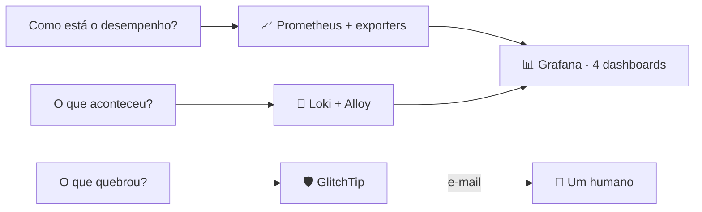

O [tópico de infraestrutura](/architecture/infrastructure) mostra onde isto roda; este explica como funciona. O design divide a observabilidade em três perguntas com três donos, todas carregadas por um único overlay do Compose que é idêntico byte a byte em desenvolvimento e produção: o que você depura localmente é o que roda implantado.

## O overlay

Um arquivo adiciona dez serviços: Prometheus, Grafana, Loki, Alloy, o GlitchTip com Postgres e Valkey próprios, e três exporters (cAdvisor para containers, node-exporter para o host, postgres-exporter para o banco do app). Tudo escuta em loopback por padrão, todo serviço carrega a mesma rotação limitada de logs, e duas variáveis de ambiente se recusam a ter default: as credenciais de admin do Grafana e a chave secreta do GlitchTip, porque um template anterior entregava um Grafana que subia como admin/admin.

Os bancos do GlitchTip vivem em uma rede própria isolada; só o coletor é dual-homed, exatamente o que o deixa sondar a porta de management do backend para checagens de uptime enquanto seu banco fica inalcançável pela rede do app.

## Prometheus

A configuração de coleta é um template renderizado na partida do container (o Prometheus não expande variáveis de ambiente, e o mount é somente-leitura, então um entrypoint minúsculo substitui portas e token antes de entregar ao binário real). Dez jobs cobrem o actuator do backend, GlitchTip, Loki, Alloy, Grafana, Watchtower (com bearer token), os três exporters e o próprio Prometheus, a cada 15 segundos.

Duas ausências deliberadas o moldam. Não há regras de alerta nem Alertmanager: alertar é trabalho do GlitchTip, e o Prometheus permanece camada pura de observação. E os endpoints de ciclo de vida ficam desligados, porque a escuta em loopback não é proteção quando o daemon do túnel roda no mesmo host e alcança 127.0.0.1.

Os self-scrapes importam mais do que parecem: um pipeline de logs morto falha em silêncio (a ingestão simplesmente para), então o `up` do Loki e do Alloy, mais o contador de entradas descartadas do Alloy, são os únicos sinais honestos de que logs foram de fato perdidos.

## Grafana

Com versão fixada e uma história junto: os apps de Drilldown embutidos no Grafana se atualizam sozinhos, e uma versão anterior quebrou quando uma atualização de plugin assumiu um runtime de módulos mais novo. Um Grafana fixado com plugins soltos é um conflito de versões em câmera lenta, então o pin é revisado, nunca removido.

Os datasources são provisionados somente-leitura, e o Loki só é alcançável pelo proxy do lado servidor do Grafana, que é o que mantém uma API sem autenticação fora da rede. Quatro dashboards são provisionados de arquivos, e os dois grandes são gerados por scripts Python commitados ao lado do JSON, então o layout dos painéis é código, não histórico de cliques:

| Dashboard | Cobre |
|-----------|-------|
| Service Health (68 painéis) | JVM, GC, percentis de HTTP, pool Hikari, caches Caffeine, repositórios, tarefas agendadas |
| Containers (32 painéis) | Recursos por container, status dos alvos de coleta, o host, o banco do app, volume de logs |
| AI Agent (32 painéis) | Chamadas de modelo e tokens por provedor, uso de ferramentas (incluindo contagens de destrutivas e das que dão XP), saltos de fallback, cadeia esgotada |
| Logs | Gráficos de volume e erro mais um navegador ao vivo filtrável |

## Loki e Alloy

O Alloy descobre containers pelo socket do Docker e mantém só os que têm projeto Compose casando com o prefixo beyou, e então etiqueta cada stream apenas com o nome do serviço e do projeto: sem ids de container, sem tags de imagem, porque cada combinação distinta de labels é um stream separado. A configuração não tem pipeline de processamento algum; o Loki detecta níveis de log no servidor (JSON, logfmt e palavras-chave de texto puro com um único detector), e as linhas cruas continuam grep-áveis. A retenção é de 30 dias, imposta pelo compactor, casando com a retenção do rastreador de erros no dia.

As linhas do backend carregam o id de quem chamou como um campo `[userId=…]`, e ele continua sendo campo. Promovê-lo a label de stream criaria um stream por conta, que é justamente a cardinalidade que encarece uma instalação do Loki, então as consultas o extraem na leitura, com `pattern`.

O modo de falha conhecido está escrito na própria configuração: o filtro de projeto deriva do nome do diretório do checkout, então implantar de um diretório que não começa com "beyou" para todo o fluxo de logs em silêncio.

Logs de navegador deliberadamente não são coletados. Esse é o trabalho do GlitchTip, e a documentação avisa explicitamente contra fechar a lacuna expondo um endpoint de push do Loki à internet.

## GlitchTip

Um container tudo-em-um (web, worker e migrações juntos) com Postgres e Valkey atrás. Quatro projetos separam as superfícies de reporte: backend, web, mobile e um projeto de infra sem DSN, que existe puramente para uma queda de container de banco não ser enviada por e-mail em nome do backend.

Tudo nele é criado e reconciliado por um script de bootstrap que trata a si mesmo, não a UI, como fonte de verdade: a organização, o time, os quatro projetos, doze monitores de uptime sondando endereços de container de dentro da rede (a saúde do backend — um grupo nomeado que inclui só checagens locais, nunca o endpoint inteiro, para nenhum indicador adicionado depois colocar uma chamada de rede na frente da sonda, a porta do frontend web, os dois bancos, o Valkey, Loki, Alloy, Prometheus, Grafana, opcionalmente o Watchtower e a própria saúde do GlitchTip para a página de status), três monitores de heartbeat e quatro regras de alerta. Exatamente uma regra por projeto, porque o caminho de notificação de uptime passa pelo projeto e uma segunda regra enviaria cada evento duas vezes.

Os heartbeats são os sutis. O scheduler de snapshots só se reporta depois de um ciclo completo, e o GlitchTip alerta quando 90 minutos passam sem reporte. A checagem é invertida de propósito: um scheduler travado mantém o endpoint de saúde verde enquanto silenciosamente não escreve snapshot nenhum, então o alerta dispara na ausência de sucesso, não na presença de falha.

A passada de nudges de engajamento tem o mesmo heartbeat, e precisa mais dele. Um job de snapshot que para acaba aparecendo como histórico faltando; um job de nudge que para parece exatamente uma semana quieta, porque ninguém reclama de e-mail que não recebeu. O monitor dele é opt-in no script de bootstrap, e de propósito: a passada retorna antes de se reportar enquanto `engagement.enabled` for false, então um monitor criado antes dessa flag alertaria a cada 90 minutos sobre um job que está desligado de propósito. `GLITCHTIP_NUDGE_HEARTBEAT=1` entra na mesma mudança que liga o remetente.

Os outros dois cuidam dos backups, invertidos pelo mesmo motivo levado adiante: o job noturno e o teste semanal de restauração só se reportam quando dão certo, então um backup que para de rodar não gera erro, não falha requisição nenhuma e não deixa nada vermelho. São dois e não um porque "subiu sem erro" e "restaura de verdade" são afirmações diferentes, e um backup que só cumpre a primeira é o jeito comum de isso dar errado.

Três bordas afiadas que o script e a documentação carregam: a primeira conta a se registrar vira admin independentemente das configurações, então o registro acontece imediatamente após o primeiro boot; as chaves públicas de DSN perdem os hífens porque o parser do SDK JavaScript rejeita chaves com hífen e então descarta todo evento em silêncio total; e o script termina conferindo o transporte de e-mail, gritando quando o e-mail ainda é o backend de console, porque um coletor com todas as regras ligadas e sem correio funcionando parece saudável exatamente do jeito errado.

O GlitchTip é a única superfície de monitoramento exposta publicamente (pelo túnel), porque navegadores e celulares reais precisam conseguir entregar erros a ele. O Grafana também é público, atrás do próprio login; Prometheus, Loki e Alloy não têm hostname algum.

## Os lados instrumentados

**Backend**: o SDK do Sentry entra pelo logging, e as escolhas interessantes são o que ele se recusa a enviar. PII padrão desligado, corpos de requisição nunca (carregam texto escrito pelo usuário), eventos só em ERROR (um handler registra corpos de resposta de upstream em WARN, e baixar o limiar transformaria esses corpos em mensagens de evento). A deduplicação colapsa a captura tripla de uma falha, com uma duplicata residual mantida de propósito: o container servlet re-loga falhas com um throwable diferente, e essa linha é o único sinal para exceções lançadas na cadeia de filtros. Um filtro de before-send descarta qualquer coisa causada por exceção de negócio, e quinze loggers ficam fora dos breadcrumbs, incluindo um que pode vazar uma URL secreta de monitor pelo texto de exceção. Métricas próprias cobrem a cadeia de LLM (chamadas, fallbacks, esgotamento), cada execução de ferramenta do agente e a instrumentação de tokens e latência do Spring AI, passada explicitamente para os clientes de provedor montados à mão que de outro modo seriam invisíveis.

**Web**: a telemetria fica dormente sem DSN e agressiva com privacidade com um. URLs perdem a query string em três lugares (a requisição, o referrer e os breadcrumbs de navegação), porque duas telas carregam tokens vivos de uso único nas suas e uma navegação dura faz da URL com token o referrer da página seguinte. Breadcrumbs de UI são reescritos até a estrutura nua do DOM por uma allowlist, porque o controle de check-in é rotulado com o nome do próprio hábito do usuário e o anexaria a cada evento. Quebras de renderização e falhas de API tratadas têm caminhos de captura dedicados, já que error boundaries e um cliente de API que nunca lança derrotam a captura automática.

**Mobile**: ligado do mesmo jeito dormente-sem-DSN, tracing fixado em desligado, e a entrega está provada: erros de um aparelho real chegam ao coletor no projeto do mobile.
