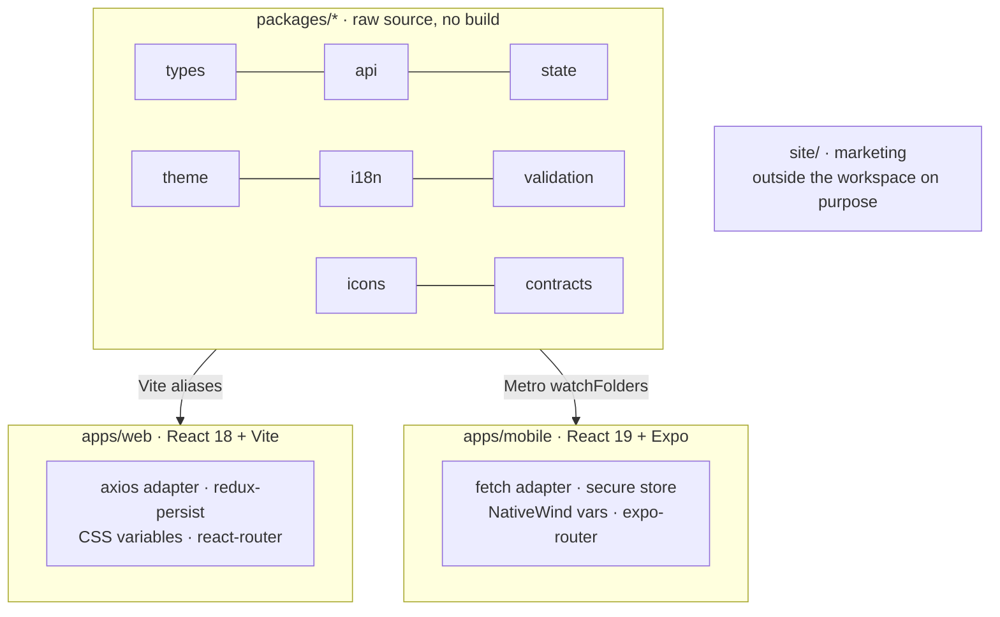

This document explains how one repository serves both a React web app and a React Native mobile app: the workspace mechanics, what the shared packages hold, the seams where each platform plugs in its own transport and storage, and the traps that keep the dual-React setup alive.

## The decision, briefly

Before the mobile app existed, three competing studies (React Native + Expo, Flutter, Kotlin Multiplatform) were written as advocacy pieces. The RN one won on a single observation: Beyou's business logic was already cleanly separated from the DOM, thousands of lines of pure TypeScript (state, API calls, validation, types, translations, themes as plain objects) portable with near-zero rewrites. It also named the two costs honestly up front: auth would need re-architecting for native, and every visual layer would be a rewrite. Both predictions held exactly.

## Workspace mechanics

npm workspaces (`apps/*`, `packages/*`) with Turborepo on top, and one architectural statement hiding in the build config: **shared packages have no build step**. Their package.json points main and types straight at `src/index.ts`, and both bundlers alias `@beyou/*` to raw source. Editing a shared file hot-reloads the web app through Vite and the mobile app through Metro at the same moment. Turbo's task graph exists mostly for typecheck and tests; only the web app produces a `dist/`.

The marketing site sits at the repo root, outside the workspace glob on purpose: it is framework-free Python-built HTML that ships to Cloudflare Pages on its own, and no root build ever touches it.

## The eight packages

| Package | Holds | The heaviest consumer |
|---------|-------|------------------------|
| types | Plain domain types and DTOs | Everything |
| api | The HttpClient interface, every API repository, error model, logging seam | The most-shared package by import count |
| state | 17 Redux slices, the root reducer, and the pure logic both apps run: gamification apply, widget ids, sorters, date helpers | Web and mobile equally |
| theme | The token model, accent packs, the theme-to-variables map | Both theme providers |
| i18n | The en and pt translation JSONs | Both i18next inits |
| validation | Zod schemas per form, as translation-aware factories | Every form on both platforms |
| icons | Platform-neutral icon registry, search, recents | Each app supplies only the renderer |
| contracts | Types generated from a committed OpenAPI snapshot | Wired ahead of use; CI guards staleness |

The contracts package deserves its honest footnote: it is scaffolding wired before its consumers. CI regenerates the types and diffs them against the committed ones, which catches a stale regeneration but not drift against the live backend, since the spec endpoint sits behind authentication. Threading the generated types into the api repositories is the named next phase.

## The seams: how sharing actually works

The trick that makes one API layer serve two platforms is a deliberately narrow interface. The api package defines an HttpClient of exactly four methods over a config of exactly three options, so no adapter can silently drop a key. Each app registers its own at boot: the web registers an axios adapter (cookies, silent refresh, interceptors), mobile registers a fetch adapter that adds the `X-Client: mobile` header, keeps the access token in memory, stores the refresh token in the secure store, and does its own single-flight 401 refresh. The same setter-singleton seam repeats for logging and for the agent's SSE stream, where mobile supplies Expo's fetch because React Native's global fetch buffers whole bodies.

What stays per-app is exactly what should: persistence (web uses redux-persist with a PII blacklist; mobile persists nothing and refetches), navigation (react-router vs expo-router's file-based routes), token storage (httpOnly cookie vs secure store), theme application (CSS variables on the document vs NativeWind variables on the root view), and the entire render layer.

## The dual-React tightrope

The web app runs React 18, the mobile app React 19 with React Native, in one npm tree. Root-level overrides pin the mobile versions, Metro pins react and react-native to the mobile app's own node_modules, and a resolver chain redirects three singleton native libraries to the mobile copy, because a hoisted duplicate of the animation runtime silently renders every styled component unstyled. This arrangement works and is tested daily, and it has one commandment written in three separate files: **never run npm dedupe**. Deduping collapses the two Reacts and breaks both bundlers; the documented recovery is a reinstall with prefer-dedupe and a manual check of both React versions.

Two more traps carry warning signs in the repo: Metro's hierarchical lookup must stay enabled (disabling it broke nested Expo transitives), and no test file may live under the mobile app's route directory, because Expo Router turns every file there into a route and the production export fails.

## CI and delivery

One workflow runs the whole graph on every push: typecheck, build, and tests across all workspaces (vitest for web and the packages, jest for mobile), the contracts staleness gate, a brand-asset check, and an npm audit. An e2e job then boots the full stack and runs Playwright against it, with a sibling-branch resolver: when the e2e or backend repo has a branch matching the current one, the job tests against that branch instead of main, so a frontend change that needs new specs can go green before anything merges.

Delivery splits by platform. A push to main publishes the web image to GHCR (Watchtower deploys it, as the infrastructure topic covers). The mobile app has its own workflow, triggered by changes to the mobile app or any shared package, which is the monorepo paying off in CI: a state-package change rebuilds the APK. It prebuilds the Android project, assembles a signed arm64 release with heavily tuned Gradle flags, and publishes to a rolling GitHub release with a stable download URL. No app store, no EAS, no OTA updates yet.
