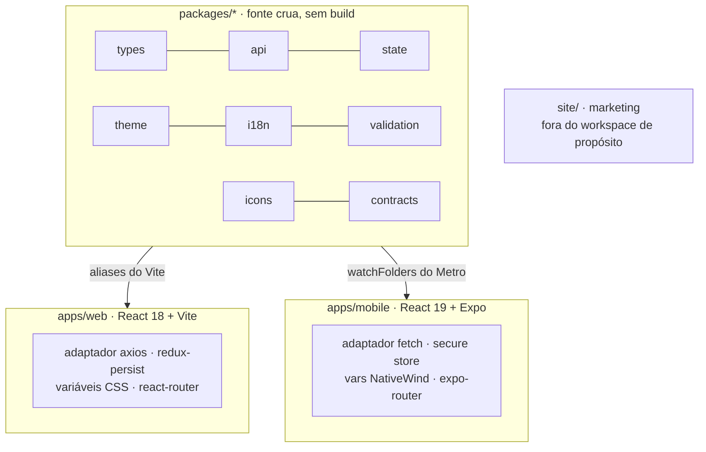

Este documento explica como um repositório serve um app web React e um app mobile React Native ao mesmo tempo: a mecânica do workspace, o que os pacotes compartilhados guardam, as costuras onde cada plataforma pluga seu próprio transporte e armazenamento, e as armadilhas que mantêm o arranjo de dois Reacts vivo.

## A decisão, em resumo

Antes de o app mobile existir, três estudos concorrentes (React Native + Expo, Flutter, Kotlin Multiplatform) foram escritos como peças de defesa. O de RN venceu por uma única observação: a lógica de negócio do Beyou já estava separada do DOM de forma limpa, milhares de linhas de TypeScript puro (estado, chamadas de API, validação, tipos, traduções, temas como objetos simples) portáveis quase sem reescrita. Ele também nomeou os dois custos com honestidade: a autenticação precisaria de rearquitetura para o nativo, e toda camada visual seria reescrita. As duas previsões se cumpriram exatamente.

## Mecânica do workspace

npm workspaces (`apps/*`, `packages/*`) com Turborepo por cima, e uma declaração arquitetural escondida na configuração de build: **pacotes compartilhados não têm etapa de build**. O package.json deles aponta main e types direto para `src/index.ts`, e os dois bundlers apelidam `@beyou/*` para o código-fonte cru. Editar um arquivo compartilhado recarrega o web app pelo Vite e o app mobile pelo Metro no mesmo instante. O grafo de tarefas do Turbo existe principalmente para typecheck e testes; só o web app produz um `dist/`.

O site de marketing fica na raiz do repositório, fora do glob do workspace de propósito: é HTML sem framework, construído em Python, que vai sozinho para o Cloudflare Pages, e nenhum build da raiz o toca.

## Os oito pacotes

| Pacote | Guarda | O maior consumidor |
|--------|--------|--------------------|
| types | Tipos de domínio e DTOs | Tudo |
| api | A interface HttpClient, cada repositório de API, modelo de erro, costura de logging | O pacote mais compartilhado em contagem de imports |
| state | 17 slices Redux, o root reducer e a lógica pura que os dois apps rodam: aplicação de gamificação, ids de widgets, ordenadores, helpers de data | Web e mobile por igual |
| theme | O modelo de tokens, os pacotes de acento, o mapa tema-para-variáveis | Os dois provedores de tema |
| i18n | Os JSONs de tradução en e pt | As duas inicializações do i18next |
| validation | Schemas zod por formulário, como fábricas cientes de tradução | Todo formulário nas duas plataformas |
| icons | Registro de ícones neutro de plataforma, busca, recentes | Cada app fornece só o renderizador |
| contracts | Tipos gerados de um snapshot OpenAPI commitado | Ligado antes do uso; o CI guarda contra staleness |

O pacote de contratos merece sua nota honesta: é andaime ligado antes dos consumidores. O CI regenera os tipos e compara com os commitados, o que pega uma regeneração esquecida mas não a deriva contra o backend vivo, já que o endpoint da spec fica atrás de autenticação. Levar os tipos gerados para dentro dos repositórios da api é a próxima fase nomeada.

## As costuras: como o compartilhamento funciona de verdade

O truque que faz uma camada de API servir duas plataformas é uma interface estreita de propósito. O pacote api define um HttpClient de exatamente quatro métodos sobre uma configuração de exatamente três opções, para nenhum adaptador engolir uma chave em silêncio. Cada app registra o seu no boot: o web registra um adaptador axios (cookies, refresh silencioso, interceptors), o mobile registra um adaptador fetch que adiciona o header `X-Client: mobile`, mantém o access token em memória, guarda o refresh token no secure store e faz seu próprio refresh de voo único no 401. A mesma costura de setter-singleton se repete para logging e para o stream SSE do agente, onde o mobile fornece o fetch do Expo porque o fetch global do React Native bufferiza corpos inteiros.

O que fica por app é exatamente o que deveria: persistência (o web usa redux-persist com blacklist de PII; o mobile não persiste nada e rebusca), navegação (react-router contra as rotas por arquivo do expo-router), armazenamento de token (cookie httpOnly contra secure store), aplicação de tema (variáveis CSS no documento contra variáveis NativeWind na view raiz) e toda a camada de renderização.

## A corda bamba dos dois Reacts

O web app roda React 18, o mobile React 19 com React Native, em uma única árvore npm. Overrides na raiz fixam as versões do mobile, o Metro fixa react e react-native no node_modules do próprio app mobile, e uma cadeia de resolução redireciona três bibliotecas nativas singleton para a cópia do mobile, porque uma duplicata içada do runtime de animação silenciosamente renderiza todo componente estilizado sem estilo. O arranjo funciona e é testado diariamente, e tem um mandamento escrito em três arquivos separados: **nunca rode npm dedupe**. Dedupar colapsa os dois Reacts e quebra os dois bundlers; a recuperação documentada é reinstalar com prefer-dedupe e conferir as duas versões de React na mão.

Mais duas armadilhas carregam placas de aviso no repositório: a busca hierárquica do Metro precisa ficar habilitada (desligá-la quebrou transitivas aninhadas do Expo), e nenhum arquivo de teste pode morar no diretório de rotas do app mobile, porque o Expo Router transforma cada arquivo dali em rota e o export de produção falha.

## CI e entrega

Um workflow roda o grafo inteiro a cada push: typecheck, build e testes em todos os workspaces (vitest para web e pacotes, jest para o mobile), o portão de staleness dos contratos, uma checagem de assets de marca e um npm audit. Um job de e2e então sobe a stack completa e roda Playwright contra ela, com um resolvedor de branch irmã: quando o repositório de e2e ou o do backend tem uma branch com o mesmo nome da atual, o job testa contra ela em vez da main, então uma mudança de frontend que precisa de specs novas consegue ficar verde antes de qualquer merge.

A entrega se divide por plataforma. Um push na main publica a imagem web no GHCR (o Watchtower a implanta, como o tópico de infraestrutura cobre). O app mobile tem workflow próprio, disparado por mudanças no app ou em qualquer pacote compartilhado, que é o monorepo se pagando no CI: uma mudança no pacote de estado reconstrói o APK. Ele faz o prebuild do projeto Android, monta um release arm64 assinado com flags de Gradle bem ajustadas e publica em um release rolante do GitHub com URL estável de download. Sem loja de aplicativos, sem EAS, sem OTA por enquanto.
