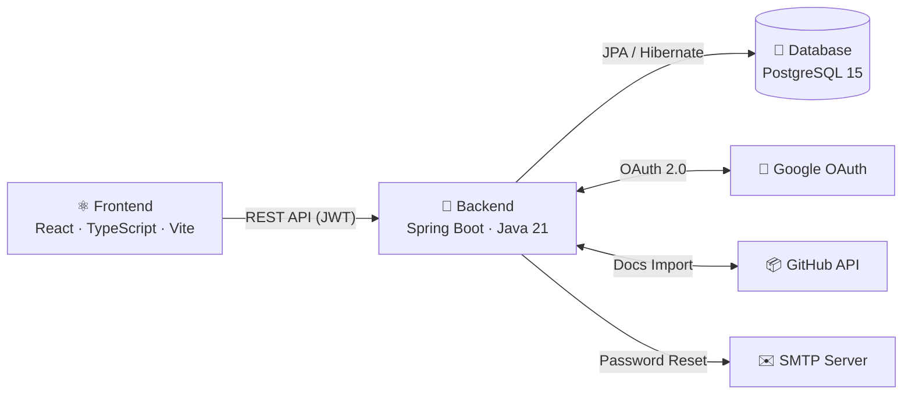
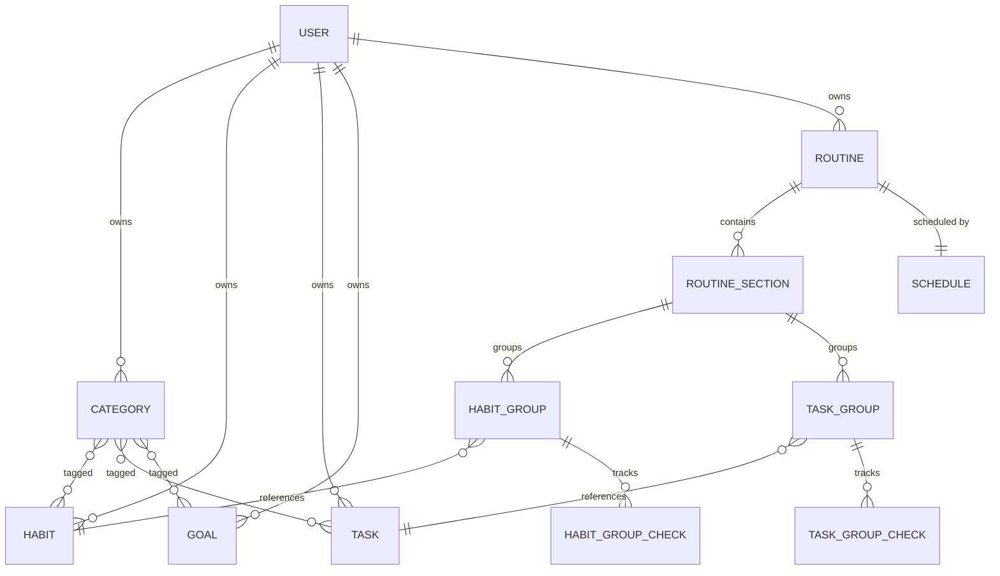
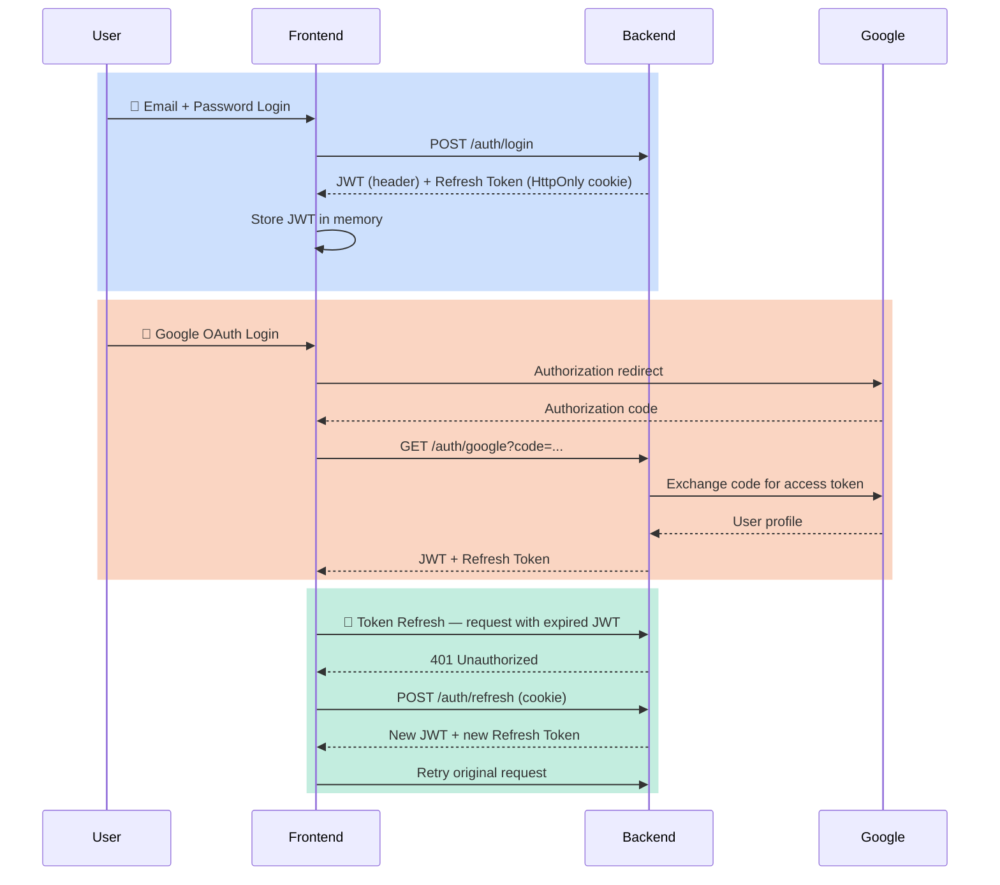
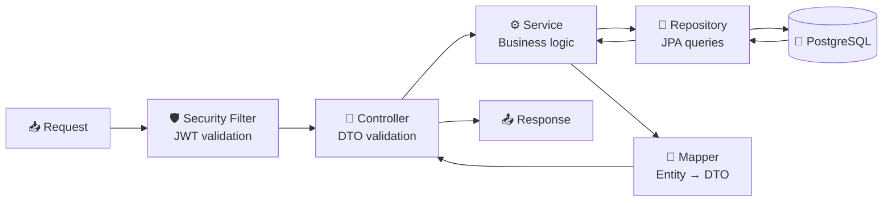
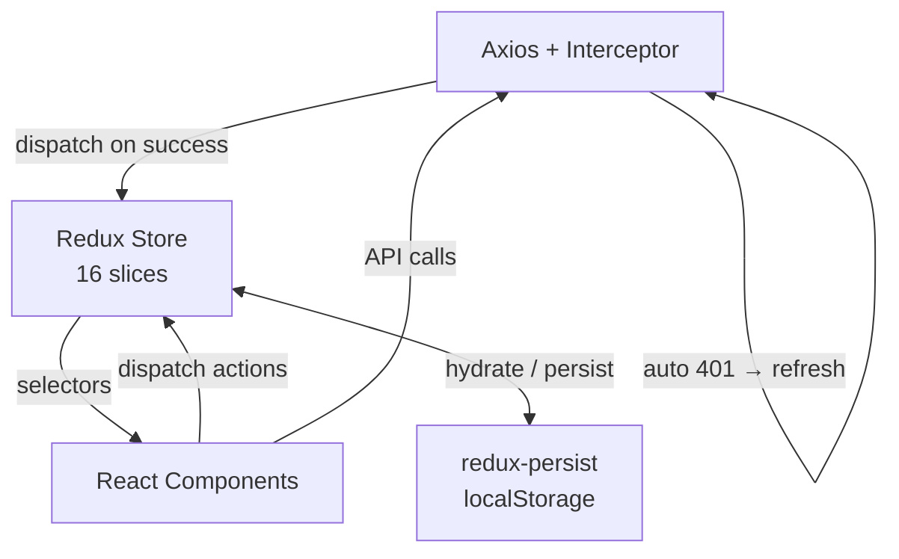
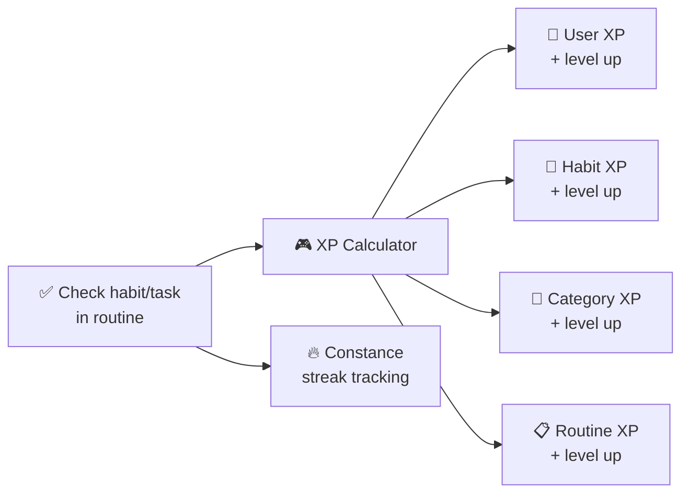
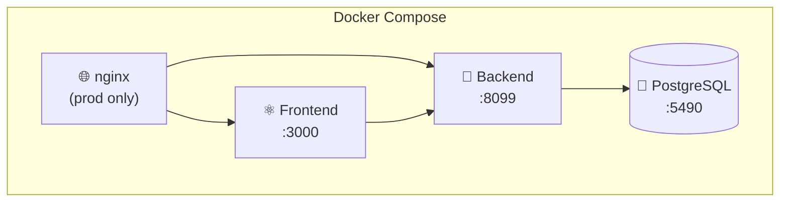

This document describes the overall architecture of the Beyou application, covering the main layers, data flow, domain model, authentication, and gamification system.

## System Architecture

## Tech Stack

| Layer | Technologies |
|-------|-------------|
| **Frontend** | React 18, TypeScript, Vite, Redux Toolkit + redux-persist, Axios, react-hook-form + Zod, i18next (en/pt), Tailwind CSS 3 |
| **Backend** | Spring Boot 3.3, Java 21 (virtual threads), Spring Security, JWT (auth0 java-jwt), Undertow, Spring AOP, Lombok |
| **Database** | PostgreSQL 15, Hibernate JPA, UUID primary keys, ddl-auto: update |
| **DevOps** | Docker Compose, nginx (prod), hot-reload (dev) |

## Domain Model

### Entity highlights

- **User** — profile, preferences (theme, language, widgets), and embedded XP progression (level, xp, constance streak).
- **Category** — groups habits, tasks, and goals via ManyToMany. Has its own XP/level.
- **Habit** — trackable behavior with importance, difficulty, motivational phrase, and XP/level progression.
- **Task** — similar to habit but can be one-time (oneTimeTask) with soft-delete via markedToDelete.
- **Goal** — target-based with currentValue / targetValue, status (active/completed/failed), and term (short/long/life).
- **Routine** — abstract base with DiaryRoutine concrete type. Contains sections with habit/task groups.
- **Schedule** — days of the week (Monday–Sunday) linked to a routine.
- **Checks** — daily check/skip records for habit and task groups inside routines, with XP generation tracking.

## Authentication Flow

### Token details

- **Access token (JWT)** — 15 minutes, HMAC256, sent in the Authorization: Bearer header.
- **Refresh token** — 15 days, opaque hashed token, HttpOnly cookie. Old token revoked on refresh.
- **Password reset** — secure token via email, 30 min TTL, 5 min cooldown between requests. All refresh tokens revoked on reset.

## API Layer

14 REST controllers organized by domain:

| Group | Controllers | Base paths |
|-------|-----------|------------|
| **Auth** | AuthenticationController | /auth/* |
| **Core entities** | CategoryController, HabitController, TaskController, GoalController | /category, /habit, /task, /goal |
| **Routines** | RoutineController, ScheduleController | /routine, /schedule |
| **User** | UserController | /user |
| **Docs** | ArchitectureDocsController, DesignDocsController, ApiDocsController, ProjectDocsController, SearchDocsController, DocsImportController | /docs/* |

### Request/response pattern

- Request DTOs validated with Jakarta Bean Validation (@NotBlank, @Size, @Email).
- Responses mapped through dedicated Mapper classes (entity → response DTO).
- Global exception handler translates errors into standardized ApiErrorResponse with error keys for frontend i18n.

## State Management (Frontend)

### Key slices

| Slice | Purpose |
|-------|---------|
| perfil | User profile, XP, level, theme, language, constance |
| habits, tasks, goals, routines, categories | Entity lists |
| editHabit, editTask, editGoal, editRoutine, editCategory | Edit mode state |
| todayRoutine | Today's scheduled routine for dashboard |
| viewFilters | Sort/filter preferences per page |
| register, errorHandler | Auth and error state |

## Gamification System

- **XpProgress** is an embeddable component shared by User, Category, Habit, and Routine.
- XP is generated when a habit or task is checked inside a routine.
- Level progression follows a seeded XP-per-level table (XpByLevelSeeder).
- Constance (streak) tracks consecutive completed days on the User entity.
- Goals award a fixed xpReward on completion.

## Infrastructure

- **Dev mode** — up-dev.sh: hot-reload for frontend and backend, direct port access.
- **Prod mode** — up-prod.sh: nginx reverse proxy routing /api → backend, / → frontend.
- **Reset** — reset-db.sh: wipes PostgreSQL data volume.
- Environment configured via .env file with secrets for JWT, Google OAuth, SMTP, CORS, and docs import.
