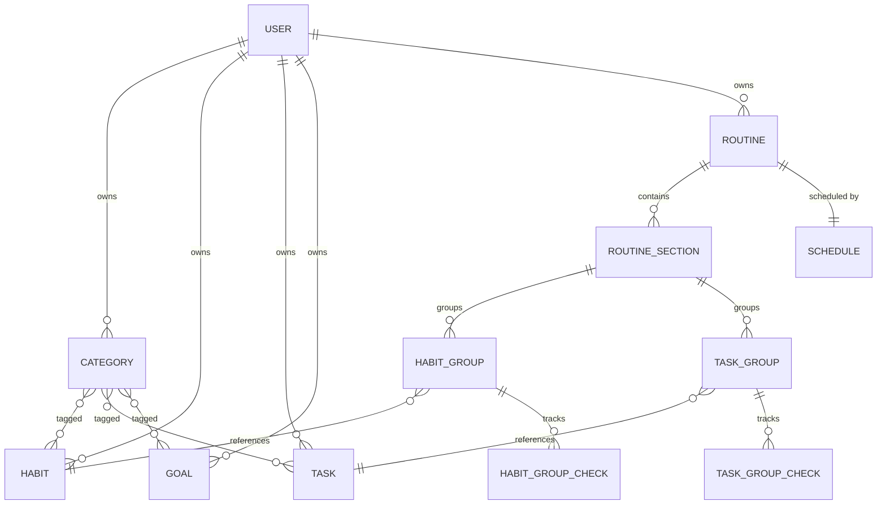
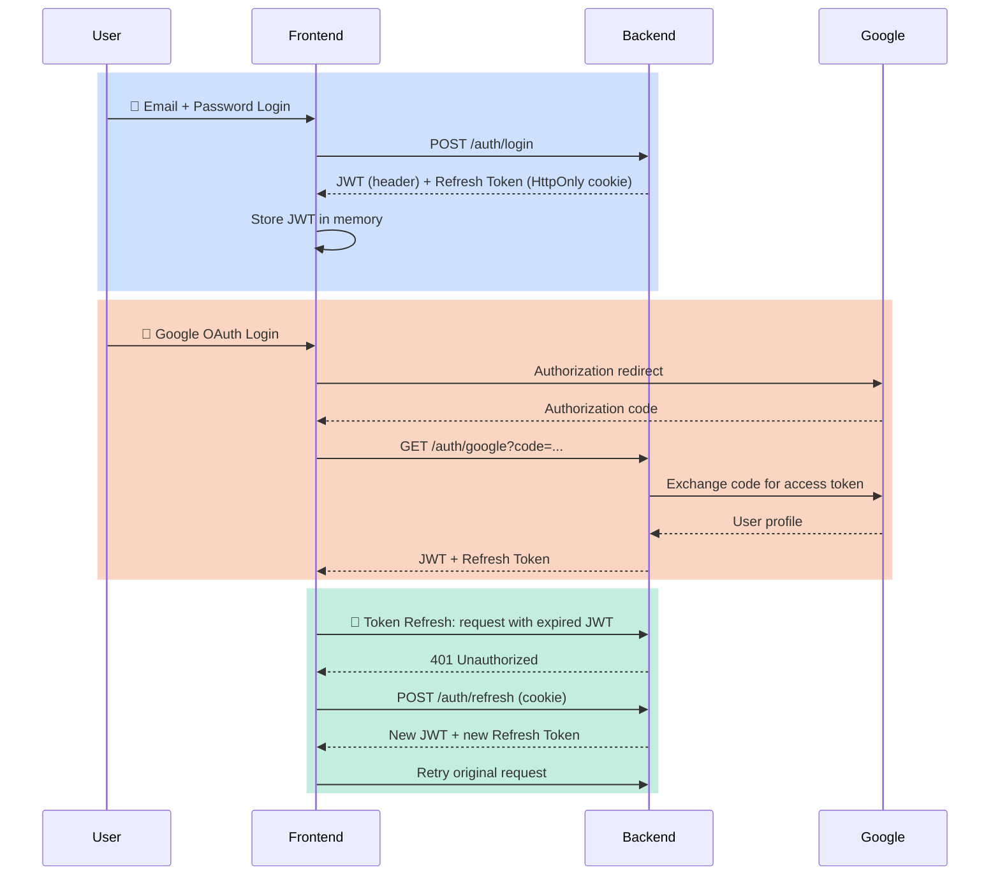
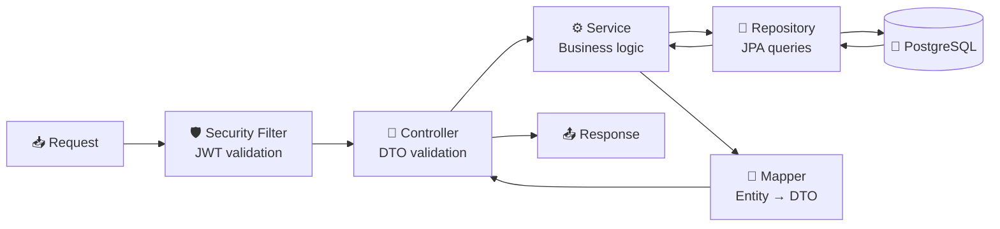
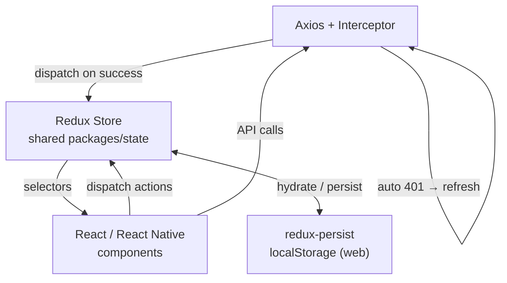
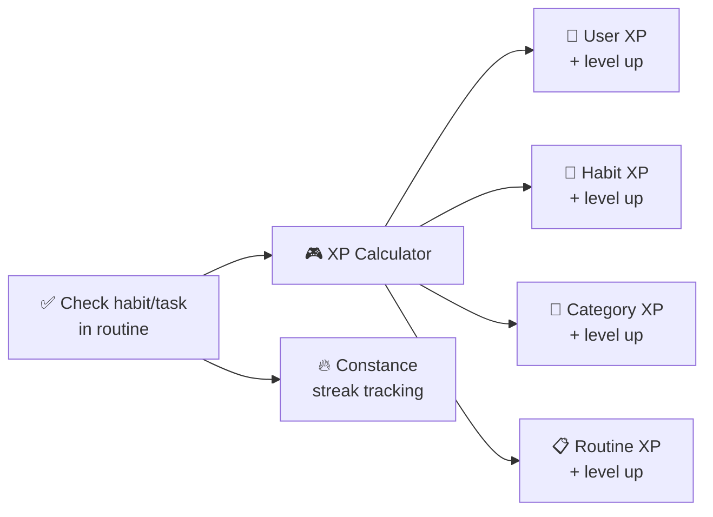

This is the map of the system as it runs in production: every client surface, the API behind them, the database, how new code reaches the server, and how we find out when something breaks. The diagram above shows the whole picture; the sections below walk through each piece.

## Tech stack

| Layer | Technologies |
|-------|-------------|
| **Web app** | React 18, TypeScript, Vite, Redux Toolkit, Axios, react-hook-form + Zod, i18next (en/pt), Tailwind CSS 3 |
| **Mobile app** | React Native + Expo (Android first), NativeWind, TypeScript. Shares the state, API client, and i18n packages with the web app through the monorepo |
| **Backend** | Spring Boot 4.1, Java 25 (virtual threads), Spring Security, JWT (auth0 java-jwt), Spring AOP, Spring AI for the agent chat and onboarding suggestions (LLM fallback chain) |
| **Database** | PostgreSQL 15, Flyway-owned schema (Hibernate validates it, never writes it), UUID primary keys, Caffeine cache in front of hot reads |
| **Delivery** | GitHub Actions builds images to GHCR, Watchtower redeploys them; Docker Compose; nginx serves the web and docs builds |
| **Monitoring** | Prometheus, Grafana, Loki + Alloy, GlitchTip (Sentry-compatible) |

## Production topology

The application side is four containers, all built by CI and published to GitHub Container Registry:

- **beyou-backend**: the Spring Boot API on port 8099, everything under `/api/v1`.
- **beyou-web**: the web app's static build, served by nginx. Public at **app.beyouweb.com**.
- **beyou-docs**: this documentation site, prerendered to static HTML and served by nginx. Public at **docs.beyouweb.com**.
- **watchtower**: polls GHCR every five minutes and restarts any container whose image changed. Merging to main is the deployment; CI does the rest.

Every published port binds to 127.0.0.1. The public hostnames reach the containers through a TLS reverse proxy, so nothing is exposed directly. Two pieces live outside the Compose stack: the marketing site at **beyouweb.com** (static HTML on Cloudflare Pages) and the mobile app, which installs on the phone and talks to the same API as the web app.

The content of this docs site has its own pipeline: markdown and OpenAPI specs live in the beyou-arch-design repository, the backend imports them into PostgreSQL, and a content change triggers a rebuild of the prerendered docs image.

## Monitoring

One Compose overlay carries the whole observability stack, and it is the same file in development and in production. Each component answers a different question:

- **Prometheus** answers "how is it performing?". It scrapes the backend's actuator plus cAdvisor, node-exporter, and postgres-exporter, so JVM internals, per-container resources, the host, and the database are all on the same board.
- **Loki + Alloy** answer "what happened?". Alloy tails the stdout of every beyou* container through the Docker API and pushes to Loki. The apps need no log configuration at all, and logs are kept for 30 days.
- **GlitchTip** answers "what broke?". The backend, the web app, and the mobile app all deliver errors to it through Sentry SDKs. It is public at **mnt.beyouweb.com** because real browsers and real phones must be able to reach it. It also runs the uptime and heartbeat monitors, since it is the piece that can notify a human.

Grafana sits on top of all three, with four dashboards provisioned automatically: fleet health, backend JVM internals, the AI agent, and logs. It lives at **obs.beyouweb.com**, behind its own login. Those two are the only public monitoring surfaces; the rest of the overlay (Prometheus, Loki, the exporters) stays on loopback and is only reachable through Grafana.

## Domain model

```mermaid
erDiagram
  USER ||--o{ CATEGORY : owns
  USER ||--o{ HABIT : owns
  USER ||--o{ TASK : owns
  USER ||--o{ GOAL : owns
  USER ||--o{ ROUTINE : owns

  CATEGORY }o--o{ HABIT : tagged
  CATEGORY }o--o{ TASK : tagged
  CATEGORY }o--o{ GOAL : tagged

  ROUTINE ||--o{ ROUTINE_SECTION : contains
  ROUTINE ||--|| SCHEDULE : "scheduled by"

  ROUTINE_SECTION ||--o{ HABIT_GROUP : groups
  ROUTINE_SECTION ||--o{ TASK_GROUP : groups

  HABIT_GROUP }o--|| HABIT : references
  TASK_GROUP }o--|| TASK : references

  HABIT_GROUP ||--o{ HABIT_GROUP_CHECK : tracks
  TASK_GROUP ||--o{ TASK_GROUP_CHECK : tracks
```

### Entity highlights

- **User**: profile, preferences (theme, language, widgets), and embedded XP progression (level, xp, constance streak).
- **Category**: groups habits, tasks, and goals via ManyToMany. Has its own XP/level.
- **Habit**: trackable behavior with importance, difficulty, motivational phrase, and XP/level progression.
- **Task**: like a habit, but can be one-time (oneTimeTask) with soft-delete via markedToDelete.
- **Goal**: target-based with currentValue / targetValue, status (active/completed/failed), and term (short/long/life).
- **Routine**: abstract base with DiaryRoutine as the concrete type. Contains sections with habit/task groups.
- **Schedule**: days of the week linked to a routine.
- **Checks**: daily check/skip records for habit and task groups inside routines, with XP generation tracking.
- **Routine snapshots**: an immutable daily copy of each routine, taken per timezone by a scheduler, so history survives later edits to the routine.
- **Check and XP history**: per-day records behind the dashboard's history and progress widgets.
- **Feedback**: in-app feedback reports, delivered with optional screenshots and browsable by an admin.

## Authentication flow

```mermaid
sequenceDiagram
  participant U as User
  participant FE as Frontend
  participant BE as Backend
  participant GO as Google

  rect rgba(59, 130, 246, 0.25)
  U->>FE: 🔑 Email + Password Login
  FE->>BE: POST /auth/login
  BE-->>FE: JWT (header) + Refresh Token (HttpOnly cookie)
  FE->>FE: Store JWT in memory
  end

  rect rgba(234, 88, 12, 0.25)
  U->>FE: 🔐 Google OAuth Login
  FE->>GO: Authorization redirect
  GO-->>FE: Authorization code
  FE->>BE: GET /auth/google?code=...
  BE->>GO: Exchange code for access token
  GO-->>BE: User profile
  BE-->>FE: JWT + Refresh Token
  end

  rect rgba(16, 185, 129, 0.25)
  FE->>BE: 🔄 Token Refresh: request with expired JWT
  BE-->>FE: 401 Unauthorized
  FE->>BE: POST /auth/refresh (cookie)
  BE-->>FE: New JWT + new Refresh Token
  FE->>BE: Retry original request
  end
```

### Token details

- **Access token (JWT)**: 15 minutes, HMAC256. Requests carry it as `Authorization: Bearer`; the backend delivers a fresh one in the `X-Access-Token` response header.
- **Refresh token**: 15 days, opaque hashed token in an HttpOnly cookie. The old token is revoked on every refresh.
- **Email verification**: new accounts confirm their address by email before the first login, and can ask for another link if the first never arrives.
- **Password reset**: secure token by email, 15 minute TTL, 5 minute cooldown between requests. All refresh tokens are revoked on reset.
- **Account deletion**: confirmed with a short-lived code (15 minute TTL) before anything is removed.

## API layer

24 REST controllers organized by domain, all under `/api/v1`:

| Group | Controllers | Base paths |
|-------|-----------|------------|
| **Auth** | Authentication, AuthVerification | /auth/* |
| **Core entities** | Category, Habit, Task, Goal | /category, /habit, /task, /goal |
| **Routines** | Routine, Schedule, Snapshot | /routine, /schedule, /routine/snapshot |
| **History** | CheckHistory, XpHistory | /check-history, /xp |
| **User** | User, UserPhoto, UserExport | /user, /user/photo |
| **AI** | AiAgent, Onboarding | /ai/agent, /onboarding |
| **Feedback** | Feedback, FeedbackAdmin | /feedback, /feedback/admin |
| **Docs** | Architecture, Blog, Api, Project, Search, Import | /docs/* |

### Request/response pattern

```mermaid
flowchart LR
  REQ["📥 Request"] --> FILT["🛡️ Security Filter<br/>JWT validation"]
  FILT --> CTRL["🎯 Controller<br/>DTO validation"]
  CTRL --> SVC["⚙️ Service<br/>Business logic"]
  SVC --> REPO["💾 Repository<br/>JPA queries"]
  REPO --> DB[("🐘 PostgreSQL")]
  DB --> REPO
  REPO --> SVC
  SVC --> MAP["🔄 Mapper<br/>Entity → DTO"]
  MAP --> CTRL
  CTRL --> RES["📤 Response"]
```

- Request DTOs are validated with Jakarta Bean Validation (@NotBlank, @Size, @Email).
- Responses go through dedicated Mapper classes (entity → response DTO).
- A global exception handler turns errors into a standardized ApiErrorResponse with error keys the frontends translate through i18n.

## State management (frontend)

```mermaid
flowchart TD
  AX["Axios + Interceptor"]
  ST["Redux Store<br/>shared packages/state"]
  PS["redux-persist<br/>localStorage (web)"]
  UI["React / React Native<br/>components"]

  UI -->|"dispatch actions"| ST
  ST -->|"selectors"| UI
  ST <-->|"hydrate / persist"| PS
  UI -->|"API calls"| AX
  AX -->|"dispatch on success"| ST
  AX -->|"auto 401 → refresh"| AX
```

The Redux slices live in a shared workspace package (`packages/state`, 17 slices), so the web and mobile apps run the same state logic. The web app wraps it with redux-persist, deliberately excluding the profile and snapshot slices so no PII lands in localStorage. The mobile app adds an offline layer (`packages/offline`) for reads and queued writes.

## Gamification system

```mermaid
flowchart LR
  ACT["✅ Check habit/task<br/>in routine"] --> XP["🎮 XP Calculator"]
  XP --> UXP["👤 User XP<br/>+ level up"]
  XP --> HXP["💪 Habit XP<br/>+ level up"]
  XP --> CXP["📂 Category XP<br/>+ level up"]
  XP --> RXP["📋 Routine XP<br/>+ level up"]
  ACT --> STR["🔥 Constance<br/>streak tracking"]
```

- **XpProgress** is an embeddable component shared by User, Category, Habit, and Routine.
- XP is generated when a habit or task is checked inside a routine.
- Level progression follows a seeded XP-per-level table (XpByLevelSeeder).
- Constance (streak) tracks consecutive completed days on the User entity.
- Goals award a fixed xpReward on completion.
