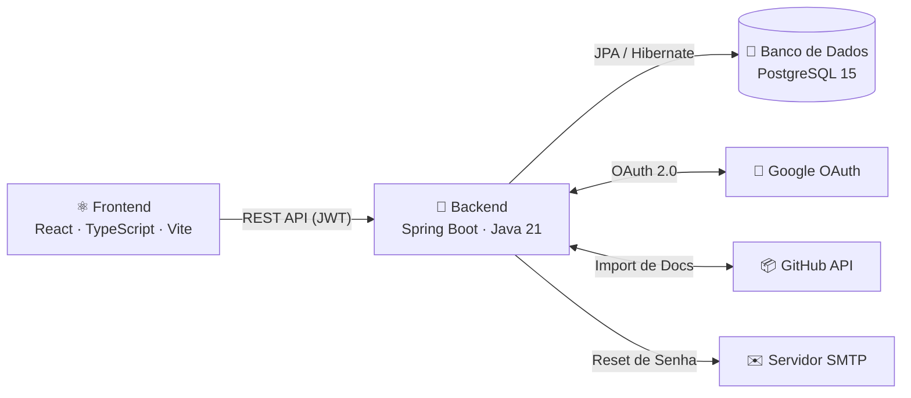
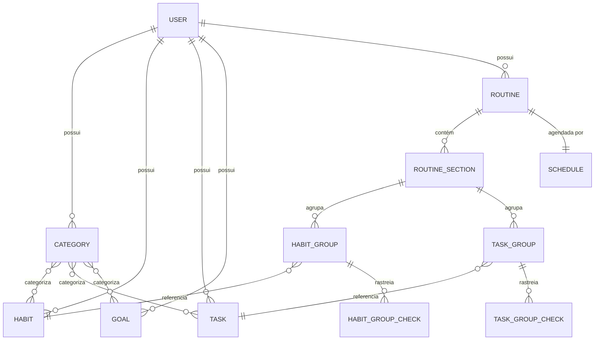
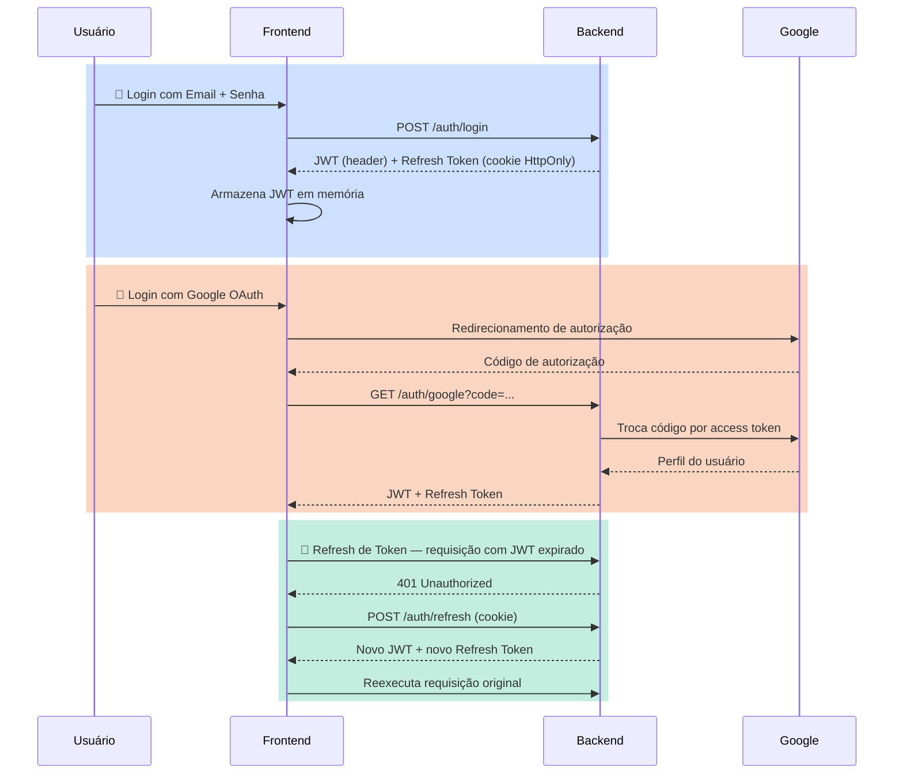
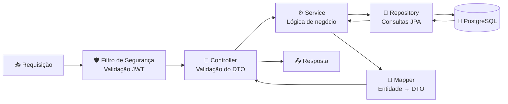
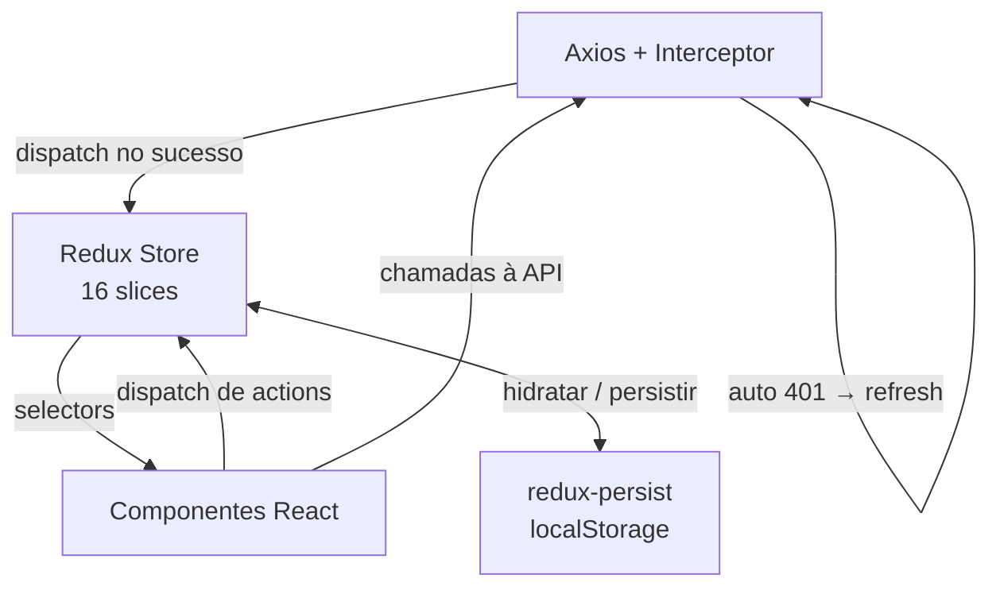
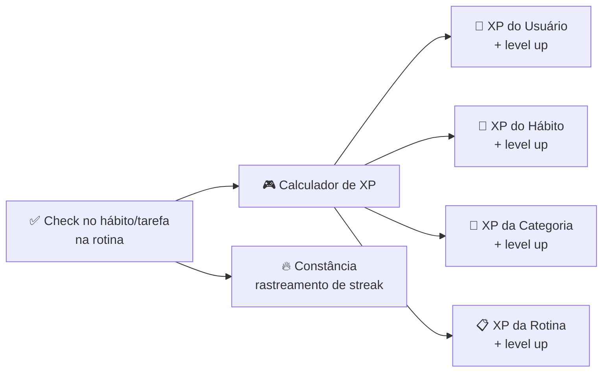
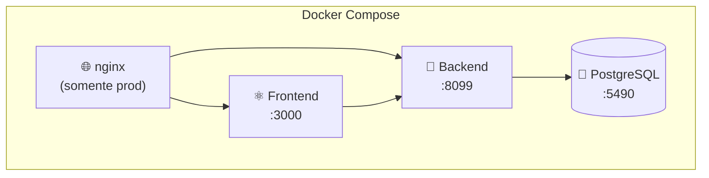

Este documento descreve a arquitetura geral da aplicação Beyou, cobrindo as camadas principais, fluxo de dados, modelo de domínio, autenticação e sistema de gamificação.

## Arquitetura do Sistema

## Stack Tecnológica

| Camada | Tecnologias |
|--------|-------------|
| **Frontend** | React 18, TypeScript, Vite, Redux Toolkit + redux-persist, Axios, react-hook-form + Zod, i18next (en/pt), Tailwind CSS 3 |
| **Backend** | Spring Boot 3.3, Java 21 (virtual threads), Spring Security, JWT (auth0 java-jwt), Undertow, Spring AOP, Lombok |
| **Banco de Dados** | PostgreSQL 15, Hibernate JPA, chaves primárias UUID, ddl-auto: update |
| **DevOps** | Docker Compose, nginx (prod), hot-reload (dev) |

## Modelo de Domínio

### Destaques das entidades

- **User** — perfil, preferências (tema, idioma, widgets) e progressão de XP embutida (level, xp, constância).
- **Category** — agrupa hábitos, tarefas e metas via ManyToMany. Possui seu próprio XP/level.
- **Habit** — comportamento rastreável com importância, dificuldade, frase motivacional e progressão de XP/level.
- **Task** — similar ao hábito, mas pode ser única (oneTimeTask) com soft-delete via markedToDelete.
- **Goal** — baseada em meta com currentValue / targetValue, status (ativa/completa/falha) e prazo (curto/longo/vida).
- **Routine** — base abstrata com tipo concreto DiaryRoutine. Contém seções com grupos de hábitos/tarefas.
- **Schedule** — dias da semana (segunda a domingo) vinculados a uma rotina.
- **Checks** — registros diários de check/skip para grupos de hábitos e tarefas dentro das rotinas, com rastreamento de XP gerado.

## Fluxo de Autenticação

### Detalhes dos tokens

- **Access token (JWT)** — 15 minutos, HMAC256, enviado no header Authorization: Bearer.
- **Refresh token** — 15 dias, token opaco com hash, cookie HttpOnly. Token antigo revogado no refresh.
- **Reset de senha** — token seguro via email, TTL de 30 min, cooldown de 5 min entre requisições. Todos os refresh tokens revogados após reset.

## Camada de API

14 controllers REST organizados por domínio:

| Grupo | Controllers | Caminhos base |
|-------|-----------|--------------|
| **Auth** | AuthenticationController | /auth/* |
| **Entidades principais** | CategoryController, HabitController, TaskController, GoalController | /category, /habit, /task, /goal |
| **Rotinas** | RoutineController, ScheduleController | /routine, /schedule |
| **Usuário** | UserController | /user |
| **Docs** | ArchitectureDocsController, DesignDocsController, ApiDocsController, ProjectDocsController, SearchDocsController, DocsImportController | /docs/* |

### Padrão de requisição/resposta

- DTOs de requisição validados com Jakarta Bean Validation (@NotBlank, @Size, @Email).
- Respostas mapeadas através de classes Mapper dedicadas (entidade → DTO de resposta).
- Handler global de exceções traduz erros em ApiErrorResponse padronizado com chaves de erro para i18n no frontend.

## Gerenciamento de Estado (Frontend)

### Slices principais

| Slice | Finalidade |
|-------|-----------|
| perfil | Perfil do usuário, XP, level, tema, idioma, constância |
| habits, tasks, goals, routines, categories | Listas de entidades |
| editHabit, editTask, editGoal, editRoutine, editCategory | Estado do modo edição |
| todayRoutine | Rotina agendada do dia para o dashboard |
| viewFilters | Preferências de ordenação/filtro por página |
| register, errorHandler | Estado de autenticação e erros |

## Sistema de Gamificação

- **XpProgress** é um componente embutido compartilhado por User, Category, Habit e Routine.
- XP é gerado quando um hábito ou tarefa é marcado como concluído dentro de uma rotina.
- A progressão de level segue uma tabela semeada de XP por level (XpByLevelSeeder).
- Constância (streak) rastreia dias consecutivos completados na entidade User.
- Goals concedem um xpReward fixo ao serem completadas.

## Infraestrutura

- **Modo dev** — up-dev.sh: hot-reload para frontend e backend, acesso direto às portas.
- **Modo prod** — up-prod.sh: proxy reverso nginx roteando /api → backend, / → frontend.
- **Reset** — reset-db.sh: limpa o volume de dados do PostgreSQL.
- Ambiente configurado via arquivo .env com secrets para JWT, Google OAuth, SMTP, CORS e import de docs.
