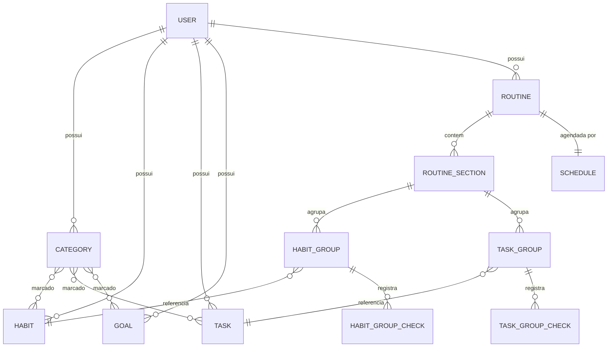
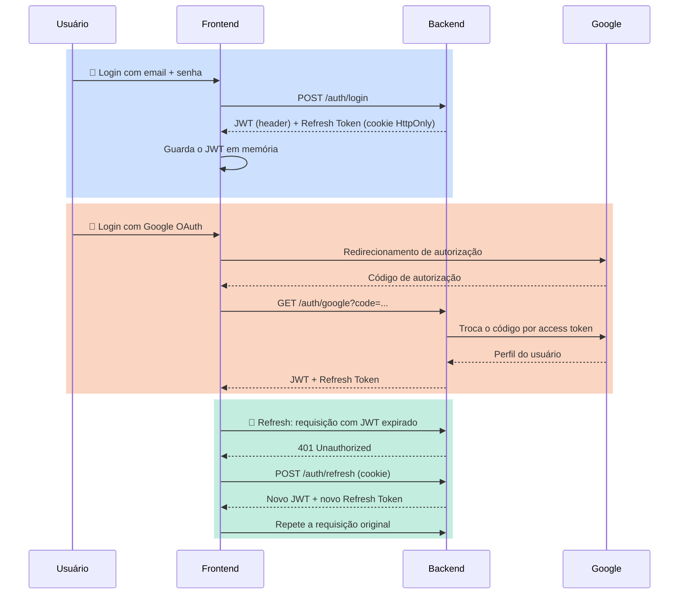
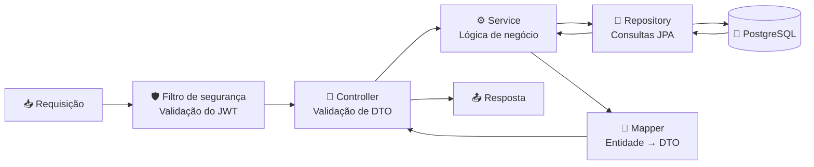
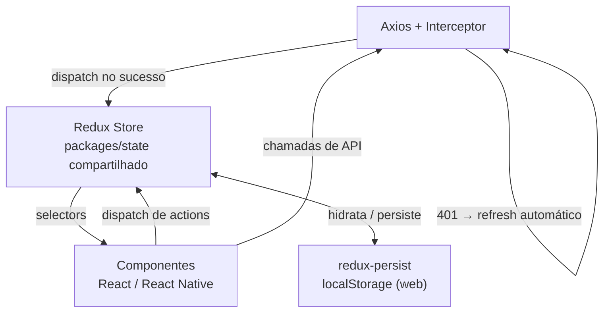
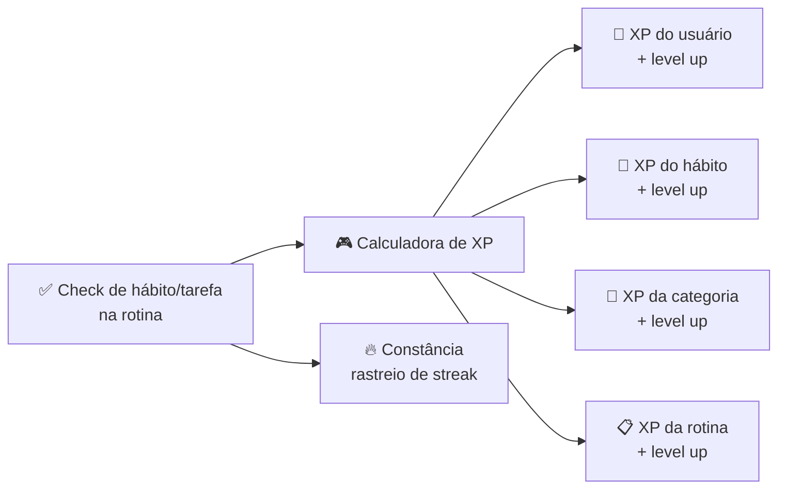

Este é o mapa do sistema como ele roda em produção: cada superfície de cliente, a API por trás delas, o banco de dados, como código novo chega ao servidor e como descobrimos quando algo quebra. O diagrama acima mostra o quadro completo; as seções abaixo percorrem cada peça.

## Stack tecnológica

| Camada | Tecnologias |
|--------|-------------|
| **Web app** | React 18, TypeScript, Vite, Redux Toolkit, Axios, react-hook-form + Zod, i18next (en/pt), Tailwind CSS 3 |
| **App mobile** | React Native + Expo (Android primeiro), NativeWind, TypeScript. Divide os pacotes de estado, cliente de API e i18n com o web app pelo monorepo |
| **Backend** | Spring Boot 4.1, Java 25 (virtual threads), Spring Security, JWT (auth0 java-jwt), Spring AOP, Spring AI para o chat do agente e as sugestões de onboarding (cadeia de fallback de LLMs) |
| **Banco de dados** | PostgreSQL 15, schema controlado pelo Flyway (o Hibernate valida, nunca escreve), chaves primárias UUID, cache Caffeine na frente das leituras quentes |
| **Entrega** | GitHub Actions constrói as imagens para o GHCR, o Watchtower as reimplanta; Docker Compose; nginx serve os builds do web e da documentação |
| **Monitoramento** | Prometheus, Grafana, Loki + Alloy, GlitchTip (compatível com Sentry) |

## Topologia de produção

O lado da aplicação são quatro containers, todos construídos pelo CI e publicados no GitHub Container Registry:

- **beyou-backend**: a API Spring Boot na porta 8099, tudo sob `/api/v1`.
- **beyou-web**: o build estático do web app, servido pelo nginx. Público em **app.beyouweb.com**.
- **beyou-docs**: este site de documentação, pré-renderizado em HTML estático e servido pelo nginx. Público em **docs.beyouweb.com**.
- **watchtower**: consulta o GHCR a cada cinco minutos e reinicia qualquer container cuja imagem mudou. Fazer merge na main é o deploy; o CI faz o resto.

Toda porta publicada escuta em 127.0.0.1. Os hostnames públicos chegam aos containers por um proxy reverso com TLS, então nada fica exposto diretamente. Duas peças vivem fora da stack do Compose: o site de marketing em **beyouweb.com** (HTML estático no Cloudflare Pages) e o app mobile, que é instalado no celular e fala com a mesma API do web app.

O conteúdo deste site de documentação tem seu próprio pipeline: o markdown e as specs OpenAPI vivem no repositório beyou-arch-design, o backend os importa para o PostgreSQL, e uma mudança de conteúdo dispara a reconstrução da imagem pré-renderizada.

## Monitoramento

Um único overlay do Compose carrega toda a stack de observabilidade, e é o mesmo arquivo em desenvolvimento e em produção. Cada componente responde uma pergunta diferente:

- O **Prometheus** responde "como está o desempenho?". Ele coleta o actuator do backend mais cAdvisor, node-exporter e postgres-exporter, então internos da JVM, recursos por container, o host e o banco ficam no mesmo painel.
- **Loki + Alloy** respondem "o que aconteceu?". O Alloy acompanha o stdout de cada container beyou* pela API do Docker e envia ao Loki. Os apps não precisam de nenhuma configuração de log, e os logs ficam guardados por 30 dias.
- O **GlitchTip** responde "o que quebrou?". O backend, o web app e o app mobile entregam erros a ele por SDKs do Sentry. Ele é público em **mnt.beyouweb.com** porque navegadores e celulares de verdade precisam alcançá-lo. Também roda os monitores de uptime e heartbeat, já que é a peça capaz de avisar um humano.

O Grafana fica em cima dos três, com quatro dashboards provisionados automaticamente: saúde da frota, internos da JVM do backend, o agente de IA e os logs. Ele vive em **obs.beyouweb.com**, atrás do próprio login. Esses dois são as únicas superfícies públicas de monitoramento; o resto do overlay (Prometheus, Loki, os exporters) fica em loopback e só é alcançável pelo Grafana.

## Modelo de domínio

```mermaid
erDiagram
  USER ||--o{ CATEGORY : possui
  USER ||--o{ HABIT : possui
  USER ||--o{ TASK : possui
  USER ||--o{ GOAL : possui
  USER ||--o{ ROUTINE : possui

  CATEGORY }o--o{ HABIT : marcado
  CATEGORY }o--o{ TASK : marcado
  CATEGORY }o--o{ GOAL : marcado

  ROUTINE ||--o{ ROUTINE_SECTION : contem
  ROUTINE ||--|| SCHEDULE : "agendada por"

  ROUTINE_SECTION ||--o{ HABIT_GROUP : agrupa
  ROUTINE_SECTION ||--o{ TASK_GROUP : agrupa

  HABIT_GROUP }o--|| HABIT : referencia
  TASK_GROUP }o--|| TASK : referencia

  HABIT_GROUP ||--o{ HABIT_GROUP_CHECK : registra
  TASK_GROUP ||--o{ TASK_GROUP_CHECK : registra
```

### Destaques das entidades

- **User**: perfil, preferências (tema, idioma, widgets) e progressão de XP embutida (level, xp, constância).
- **Category**: agrupa hábitos, tarefas e metas via ManyToMany. Tem XP/level próprios.
- **Habit**: comportamento rastreável com importância, dificuldade, frase motivacional e progressão de XP/level.
- **Task**: como um hábito, mas pode ser única (oneTimeTask) com soft-delete via markedToDelete.
- **Goal**: baseada em alvo com currentValue / targetValue, status (ativa/concluída/falhou) e prazo (curto/longo/vida).
- **Routine**: base abstrata com DiaryRoutine como tipo concreto. Contém seções com grupos de hábitos/tarefas.
- **Schedule**: dias da semana ligados a uma rotina.
- **Checks**: registros diários de check/skip para os grupos de hábitos e tarefas dentro das rotinas, com rastreio do XP gerado.
- **Snapshots de rotina**: uma cópia diária imutável de cada rotina, tirada por timezone por um scheduler, para que o histórico sobreviva a edições futuras da rotina.
- **Histórico de checks e XP**: registros por dia que sustentam os widgets de histórico e progresso do dashboard.
- **Feedback**: relatos de feedback dentro do app, entregues com screenshots opcionais e navegáveis por um admin.

## Fluxo de autenticação

```mermaid
sequenceDiagram
  participant U as Usuário
  participant FE as Frontend
  participant BE as Backend
  participant GO as Google

  rect rgba(59, 130, 246, 0.25)
  U->>FE: 🔑 Login com email + senha
  FE->>BE: POST /auth/login
  BE-->>FE: JWT (header) + Refresh Token (cookie HttpOnly)
  FE->>FE: Guarda o JWT em memória
  end

  rect rgba(234, 88, 12, 0.25)
  U->>FE: 🔐 Login com Google OAuth
  FE->>GO: Redirecionamento de autorização
  GO-->>FE: Código de autorização
  FE->>BE: GET /auth/google?code=...
  BE->>GO: Troca o código por access token
  GO-->>BE: Perfil do usuário
  BE-->>FE: JWT + Refresh Token
  end

  rect rgba(16, 185, 129, 0.25)
  FE->>BE: 🔄 Refresh: requisição com JWT expirado
  BE-->>FE: 401 Unauthorized
  FE->>BE: POST /auth/refresh (cookie)
  BE-->>FE: Novo JWT + novo Refresh Token
  FE->>BE: Repete a requisição original
  end
```

### Detalhes dos tokens

- **Access token (JWT)**: 15 minutos, HMAC256. As requisições o carregam em `Authorization: Bearer`; o backend entrega um novo no header de resposta `X-Access-Token`.
- **Refresh token**: 15 dias, token opaco com hash em cookie HttpOnly. O token antigo é revogado a cada refresh.
- **Verificação de e-mail**: contas novas confirmam o endereço por e-mail antes do primeiro login, e podem pedir outro link se o primeiro não chegar.
- **Redefinição de senha**: token seguro por e-mail, TTL de 15 minutos, 5 minutos de espera entre pedidos. Todos os refresh tokens são revogados na redefinição.
- **Exclusão de conta**: confirmada com um código de vida curta (TTL de 15 minutos) antes de qualquer remoção.

## Camada de API

24 controllers REST organizados por domínio, todos sob `/api/v1`:

| Grupo | Controllers | Caminhos base |
|-------|-------------|---------------|
| **Auth** | Authentication, AuthVerification | /auth/* |
| **Entidades principais** | Category, Habit, Task, Goal | /category, /habit, /task, /goal |
| **Rotinas** | Routine, Schedule, Snapshot | /routine, /schedule, /routine/snapshot |
| **Histórico** | CheckHistory, XpHistory | /check-history, /xp |
| **Usuário** | User, UserPhoto, UserExport | /user, /user/photo |
| **IA** | AiAgent, Onboarding | /ai/agent, /onboarding |
| **Feedback** | Feedback, FeedbackAdmin | /feedback, /feedback/admin |
| **Docs** | Architecture, Blog, Api, Project, Search, Import | /docs/* |

### Padrão de requisição/resposta

```mermaid
flowchart LR
  REQ["📥 Requisição"] --> FILT["🛡️ Filtro de segurança<br/>Validação do JWT"]
  FILT --> CTRL["🎯 Controller<br/>Validação de DTO"]
  CTRL --> SVC["⚙️ Service<br/>Lógica de negócio"]
  SVC --> REPO["💾 Repository<br/>Consultas JPA"]
  REPO --> DB[("🐘 PostgreSQL")]
  DB --> REPO
  REPO --> SVC
  SVC --> MAP["🔄 Mapper<br/>Entidade → DTO"]
  MAP --> CTRL
  CTRL --> RES["📤 Resposta"]
```

- Os DTOs de requisição são validados com Jakarta Bean Validation (@NotBlank, @Size, @Email).
- As respostas passam por classes Mapper dedicadas (entidade → DTO de resposta).
- Um handler global de exceções transforma erros em um ApiErrorResponse padronizado, com chaves de erro que os frontends traduzem via i18n.

## Gerenciamento de estado (frontend)

```mermaid
flowchart TD
  AX["Axios + Interceptor"]
  ST["Redux Store<br/>packages/state compartilhado"]
  PS["redux-persist<br/>localStorage (web)"]
  UI["Componentes<br/>React / React Native"]

  UI -->|"dispatch de actions"| ST
  ST -->|"selectors"| UI
  ST <-->|"hidrata / persiste"| PS
  UI -->|"chamadas de API"| AX
  AX -->|"dispatch no sucesso"| ST
  AX -->|"401 → refresh automático"| AX
```

Os slices do Redux vivem em um pacote compartilhado do workspace (`packages/state`, 17 slices), então o web e o mobile rodam a mesma lógica de estado. O web app o envolve com redux-persist, excluindo de propósito os slices de perfil e snapshot para que nenhum dado pessoal caia no localStorage. O app mobile adiciona uma camada offline (`packages/offline`) para leituras e escritas enfileiradas.

## Sistema de gamificação

```mermaid
flowchart LR
  ACT["✅ Check de hábito/tarefa<br/>na rotina"] --> XP["🎮 Calculadora de XP"]
  XP --> UXP["👤 XP do usuário<br/>+ level up"]
  XP --> HXP["💪 XP do hábito<br/>+ level up"]
  XP --> CXP["📂 XP da categoria<br/>+ level up"]
  XP --> RXP["📋 XP da rotina<br/>+ level up"]
  ACT --> STR["🔥 Constância<br/>rastreio de streak"]
```

- **XpProgress** é um componente embutível compartilhado por User, Category, Habit e Routine.
- O XP é gerado quando um hábito ou tarefa é marcado dentro de uma rotina.
- A progressão de level segue uma tabela semeada de XP por level (XpByLevelSeeder).
- A constância (streak) rastreia dias consecutivos completados na entidade User.
- Metas concedem um xpReward fixo ao serem concluídas.
