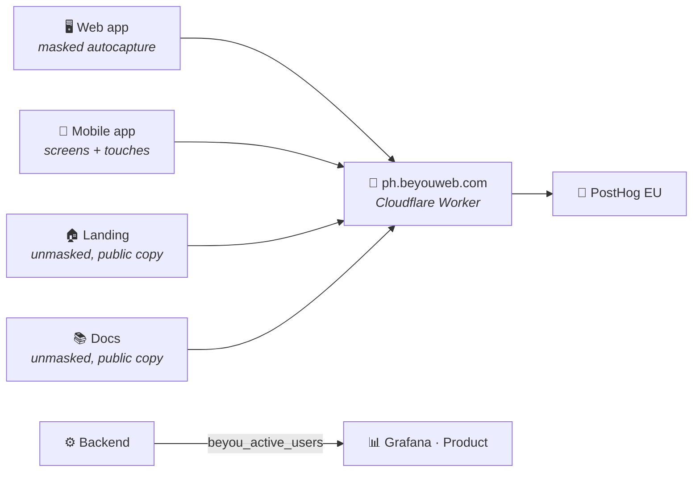

The [monitoring topic](/architecture/monitoring) answers "how is the system doing"; this layer answers "what are people doing in it". The split is intentional: infrastructure metrics stay in Prometheus and Grafana, product behavior goes to PostHog Cloud (EU region), and the one metric that straddles the line, how many users are on right now, lives on the backend as a Micrometer gauge, because concurrency is a property of the server rather than of any one browser.

## One project, four surfaces

Everything reports into a single PostHog project. The surfaces separate at query time, the three websites by `$host` and the mobile app by `$lib`, and four pinned dashboards (App, Landing, Docs, Mobile) plus the built-in Web Analytics page each lock onto one of them. One project instead of four because the interesting questions cross surfaces: the landing-to-app conversion funnel only works when both ends land in the same event stream. It works across subdomains because posthog-js sets its cookie on the registrable domain, so the anonymous visitor who read the landing is the same person who signs up a minute later.

The SDK never appears in feature code. `@beyou/api` exposes an `Analytics` seam (`identify` / `reset` / `track`) mirroring the logger seam, with a no-op default. The web app wires posthog-js into it at boot, the mobile app wires posthog-react-native, and shared code calls the seam without knowing which platform it is on. Every client is dormant by construction: without `VITE_POSTHOG_KEY` or `EXPO_PUBLIC_POSTHOG_KEY` at build time, `init()` is never called and nothing is ever sent, the same posture the error telemetry takes with its DSNs. The key is a public ingest identifier (it appears in every visitor's page source by definition), so it travels as a repo variable into the image and bundle builds, never as a secret, and never via the server's runtime env. Vite and Metro inline it when the artifact is built.

## Identity

`identify()` carries the account's opaque UUID, the display name, and a set of account-shape person properties. The UUID was added to the profile payload for this purpose. Before it, the only stable identity the frontend possessed was the email, and shipping emails to an analytics vendor is the line this stack does not cross — the name is the one deliberate exception, so that a person profile is recognizable at all.

The person properties are what make an audience expressible: level, XP, current and best streak, a streak *bucket*, whether the run is dormant, tutorial state, Google vs password account, timezone and its source, XP-decay strategy, language, theme, and the signup date. They are built by one function in `@beyou/api` and called from the two identify sites, because two hand-written lists would drift on the first field added.

Three of those deserve their reasons written down. The streak arrives both raw and bucketed, because a person property is overwritten on every identify and "users whose streak is 23" is not a population anyone wants — the buckets are the boundaries the engagement triggers act on. The signup date is a real column read off the profile rather than the vendor's own first-seen timestamp, because for every account older than the instrumentation those are different dates and only the backend knows the first one; the age in days is derived at report time, since a stored age is stale the moment it is written. And item counts are deliberately absent: they live in a different request than the profile, so reading them here would tie the builder to a load order it cannot see.

The call sites follow the same single-funnel philosophy the codebase uses elsewhere. On web, identify lives inside `hydratePerfil`, the one function every user-loading path (login, Google login, silent refresh, agent refresh, profile screen) already passes through, so a sixth path added later cannot forget it. On mobile it is an `AnalyticsSync` component watching the auth slice, the same pattern as ThemeSync. `reset()` fires on logout and account teardown, because an identity left on the device would merge the next account on that browser into the one that left.

## The event vocabulary

Events are named after the engagement trigger, never after the control that fired them. `check_recorded` is the thing a streak is made of; `dashboard_check_button_clicked` would be a fact about a button and would stop being true at the next redesign. The rule exists because the same concepts are about to be read twice — once here to measure a nudge, once on the backend to decide whether to send it — and a name that describes the UI cannot be shared with a scheduled job that has no UI.

The vocabulary is small on purpose: a check recorded, a level up, a streak milestone crossed, an item created (with its type), a goal completed, the tutorial finished, an agent message sent, and onboarding suggestions requested. Each one answers a question the engagement work actually asks.

Where each call lives follows the same single-funnel philosophy as identify. Checks, level-ups and milestones are tracked in `applyRefreshUi`, the one shared function both platforms pipe every accepted check through, so neither client tracks them separately. Item creation and goal completion sit in the `@beyou/api` call itself, again once for both platforms. The two conditions there are the interesting part: an `item_created` is suppressed when the response body carries a refusal, because these endpoints answer some failures in a 200 and counting those would put failed submissions into an activation funnel; and `check_recorded` requires a checked item or a refreshed habit in the payload, because goal actions come through the same refresh function and counting them as check-ins would inflate every completion rate in the product.

Two flags carry more weight than their size suggests. `retroactive` marks a check filled in for an earlier day — the behaviour the XP-decay window is meant to produce, so it has to be distinguishable from a same-day check for the nudge to ever be shown to have worked. It rides the same signal that suppresses the celebration, but the level-up and milestone events are *not* suppressed with it: hiding confetti on a backfilled day is a UI decision, and the level really did go up. And `skipped` separates a deliberate "not today" from a completion, since both keep a streak alive and a funnel that conflated them would read a week of skips as a week of progress.

The PII rule from the seam applies unchanged and is the reason several properties are shaped the way they are: no user-written content in any property, ever. So the agent event reports the length of the question and not the question, onboarding reports the step and not the context the user typed into it, and goal completion reports nothing at all, because everything that identifies a goal is the user's own words. When in doubt, the thing gets counted instead of named.

## What never leaves the browser

The app's autocapture runs with all element text and attributes masked, because the routine check-in control is labeled with the user's own habit name. One unmasked click event per check-in would ship user-written content, the same leak the error-telemetry breadcrumb scrubber closes on its side. Structure and coordinates survive, which is enough for heatmaps and per-element analysis; the words themselves stay on the device. The landing and docs run unmasked, because every string on those pages is public copy the site itself published, and element text is exactly what makes "which link do readers click" answerable.

Query strings are stripped from every URL-bearing property by a `before_send` hook, and this one was earned in production: the Google OAuth callback landed on `/?state=…&code=…` and the pageview captured it verbatim, single-use authorization code included. Reset-password and verify-email tokens ride query strings too. No query string on the app carries analytics value, so all of them are removed rather than allowlisted. The scrub is pinned by tests on the produced event rather than on the configuration, because pinning config is how a previous scrubber passed its tests while still leaking.

Session recording is not loaded on any surface. Heatmaps, web vitals, and dead-click capture are on; recordings are the easiest way to leak user content wholesale, and nothing asked so far needs them.

## The proxy, or how adblockers shaped the transport

The first real browsing session produced a puzzle: pageviews arrived, clicks never did. The browser was Brave, and privacy filter lists match on `*.posthog.com`. The first capture request slipped through and the batch endpoint everything else rides was blocked. Since 20 to 40% of web users run some blocker, that means a systematic undercount of exactly the engaged-user events that matter.

Capture therefore rides `ph.beyouweb.com`, a Cloudflare Worker (PostHog's own recipe) that forwards to EU ingest and serves the SDK's static assets edge-cached. A first-party origin is on nobody's filter list. The change had a second benefit: the landing page's one remaining third-party script load disappeared, since `array.js` now comes through the same origin. Clients point at the proxy through the same build-time variables as the key, plus `ui_host` so the PostHog toolbar still finds its home.

Two content-security-policy postures interact with this. The app's CSP is Report-Only and blocks nothing. The landing's is enforcing, with `default-src 'none'`, and it did exactly its job when analytics arrived: it silently killed both the SDK load and the capture requests until `script-src` and `connect-src` explicitly admitted the proxy origin. Anyone promoting the app's policy from Report-Only to enforcing must grant the same two directives, or the app goes exactly as silent as the landing did.

## The server-side half

Three product questions cannot be answered from a browser: how many users are on right now, the peak concurrency over a window, and login recency as ground truth independent of any vendor. The backend answers them with a Caffeine-backed sliding window feeding a `beyou_active_users` gauge, touched by the security filter on every authenticated request, so "active" means "made a real request in the last five minutes". Two database columns complete the picture: `last_login_at`, written at the single choke point every session-issuing path crosses, and `last_seen_at`, throttled to one write per user per window so read traffic does not become write traffic. The columns are left unmapped on the JPA entity on purpose. The User object is loaded on every request and saved by unrelated flows, and a mapped field would let a stale in-memory value overwrite a fresher one.

Grafana's Product dashboard reads both, the gauge from Prometheus and the columns (plus check-ins, XP, and AI usage from the domain tables) through a provisioned Postgres datasource. The at-a-glance numbers sit next to the infrastructure dashboards, and the deep behavioral questions stay in PostHog, one link away.

## Hygiene

Two test accounts are excluded through the project's test-account filters, checked by default on every new insight, so dashboards measure users rather than the people building the product. The known blind spot is written down instead of papered over: bot detection is PostHog's own (it reads `navigator.webdriver` and the user-agent brands) and events from headless browsers are silently dropped. Mobile delivery shares the same gate as mobile error telemetry: the code is ready, but delivery counts as proven only when a release build on a physical device shows up in the project.
