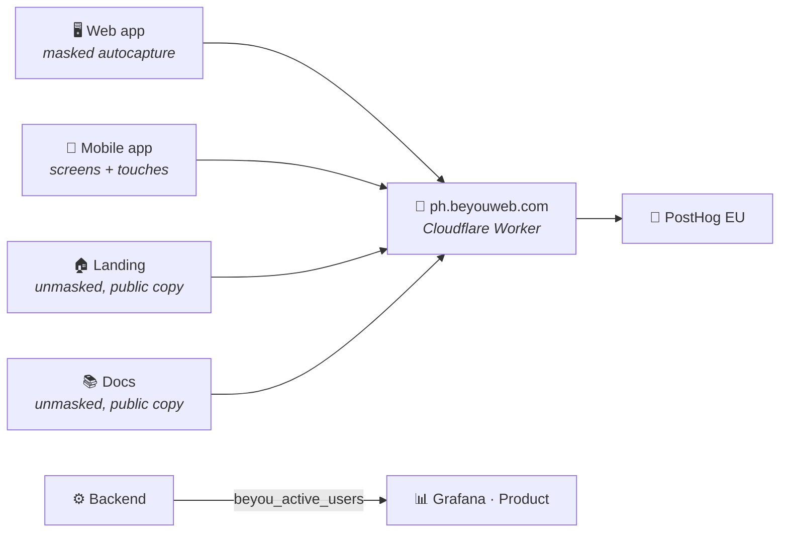

The [monitoring topic](/architecture/monitoring) answers "how is the system doing"; this layer answers "what are people doing in it". The split is deliberate: infrastructure metrics stay in Prometheus/Grafana, product behavior goes to PostHog Cloud (EU region), and the one metric that straddles the line — how many users are on right now — lives on the backend as a Micrometer gauge, because concurrency is a property of the server, not of any one browser.

## One project, four surfaces

Everything reports into a single PostHog project. The surfaces separate at query time — the three websites by `$host`, the mobile app by `$lib` — and four pinned dashboards (App, Landing, Docs, Mobile) plus the built-in Web Analytics page each lock onto one of them. One project instead of four because the interesting questions cross surfaces: the landing-to-app conversion funnel only works when both ends land in the same event stream, and it works across subdomains because posthog-js sets its cookie on the registrable domain, so the anonymous visitor who read the landing is the same person who signs up a minute later.

The SDK never appears in feature code. `@beyou/api` exposes an `Analytics` seam (`identify` / `reset` / `track`) mirroring the logger seam, with a no-op default; the web app wires posthog-js into it at boot, the mobile app wires posthog-react-native, and shared code calls the seam without knowing which platform it is on. Every client is dormant by construction: no `VITE_POSTHOG_KEY` / `EXPO_PUBLIC_POSTHOG_KEY` at build time means `init()` is never called and nothing is ever sent — the same posture the error telemetry takes with its DSNs. The key is a public ingest identifier (it ships in every visitor's page source by definition), so it travels as a repo *variable* into the image and bundle builds, never as a secret, and never via the server's runtime env — Vite and Metro inline it when the artifact is built.

## Identity

`identify()` carries exactly two things: the account's opaque UUID and the display name. The UUID was added to the profile payload for precisely this purpose — before it, the only stable identity the frontend possessed was the email, and shipping emails to an analytics vendor is the line this stack does not cross. The name is a deliberate, owner-approved exception so person profiles are recognizable in the PostHog UI; the email stays out everywhere.

The call sites follow the same single-funnel philosophy the codebase uses elsewhere. On web, identify lives inside `hydratePerfil` — the one function every user-loading path (login, Google login, silent refresh, agent refresh, profile screen) already passes through, so a sixth path added later cannot forget it. On mobile it is an `AnalyticsSync` component watching the auth slice, the same pattern as ThemeSync. `reset()` fires on logout and account teardown, because an identity left on the device would merge the next account on that browser into the departed one.

## What deliberately never leaves the browser

The app's autocapture runs with all element text and attributes masked. This is not caution for its own sake: the routine check-in control is labeled with the user's own habit name, so one unmasked click event per check-in would ship user-written content — the same leak the error-telemetry breadcrumb scrubber closes on its side. Structure and coordinates survive (enough for heatmaps and "which element" analysis); words do not. The landing and docs run unmasked, because every string on those pages is public copy the site itself published, and element text is exactly what makes "which link do readers click" answerable.

Query strings are stripped from every URL-bearing property by a `before_send` hook, and this one was earned in production: the Google OAuth callback landed on `/?state=…&code=…` and the pageview captured it verbatim, single-use authorization code included. Reset-password and verify-email tokens ride query strings too. No query string on the app carries analytics value, so they are all removed rather than allowlisted, and the scrub is pinned by tests on the produced event rather than on the configuration — pinning config is how a previous scrubber passed its tests while still leaking.

Session recording is not loaded on any surface. Heatmaps, web vitals, and dead-click capture are on; recordings are the easiest way to leak user content wholesale, and nothing currently asked needs them.

## The proxy, or how adblockers shaped the transport

The first real browsing session produced a puzzle: pageviews arrived, clicks never did. The browser was Brave, and privacy filter lists key on `*.posthog.com` — the first capture request slipped through, the batch endpoint everything else rides was blocked. Since 20–40% of web users run some blocker, that is not noise; it is a systematic undercount of exactly the engaged-user events that matter.

Capture therefore rides `ph.beyouweb.com`, a Cloudflare Worker (PostHog's own recipe) that forwards to EU ingest and serves the SDK's static assets edge-cached. A first-party origin is on nobody's filter list, and it had a second dividend: the landing page's one remaining third-party script load disappeared, since `array.js` now comes through the same origin. Clients point at the proxy through the same build-time variables as the key, plus `ui_host` so the PostHog toolbar still finds its home.

Two content-security-policy postures interact with this. The app's CSP is Report-Only and blocks nothing. The landing's is **enforcing** with `default-src 'none'` — and it did exactly its job when analytics arrived, silently killing both the SDK load and the capture requests until `script-src` and `connect-src` explicitly admitted the proxy origin. Anyone promoting the app's policy from Report-Only to enforcing must grant the same two directives, or the app goes exactly as silent as the landing did.

## The server-side half

Three product questions cannot be answered from a browser: how many users are on right now, the peak concurrency over a window, and login recency as ground truth independent of any vendor. The backend answers them with a Caffeine-backed sliding window feeding a `beyou_active_users` gauge (touched by the security filter on every authenticated request, so "active" means "made a real request in the last five minutes"), and two database columns — `last_login_at`, written at the single choke point every session-issuing path crosses, and `last_seen_at`, throttled to one write per user per window so read traffic does not become write traffic. The columns are deliberately unmapped on the JPA entity: the User object is loaded on every request and saved by unrelated flows, and a mapped field would let a stale in-memory value overwrite a fresher one.

Grafana's Product dashboard reads both — the gauge from Prometheus, the columns (plus check-ins, XP, and AI usage from the domain tables) through a provisioned Postgres datasource — so the at-a-glance numbers sit next to the infrastructure dashboards, and the deep behavioral questions stay in PostHog, one link away.

## Hygiene

Two test accounts are excluded through the project's test-account filters, checked by default on every new insight, so dashboards measure users rather than the people building the product. And the known blind spot is written down rather than papered over: bot detection is PostHog's own (it reads `navigator.webdriver` and the user-agent brands), events from headless browsers are silently dropped, and mobile delivery shares the same gate as mobile error telemetry — code-ready is not delivery-proven until a release build on a physical device shows up in the project.
