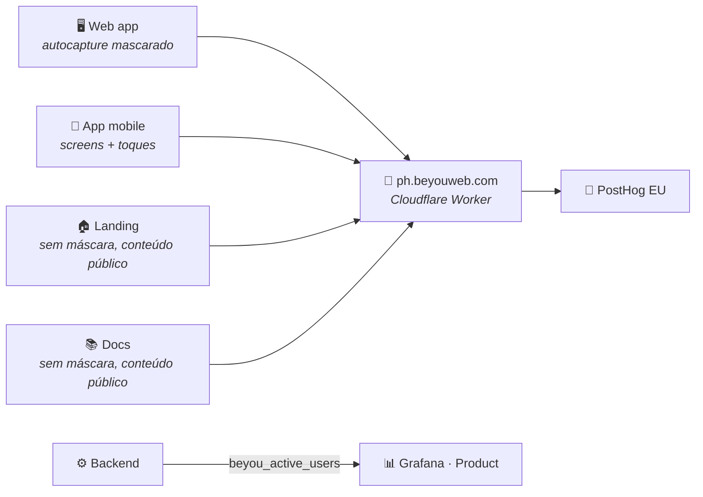

O [tópico de monitoring](/architecture/monitoring) responde "como o sistema está"; esta camada responde "o que as pessoas estão fazendo nele". A separação é intencional: métricas de infraestrutura ficam no Prometheus e no Grafana, comportamento de produto vai para o PostHog Cloud (região EU), e a única métrica que cruza a linha, quantos usuários estão online agora, vive no backend como um gauge do Micrometer, porque concorrência é uma propriedade do servidor e não de um browser individual.

## Um projeto, quatro superfícies

Tudo reporta para um único projeto PostHog. As superfícies se separam na hora da consulta, os três sites por `$host` e o app mobile por `$lib`, e quatro dashboards fixados (App, Landing, Docs, Mobile) mais a página nativa de Web Analytics travam cada um em uma delas. Um projeto em vez de quatro porque as perguntas interessantes cruzam superfícies: o funil de conversão landing→app só funciona quando as duas pontas caem no mesmo fluxo de eventos. Ele funciona entre subdomínios porque o posthog-js grava seu cookie no domínio registrável, então o visitante anônimo que leu a landing é a mesma pessoa que se cadastra um minuto depois.

O SDK nunca aparece em código de feature. O `@beyou/api` expõe um seam `Analytics` (`identify` / `reset` / `track`) espelhando o seam do logger, com default no-op. O web app pluga o posthog-js nele no boot, o mobile pluga o posthog-react-native, e código compartilhado chama o seam sem saber em que plataforma está. Todo cliente é dormente por construção: sem `VITE_POSTHOG_KEY` ou `EXPO_PUBLIC_POSTHOG_KEY` no build, o `init()` nunca é chamado e nada é enviado, a mesma postura que a telemetria de erros adota com seus DSNs. A chave é um identificador público de ingestão (ela aparece no código-fonte de qualquer visitante por definição), então viaja como variable de repositório para os builds de imagem e bundle, nunca como secret, e nunca pelo env de runtime do servidor. Vite e Metro a embutem quando o artefato é construído.

## Identidade

O `identify()` carrega exatamente duas coisas: o UUID opaco da conta e o nome de exibição. O UUID foi adicionado ao payload do perfil para isso. Antes dele, a única identidade estável que o frontend possuía era o email, e enviar emails para um vendor de analytics é a linha que esta stack não cruza.

Os pontos de chamada seguem a mesma filosofia de funil único que o código usa em outros lugares. Na web, o identify vive dentro do `hydratePerfil`, a única função por onde todo caminho de carregamento do usuário (login, login Google, refresh silencioso, refresh do agente, tela de perfil) já passa, então um sexto caminho adicionado depois não tem como esquecer. No mobile é um componente `AnalyticsSync` observando o slice de auth, o mesmo padrão do ThemeSync. O `reset()` dispara no logout e no teardown de conta, porque uma identidade deixada no dispositivo fundiria a próxima conta daquele browser com a que saiu.

## O que nunca sai do browser

O autocapture do app roda com todo texto e atributos de elementos mascarados, porque o controle de check-in de rotina é rotulado com o nome do hábito do próprio usuário. Um único evento de clique sem máscara por check-in enviaria conteúdo escrito pelo usuário, o mesmo vazamento que o scrubber de breadcrumbs da telemetria de erros fecha do lado dela. Estrutura e coordenadas sobrevivem, o que basta para heatmaps e análise por elemento; as palavras em si ficam no dispositivo. A landing e os docs rodam sem máscara, porque toda string dessas páginas é conteúdo público que o próprio site publicou, e o texto dos elementos é exatamente o que torna "em qual link os leitores clicam" respondível.

Query strings são removidas de toda propriedade que carrega URL por um hook `before_send`, e este foi ganho em produção: o callback OAuth do Google caía em `/?state=…&code=…` e o pageview capturava a URL literalmente, código de autorização de uso único incluído. Tokens de reset de senha e verificação de email também viajam em query strings. Nenhuma query string do app carrega valor analítico, então todas são removidas em vez de passar por allowlist. O scrub é fixado por testes sobre o evento produzido, e não sobre a configuração, porque fixar configuração foi como um scrubber anterior passou nos testes continuando a vazar.

Session recording não é carregado em nenhuma superfície. Heatmaps, web vitals e captura de dead clicks estão ligados; gravações são o jeito mais fácil de vazar conteúdo do usuário por atacado, e nada do que se perguntou até agora precisa delas.

## O proxy, ou como os adblockers moldaram o transporte

A primeira sessão real de navegação produziu um enigma: pageviews chegavam, cliques nunca. O browser era o Brave, e as listas de filtro de privacidade casam com `*.posthog.com`. A primeira requisição de captura escapava e o endpoint de batch em que todo o resto viaja era bloqueado. Como 20 a 40% dos usuários web rodam algum bloqueador, isso significa uma subcontagem sistemática exatamente dos eventos de usuário engajado que importam.

A captura viaja portanto por `ph.beyouweb.com`, um Cloudflare Worker (receita do próprio PostHog) que encaminha para a ingestão EU e serve os assets estáticos do SDK com cache de edge. Uma origem first-party não está em lista de filtro nenhuma. A mudança teve um segundo benefício: o único script third-party que restava na landing desapareceu, já que o `array.js` agora vem pela mesma origem. Os clientes apontam para o proxy pelas mesmas variáveis de build da chave, mais o `ui_host` para que a toolbar do PostHog ainda encontre sua casa.

Duas posturas de content-security-policy interagem com isso. O CSP do app é Report-Only e não bloqueia nada. O da landing é enforcing, com `default-src 'none'`, e fez exatamente seu trabalho quando o analytics chegou: matou em silêncio tanto o carregamento do SDK quanto as requisições de captura, até que `script-src` e `connect-src` admitissem explicitamente a origem do proxy. Quem promover a política do app de Report-Only para enforcing precisa conceder as mesmas duas diretivas, ou o app fica exatamente tão mudo quanto a landing ficou.

## A metade do lado do servidor

Três perguntas de produto não podem ser respondidas de um browser: quantos usuários estão online agora, o pico de concorrência numa janela, e a recência de login como verdade independente de qualquer vendor. O backend as responde com uma janela deslizante em Caffeine alimentando o gauge `beyou_active_users`, tocado pelo filtro de segurança em cada requisição autenticada, então "ativo" significa "fez uma requisição real nos últimos cinco minutos". Duas colunas no banco completam o quadro: `last_login_at`, escrita no único ponto de estrangulamento por onde todo caminho que emite sessão passa, e `last_seen_at`, limitada a uma escrita por usuário por janela para que tráfego de leitura não vire tráfego de escrita. As colunas ficam sem mapeamento na entidade JPA de propósito. O objeto User é carregado em toda requisição e salvo por fluxos não relacionados, e um campo mapeado deixaria um valor velho em memória sobrescrever um mais fresco.

O dashboard Product do Grafana lê os dois, o gauge do Prometheus e as colunas (mais check-ins, XP e uso de AI das tabelas de domínio) por um datasource Postgres provisionado. Os números de relance ficam ao lado dos dashboards de infraestrutura, e as perguntas comportamentais profundas ficam no PostHog, a um link de distância.

## Higiene

Duas contas de teste são excluídas pelos filtros de test-account do projeto, marcados por padrão em todo insight novo, para que os dashboards meçam usuários e não as pessoas construindo o produto. O ponto cego conhecido está escrito em vez de disfarçado: a detecção de bots é a do próprio PostHog (ela lê `navigator.webdriver` e as brands do user-agent) e eventos de browsers headless são descartados em silêncio. A entrega mobile compartilha o mesmo gate da telemetria de erros mobile: o código está pronto, mas a entrega só conta como comprovada quando um build de release num dispositivo físico aparecer no projeto.
