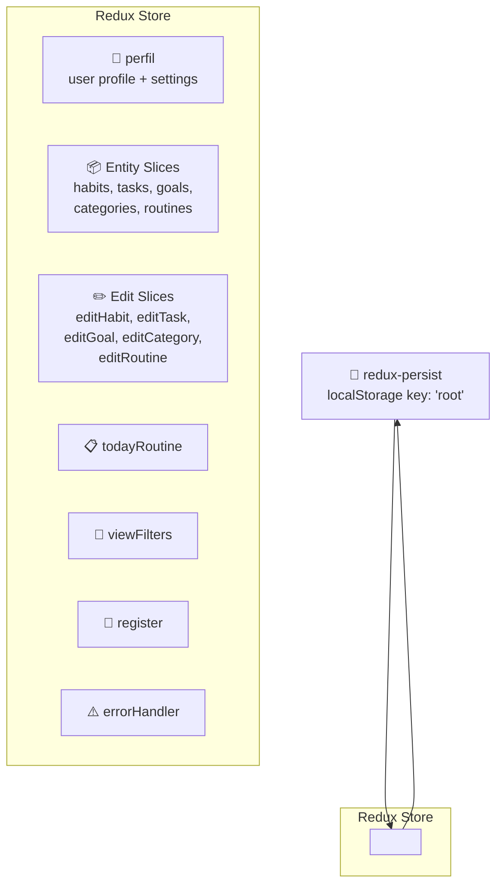
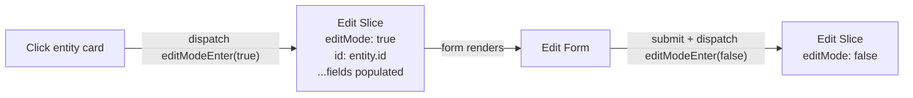
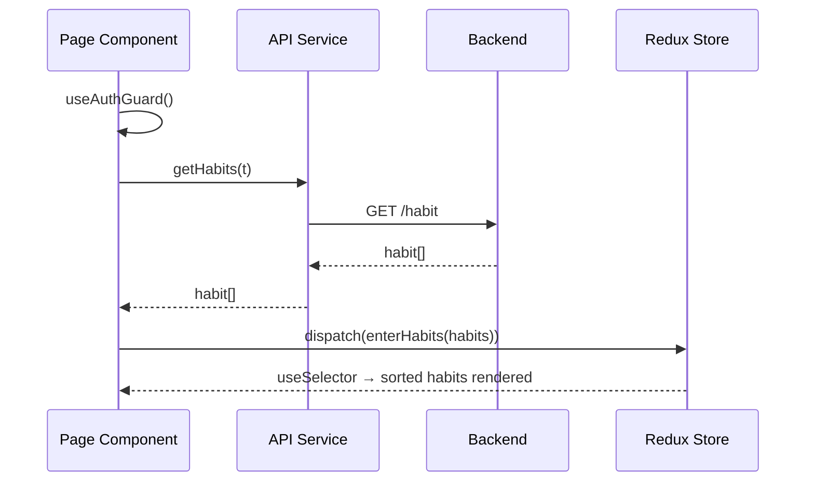
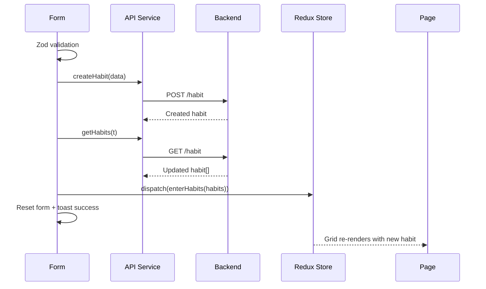
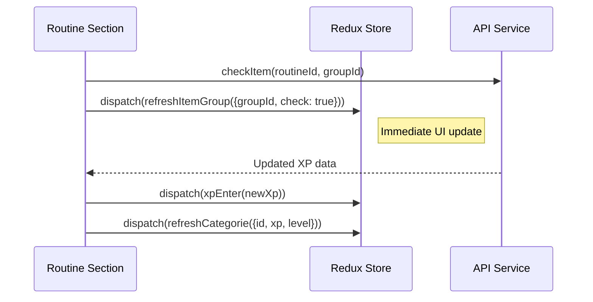
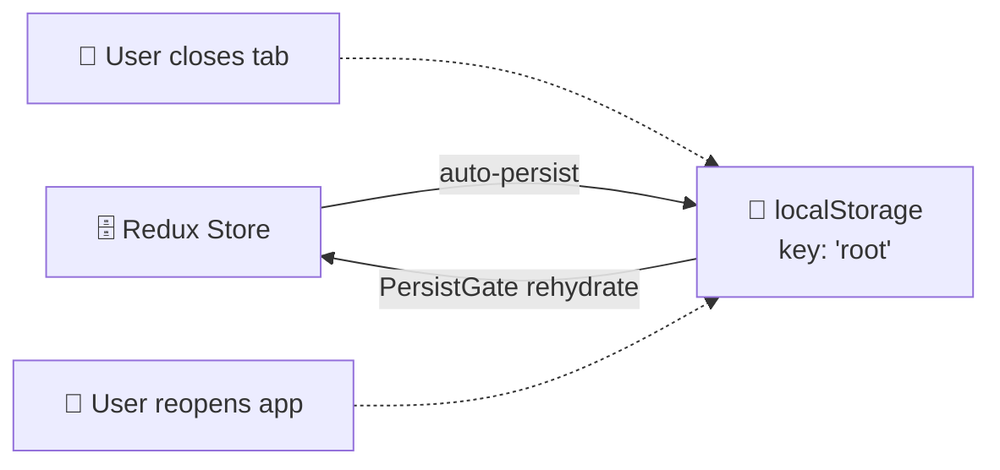

This document explains the complete Redux architecture in the Beyou frontend: how the store is configured, what each slice stores, how data flows between components and the API, and the patterns used for state updates.

## Store Architecture



### Configuration

- **Store:** configureStore from @reduxjs/toolkit
- **Persistence:** redux-persist with localStorage (key: "root")
- **Middleware:** serializableCheck ignores REGISTER, REHYDRATE, PERSIST actions (required for redux-persist)
- **Rehydration:** PersistGate wraps the app, loading null until state is restored from localStorage

This means the entire Redux state survives page refreshes. When a user closes and reopens the app, their profile, theme, language, and entity data are immediately available.

## All 16 Slices

### perfil — User Profile and Settings

The most important slice. Stores everything about the logged-in user.

| Field | Type | Purpose |
|-------|------|---------|
| username | string | Display name |
| email | string | User email |
| phrase / phrase_author | string | Motivational quote |
| photo | string | Profile photo URL |
| isGoogleAccount | boolean | OAuth flag |
| themeInUse | ThemeType | Current theme object (9 available themes) |
| languageInUse | string | Current language code (en/pt) |
| xp, level, nextLevelXp, actualLevelXp | number | Gamification state |
| constance, maxConstance | number | Streak tracking |
| widgetsIdsInUse | string[] | Active dashboard widgets |
| isTutorialCompleted | boolean | Onboarding flag |
| checkedItemsInScheduledRoutine | number | Today's progress numerator |
| totalItemsInScheduledRoutine | number | Today's progress denominator |

**18 actions** — one Enter action per field (e.g., nameEnter, themeInUseEnter, languageInUserEnter).

Populated after login with all user data from the backend response.

### Entity Collection Slices

Five slices that hold the lists of user entities:

| Slice | State | Actions |
|-------|-------|---------|
| **categories** | { categories: category[] } | enterCategories, updateCategorie, refreshCategorie |
| **habits** | { habits: habit[] } | enterHabits |
| **tasks** | { tasks: task[] } | enterTasks |
| **goals** | { goals: goal[] } | enterGoals, updateGoal |
| **routines** | { routines: Routine[] } | enterRoutines |

Categories and goals have extra update actions for partial state changes (XP refresh, goal progress).

### todayRoutine — Dashboard Routine

| Field | Type | Purpose |
|-------|------|---------|
| routine | Routine or null | Today's scheduled routine |

**Actions:**

- enterTodayRoutine — set today's routine from API
- refreshItemGroup({groupItemId, check}) — update a single check status without refetching

### Edit Mode Slices

Five slices that manage the "editing an entity" state. Each follows the same pattern:



| Slice | Entity-Specific Fields |
|-------|----------------------|
| editCategory | id, name, description, iconId, experience |
| editHabit | id, name, description, iconId, importance, difficulty, motivationalPhrase, experience, categoriesId |
| editTask | id, name, description, iconId, importance, difficulty, oneTimeTask, categoriesId |
| editGoal | id, name, description, iconId, targetValue, unit, currentValue, motivation, startDate, endDate, status, term, categoriesId |
| editRoutine | id, name, iconId, routineSections |

When a user clicks a card's edit button, the component dispatches multiple actions to populate every field of the edit slice. The edit form reads these values as defaults. On submit or cancel, editModeEnter(false) resets the mode.

### viewFilters — Sort Preferences

Stores the selected sort option for each feature page:

| Key | Default | Example Options |
|-----|---------|----------------|
| categories | "default" | name-asc, name-desc, level-desc, xp-desc |
| habits | "default" | name-asc, importance-desc, difficulty-desc, xp-desc |
| tasks | "default" | name-asc, name-desc, created-desc |
| goals | "default" | name-asc, progress-desc, xp-desc |
| routines | "default" | name-asc, name-desc |

**Action:** setViewSort({ view, sortBy }) — persisted across page navigations via redux-persist.

### register

| Field | Type | Purpose |
|-------|------|---------|
| successRegister | boolean | Signals successful registration |

Used to show a success message on the login page after registration.

### errorHandler

| Field | Type | Purpose |
|-------|------|---------|
| defaultError | string | Global error message |

Fallback error display for unexpected errors.

## Data Flow Patterns

### Pattern 1: Page Load (Fetch + Dispatch)



### Pattern 2: Create Entity



### Pattern 3: Edit Entity

```mermaid
sequenceDiagram
  participant BOX as Entity Card
  participant RDX as Redux Store
  participant FM as Edit Form
  participant API as API Service

  BOX->>RDX: dispatch(editModeEnter(true))
  BOX->>RDX: dispatch(idEnter(entity.id))
  BOX->>RDX: dispatch(nameEnter(entity.name))
  Note right of BOX: ...dispatch all fields
  RDX-->>FM: Edit form renders with values
  FM->>API: editHabit(id, data)
  FM->>RDX: dispatch(editModeEnter(false))
  FM->>API: getHabits(t) → refetch
  FM->>RDX: dispatch(enterHabits(habits))
```

### Pattern 4: Routine Check (Optimistic Update)



### Pattern 5: Login (Populate Everything)

After successful login, the frontend dispatches 15+ actions to populate the entire perfil slice with user data from the backend response:

nameEnter, emailEnter, phraseEnter, phraseAuthorEnter, constanceEnter, photoEnter, isGoogleAccountEnter, themeInUseEnter, languageInUserEnter, xpEnter, levelEnter, nextLevelXpEnter, actualLevelXpEnter, maxConstanceEnter, widgetsIdInUseEnter, tutorialCompletedEnter

## Persistence Strategy



**What is persisted:** Everything — all 16 slices, including entity lists, user profile, edit mode state, sort preferences, and tutorial progress.

**What this means:**

- Page refresh does not lose state
- User sees their data immediately on reopen (before any API call)
- Theme and language apply instantly (no flash of default theme)
- Sort preferences survive across sessions

**Trade-off:** Stale data is possible if the user has multiple devices. Each page refetches from the API on mount, so the persisted data is quickly replaced with fresh data.
