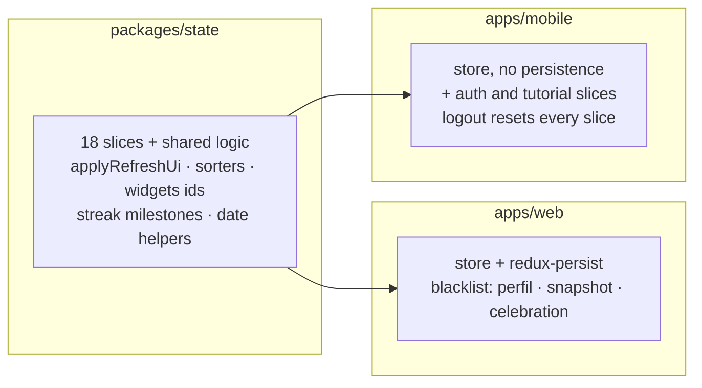
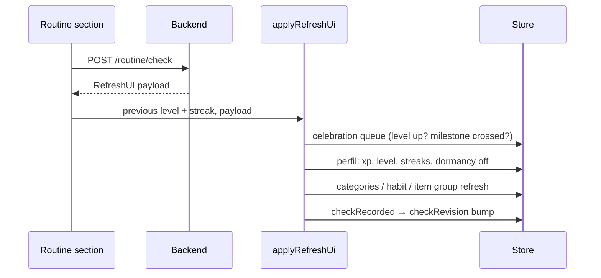

This document explains the state and data layer: where the slices live, what persists and what deliberately does not, how a check response fans out across the store, and how the HTTP client is structured so web and mobile share everything above the transport.

## One store definition, two apps

The slices live in the shared `packages/state`, and each app assembles its own store from them under identical reducer keys, so shared actions and selectors line up everywhere.

```mermaid
flowchart LR
  subgraph pkg["packages/state"]
    SLICES["18 slices + shared logic<br/>applyRefreshUi · sorters · widgets ids<br/>streak milestones · date helpers"]
  end

  subgraph web["apps/web"]
    WSTORE["store + redux-persist<br/>blacklist: perfil · snapshot · celebration"]
  end

  subgraph mobile["apps/mobile"]
    MSTORE["store, no persistence<br/>+ auth and tutorial slices<br/>logout resets every slice"]
  end

  SLICES --> WSTORE
  SLICES --> MSTORE
```

## The 18 slices

| Slice | Holds |
|-------|-------|
| perfil | The user: name, e-mail, photo, phrase, XP/level, streaks and dormancy, widgets, theme, language, timezone and its source, XP decay strategy, tutorial flag, checkRevision |
| categories / habits / tasks / goals / routines | The entity lists, each with its enter action and targeted refresh actions where checks update them in place |
| editCategory / editHabit / editTask / editGoal / editRoutine | Edit-mode drafts, populated field by field when a card's edit button is clicked |
| todayRoutine | Today's scheduled routine, with refreshItemGroup applying a check result without a refetch |
| snapshot | Historical routine snapshots by date, plus the selected date |
| celebration | A FIFO queue of pending celebrations (level-ups, streak milestones) |
| viewFilters | The per-page sort choice, hydrated through a key whitelist |
| focus | The Focus Mode: which state the screen is in, the selected item and whether the person chose it by hand, the pomodoro timer as an absolute end time plus its four editable lengths, and a per-item cache of the server's micro-tasks |
| register | One boolean for the post-registration success screen |
| errorHandler | One global error string |

The package's barrel is curated: action names that collide across slices are not re-exported and must be imported by deep path, and the profile slice's nameEnter is aliased to perfilNameEnter. That convention is what keeps eighteen slices from stepping on each other in two apps.

Beside the slices sit the shared plain functions both apps use: the gamification apply function, the streak milestone list, the widget id registry, sorting logic, date helpers, the auto-refresh policy, and the onboarding entity-creation helpers.

## Persistence, and what refuses to persist

The web store persists to localStorage with a deliberate blacklist:

| Excluded slice | Why |
|----------------|-----|
| perfil | Name, e-mail, and photo are PII and do not belong in localStorage; the profile re-hydrates from the API on every boot |
| snapshot | Routine history is PII by accumulation |
| celebration | Transient by definition: a queued level-up must not replay after a reload |

Everything else (entity lists, edit drafts, sort preferences) persists, so a reload paints instantly from local data while fresh data loads behind it.

The focus slice persists on purpose, and it is the one slice that made persistence VERSIONED. A pomodoro is a promise about the next 25 minutes, so its absolute end time has to survive a reload; but redux-persist's default reconciler replaces a stored slice wholesale rather than merging it into the reducer's initial state, so every field added to a persisted slice is `undefined` in every browser holding the previous shape — and the first render reads it before any reducer can repair it. The web store therefore carries a `version` and a migration table (`persistMigrations.ts`): each bump drops the stored focus slice and lets the reducer supply the current shape. The rule that came out of it is written next to the table: a field added to a persisted slice needs a version bump AND a tolerant read, and a test that hands the reducer the OLD shape on purpose is what catches the one you forget. The mobile app persists nothing: tokens live in the secure store, data refetches on mount, and its logout action resets every slice through the root reducer. On web, logout instead purges the persistor and hard-navigates, which discards the in-memory store wholesale.

## The check response: applyRefreshUi

The heart of the gamification flow is a shared plain function, deliberately not a thunk, so a bare dispatch works identically on web and React Native:

```mermaid
sequenceDiagram
  participant UI as Routine section
  participant BE as Backend
  participant AP as applyRefreshUi
  participant ST as Store

  UI->>BE: POST /routine/check
  BE-->>UI: RefreshUI payload
  UI->>AP: previous level + streak, payload
  AP->>ST: celebration queue (level up? milestone crossed?)
  AP->>ST: perfil: xp, level, streaks, dormancy off
  AP->>ST: categories / habit / item group refresh
  AP->>ST: checkRecorded → checkRevision bump
```

The order matters: the caller reads the previous level and streak from the store before applying, so the function can decide whether a celebration was earned. It force-clears the streak-dormancy flag (a run that just checked something cannot be dormant), and at the end it bumps a revision counter that day strips and heatmaps keep in their fetch dependencies, so today's square repaints without anyone refetching lists. Streak fields inside the payload are optional on purpose; readers fall back to existing values rather than zeroing, because category owners report zeros and older responses lack the fields.

## The HTTP layer

Two tiers, so everything above the transport is shared:

- **The interface** (`packages/api`): a deliberately narrow http client contract (get, post, put, delete; headers, params, timeout and nothing else, so no adapter can silently drop an option), a module-level singleton setter, a typed ApiError, and the agent SSE stream helper.
- **The web adapter**: axios behind that interface, plus the real axios instance where the interesting policy lives.

The axios instance policy, in order:

| Rule | Behavior |
|------|----------|
| Base | VITE_API_URL, credentials on |
| Refresh dedup | One module-level refresh promise: N concurrent 401s share a single refresh call, and the token is read from the X-Access-Token response header |
| Skip list | /auth/refresh, /auth/login, /auth/google pass through: they legitimately 401, and the auth screens name a throttle themselves rather than take a second toast on top |
| 429 | A translated rate-limit toast, for everything except the skip list and the agent stream, which do it at their own layer |
| 401, first time | Mark the request, refresh, write the token to the axios defaults and the retried request, replay |
| Refresh failed | Report the failure, hard-navigate to login, and reject with the original 401 rather than the refresh error, so an expired session is not misfiled as an unknown fault |

On boot, `useSilentRefresh` runs before the router mounts: it trades the httpOnly cookie for an access token, then re-fetches the profile and hydrates the perfil slice, which is necessary precisely because perfil is blacklisted from persistence. The agent's SSE stream rides raw fetch (axios buffers streams) but is configured with the same base URL, live auth header, and the same shared refresh function, so a stream 401 cannot race a second refresh. Riding outside axios also means it misses the interceptor above, so it reads the error key off the failure body itself — which is how a throttled chat says it was throttled instead of reporting a status nobody translated.
