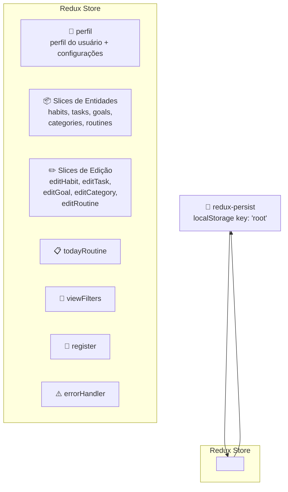
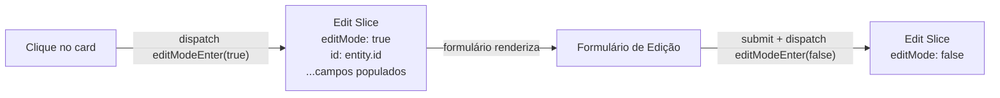
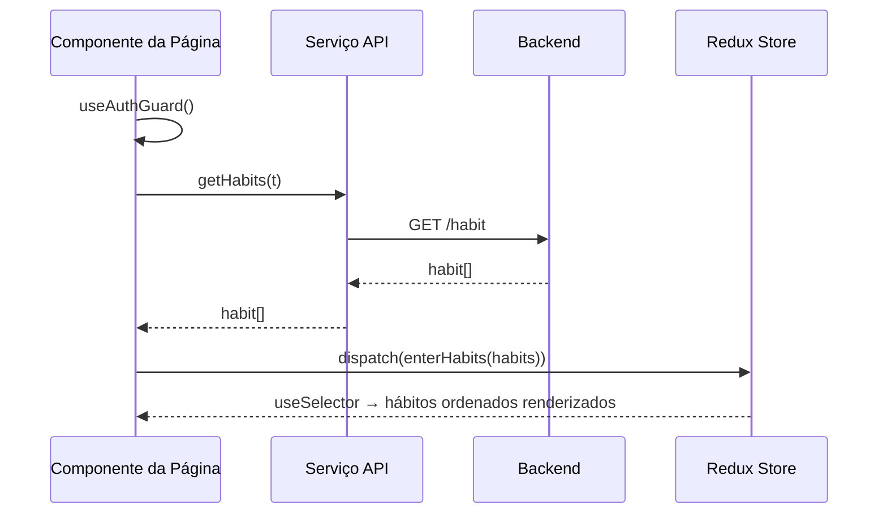
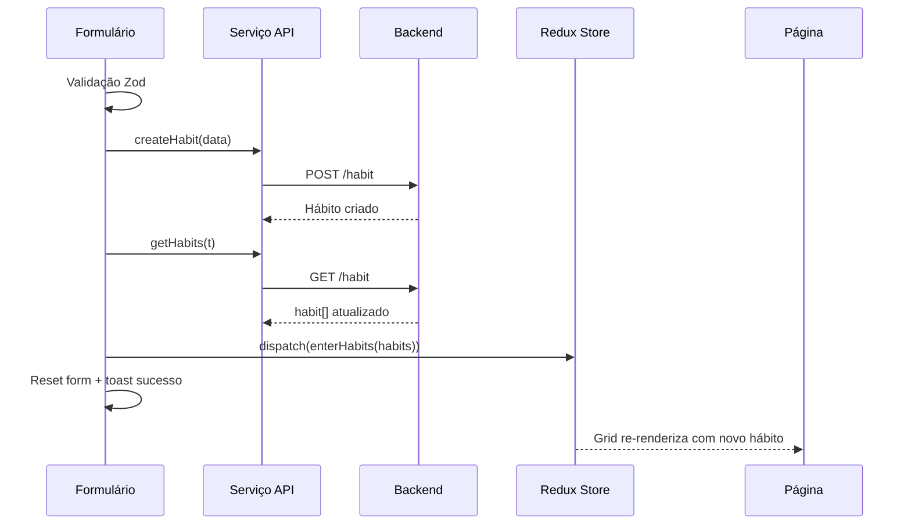
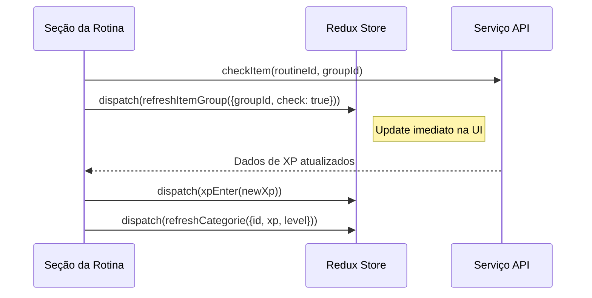
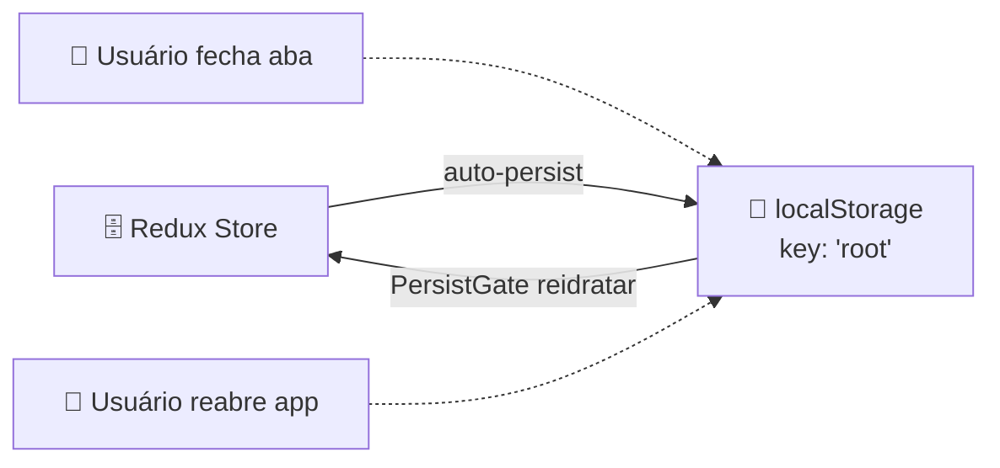

Este documento explica a arquitetura Redux completa no frontend Beyou: como o store é configurado, o que cada slice armazena, como os dados fluem entre componentes e a API, e os padrões usados para atualizações de estado.

## Arquitetura do Store



### Configuração

- **Store:** configureStore do @reduxjs/toolkit
- **Persistência:** redux-persist com localStorage (key: "root")
- **Middleware:** serializableCheck ignora ações REGISTER, REHYDRATE, PERSIST (necessário para redux-persist)
- **Reidratação:** PersistGate envolve o app, loading null até o estado ser restaurado do localStorage

Isso significa que todo o estado Redux sobrevive a refreshes de página. Quando o usuário fecha e reabre o app, perfil, tema, idioma e dados de entidades estão imediatamente disponíveis.

## Todos os 16 Slices

### perfil — Perfil e Configurações do Usuário

O slice mais importante. Armazena tudo sobre o usuário logado.

| Campo | Tipo | Propósito |
|-------|------|-----------|
| username | string | Nome de exibição |
| email | string | Email do usuário |
| phrase / phrase_author | string | Citação motivacional |
| photo | string | URL da foto de perfil |
| isGoogleAccount | boolean | Flag OAuth |
| themeInUse | ThemeType | Objeto do tema atual (9 temas disponíveis) |
| languageInUse | string | Código do idioma atual (en/pt) |
| xp, level, nextLevelXp, actualLevelXp | number | Estado de gamificação |
| constance, maxConstance | number | Rastreamento de streak |
| widgetsIdsInUse | string[] | Widgets ativos no dashboard |
| isTutorialCompleted | boolean | Flag de onboarding |
| checkedItemsInScheduledRoutine | number | Numerador do progresso de hoje |
| totalItemsInScheduledRoutine | number | Denominador do progresso de hoje |

**18 actions** — uma action Enter por campo (ex: nameEnter, themeInUseEnter, languageInUserEnter).

Populado após login com todos os dados do usuário da resposta do backend.

### Slices de Coleção de Entidades

Cinco slices que mantêm as listas de entidades do usuário:

| Slice | Estado | Actions |
|-------|--------|---------|
| **categories** | { categories: category[] } | enterCategories, updateCategorie, refreshCategorie |
| **habits** | { habits: habit[] } | enterHabits |
| **tasks** | { tasks: task[] } | enterTasks |
| **goals** | { goals: goal[] } | enterGoals, updateGoal |
| **routines** | { routines: Routine[] } | enterRoutines |

Categories e goals têm actions extras de update para mudanças parciais de estado (refresh de XP, progresso de meta).

### todayRoutine — Rotina do Dashboard

| Campo | Tipo | Propósito |
|-------|------|-----------|
| routine | Routine ou null | Rotina agendada para hoje |

**Actions:**

- enterTodayRoutine — define a rotina de hoje da API
- refreshItemGroup({groupItemId, check}) — atualiza um único status de check sem refetch

### Slices de Modo Edição

Cinco slices que gerenciam o estado de "editando uma entidade". Todos seguem o mesmo padrão:



Quando o usuário clica no botão editar de um card, o componente dispara múltiplas actions para popular cada campo do edit slice. O formulário de edição lê esses valores como padrões. No submit ou cancelamento, editModeEnter(false) reseta o modo.

### viewFilters — Preferências de Ordenação

Armazena a opção de ordenação selecionada para cada página de feature:

| Key | Padrão | Exemplos de Opções |
|-----|--------|-------------------|
| categories | "default" | name-asc, name-desc, level-desc, xp-desc |
| habits | "default" | name-asc, importance-desc, difficulty-desc, xp-desc |
| tasks | "default" | name-asc, name-desc, created-desc |
| goals | "default" | name-asc, progress-desc, xp-desc |
| routines | "default" | name-asc, name-desc |

**Action:** setViewSort({ view, sortBy }) — persistido entre navegações via redux-persist.

### register

| Campo | Tipo | Propósito |
|-------|------|-----------|
| successRegister | boolean | Sinaliza registro bem-sucedido |

Usado para mostrar mensagem de sucesso na página de login após registro.

### errorHandler

| Campo | Tipo | Propósito |
|-------|------|-----------|
| defaultError | string | Mensagem de erro global |

Exibição de erro fallback para erros inesperados.

## Padrões de Fluxo de Dados

### Padrão 1: Carregamento de Página (Fetch + Dispatch)



### Padrão 2: Criar Entidade



### Padrão 3: Editar Entidade

```mermaid
sequenceDiagram
  participant BOX as Card da Entidade
  participant RDX as Redux Store
  participant FM as Formulário de Edição
  participant API as Serviço API

  BOX->>RDX: dispatch(editModeEnter(true))
  BOX->>RDX: dispatch(idEnter(entity.id))
  BOX->>RDX: dispatch(nameEnter(entity.name))
  Note right of BOX: ...dispatch de todos os campos
  RDX-->>FM: Form de edição renderiza com valores
  FM->>API: editHabit(id, data)
  FM->>RDX: dispatch(editModeEnter(false))
  FM->>API: getHabits(t) → refetch
  FM->>RDX: dispatch(enterHabits(habits))
```

### Padrão 4: Check na Rotina (Update Otimista)



## Estratégia de Persistência



**O que é persistido:** Tudo — todos os 16 slices, incluindo listas de entidades, perfil de usuário, estado de modo edição, preferências de ordenação e progresso do tutorial.

**O que isso significa:**

- Refresh de página não perde estado
- Usuário vê seus dados imediatamente ao reabrir (antes de qualquer chamada API)
- Tema e idioma aplicam instantaneamente (sem flash do tema padrão)
- Preferências de ordenação sobrevivem entre sessões

**Trade-off:** Dados obsoletos são possíveis se o usuário tem múltiplos dispositivos. Cada página faz refetch da API no mount, então os dados persistidos são rapidamente substituídos por dados frescos.
