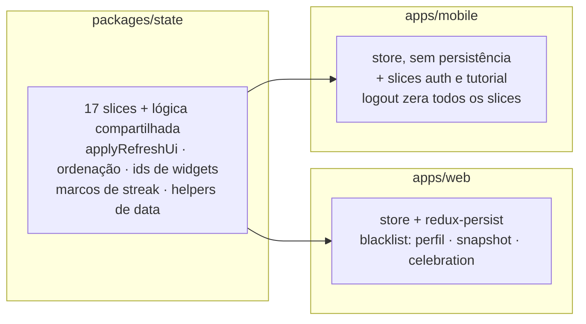
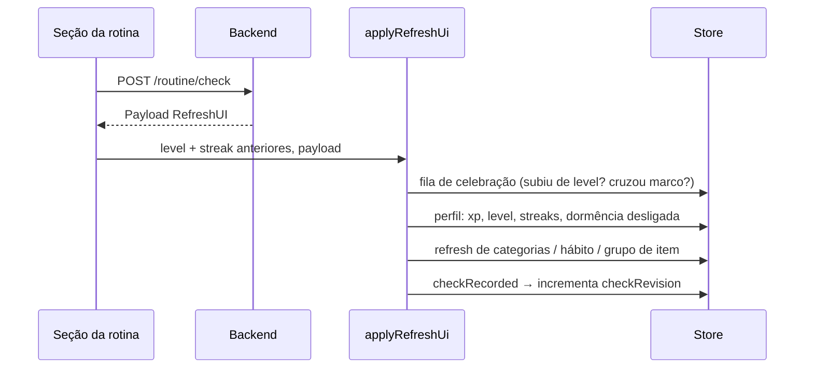

Este documento explica a camada de estado e dados: onde os slices vivem, o que persiste e o que deliberadamente não persiste, como a resposta de um check se espalha pela store e como o cliente HTTP é estruturado para web e mobile dividirem tudo acima do transporte.

## Uma definição de estado, dois apps

Os slices vivem no pacote compartilhado `packages/state`, e cada app monta a própria store com eles sob chaves de reducer idênticas, então actions e selectors compartilhados se alinham em todo lugar.

```mermaid
flowchart LR
  subgraph pkg["packages/state"]
    SLICES["17 slices + lógica compartilhada<br/>applyRefreshUi · ordenação · ids de widgets<br/>marcos de streak · helpers de data"]
  end

  subgraph web["apps/web"]
    WSTORE["store + redux-persist<br/>blacklist: perfil · snapshot · celebration"]
  end

  subgraph mobile["apps/mobile"]
    MSTORE["store, sem persistência<br/>+ slices auth e tutorial<br/>logout zera todos os slices"]
  end

  SLICES --> WSTORE
  SLICES --> MSTORE
```

## Os 17 slices

| Slice | Guarda |
|-------|--------|
| perfil | O usuário: nome, e-mail, foto, frase, XP/level, streaks e dormência, widgets, tema, idioma, timezone e sua origem, estratégia de decaimento de XP, flag do tutorial, checkRevision |
| categories / habits / tasks / goals / routines | As listas de entidades, cada uma com sua action de entrada e actions de refresh dirigido onde os checks as atualizam no lugar |
| editCategory / editHabit / editTask / editGoal / editRoutine | Rascunhos do modo de edição, populados campo a campo quando o botão de editar de um card é clicado |
| todayRoutine | A rotina agendada de hoje, com refreshItemGroup aplicando o resultado de um check sem rebuscar |
| snapshot | Snapshots históricos de rotina por data, mais a data selecionada |
| celebration | Uma fila FIFO de celebrações pendentes (level-ups, marcos de streak) |
| viewFilters | A ordenação escolhida por página, hidratada por uma whitelist de chaves |
| register | Um booleano para a tela de sucesso pós-cadastro |
| errorHandler | Uma string global de erro |

O barrel do pacote é curado: nomes de action que colidem entre slices não são re-exportados e precisam de import por caminho profundo, e o nameEnter do slice de perfil vira perfilNameEnter no barrel. Essa convenção é o que impede dezessete slices de pisarem uns nos outros em dois apps.

Ao lado dos slices ficam as funções puras que os dois apps usam: a aplicação de gamificação, a lista de marcos de streak, o registro de ids de widgets, a lógica de ordenação, helpers de data, a política de auto-refresh e os helpers de criação de entidades do onboarding.

## Persistência, e o que se recusa a persistir

A store do web persiste em localStorage com uma blacklist deliberada:

| Slice excluído | Por quê |
|----------------|---------|
| perfil | Nome, e-mail e foto são PII e não pertencem ao localStorage; o perfil re-hidrata da API a cada boot |
| snapshot | Histórico de rotina é PII por acúmulo |
| celebration | Transitório por definição: um level-up na fila não pode tocar de novo depois de um reload |

Todo o resto (listas de entidades, rascunhos de edição, preferências de ordenação) persiste, então um reload pinta na hora com dados locais enquanto dados frescos carregam por trás. O app mobile não persiste nada: tokens vivem no armazenamento seguro, dados rebuscam ao montar e o logout dele zera todos os slices pelo root reducer. No web, o logout purga o persistor e navega de forma dura, o que descarta a store em memória por inteiro.

## A resposta do check: applyRefreshUi

O coração do fluxo de gamificação é uma função pura compartilhada, deliberadamente não um thunk, para um dispatch simples funcionar igual no web e no React Native:

```mermaid
sequenceDiagram
  participant UI as Seção da rotina
  participant BE as Backend
  participant AP as applyRefreshUi
  participant ST as Store

  UI->>BE: POST /routine/check
  BE-->>UI: Payload RefreshUI
  UI->>AP: level + streak anteriores, payload
  AP->>ST: fila de celebração (subiu de level? cruzou marco?)
  AP->>ST: perfil: xp, level, streaks, dormência desligada
  AP->>ST: refresh de categorias / hábito / grupo de item
  AP->>ST: checkRecorded → incrementa checkRevision
```

A ordem importa: quem chama lê o level e o streak anteriores da store antes de aplicar, para a função decidir se uma celebração foi conquistada. Ela desliga à força a flag de dormência de streak (uma execução que acabou de marcar algo não pode estar dormente) e, ao final, incrementa um contador de revisão que as faixas de dias e os heatmaps mantêm nas dependências de busca, então o quadrado de hoje repinta sem ninguém rebuscar listas. Os campos de streak do payload são opcionais de propósito; leitores caem para os valores existentes em vez de zerar, porque donos de categoria reportam zeros e respostas antigas não têm os campos.

## A camada HTTP

Dois níveis, para tudo acima do transporte ser compartilhado:

- **A interface** (`packages/api`): um contrato de cliente http estreito de propósito (get, post, put, delete; headers, params, timeout e nada mais, para nenhum adaptador engolir uma opção em silêncio), um singleton de módulo, um ApiError tipado e o helper de stream SSE do agente.
- **O adaptador web**: axios atrás dessa interface, mais a instância axios real, onde vive a política interessante.

A política da instância axios, em ordem:

| Regra | Comportamento |
|-------|---------------|
| Base | VITE_API_URL, credenciais ligadas |
| Dedup de refresh | Uma promise de refresh no módulo: N 401s simultâneos dividem uma única chamada, e o token é lido do header de resposta X-Access-Token |
| Lista de exceção | /auth/refresh, /auth/login, /auth/google passam direto: eles dão 401 legitimamente |
| 429 | Um toast traduzido de limite de requisições |
| 401, primeira vez | Marca a requisição, faz refresh, escreve o token nos defaults do axios e na requisição repetida, repete |
| Refresh falhou | Reporta a falha, navega duro para o login e rejeita com o 401 original em vez do erro do refresh, para uma sessão expirada não ser arquivada como falha desconhecida |

No boot, o `useSilentRefresh` roda antes de o router montar: troca o cookie httpOnly por um access token, depois rebusca o perfil e hidrata o slice perfil, o que é necessário justamente porque o perfil está na blacklist da persistência. O stream SSE do agente anda sobre fetch cru (o axios bufferiza streams), mas é configurado com a mesma URL base, o header de auth vivo e a mesma função compartilhada de refresh, então um 401 no stream não corre contra um segundo refresh.
