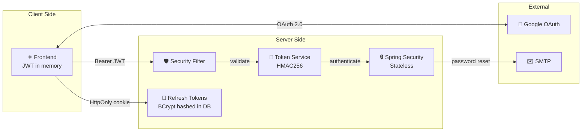
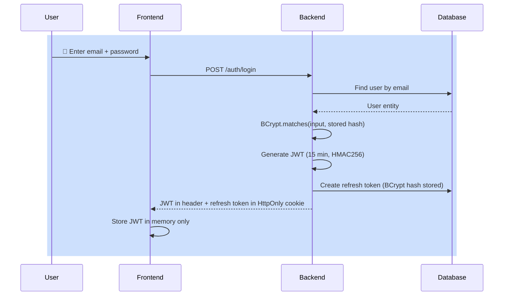
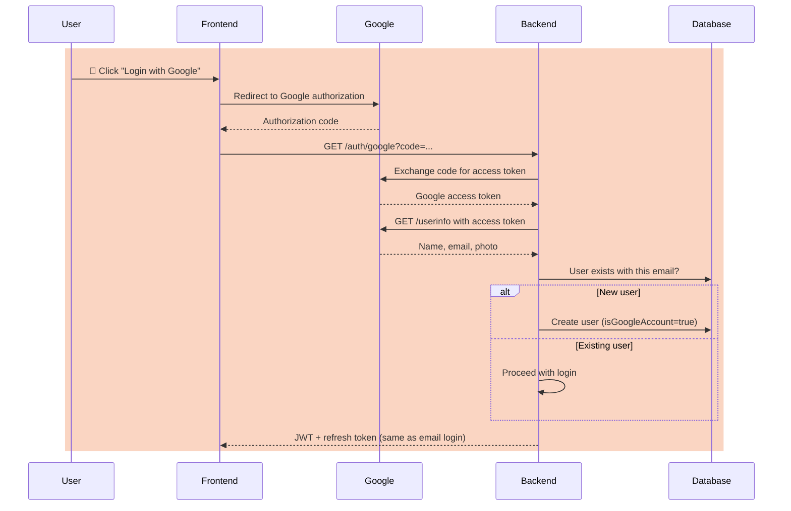
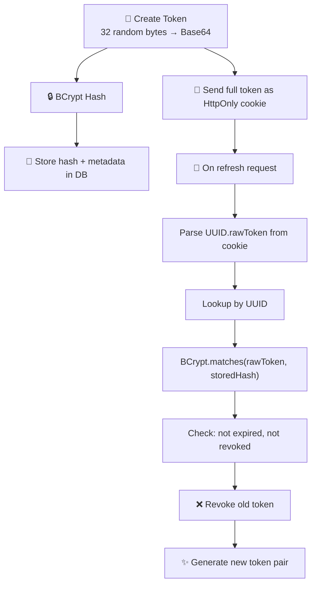
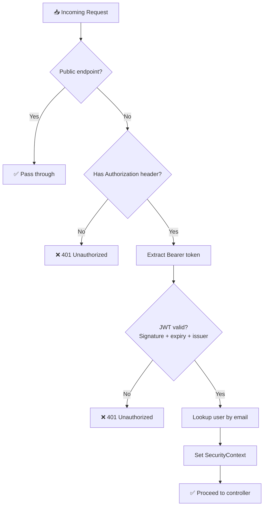
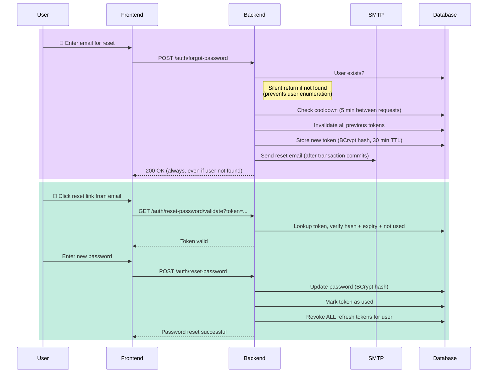
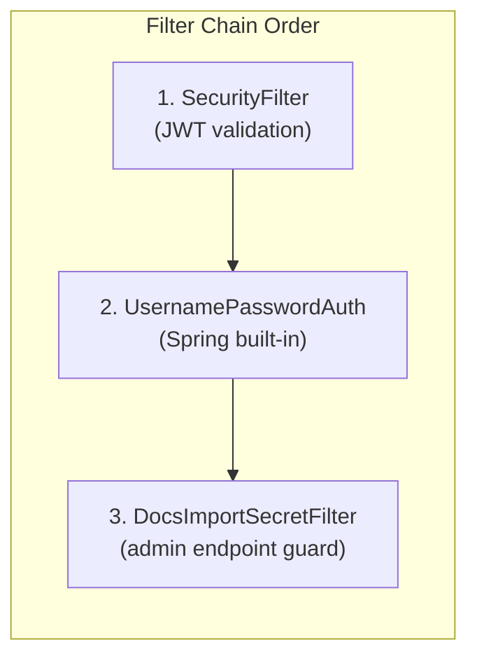

This document explains the full security architecture of Beyou — from how users log in to how every request is validated. It covers the mechanisms, the design decisions, what is secure, and what could be improved.

## Security at a Glance

**Key design decisions:**

- Stateless — no server-side sessions, no session fixation risk
- JWT access tokens (15 min) stored only in frontend memory — not in localStorage, not in cookies
- Refresh tokens (15 days) sent as HttpOnly cookies — invisible to JavaScript
- Refresh token rotation — every use generates a new token and revokes the old one
- BCrypt everywhere — passwords, refresh tokens, and password reset tokens are all hashed

## Authentication Endpoints

| Endpoint | Method | Auth Required | Purpose |
|----------|--------|---------------|---------|
| /auth/login | POST | No | Email + password login |
| /auth/register | POST | No | User registration |
| /auth/google | GET | No | Google OAuth code exchange |
| /auth/refresh | POST | No | Refresh expired JWT via cookie |
| /auth/logout | POST | No | Revoke refresh token |
| /auth/verify | GET | Yes | Check if session is valid |
| /auth/forgot-password | POST | No | Request password reset email |
| /auth/reset-password/validate | GET | No | Validate reset token |
| /auth/reset-password | POST | No | Reset password with token |

## How Login Works

### Email + Password

**What happens under the hood:**

1. The backend looks up the user by email
2. BCrypt compares the submitted password against the stored hash (constant-time, resists timing attacks)
3. If Google account, login is rejected (Google users must use OAuth)
4. A JWT access token is generated with the user's email as the subject
5. A refresh token is created — 32 random bytes, Base64 encoded, BCrypt hashed before storage
6. The response sends the JWT in the accessToken header and the refresh token as an HttpOnly cookie

### Google OAuth

**Key detail:** Google accounts have their password field set to a dummy value and cannot use email/password login or password reset. The system checks isGoogleAccount before allowing those flows.

## JWT Access Token

| Property | Value |
|----------|-------|
| Algorithm | HMAC256 |
| Library | Auth0 java-jwt |
| Expiration | 15 minutes |
| Issuer | "auth-api" |
| Subject | User email |
| Transport | Response header (accessToken), request header (Authorization: Bearer) |
| Storage | Frontend memory only |

**Why 15 minutes?** Short-lived tokens limit the damage window if a token is compromised. The user won't notice because the frontend automatically refreshes before expiration.

**Why HMAC256?** Symmetric signing is appropriate here because only the backend creates and validates tokens. There is no need for asymmetric keys (RSA/EC) since no third party verifies signatures.

## Refresh Token System

This is the most security-critical component. The refresh token allows the frontend to get new JWTs without re-entering credentials.

### Token format

The token sent to the client is: {UUID}.{Base64-encoded-random-bytes}

The database stores: the UUID (as primary key) + BCrypt hash of the random bytes + expiration + revocation timestamp.

This means:

- If the database leaks, attackers cannot use the hashed tokens
- Each refresh immediately revokes the previous token (rotation)
- Expired or revoked tokens are rejected even if the hash matches

### Cookie security attributes

| Attribute | Value | Why |
|-----------|-------|-----|
| httpOnly | true | JavaScript cannot access the cookie — prevents XSS token theft |
| secure | configurable (true in prod) | Cookie only sent over HTTPS |
| sameSite | Lax | Prevents cross-site request forgery for most attack vectors |
| path | / | Available to all backend paths |
| maxAge | 15 days | Matches token expiration |

## Request Validation (Security Filter)

Every request to a protected endpoint passes through the SecurityFilter — a OncePerRequestFilter that runs before Spring Security's built-in filters.

**Public endpoints (bypass filter):**

- /auth/login, /auth/register, /auth/refresh, /auth/google, /auth/logout
- /auth/forgot-password, /auth/reset-password/*
- /docs/* (non-admin docs)

**Protected endpoints (require valid JWT):**

- All other endpoints
- /docs/admin/* (additionally requires X-Docs-Import-Secret header)

## Password Reset

The password reset flow has multiple layers of protection against abuse.

### Protection mechanisms

| Mechanism | What it prevents |
|-----------|-----------------|
| Silent return for unknown emails | User enumeration — attackers can't discover which emails are registered |
| Silent return for Google accounts | Account type disclosure — doesn't reveal how users signed up |
| 5-minute cooldown between requests | Email flooding, brute force token generation |
| 30-minute token TTL | Limits attack window for intercepted reset emails |
| Previous tokens invalidated on new request | Prevents replay of older tokens |
| Token stored as BCrypt hash | Database leak doesn't expose usable tokens |
| All refresh tokens revoked on reset | Forces re-login on all devices after password change |
| Email sent after transaction commit | Ensures token exists in DB before user receives the link |

## CORS Configuration

| Setting | Value | Notes |
|---------|-------|-------|
| allowCredentials | true | Required for cookies in cross-origin requests |
| allowedOriginPattern | configurable | Must be specific in production (not wildcard) |
| allowedHeaders | * | All headers accepted |
| allowedMethods | GET, POST, PUT, DELETE | Standard REST methods |
| exposedHeaders | accessToken | Lets the frontend read the JWT from response headers |

**Important:** allowCredentials: true combined with a wildcard origin is rejected by browsers. The CORS pattern must match the actual frontend domain in production.

## Spring Security Configuration

- **Session policy:** STATELESS — no HttpSession created, no JSESSIONID cookie
- **CSRF:** Disabled — appropriate for stateless APIs where authentication is via headers, not cookies
- **Password encoder:** BCryptPasswordEncoder (default strength 10 rounds)

## Docs Import Protection

The /docs/admin/import endpoint is protected by a separate filter (DocsImportSecretFilter) that requires a shared secret in the X-Docs-Import-Secret header. This is used by the GitHub Actions pipeline or manual import triggers.

## Security Assessment

### What is done well

- **Token storage separation** — JWT in memory (not localStorage), refresh in HttpOnly cookie. This is the recommended pattern because XSS attacks cannot steal the refresh token, and the JWT's short lifetime limits exposure.
- **Refresh token rotation** — Every refresh creates a new token and revokes the old one. If an attacker steals a refresh token, the legitimate user's next refresh will invalidate it.
- **BCrypt everywhere** — Passwords, refresh tokens, and reset tokens are all BCrypt hashed. Database leaks expose nothing usable.
- **User enumeration prevention** — Password reset returns 200 regardless of whether the email exists or is a Google account.
- **Stateless architecture** — No session fixation, no session hijacking, no need for sticky sessions in load-balanced deployments.
- **Transaction-safe emails** — Reset emails are sent only after the token is committed to the database, preventing race conditions.

### What could be improved

| Area | Current State | Recommendation | Priority |
|------|--------------|----------------|----------|
| Login rate limiting | None | Add per-IP and per-account throttling (e.g., 5 attempts per minute) | High |
| Account lockout | None | Lock account after N consecutive failed attempts | High |
| Password complexity | Min 6 chars only | Add rules for uppercase, numbers, special characters | Medium |
| Registration protection | None | Add CAPTCHA or rate limiting to prevent spam | Medium |
| Refresh token binding | Not bound to device/IP | Consider binding to IP or user-agent fingerprint | Medium |
| 2FA/MFA | Not implemented | Add TOTP or email-based second factor | Medium |
| Audit logging | None | Log failed login attempts, token refreshes, password resets | Medium |
| CORS headers restriction | Allows all headers | Restrict to only the headers the frontend actually sends | Low |
| JWT algorithm validation | Implicit | Explicitly reject "none" algorithm in validation | Low |

### Threat model summary

| Threat | Mitigated? | How |
|--------|-----------|-----|
| Password theft from DB leak | Yes | BCrypt hashing |
| XSS stealing tokens | Mostly | JWT in memory (not localStorage), refresh in HttpOnly cookie |
| CSRF | Yes | Stateless + SameSite: Lax cookies |
| Token replay after rotation | Yes | Old refresh tokens are revoked |
| User enumeration via reset | Yes | Silent 200 response regardless |
| Session fixation | Yes | No sessions (stateless) |
| Brute force login | No | No rate limiting |
| Token theft across networks | Partial | Short JWT lifetime, but refresh token not bound to IP |
