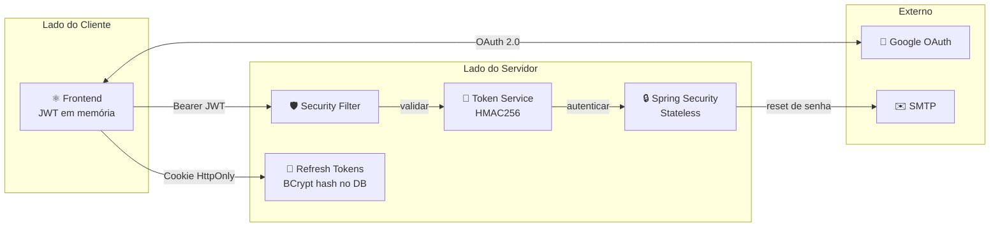
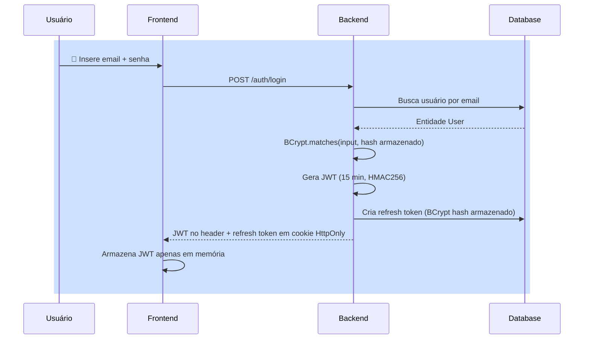
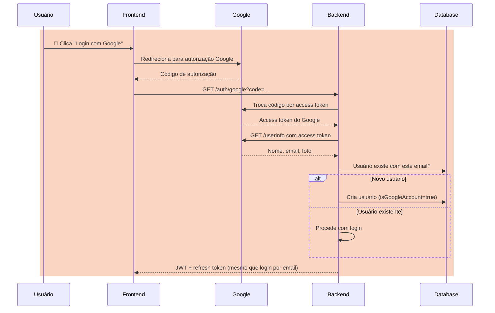
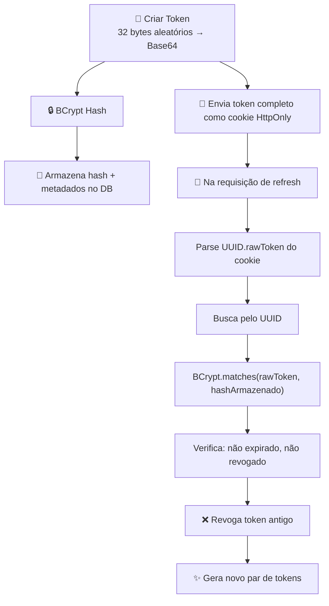
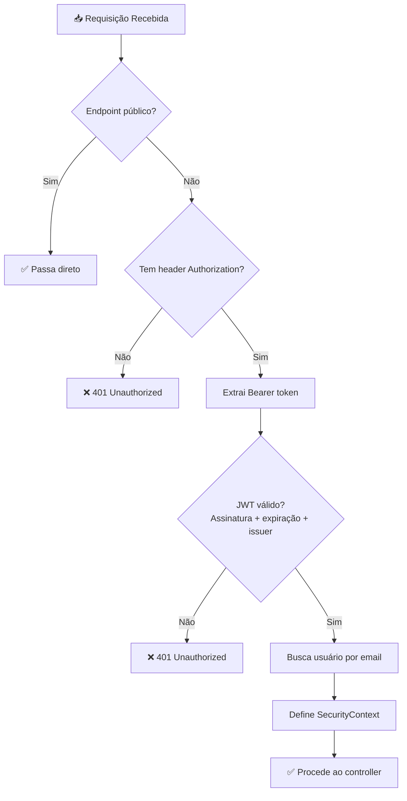
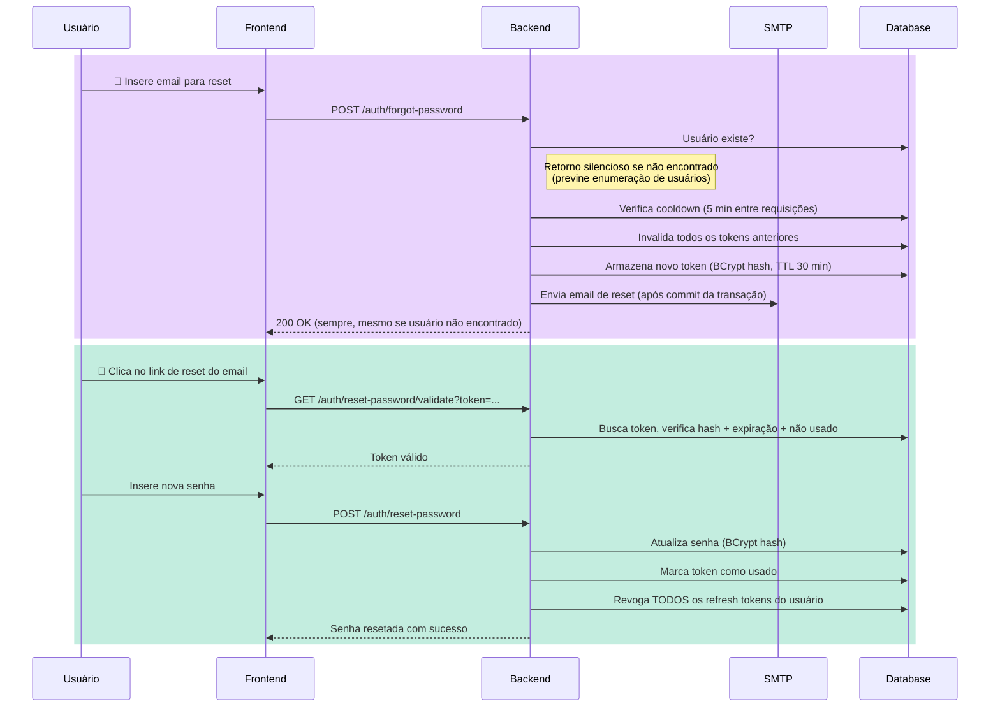
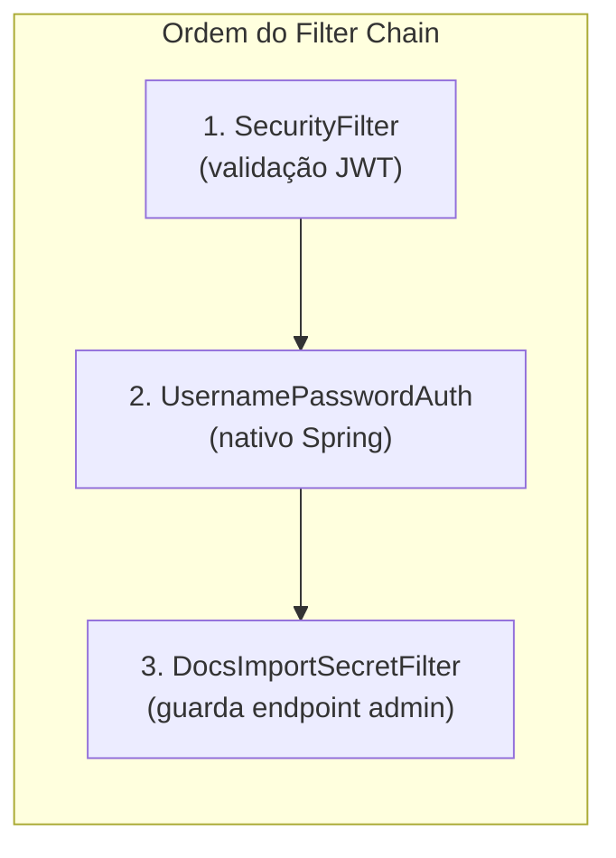

Este documento explica a arquitetura completa de segurança do Beyou — desde como os usuários fazem login até como cada requisição é validada. Cobre os mecanismos, as decisões de design, o que é seguro e o que pode ser melhorado.

## Segurança em Resumo

**Decisões de design principais:**

- Stateless — sem sessões no servidor, sem risco de session fixation
- JWT access tokens (15 min) armazenados apenas na memória do frontend — não no localStorage, não em cookies
- Refresh tokens (15 dias) enviados como cookies HttpOnly — invisíveis ao JavaScript
- Rotação de refresh token — cada uso gera um novo token e revoga o anterior
- BCrypt em tudo — senhas, refresh tokens e tokens de reset de senha são todos hashed

## Endpoints de Autenticação

| Endpoint | Método | Auth Necessário | Finalidade |
|----------|--------|----------------|-----------|
| /auth/login | POST | Não | Login com email + senha |
| /auth/register | POST | Não | Registro de usuário |
| /auth/google | GET | Não | Troca de código Google OAuth |
| /auth/refresh | POST | Não | Renovar JWT expirado via cookie |
| /auth/logout | POST | Não | Revogar refresh token |
| /auth/verify | GET | Sim | Verificar se a sessão é válida |
| /auth/forgot-password | POST | Não | Solicitar email de reset de senha |
| /auth/reset-password/validate | GET | Não | Validar token de reset |
| /auth/reset-password | POST | Não | Resetar senha com token |

## Como o Login Funciona

### Email + Senha

**O que acontece por baixo dos panos:**

1. O backend busca o usuário pelo email
2. BCrypt compara a senha enviada contra o hash armazenado (tempo constante, resiste a timing attacks)
3. Se for conta Google, o login é rejeitado (usuários Google devem usar OAuth)
4. Um JWT access token é gerado com o email do usuário como subject
5. Um refresh token é criado — 32 bytes aleatórios, Base64 encoded, BCrypt hash antes de armazenar
6. A resposta envia o JWT no header accessToken e o refresh token como cookie HttpOnly

### Google OAuth

**Detalhe importante:** Contas Google têm o campo de senha com um valor dummy e não podem usar login por email/senha ou reset de senha. O sistema verifica isGoogleAccount antes de permitir esses fluxos.

## JWT Access Token

| Propriedade | Valor |
|-------------|-------|
| Algoritmo | HMAC256 |
| Biblioteca | Auth0 java-jwt |
| Expiração | 15 minutos |
| Issuer | "auth-api" |
| Subject | Email do usuário |
| Transporte | Header de resposta (accessToken), header de requisição (Authorization: Bearer) |
| Armazenamento | Apenas memória do frontend |

**Por que 15 minutos?** Tokens de curta duração limitam a janela de dano se um token for comprometido. O usuário não percebe porque o frontend renova automaticamente antes da expiração.

**Por que HMAC256?** Assinatura simétrica é apropriada aqui porque apenas o backend cria e valida tokens. Não há necessidade de chaves assimétricas (RSA/EC) já que nenhum terceiro verifica as assinaturas.

## Sistema de Refresh Token

Este é o componente mais crítico de segurança. O refresh token permite que o frontend obtenha novos JWTs sem reinserir credenciais.

### Formato do token

O token enviado ao cliente é: {UUID}.{bytes-aleatórios-Base64}

O banco armazena: o UUID (como chave primária) + BCrypt hash dos bytes aleatórios + expiração + timestamp de revogação.

Isso significa:

- Se o banco vazar, atacantes não podem usar os tokens hashed
- Cada refresh revoga imediatamente o token anterior (rotação)
- Tokens expirados ou revogados são rejeitados mesmo se o hash bater

### Atributos de segurança do cookie

| Atributo | Valor | Por quê |
|----------|-------|---------|
| httpOnly | true | JavaScript não consegue acessar o cookie — previne roubo de token via XSS |
| secure | configurável (true em prod) | Cookie só enviado via HTTPS |
| sameSite | Lax | Previne cross-site request forgery na maioria dos vetores de ataque |
| path | / | Disponível para todos os caminhos do backend |
| maxAge | 15 dias | Corresponde à expiração do token |

## Validação de Requisições (Security Filter)

Toda requisição a um endpoint protegido passa pelo SecurityFilter — um OncePerRequestFilter que roda antes dos filtros nativos do Spring Security.

**Endpoints públicos (bypass do filtro):**

- /auth/login, /auth/register, /auth/refresh, /auth/google, /auth/logout
- /auth/forgot-password, /auth/reset-password/*
- /docs/* (docs não-admin)

**Endpoints protegidos (requerem JWT válido):**

- Todos os outros endpoints
- /docs/admin/* (adicionalmente requer header X-Docs-Import-Secret)

## Reset de Senha

O fluxo de reset de senha tem múltiplas camadas de proteção contra abuso.

### Mecanismos de proteção

| Mecanismo | O que previne |
|-----------|--------------|
| Retorno silencioso para emails desconhecidos | Enumeração de usuários — atacantes não descobrem quais emails estão cadastrados |
| Retorno silencioso para contas Google | Divulgação de tipo de conta — não revela como os usuários se cadastraram |
| Cooldown de 5 minutos entre requisições | Flooding de email, geração brute force de tokens |
| TTL de 30 minutos do token | Limita janela de ataque para emails de reset interceptados |
| Tokens anteriores invalidados ao solicitar novo | Previne replay de tokens antigos |
| Token armazenado como BCrypt hash | Vazamento do banco não expõe tokens utilizáveis |
| Todos os refresh tokens revogados no reset | Força re-login em todos os dispositivos após mudança de senha |
| Email enviado após commit da transação | Garante que o token existe no DB antes do usuário receber o link |

## Configuração CORS

| Configuração | Valor | Notas |
|-------------|-------|-------|
| allowCredentials | true | Necessário para cookies em requisições cross-origin |
| allowedOriginPattern | configurável | Deve ser específico em produção (não wildcard) |
| allowedHeaders | * | Todos os headers aceitos |
| allowedMethods | GET, POST, PUT, DELETE | Métodos REST padrão |
| exposedHeaders | accessToken | Permite o frontend ler o JWT dos headers de resposta |

**Importante:** allowCredentials: true combinado com origin wildcard é rejeitado pelos navegadores. O padrão CORS deve corresponder ao domínio real do frontend em produção.

## Configuração do Spring Security

- **Política de sessão:** STATELESS — nenhum HttpSession criado, nenhum cookie JSESSIONID
- **CSRF:** Desabilitado — apropriado para APIs stateless onde autenticação é via headers, não cookies
- **Password encoder:** BCryptPasswordEncoder (strength padrão 10 rounds)

## Proteção de Import de Docs

O endpoint /docs/admin/import é protegido por um filtro separado (DocsImportSecretFilter) que requer um secret compartilhado no header X-Docs-Import-Secret. Usado pelo pipeline do GitHub Actions ou triggers manuais de importação.

## Avaliação de Segurança

### O que é bem feito

- **Separação de armazenamento de tokens** — JWT em memória (não localStorage), refresh em cookie HttpOnly. Este é o padrão recomendado porque ataques XSS não conseguem roubar o refresh token, e a curta duração do JWT limita a exposição.
- **Rotação de refresh token** — Cada refresh cria um novo token e revoga o antigo. Se um atacante roubar um refresh token, o próximo refresh do usuário legítimo o invalidará.
- **BCrypt em tudo** — Senhas, refresh tokens e tokens de reset são todos hashed com BCrypt. Vazamentos do banco não expõem nada utilizável.
- **Prevenção de enumeração de usuários** — Reset de senha retorna 200 independente de o email existir ou ser conta Google.
- **Arquitetura stateless** — Sem session fixation, sem session hijacking, sem necessidade de sticky sessions em deploys com load balancer.
- **Emails transaction-safe** — Emails de reset são enviados somente após o token ser commitado no banco, prevenindo race conditions.

### O que pode ser melhorado

| Área | Estado Atual | Recomendação | Prioridade |
|------|-------------|--------------|-----------|
| Rate limiting de login | Nenhum | Adicionar throttling por IP e por conta (ex: 5 tentativas por minuto) | Alta |
| Bloqueio de conta | Nenhum | Bloquear conta após N tentativas consecutivas falhas | Alta |
| Complexidade de senha | Mín 6 caracteres apenas | Adicionar regras para maiúsculas, números, caracteres especiais | Média |
| Proteção de registro | Nenhuma | Adicionar CAPTCHA ou rate limiting para prevenir spam | Média |
| Binding de refresh token | Não vinculado a dispositivo/IP | Considerar vincular a IP ou fingerprint de user-agent | Média |
| 2FA/MFA | Não implementado | Adicionar TOTP ou segundo fator por email | Média |
| Audit logging | Nenhum | Registrar tentativas de login falhas, refreshes, resets de senha | Média |
| Restrição de headers CORS | Permite todos os headers | Restringir apenas aos headers que o frontend realmente envia | Baixa |
| Validação de algoritmo JWT | Implícita | Rejeitar explicitamente algoritmo "none" na validação | Baixa |

### Resumo do modelo de ameaças

| Ameaça | Mitigada? | Como |
|--------|----------|------|
| Roubo de senha via vazamento de DB | Sim | BCrypt hashing |
| XSS roubando tokens | Majoritariamente | JWT em memória (não localStorage), refresh em cookie HttpOnly |
| CSRF | Sim | Stateless + SameSite: Lax cookies |
| Replay de token após rotação | Sim | Refresh tokens antigos são revogados |
| Enumeração de usuários via reset | Sim | Resposta silenciosa 200 |
| Session fixation | Sim | Sem sessões (stateless) |
| Brute force login | Não | Sem rate limiting |
| Roubo de token entre redes | Parcial | JWT de curta duração, mas refresh token não vinculado a IP |
