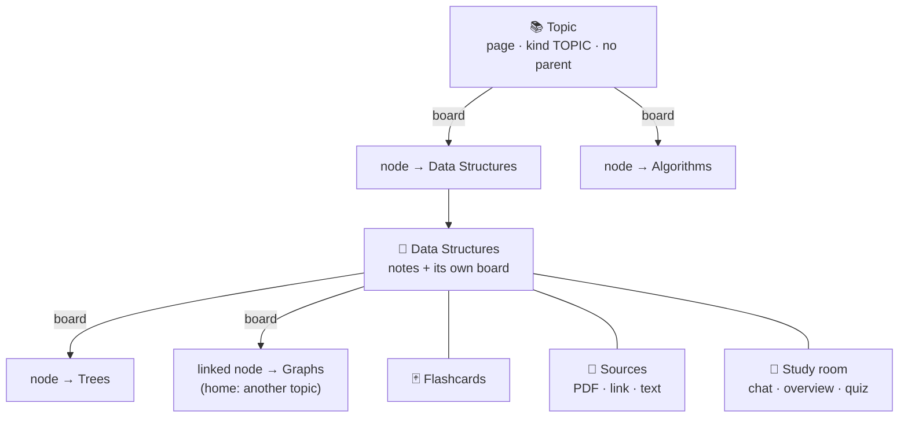

The study notebook is where somebody organises a subject they are learning. They open a topic, say "Software Engineering", and lay it out as a roadmap board. Each node on that board opens a page for notes, and the page can hold a board of its own, so "Data Structures" breaks down into trees and heaps without leaving the notebook. PDFs, web pages and pasted text attach to pages as sources, and a study AI answers from them with citations. Flashcards written on a page come back on a schedule.

This document covers the model, the rules and the class each rule lives in, then the choices that shaped the two clients. The routes themselves are in the Study Notebook Controller API.

## Everything is a page

A topic is a page with `kind = TOPIC` and no parent. Every other page has `kind = PAGE` and exactly one home: `parent_id` places it in the tree and `topic_id` names its topic, stored on the row so a whole topic loads in one indexed read. A CHECK constraint in V34 refuses any row that breaks that shape, which means a page without a topic cannot exist even if a service builds one by mistake.

The notes are a BlockNote document stored as a JSON string in `content`. Next to it sits `content_text`, the plain text `BlockText` extracts on the server on every save. The study AI reads that text and the account export ships it. Clients never send it, since a client could send any text it liked next to the document, and deriving it on the server keeps the two in agreement. `BlockText` walks the JSON by structure and ignores block types, so a block the editor gains later is still read.

A page or topic can carry an `icon`, an `@beyou/icons` id chosen from the page header with the same picker categories and habits use. It shows wherever the page does: the tree, board nodes, the home's cards and the mobile page screen, with the topic or page default when there is none. A rename or a new icon is written into all of those at once by `applyPageDetails` in `@beyou/state`, the same fan-out `applyStatuses` does for status.

A page row has more than one writer, and they load it at different moments. The autosave is one. A status that moves because a node below finished is another. `NotebookPage` is `@DynamicUpdate`, so each UPDATE carries only the columns that request changed, and a status change can no longer write back a document it loaded before the autosave committed. Opening a page records `last_opened_at` through an UPDATE query that never loads the row dirty, since the page screen repeats that read while the person types. The e2e suite found this one, and `NotebookConcurrentWritesIT` replays the interleavings.

## One board per page

A board belongs to the page that shows it. Its rows in `notebook_board_nodes` and `notebook_board_edges` are keyed by `board_page_id`, so a page has one board at most. The editor's "Roadmap board" block (`roadmapBoard`, the constant `MarkdownBlocks.BOARD_BLOCK_TYPE`) only says where on the page to draw it. Deleting the block hides the board and deletes no node.

A node is one of these:

- A PAGE node added by title. The server creates a child page of the board's page and the node opens it. This is the ordinary case.
- A PAGE node added with `linkPageId`, which opens a page that lives somewhere else, usually in another topic. That page keeps its one home and its one status, and the node becomes a second way in. This is why a node has its own `page_id` column and does not reuse the tree.
- A SECTION, a labelled band with a width and a height that groups the nodes drawn over it.

`NotebookBoardService` refuses two kinds of link. A page shows up on a given board once, enforced by `UNIQUE (board_page_id, page_id)` and reported as `NOTEBOOK_NODE_DUPLICATE`. A page that can already reach the board's page by walking boards downward would put that page on its own board, and `ProgressGraph.reaches` catches it as `NOTEBOOK_BOARD_CYCLE`. Every walk in `ProgressGraph` keeps a visited set anyway, so a loop that got in some other way cannot hang a request.

Edges order the nodes and draw the suggested path. Progress and status never read them, and they lock nothing.

A page made with the tree's "Add a page" lives under its parent with no node. Removing a node leaves its page in the tree, off the board. The board can delete the page too (`deletePage`), and the server honours that only for a page whose home is that board's page, so removing a linked node never deletes the page in the other topic.

## Status and progress

These are two numbers with different lifetimes.

Progress is computed on every read by `ProgressGraph`, which is built from two queries for one user: every page and every PAGE node. It counts leaves. A page with no nodes on its board counts as one, and a page with a board counts as the sum of what is on it, through every nested board and every linked page. "Software Engineering 11 of 56" means 56 things with nothing broken down further under them.

Status is stored, and `NotebookProgressService` is the only class that writes it. XP is paid when a page first reaches DONE, and paying on a transition needs a before. A status computed per read could never tell the moment a page finished from the hundredth time somebody looked at a finished page.

1. A leaf has the status somebody gave it.
2. A page with nodes follows them through `ProgressGraph.derivedStatus`. Every node done makes it DONE, anything done or started makes it STUDYING, and otherwise it is TO_STUDY. A status set by hand on such a page sets `status_manual` and the nodes stop moving it. `StatusChoice.AUTO` clears the flag and recomputes at once. The flag only matters where nodes could overrule it, so on a leaf it stays off, and a node added later takes over.
3. Every change walks up through every board that shows the page (`ProgressGraph.boardsShowing`) and recomputes each page that follows its nodes, until nothing moves. A page linked into two topics moves both. A page set by hand stops the walk on its branch.
4. Board edits come through the same service (`boardChanged`), since adding or removing a node changes what a page's nodes say. A finished page that gains a node nobody has started goes back to STUDYING.

Each response that can move a status carries `changed`, every page it moved. On the client, `applyStatuses` (in `@beyou/state`) writes those into the page, into every board node that opens it, into every tree row and into the home's topic previews. A node turns green on a board the moment its page is marked done, with no refetch.

## XP

`NotebookRewards` holds every amount the notebook pays, so the three can be compared at a glance:

| Event | XP | What stops it paying twice |
|-------|----|-----------------------------|
| A page reaches DONE for the first time | 15 (`PAGE_DONE_XP`) | `notebook_pages.done_xp_at`, set once and never cleared |
| A quiz is passed for the first time, `score * 10 >= total * 7` | 20 (`QUIZ_PASSED_XP`) | `notebook_study_outputs.passed_at` |
| One reviewed card | 1 (`CARD_REVIEW_XP`), at most 30 a day (`DAILY_REVIEW_XP_CAP`) | `notebook_card_reviews.xp_paid`, collected by `POST /notebook/reviews/finish` |

The XP goes to the person and to the category on the page's topic through `XpCalculatorService.addXpToUserAndCategoriesAndPersist`, which writes the daily XP ledger like any other payment. A topic with no category pays the person only. One status change can finish pages in two topics filed under different categories, so a payment is a `Payroll` grouped by category with a single repaint (`RefreshUiDTO`) for all of it.

Marking a page done, undone and done again pays once. The status would be an XP button otherwise, and `notebook-rules.spec.ts` holds that line.

Reviews pay when the session ends. A person flipping through cards sees one +XP at the end and no counter ticking under every tap. The daily cap keeps a deck of a thousand one-word cards from turning into an XP farm, and reviewing past it still moves the schedule. Reviews over the cap get marked paid with nothing paid for them: they could only ever be paid today, and today is already capped.

## Flashcards

Cards live on a page in `notebook_cards`. `SpacedRepetition` is SM-2 as Anki adapted it, in whole days, with no clock and no repository so every rule is a unit test:

- AGAIN means forgotten. Ease drops 0.2, repetitions reset, and the card is due again today. The client moves it to the end of the session.
- HARD drops ease by 0.15 and grows the interval by 1.2.
- GOOD gives one day, then three, then the interval times the ease.
- EASY raises ease by 0.15 and jumps further than GOOD would.

Ease never goes below 1.3 and no interval passes 365 days. `due_on` is a date in the owner's timezone, resolved through `UserDateResolver`, so "due tomorrow" means the reader's tomorrow. The due queue sends each card with `intervals`, the result of every button, and the labels under the buttons come from the same function that does the scheduling.

`ReviewStreak` counts consecutive days with a review, and the run may end yesterday. At nine in the morning nobody has reviewed yet, and a streak that reads 0 until the first card punishes people for being awake.

## Sources

A source attaches to one page, and a page reads its own sources plus every ancestor's up the tree. A textbook on the topic answers questions on every node in it. A paper on one node stays on that node, and siblings never see each other's. The scope follows the tree only: a linked page reads the sources of its own home.

Adding a source writes the row as PENDING and answers 202. `SourceIngestionService` reads it on a two-thread pool, `notebook-ingest`, and the job starts after the request's transaction commits, so the pool never looks for a row that is not there yet. The row moves through READING with a percentage and ends READY or FAILED with an `error_key` the clients translate. The status writes go through `SourceWrites`, each in a transaction of its own, and a row deleted mid-read is simply skipped. At boot, rows a restart caught half-read are marked FAILED with `NOTEBOOK_SOURCE_INTERRUPTED`, since the PDF bytes died with the process.

- **PDF.** Up to 15MB, recognised by its `%PDF-` magic number whatever the client says the type is. `PdfTextExtractor` (PDFBox) reads it in memory, page by page, up to 800 pages, because a citation names a page. The bytes are never written anywhere. When the job ends, the text is the only copy left, and there is no file to clean up when an account goes. A PDF with no text layer is refused as unreadable, because a source that answers every question with nothing is worse than an error the person can act on.
- **Link.** `LinkFetcher` is the one place the server requests a URL a user typed, so it is also where SSRF is refused. The rules are in the security topic. HTML comes back as readable text through jsoup, reading 3MB at most. A PDF behind a link goes through the PDF path with its 15MB cap.
- **Text.** Pasted, up to 200,000 characters.

`TextChunker` cuts the text into passages of about 1000 characters, following paragraphs and splitting a paragraph longer than 1600 at sentence ends, with at most 3000 chunks per source. Chunks never overlap. A citation opens one chunk as an excerpt, and an excerpt that starts halfway through the previous chunk's last sentence reads like a bug. Retrieval returns several chunks per answer, so a thought that straddles two still arrives whole.

`SourceChunkStore` reads and writes `notebook_source_chunks` with plain SQL through `JdbcTemplate`. The table has a generated `tsvector` and a `real[]`, two types Hibernate would have to be taught to validate and that nothing needs as objects. A page holds at most 20 sources of its own (`NOTEBOOK_SOURCE_LIMIT_REACHED`), on top of what it inherits.

### Finding sources for me

The person describes what the sources should cover, and `SourceDiscoveryService` runs a web search with the page's topic, its title and the room's goal for context. Two providers sit behind `WebSearchClient`, and the keys pick one (`DiscoveryProperties`): Tavily when `TAVILY_API_KEY` is set, otherwise Gemini with Google Search when `NOTEBOOK_DISCOVERY_GEMINI_API_KEY` is, otherwise none and the study room hides the button. Gemini's search needs a project with billing; on a free key every grounded call answers 429, which is why its key is its own and the chat chain's `GEMINI_API_KEY` is never reused: a fallback would show a button that fails every time. Gemini's results are the answer's grounding chunks, which are pages Google returned, never URLs written in the model's text, since a model can invent a URL.

Every result is opened before it is offered, through `LinkFetcher.resolve`: redirects are followed to the real page with the SSRF refusals on every hop, and only enough HTML is read for the title. A Gemini result is a Google redirect, so this is also where it becomes the real address. Results that do not open, point somewhere private, are already sources on the page (switched off or still reading included) or repeat another result are dropped and counted. They are opened in parallel, and anything still loading after 20 seconds is dropped. Nothing is stored: the person ticks what to keep, and the client adds each as a link source, which is read like any pasted link. The search spends the `notebook-ai` budget and each added source the `notebook-source` one.

## Retrieval, and why there is no pgvector

`NotebookRetriever` finds the passages that best answer a question, in this order:

1. Embeddings, when a model is configured and the sources were embedded by that same model. The question is embedded and scored by cosine against the stored vectors of those sources, in the JVM, up to 6000 vectors. At the size of one person's reading that takes milliseconds.
2. Full-text search on the generated `tsvector`, matching any word of the question. A natural-language question almost never has every one of its words in one passage, so the terms are OR-ed. The text search config is `simple`, since the notebook is bilingual and a stemmer for one language mangles the other.
3. When nothing matches, the opening passages of each source, so "what is this about?" still has something to stand on.

There is ONE embedding model, set by `notebook.embedding.*` (`EmbeddingProperties`). It defaults to Mistral's `mistral-embed` on the same `MISTRAL_API_KEY` the chat chain uses, and any OpenAI-compatible `/embeddings` endpoint works through `NOTEBOOK_EMBEDDING_BASE_URL`, `NOTEBOOK_EMBEDDING_API_KEY` and `NOTEBOOK_EMBEDDING_MODEL`. No key at all turns embeddings off. Vectors from two models live in different spaces, so a fallback chain would make every stored vector useless for the question asked. Each chunk records `embedding_model`, and the retriever only compares a question with chunks embedded by the model configured now. When the provider fails during ingestion the source still ends READY: its chunks are stored and searchable by full text. The test and e2e profiles pin the key empty, so CI and the e2e stack always run on full-text search.

pgvector was planned and dropped. It needs the database image swapped in prod, in three compose files, in every CI service and in Testcontainers. A backend merged before that swap would fail at Flyway time and take the API down with it. One person's sources fit comfortably in a JVM cosine pass, and moving to pgvector later is a column type change plus one query.

## The study AI

Every model call goes through `NotebookLlm`: the same fallback chain as the assistant, one structured answer through `ChatClient.entity()`, one retry asking for valid JSON, then `AI_UNAVAILABLE`. No tools, no streaming and no memory. A notebook call is a question with its context attached, assembled by the caller and sent in full each time, which is the onboarding suggestions' contract.

The whole call, retry included, gets 90 seconds (`NotebookLlm.BUDGET`). Cloudflare drops a request to the API at 100 seconds, and the web client gives up at the same point. A provider that hangs could otherwise hold a request for minutes, and the person would see an error for work the server went on to finish, or save twice when they tried again. So the server stops first and answers `AI_UNAVAILABLE`. The retry only starts when at least 20 seconds of the budget are left. Each attempt runs on a virtual thread, so the request can stop waiting at the deadline; the abandoned HTTP call ends on its own read timeout.

No database transaction stays open while the model answers. A call that can take 90 seconds would hold one of the connection pool's ten connections the whole time, and ten slow answers at once would leave the rest of the app waiting for one. So every path that calls the model reads what the prompt needs in a short transaction, calls the model with none open, and saves what came back in a second short one, through `NotebookTransactions`. The save loads the page again, because the one from the read is detached by then, and a page deleted while the model was thinking refuses the save instead of collecting orphan rows. `NotebookModelCallTransactionIT` asks every one of those paths whether a transaction is open at the moment of the call. One limit worth knowing: Spring's open-session-in-view is on, so on an HTTP request the Hibernate session, and the connection it took, lives until the response is written. The split frees the connection on the assistant's tool calls and on the roadmap draft's background thread. On the HTTP routes it takes turning that setting off, which is a separate change.

While a call runs, every notebook screen that waits on one shows the time so far, and past 30 seconds a note that it is still going and how long it can take. The roadmap draft also shows skeleton rows where the nodes will land, and it can be closed at any point without losing anything, because the draft is stored (below).

The system prompt is `prompts/notebookTutor.st`, and each message opens with a mode:

| Mode | Used by | The model may |
|------|---------|---------------|
| GROUNDED | Chat, summary, study guide, overview, quiz, AI flashcards, "suggest nodes" from sources | Answer only from the numbered passages, citing `[n]`. When they do not cover the question it says so in one sentence and stops |
| SUPPORTED | "Explain the block above" | Explain from its own knowledge and cite the passages that support it |
| PLANNING | Roadmap draft, "suggest nodes" without sources | Use general knowledge. There are no passages |

`StudyContextBuilder` numbers the passages and owns those numbers. The person's notes come first, read fresh from the page and its ancestors, then the chunks `NotebookRetriever` picked. An answer that agrees with what the person wrote is the one that sticks. Any number the model cites that is not in the list is dropped, and dead `[n]` markers are stripped from the text, because a citation the reader cannot open is worse than none. A GROUNDED call on a page with no notes and no readable sources raises `NOTEBOOK_NOTHING_TO_STUDY` before the model is called.

`NotebookStudyService` runs the study room. Chat turns are stored in `notebook_chat_messages`, and the last 6 messages go along with each question for follow-ups. Outputs are stored in `notebook_study_outputs` as JSON: OVERVIEW (one per page, replaced each time), SUMMARY, STUDY_GUIDE and QUIZ. A quiz keeps its answers on the server. The client gets the questions, sends its picks to be graded, and only then learns what was right, which is also where the 20 XP is paid.

`NotebookAiService` holds the rest. A roadmap draft is stored, because a call takes up to a minute and a half and the dialog used to lose a finished draft to one click outside it. `RoadmapDraftService` writes the request to `notebook_roadmap_drafts` (V35) and answers at once, DRAFTING. The model call runs on a virtual thread after that request commits, the handoff source ingestion uses, and `RoadmapDraftWrites` stores the result, but only on a row that is still DRAFTING, so a draft deleted mid-call stays deleted. The dialog reads the draft back every few seconds. The notebook home lists every draft and reopens one with its form, its nodes and the person's ticks, which the dialog saves as they change. One call per draft at a time: a DRAFTING draft refuses a redraft and new ticks (`NOTEBOOK_DRAFT_BUSY`). Creating the topic deletes the draft in the same transaction, a restart marks the calls it cut off FAILED with `NOTEBOOK_DRAFT_INTERRUPTED`, and a person keeps at most 20 drafts. The reads live under `/notebook/drafts`, outside `/notebook/ai`, so polling a draft spends the read budget, not the AI one. Nothing in the notebook itself changes until "Create".

The draft also offers links. Each drafted title is normalised (case, accents, punctuation and a plural s removed) and compared with the person's existing pages, so a draft for "Fundamentals of Computer Science" can say "you already have Operating Systems, 4 of 9 done, link it". Creating from the draft runs in one transaction through `NotebookBoardService.addChain`, which lays the nodes out three to a row, 240 by 140 apart, joined by edges, and gives every new node with subtopics a board of its own. The model proposes text. It never writes to the database and never picks an id or a coordinate.

Every route under `/notebook/ai/**` spends the `notebook-ai` rate-limit bucket, 60 calls per user per hour. Sharing the assistant's 30 would let an evening of studying lock someone out of the assistant. The assistant's card tool calls the same model without that route, so `NotebookAiQuota` spends the same bucket for it (same cache, same key), and one chat turn cannot draft cards past the hour's cap.

### The study room's setup

Before the first question the room opens on its setup (`StudySetup` on the web), and "Edit setup" on the line above the chat brings it back. It asks three things. A goal for studying the page, kept in `notebook_pages.study_goal` and put ahead of the passages in every answer's context, so answers aim at it; it is never a passage and never cited. Whose notes the AI reads (`study_scope`, V36): PAGE, the page and the pages above it, which is what the room always read and stays the default; SUBTREE, every page under it too; TOPIC, every page of the topic. `StudyScopes` builds the list, and the setup screen shows how many pages with notes and how many words each choice covers. And what it may quote: the sources stay in the panel beside the setup with their switches, and the setup adds more, by hand or with "find sources for me". Goal and scope apply to every AI call on the page, not only the chat: the studio, explain, AI flashcards and node suggestions read the same context. `study_setup_at` null is what opens the setup screen; a room with messages from before V36 opens on its chat.

## The assistant on a board

The assistant's chat (the [AI agent](/architecture/ai-agent)) changes a board when the person asks it to. `getStudyBoard` reads one: its page nodes in path order with their statuses, the links between them by title, and its sections. Nine tools write: the eight below, and `generateStudyCards`, further down. `addStudyNode` puts a node on the next free grid cell and can link it after another node. `editStudyNode` renames a node or changes its icon, and since a node's title is its page's title, the page is renamed everywhere it shows. `setStudyNodeStatus` sets a node's status or the board page's own. `connectStudyNodes` and `disconnectStudyNodes` add and remove links. `removeStudyNode` takes a node off the board and keeps the page unless `deletePage` is sent. `reorderStudyBoard` rebuilds the path, and `addStudyNotes` writes markdown at the end of a page.

`StudyBoardEditor` turns the names a person uses into rows and then calls the same services the board on screen calls, so ownership, the link refusals and the XP for a finished page are the ones a click gets. A board is named by its page id, which the route the person is on carries, or by its page's exact title. A node is named by its title or its id. A name that matches nothing gets back a list of what is there. A name that matches two pages, or two nodes, gets back a question, so the model never picks one. Each tool call is one transaction, except `generateStudyCards`: it resolves the page in a short one and leaves the model call outside any, like the button does.

`reorderStudyBoard` takes every page node of the board once. They become one chain on the grid in that order, and the chain replaces every link the board had (`NotebookBoardService.restructure`), so a branch the person drew is gone afterwards. The prompt makes the assistant restate the order and wait for a yes. When the assistant adds the first node to a page whose document has no board block, it writes the block too (`MarkdownBlocks.withBoardBlock`). Without it the board would have nowhere to be drawn.

`generateStudyCards` drafts flashcards on a node's page, or on the board page, with the same call as "Draft with AI" on the cards block (`NotebookAiService.cards`), from the page's notes and sources or from a focus text. It spends the notebook-ai quota, and gives the page a cards block if it had none, so the cards show where the person reads. The cards block reads its deck again when the page's card count changes, which is how cards drafted from the chat appear under an open page.

Every writer reports the `notebook` domain, and the ones that can move a status report `perfil` as well. On that, both clients re-read the home, every board and tree they have loaded, and the page on screen (`refreshNotebook` in `@beyou/state`). A newer revision of the page on screen is merged into the open editor (see "One page, two writers" below), so the assistant's notes appear without a reload and whatever is typed meanwhile stays.

## One page, two writers

The document is one JSON column, saved whole by the editor's autosave, and until V37 the last save won. A phone and a computer on the same page, or the assistant appending notes while the page was open, meant one write silently removed the other's. Now every page has a `content_revision` that goes up on every write of the document, and every writer goes through one compare-and-set, `NotebookPageRepository.writeContentIfAt` (UPDATE ... WHERE content_revision = :read). The autosave sends the revision it started from as `baseRevision`; a save from an older one is refused with `NOTEBOOK_CONTENT_CONFLICT` and changes nothing. The server's own writers (an append, a board or cards block it adds) read again and retry when someone wrote first. A request with no `baseRevision`, from a client older than revisions, still overwrites.

The refused editor merges. `DocumentSync` in `@beyou/state` keeps the revision the editor last saw and the document at that revision, the base. On a refusal, or when a newer revision arrives from anywhere else (a reload, an assistant turn), it reads the page and merges base, the editor's document and the server's block by block (`mergeDocuments`). A block changed on one side takes that side's version, blocks added on either side are kept where their side put them, and only a block changed on both sides, or removed on one and changed on the other, goes to the person: a dialog shows both versions and keeps both unless they pick one. Nothing is saved while it is open. The merged document goes into the editor by swapping only the stretch that differs, so the board, the cards and the cursor elsewhere are left alone, and it is saved when it holds something the server does not. One save is in the air at a time, so an editor never conflicts with itself. `DocumentSync` has no React and no network of its own, which is what lets the phone's editor use it too.

Matching is by block id. Blocks the server writes get a random UUID, like the ones BlockNote makes (`MarkdownBlocks`), and a page saved before that, with blocks that have no id, is saved once when it opens, which writes the ids the editor gave them. A block without an id that does reach a merge is matched by its type and text.

## Where each rule lives

| Rule | Lives in |
|------|----------|
| A page belongs to the caller. Every path checks it first, focus cycles that name a page included | `NotebookOwnership` |
| Status, its walk up the boards, and paying on first DONE | `NotebookProgressService` |
| Progress, derived status, reachability, the next leaf to study, a page's subtree | `ProgressGraph` |
| Every XP amount and the daily review cap | `NotebookRewards` |
| The plain text of a document | `BlockText` |
| The document's revision: one compare-and-set for every writer | `NotebookPageRepository.writeContentIfAt`, `NotebookPageService` |
| Merging an open editor with what was saved elsewhere, one save at a time | `DocumentSync`, `mergeDocuments` in `@beyou/state` |
| What both editors do to a document outside BlockNote: code languages, the empty-page check, the stored JSON as initial content, swapping only the stretch that differs | `codeLanguages`, `editorDocument` in `@beyou/state` |
| Markdown from the AI turned into blocks for "Save to page", the board block type | `MarkdownBlocks` |
| Linked-node refusals, `deletePage`, the draft's chain layout, the next free cell, path order, rebuilding a board as one path | `NotebookBoardService` |
| The assistant's board tools: names to rows, and the refusals that keep it from guessing | `StudyBoardEditor` |
| The notebook-ai bucket spent from outside `/notebook/ai/**` (the assistant's card tool) | `NotebookAiQuota` |
| The SM-2 schedule | `SpacedRepetition` |
| Source scope, the 20-per-page limit, the PDF checks | `NotebookSourceService` |
| SSRF refusals, redirect hops, body caps | `LinkFetcher` |
| Background reading, embeddings, restart recovery | `SourceIngestionService` |
| Passage choice and its fallbacks | `NotebookRetriever` |
| Passage numbers and citation cleanup, the goal in the context | `StudyContextBuilder` |
| Whose notes a page's answers read | `StudyScopes` |
| Web search, opening every result, dropping what is dead, private or already a source | `SourceDiscoveryService`, `WebSearchClient`, `LinkFetcher.resolve` |
| The model call, its retry, the 90-second budget and `AI_UNAVAILABLE` | `NotebookLlm` |
| No transaction open while the model answers: a short read before, a short write after | `NotebookTransactions` |
| A stored roadmap draft: one call at a time, results only on a DRAFTING row, gone once the topic exists | `RoadmapDraftService`, `RoadmapDraftWrites` |

## The web editor and the board

The web editor is BlockNote 0.55 (`@blocknote/core`, `@blocknote/react`, `@blocknote/mantine`) on Mantine 8. Mantine 9 requires React 19.2 and the web app is on React 18, so `@mantine/core` stays on `^8.3.18` until React moves. The schema drops the audio, video and file blocks, since they need an upload backend the notebook does not have and a block that offers an upload and then fails is worse than no block. Images stay, embedded by link. Two custom blocks join the defaults, `roadmapBoard` and `flashcards`, and the slash menu gains "Roadmap board", "Flashcards" and "Explain the block above". The editor saves 900 ms after the last change with `PUT /notebook/pages/{id}/content`. Its colours come from theme variables, so it follows whichever theme is on.

While a page has nothing in it, the editor shows two starters, "Add a roadmap board" and "Add cards". They live inside the editor because the editor is what knows the document is empty, and they insert their block in front of whatever it holds. They used to sit on the page screen, decide from a copy of the page that autosave never updates, and write a new document to the server: on a page that started empty they stayed up while the person wrote, and "Add cards" replaced the notes with one cards block. The cards block lists the first three cards, each a question whose answer opens on a click. Code blocks get a language picker over a fixed list (`codeLanguages.ts`); BlockNote throws while drawing a language it does not list, so the list answers yes to any name and a page's code blocks are moved to a listed id (or `text`) as it loads. Links are drawn the way Notion draws them: the text's own colour with a soft underline.

The board is React Flow (`@xyflow/react` 12). "Tidy up" puts the page nodes back on the grid a draft starts on: in path order, so a node comes after the nodes that point to it, three to a row, each row going on where the last one ended. Where the edges leave a choice, the order the person left on the board decides. Sections stay where the person put them. The web layout (`boardLayout.ts`) and the server's (`NotebookBoardService`) share the grid, so tidying a fresh draft moves nothing. A new node takes the next free cell. Tidy up used to be a dagre layout, which drew any chain as one long line. `useBoard` holds every board action for the inline board and the full-screen one alike. Every write lands in the store from the server's answer. The one exception is positions, which are drawn first and saved after so a drag never waits on the network.

The routes:

| Route | Screen |
|-------|--------|
| `/notebook` | Home: topic cards with a board miniature, "continue studying", today's reviews |
| `/notebook/review` | A review session, optionally scoped with `?page=` |
| `/notebook/:pageId` | A page: tree, notes, the inline board, status |
| `/notebook/:pageId/board` | The board full screen, covering the shell like `/focus` |
| `/notebook/:pageId/study` | The study room full screen: sources, chat, studio outputs |

Notebook sits in the sidebar's main group after Goals (icon `NotebookPen`), and in the bottom nav's sheet. Every notebook screen is a lazy chunk. The editor ships inside the page screen's chunk and never loads at boot.

On desktop the page screen reserves its own bottom space: 40px under the editor's empty trailing line, more while the timer pill floats over the bottom. It turns off the shell's 96px bottom spacer with `useNoDesktopSpacer`; that spacer stays on every other page so the assistant button never covers the end of one, and phones keep it for the bottom bar. In the study room the sources and studio panels can be resized by dragging the bars beside the chat (220 to 560px; double-click for the default, arrow keys and Enter from the keyboard), or folded into thin rails so the chat gets the screen. The layout is a per-browser preference in localStorage (`useStudyLayout`), and none of it applies below `lg`, where the columns stack.

## Mobile

The phone reads and writes notes. The screens are the topics home (`app/(app)/notebook/index.tsx`), a topic or page with Path and Notes tabs (`app/(app)/notebook/[id].tsx`), the notes editor (`app/notebook-editor.tsx`), the review (`app/notebook-review.tsx`) and the study room (`app/notebook-study.tsx`). The editor, the review and the study room are full screen and outside the `(app)` group, so the bottom bar never sits between the text and the keyboard or in a session that wants the whole screen.

A canvas panned with one thumb is no way to read a roadmap, so the Path tab reads the board as levels (`pathLevels` in `@beyou/state`). Every node comes after the nodes that point to it, and a level with more than one node gets "Then, in any order". The Notes tab draws the document with native views (`src/notebook/BlockRenderer.tsx`), and "Edit notes" or a tap on them opens the editor. Pages under this one that are not on its board are listed below, read from the topic tree, since the phone has no sidebar.

The roadmap is edited there too. The "⋯" on a node opens its sheet, the web's node inspector sized for a thumb: the page's title and icon, its status, the nodes it comes after (a link can be taken off and another added), and then open the page, add a node after this one, take it off the roadmap (its page stays under this one) or delete the page with its notes. "Add a node" below the path adds one after the last node as the path reads. The phone sends no coordinates: the server puts the node on the next free grid cell, links it after the node named and gives the page its board block, so a roadmap started on the phone shows on the web. "Reorder" moves nodes with arrows and saves the whole order at once (`PUT /notebook/pages/{id}/board/order`), which makes the board one path; on a board drawn with branches the sheet says they will become a line.

A third tab holds the page's flashcards, the web's cards block as a tab: how many are due today with the review a tap away, "Draft with AI" (the study AI reads the page and its sources and saves the cards it writes), "Write one", and the deck, where a card shows its question and the answer opens under it on a tap, with Edit and Delete there. The tab's label carries the page's card count. The board and cards blocks in the editor open the page screen on the Path and Cards tabs (`/notebook/{id}?tab=`).

The page's study room opens from "Study room" beside Focus (`app/notebook-study.tsx`): the web's room as three tabs, Chat, Sources and Studio, under a bar with the room's goal. A room nobody has set up opens on its setup, as on the web, and "Edit" on the goal bar reopens it. Each answer in the chat lists where its numbered points came from, and it can go to the end of the page or become three cards. Sources takes a link, pasted text, "Find sources for me" or a PDF picked on the phone, refused above 15 MB before it leaves. Every source of the page has a switch for whether answers use it. Sources added to a page above are listed apart, and while the server is still reading one the list is read again every 3 seconds. The studio makes a summary, a study guide, a quiz or six cards. A summary or a guide opens to read. A quiz is taken in its sheet and graded on the server, and passing pays its XP the first time with the same level-up feedback a check-in gets. The phone's markdown view has no headings, so the AI's heading lines show as bold lines.

The PDF goes up through `src/lib/uploadFile.ts`, which the profile photo uses now too. React Native's fetch cannot send a `file://` uri as a multipart part, so expo-file-system builds the request natively, and the helper adds the auth headers and the one retry after a 401 that the API client would have done. The part's filename is the uri's last segment, and the picker's cache copy has a random one, so the helper takes the file's name and sends a copy under it, removed afterwards; without that the PDF's source took a UUID for a title. `expo-document-picker` is a native module: a dev build made before it has no picker.

The editor is BlockNote, the web's own, inside a web view: an Expo DOM component (`src/notebook/editor/NotebookEditorDom.tsx`, `'use dom'`). Its schema is the web's block for block, so a page written on either opens on the other; the board and the cards blocks keep their place in the document and draw as cards that open the Path tab and the review. The editor and its `DocumentSync` run together in the web view, so a merge reads the document the person sees. The screen lends them the network (save, read the page), shows the save state and asks the conflict question in a sheet. `editorBridge.ts` is the contract between the two halves: the screen's toolbar sends commands into the web view, and the web view reports where the cursor is, so Bold, Italic, Link and the list buttons light up where they apply. BlockNote's side menu and floating toolbar are off (one needs a hover a finger does not have, the other fights Android's selection handles); "+" adds a block under the cursor, "Aa" turns the current one into another kind, and typing "/" still opens the block menu.

Leaving with an edit still on the autosave's 900ms debounce sends it at once and waits for the answer before the screen goes, so the page behind shows what was just written. Going to the background sends it too, and coming back merges whatever was saved elsewhere meanwhile. Links open in the phone's browser, never inside the web view.

Page management sits in the page's "⋯": rename, icon, a new page under this one (it opens straight in the editor) and delete, which says what goes with it as the web's dialog does and lands on the parent. "New topic" on the home starts a blank topic; drafting a roadmap with AI stays on the web for now.

Three things the web view needed that the rest of the app does not. `react` and `react-dom` are redirected to the mobile copies in `metro.config.js`, because BlockNote is hoisted next to the web app's React 18 and Expo's own dedupe covers only the native platforms. `@expo/metro-runtime` is a direct dependency, because the DOM bundle's entry imports it. And BlockNote's stylesheets are imported one by one, Mantine's whole sheet included, because the DOM bundle does not follow CSS `@import`s of package names. The production build bundles the web view into `www.bundle` next to the app.

Notebook is in the mobile bottom nav's sheet. The reducer is registered in `apps/mobile/src/store.ts`, and mobile redux is in-memory as always.

## The focus timer

"Focus 25 min" on a notebook page starts the app's one pomodoro, the same timer the focus screen runs. The `FocusTimer` state carries an optional `notebookPageId`, kept through the break handover, and `PomodoroOwner` on web and mobile reports the cycle with it. The button refuses while a cycle is running or paused anywhere in the app, because replacing it would drop minutes somebody is in the middle of and the cycle it replaced would never be reported. That rule is `notebookFocusStart` in `@beyou/state`, and both apps only dispatch what it returns. Web shipped without the check at first, which is why it moved there. The server stores it in `focus_cycles.notebook_page_id` after an ownership check, and a page's `focusMinutes` sums the POMODORO minutes run on it and on every page whose home is under it. Breaks do not count. Deleting the page sets the column to null and keeps the cycle.

The server checks nothing in. When the topic is linked to a habit that is on today's routine, the timer preselects that routine item, the focus screen opens on it, and the check stays one tap for the person.

## Privacy

Notes are as personal as the mood journal and get the same treatment. The `notebook` slice is on the web persist blacklist next to `mood`, and mobile keeps everything in memory, so no page reaches disk on the device. `PERSIST_VERSION` did not change for the blacklist itself, because a blacklisted key never existed in persisted state. It moved to 7 for something the first builds got wrong: the focus timer, which does persist, also stored the page's title next to its id. Nothing displayed it, and it was a study note's title in localStorage. The timer keeps only the id now, and the v7 migration drops any title already stored.

`GET /user/export` carries every page as plain text, the flashcards with their due dates, each source's details, the study-room chats and the roadmap drafts. The text read out of sources is named under `notIncluded` as `notebookSourceText`: it is a copy of documents the person already has, and a book's worth of it per source would bury the rest of the file. Every notebook table cascades from `users`, so account deletion takes the whole notebook.

## Tests

On the backend, the pure rules have unit tests under `unit/notebook/` (`ProgressGraphTest`, `SpacedRepetitionTest`, `LinkFetcherTest`, `BlockTextTest` and others), and `integration/notebook/` runs the services against Postgres, concurrent writes, source ingestion and the assistant's `StudyBoardEditor` included. Six e2e specs drive the stack: `notebook.spec.ts` for the UI path from topic to finished node, `notebook-rules.spec.ts` for ownership, pay-once, the cycle refusal, SSRF and source scope on the wire, `notebook-study.spec.ts` for review XP and the AI screens with only the model routes stubbed, `notebook-agent.spec.ts`, which plays an assistant turn back over an open page and checks the board, the tree, the title and the editor all show it, and `notebook-sync.spec.ts`, two tabs on one page: notes appended to an open page survive the next edit there, different paragraphs merge with no question, the same paragraph asks, and `notebook-trail.spec.ts`, a roadmap edited the phone's way on the wire: a node with no coordinates on the next free cell, after the node named, with the page's board block, and an order that makes the board one path. `NotebookConcurrentWritesIT` replays the revision's races on one thread, and `mergeDocuments`, `DocumentSync` and `editorDocument` have unit tests in `@beyou/state`. On mobile, `notebook-editor-screen.test.tsx` stands a stub in for the web view and covers the screen's half of the bridge: the page the editor starts from, saving from its revision, the conflict sheet, the toolbar's commands and leaving only once the last edit is saved. `notebook-page-actions.test.tsx` covers rename, a new page, delete and a new topic, `notebook-trail.test.tsx` the node sheet, a node added after another and the reorder, and `notebook-cards.test.tsx` the cards tab: the due count, the answer on a tap, drafting with AI, writing, editing and deleting. `notebook-study.test.tsx` covers the study room: the first setup, a question whose cited answer is saved to the page and turned into cards, sources added and one switched off, a PDF from the phone with its size check, and a quiz graded and paid.
