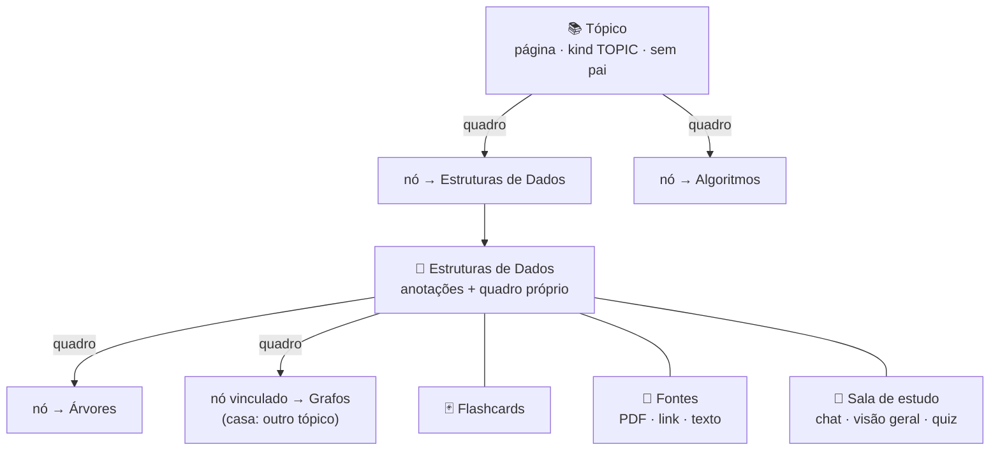

O caderno de estudos é onde alguém organiza um assunto que está aprendendo. A pessoa abre um tópico, digamos "Engenharia de Software", e monta um quadro de roadmap para ele. Cada nó desse quadro abre uma página de anotações, e essa página pode ter um quadro próprio, então "Estruturas de Dados" se divide em árvores e heaps sem sair do caderno. PDFs, páginas da web e texto colado entram nas páginas como fontes, e uma IA de estudo responde a partir delas com citações. Os flashcards escritos numa página voltam num cronograma.

Este documento cobre o modelo, as regras e a classe onde cada regra mora, e depois as escolhas que moldaram os dois clientes. As rotas estão na API do Controller do Caderno de Estudos.

## Tudo é uma página

Um tópico é uma página com `kind = TOPIC` e sem pai. Toda outra página tem `kind = PAGE` e exatamente uma casa: `parent_id` a coloca na árvore e `topic_id` diz a qual tópico ela pertence, gravado na própria linha para que um tópico inteiro venha numa leitura indexada. Uma constraint CHECK na V34 recusa qualquer linha que fuja desse formato, então uma página sem tópico não existe nem quando um service a monta errado.

As anotações são um documento BlockNote guardado como string JSON em `content`. Ao lado fica `content_text`, o texto puro que o `BlockText` extrai no servidor a cada salvamento. A IA de estudo lê esse texto e a exportação da conta o leva. Os clientes nunca o enviam, porque um cliente poderia mandar qualquer texto junto do documento, e derivá-lo no servidor mantém os dois de acordo. O `BlockText` percorre o JSON pela estrutura e ignora os tipos de bloco, então um bloco que o editor ganhe depois continua sendo lido.

Uma página ou tópico pode ter um `icon`, um id do `@beyou/icons` escolhido no cabeçalho da página com o mesmo seletor que categorias e hábitos usam. Ele aparece onde a página aparece: a árvore, os nós do quadro, os cartões da página inicial e a tela da página no mobile, com o padrão de tópico ou de página quando não há um. Uma renomeação ou um ícone novo é gravado em todos esses lugares de uma vez pelo `applyPageDetails` do `@beyou/state`, a mesma propagação que o `applyStatuses` faz para o status.

Uma linha de página tem mais de um escritor, e cada um a carrega num momento diferente. O autosave é um. Um status que muda porque um nó abaixo terminou é outro. `NotebookPage` é `@DynamicUpdate`, então cada UPDATE leva só as colunas que aquela requisição mudou, e uma mudança de status não regrava mais um documento que carregou antes do autosave commitar. Abrir uma página grava `last_opened_at` por uma query de UPDATE que nunca suja a linha, já que a tela da página repete essa leitura enquanto a pessoa digita. Foi a suíte e2e que achou esse caso, e o `NotebookConcurrentWritesIT` reproduz as intercalações.

## Um quadro por página

O quadro pertence à página que o mostra. Suas linhas em `notebook_board_nodes` e `notebook_board_edges` têm `board_page_id` como chave, então uma página tem no máximo um quadro. O bloco "Quadro de roteiro" do editor (`roadmapBoard`, a constante `MarkdownBlocks.BOARD_BLOCK_TYPE`) só diz onde desenhá-lo na página. Apagar o bloco esconde o quadro e não apaga nenhum nó.

Um nó é um destes:

- Um nó PAGE criado por título. O servidor cria uma página filha da página do quadro e o nó a abre. É o caso comum.
- Um nó PAGE criado com `linkPageId`, que abre uma página que mora em outro lugar, quase sempre em outro tópico. Essa página continua com sua única casa e seu único status, e o nó vira uma segunda porta de entrada. Por isso o nó tem sua própria coluna `page_id` em vez de reaproveitar a árvore.
- Uma SECTION, uma faixa com rótulo, largura e altura que agrupa os nós desenhados por cima dela.

O `NotebookBoardService` recusa dois tipos de vínculo. Uma página aparece uma vez em cada quadro, garantido por `UNIQUE (board_page_id, page_id)` e devolvido como `NOTEBOOK_NODE_DUPLICATE`. E uma página que já alcança a página do quadro descendo pelos quadros colocaria essa página no próprio quadro, o que `ProgressGraph.reaches` pega como `NOTEBOOK_BOARD_CYCLE`. Toda caminhada no `ProgressGraph` guarda um conjunto de visitados de qualquer forma, então um ciclo que entrasse por outro caminho não trava a requisição.

As arestas ordenam os nós e desenham o caminho sugerido. Progresso e status nunca as leem, e elas não bloqueiam nada.

Uma página criada pelo "Adicionar página" da árvore mora sob o pai sem nó nenhum. Remover um nó deixa a página na árvore, fora do quadro. O quadro pode apagar a página junto (`deletePage`), e o servidor só aceita isso para uma página cuja casa é a página daquele quadro, então remover um nó vinculado nunca apaga a página no outro tópico.

## Status e progresso

São dois números com vidas diferentes.

O progresso é calculado a cada leitura pelo `ProgressGraph`, montado com duas queries por usuário: todas as páginas e todos os nós PAGE. Ele conta folhas. Uma página sem nós no quadro conta como uma, e uma página com quadro conta como a soma do que está nele, por todos os quadros aninhados e por toda página vinculada. "Engenharia de Software 11 de 56" quer dizer 56 coisas sem nada mais detalhado abaixo delas.

O status é gravado, e o `NotebookProgressService` é a única classe que o escreve. O XP é pago quando uma página chega a DONE pela primeira vez, e pagar numa transição exige um "antes". Um status calculado a cada leitura nunca saberia separar o momento em que a página terminou da centésima vez em que alguém olhou uma página terminada.

1. Uma folha tem o status que alguém deu a ela.
2. Uma página com nós segue esses nós pelo `ProgressGraph.derivedStatus`. Todos os nós concluídos deixam a página DONE, qualquer coisa concluída ou começada a deixa STUDYING, e fora isso ela fica TO_STUDY. Um status escolhido à mão numa página assim liga `status_manual`, e os nós param de mexer nela. `StatusChoice.AUTO` desliga a flag e recalcula na hora. A flag só importa onde os nós poderiam passar por cima, então numa folha ela fica desligada, e um nó adicionado depois assume.
3. Toda mudança sobe por todos os quadros que mostram a página (`ProgressGraph.boardsShowing`) e recalcula cada página que segue seus nós, até nada mais se mover. Uma página vinculada em dois tópicos move os dois. Uma página com status manual interrompe a subida naquele galho.
4. As edições de quadro passam pelo mesmo service (`boardChanged`), já que adicionar ou remover um nó muda o que os nós de uma página dizem. Uma página concluída que ganha um nó que ninguém começou volta para STUDYING.

Toda resposta que pode mexer num status traz `changed`, a lista de toda página que se moveu. No cliente, `applyStatuses` (em `@beyou/state`) grava isso na página, em todo nó de quadro que a abre, em toda linha da árvore e nas prévias de tópico da home. Um nó fica verde no quadro no instante em que sua página é marcada como concluída, sem refetch.

## XP

O `NotebookRewards` guarda todos os valores que o caderno paga, para que os três se comparem de relance:

| Evento | XP | O que impede pagar duas vezes |
|--------|----|-------------------------------|
| Uma página chega a DONE pela primeira vez | 15 (`PAGE_DONE_XP`) | `notebook_pages.done_xp_at`, gravado uma vez e nunca limpo |
| Um quiz é aprovado pela primeira vez, `score * 10 >= total * 7` | 20 (`QUIZ_PASSED_XP`) | `notebook_study_outputs.passed_at` |
| Um card revisado | 1 (`CARD_REVIEW_XP`), no máximo 30 por dia (`DAILY_REVIEW_XP_CAP`) | `notebook_card_reviews.xp_paid`, coletado por `POST /notebook/reviews/finish` |

O XP vai para a pessoa e para a categoria do tópico da página via `XpCalculatorService.addXpToUserAndCategoriesAndPersist`, que grava o ledger diário de XP como qualquer outro pagamento. Um tópico sem categoria paga só a pessoa. Uma única mudança de status pode concluir páginas em dois tópicos com categorias diferentes, então um pagamento é um `Payroll` agrupado por categoria, com um único repaint (`RefreshUiDTO`) para tudo.

Marcar uma página como concluída, desmarcar e marcar de novo paga uma vez só. Senão o status vira um botão de XP, e o `notebook-rules.spec.ts` segura essa regra.

As revisões pagam quando a sessão termina. Quem passa pelos cards vê um +XP no fim, sem um contador subindo a cada toque. O teto diário impede que um baralho de mil cards de uma palavra vire fazenda de XP, e revisar além dele continua movendo o cronograma. As revisões acima do teto são marcadas como pagas sem pagar nada: só poderiam ser pagas hoje, e hoje já bateu o teto.

## Flashcards

Os cards ficam numa página, em `notebook_cards`. O `SpacedRepetition` é o SM-2 do jeito que o Anki adaptou, em dias inteiros, sem relógio e sem repositório, para que cada regra seja um teste unitário:

- AGAIN quer dizer esqueci. O ease cai 0,2, as repetições zeram e o card vence de novo hoje. O cliente o leva para o fim da sessão.
- HARD baixa o ease em 0,15 e aumenta o intervalo em 1,2 vez.
- GOOD dá um dia, depois três, depois o intervalo vezes o ease.
- EASY sobe o ease em 0,15 e salta mais longe do que GOOD saltaria.

O ease nunca fica abaixo de 1,3 e nenhum intervalo passa de 365 dias. `due_on` é uma data no fuso do dono, resolvida pelo `UserDateResolver`, então "vence amanhã" é o amanhã de quem lê. A fila de revisão manda cada card com `intervals`, o resultado de cada botão, e os rótulos embaixo dos botões vêm da mesma função que agenda.

O `ReviewStreak` conta dias seguidos com alguma revisão, e a sequência pode terminar ontem. Às nove da manhã ninguém revisou ainda, e uma sequência que mostra 0 até o primeiro card castiga a pessoa por estar acordada.

## Fontes

Uma fonte é anexada a uma página, e uma página lê as próprias fontes e as de cada ancestral subindo a árvore. Um livro-texto no tópico responde perguntas em todos os nós dele. Um artigo num nó fica naquele nó, e páginas irmãs nunca veem as fontes umas das outras. O escopo segue só a árvore: uma página vinculada lê as fontes da sua própria casa.

Adicionar uma fonte grava a linha como PENDING e responde 202. O `SourceIngestionService` a lê num pool de duas threads, `notebook-ingest`, e o job só começa depois que a transação da requisição commita, para o pool nunca procurar uma linha que ainda não existe. A linha passa por READING com um percentual e termina READY ou FAILED com um `error_key` que os clientes traduzem. As gravações de status passam pelo `SourceWrites`, cada uma na própria transação, e uma linha apagada no meio da leitura é simplesmente pulada. No boot, as linhas que um restart pegou pela metade são marcadas FAILED com `NOTEBOOK_SOURCE_INTERRUPTED`, porque os bytes do PDF morreram com o processo.

- **PDF.** Até 15MB, reconhecido pelo número mágico `%PDF-`, seja qual for o tipo que o cliente declara. O `PdfTextExtractor` (PDFBox) o lê em memória, página por página, até 800 páginas, porque uma citação nomeia a página. Os bytes nunca são gravados em lugar nenhum. Quando o job termina, o texto é a única cópia que sobra, e não há arquivo para limpar quando uma conta é apagada. Um PDF sem camada de texto é recusado como ilegível, porque uma fonte que responde nada a toda pergunta é pior do que um erro com o qual a pessoa consegue agir.
- **Link.** O `LinkFetcher` é o único lugar em que o servidor busca uma URL digitada por um usuário, então é também onde o SSRF é recusado. As regras estão no tópico de segurança. O HTML volta como texto legível via jsoup, lendo no máximo 3MB. Um PDF atrás de um link segue o caminho do PDF, com o teto de 15MB.
- **Texto.** Colado, até 200.000 caracteres.

O `TextChunker` corta o texto em trechos de cerca de 1000 caracteres, seguindo os parágrafos e quebrando um parágrafo maior que 1600 em finais de frase, com no máximo 3000 trechos por fonte. Os trechos nunca se sobrepõem. Uma citação abre um trecho como excerto, e um excerto que começa no meio da última frase do trecho anterior parece bug. A busca devolve vários trechos por resposta, então uma ideia dividida entre dois chega inteira.

O `SourceChunkStore` lê e grava `notebook_source_chunks` com SQL puro via `JdbcTemplate`. A tabela tem um `tsvector` gerado e um `real[]`, dois tipos que o Hibernate precisaria aprender a validar e que nada aqui usa como objeto. Uma página guarda no máximo 20 fontes próprias (`NOTEBOOK_SOURCE_LIMIT_REACHED`), além das que herda.

### Encontrar fontes para mim

A pessoa descreve o que as fontes devem cobrir, e o `SourceDiscoveryService` faz uma busca na web com o tópico da página, o título dela e o objetivo da sala como contexto. Dois provedores ficam por trás do `WebSearchClient`, e as chaves escolhem um (`DiscoveryProperties`): Tavily quando `TAVILY_API_KEY` está definida, senão Gemini com Google Search quando `NOTEBOOK_DISCOVERY_GEMINI_API_KEY` está, senão nenhum e a sala de estudo esconde o botão. A busca do Gemini precisa de um projeto com faturamento; numa chave gratuita toda chamada com busca responde 429, e por isso a chave dela é própria e a `GEMINI_API_KEY` da cadeia do chat nunca é reaproveitada: um fallback mostraria um botão que falha toda vez. Os resultados do Gemini são os grounding chunks da resposta, páginas que o Google devolveu, nunca URLs escritas no texto do modelo, porque um modelo pode inventar uma URL.

Cada resultado é aberto antes de ser oferecido, pelo `LinkFetcher.resolve`: os redirecionamentos são seguidos até a página real, com as recusas de SSRF em cada salto, e só se lê HTML suficiente para o título. Um resultado do Gemini é um redirecionamento do Google, então é aqui também que ele vira o endereço real. Resultados que não abrem, apontam para algo privado, já são fontes da página (desligadas ou ainda em leitura incluídas) ou repetem outro resultado são descartados e contados. Eles são abertos em paralelo, e o que ainda estiver carregando depois de 20 segundos é descartado. Nada é guardado: a pessoa marca o que quer manter, e o cliente adiciona cada um como fonte de link, lida como qualquer link colado. A busca gasta a cota `notebook-ai` e cada fonte adicionada a `notebook-source`.

## Busca de trechos, e por que não há pgvector

O `NotebookRetriever` encontra os trechos que melhor respondem uma pergunta, nesta ordem:

1. Embeddings, quando há um modelo configurado e as fontes foram embedadas por esse mesmo modelo. A pergunta é embedada e pontuada por cosseno contra os vetores guardados dessas fontes, na JVM, até 6000 vetores. No tamanho das leituras de uma pessoa, isso leva milissegundos.
2. Busca full-text no `tsvector` gerado, casando qualquer palavra da pergunta. Uma pergunta em linguagem natural quase nunca tem todas as palavras num só trecho, então os termos vão com OR. A configuração de busca é `simple`, porque o caderno é bilíngue e um stemmer de uma língua estraga a outra.
3. Quando nada casa, os trechos iniciais de cada fonte, para que "do que se trata isto?" ainda tenha onde se apoiar.

Existe UM modelo de embedding, definido por `notebook.embedding.*` (`EmbeddingProperties`). O padrão é o `mistral-embed` da Mistral, com a mesma `MISTRAL_API_KEY` que a cadeia de chat usa, e qualquer endpoint `/embeddings` compatível com OpenAI serve via `NOTEBOOK_EMBEDDING_BASE_URL`, `NOTEBOOK_EMBEDDING_API_KEY` e `NOTEBOOK_EMBEDDING_MODEL`. Sem chave nenhuma, os embeddings ficam desligados. Vetores de dois modelos vivem em espaços diferentes, então uma cadeia de fallback tornaria inútil todo vetor guardado para a pergunta feita. Cada trecho registra `embedding_model`, e o retriever só compara uma pergunta com trechos embedados pelo modelo configurado agora. Quando o provedor falha durante a ingestão, a fonte termina READY do mesmo jeito: os trechos estão gravados e dá para buscá-los por full-text. Os perfis de teste e e2e fixam a chave vazia, então o CI e a stack e2e sempre rodam na busca full-text.

O pgvector chegou a ser planejado e foi descartado. Ele exige trocar a imagem do banco em produção, em três arquivos compose, em todo serviço de CI e no Testcontainers. Um backend mergeado antes dessa troca quebraria na hora do Flyway e derrubaria a API junto. As fontes de uma pessoa cabem com folga numa passada de cosseno na JVM, e migrar para pgvector depois é uma troca de tipo de coluna e uma query.

## A IA de estudo

Toda chamada ao modelo passa pelo `NotebookLlm`: a mesma cadeia de fallback do assistente, uma resposta estruturada via `ChatClient.entity()`, uma nova tentativa pedindo JSON válido, e depois `AI_UNAVAILABLE`. Sem tools, sem streaming e sem memória. Uma chamada do caderno é uma pergunta com o contexto anexado, montado por quem chama e enviado inteiro a cada vez, que é o contrato das sugestões do onboarding.

A chamada inteira, nova tentativa incluída, tem 90 segundos (`NotebookLlm.BUDGET`). O Cloudflare derruba um pedido à API aos 100 segundos, e o cliente web desiste no mesmo ponto. Sem esse limite, um provedor travado podia segurar um pedido por minutos, e a pessoa via um erro de um trabalho que o servidor terminava depois, ou salvava duas vezes quando tentava de novo. Então o servidor para primeiro e responde `AI_UNAVAILABLE`. A nova tentativa só começa se sobrarem pelo menos 20 segundos. Cada tentativa roda numa virtual thread, para o pedido poder parar de esperar no prazo; a chamada HTTP abandonada termina no próprio read timeout.

Nenhuma transação de banco fica aberta enquanto o modelo responde. Uma chamada que pode levar 90 segundos seguraria uma das dez conexões do pool o tempo todo, e dez respostas lentas ao mesmo tempo deixariam o resto do app esperando por uma. Então todo caminho que chama o modelo lê o que o prompt precisa numa transação curta, chama o modelo sem nenhuma aberta e salva o que voltou numa segunda transação curta, pelo `NotebookTransactions`. O salvamento carrega a página de novo, porque a da leitura já está desanexada, e uma página apagada enquanto o modelo pensava recusa o salvamento em vez de juntar linhas órfãs. O `NotebookModelCallTransactionIT` pergunta a cada um desses caminhos se há uma transação aberta no momento da chamada. Um limite que vale saber: o open-session-in-view do Spring está ligado, então num pedido HTTP a sessão do Hibernate, e a conexão que ela pegou, vive até a resposta ser escrita. A divisão libera a conexão nas chamadas de ferramenta do assistente e na thread de fundo do rascunho de roteiro. Nas rotas HTTP isso depende de desligar essa configuração, o que é outra mudança.

Enquanto uma chamada roda, toda tela do caderno que espera por ela mostra o tempo decorrido e, depois de 30 segundos, um aviso de que ainda está em andamento e quanto pode levar. O rascunho do roteiro também mostra linhas de esqueleto onde os nós vão aparecer, e pode ser fechado a qualquer momento sem perder nada, porque o rascunho fica guardado (abaixo).

O prompt de sistema é `prompts/notebookTutor.st`, e cada mensagem começa com um modo:

| Modo | Usado por | O modelo pode |
|------|-----------|---------------|
| GROUNDED | Chat, resumo, guia de estudo, visão geral, quiz, flashcards da IA, "sugerir nós" a partir das fontes | Responder só a partir dos trechos numerados, citando `[n]`. Quando eles não cobrem a pergunta, diz isso numa frase e para |
| SUPPORTED | "Explicar o bloco acima" | Explicar com o próprio conhecimento e citar os trechos que o sustentam |
| PLANNING | Rascunho de roadmap, "sugerir nós" sem fontes | Usar conhecimento geral. Não há trechos |

O `StudyContextBuilder` numera os trechos e é o dono desses números. As anotações da pessoa vêm primeiro, lidas frescas da página e dos ancestrais, e depois os trechos que o `NotebookRetriever` escolheu. A resposta que concorda com o que a pessoa escreveu é a que fixa. Qualquer número que o modelo cite fora da lista é descartado, e marcadores `[n]` mortos saem do texto, porque uma citação que o leitor não consegue abrir é pior do que nenhuma. Uma chamada GROUNDED numa página sem anotações e sem fontes legíveis levanta `NOTEBOOK_NOTHING_TO_STUDY` antes de chamar o modelo.

O `NotebookStudyService` cuida da sala de estudo. As mensagens do chat ficam em `notebook_chat_messages`, e as últimas 6 vão junto com cada pergunta para dar conta das perguntas de seguimento. As saídas ficam em `notebook_study_outputs` como JSON: OVERVIEW (uma por página, substituída a cada vez), SUMMARY, STUDY_GUIDE e QUIZ. Um quiz guarda as respostas no servidor. O cliente recebe as perguntas, manda as escolhas para correção e só então descobre o que estava certo, que é também onde os 20 de XP são pagos.

O `NotebookAiService` cuida do resto. Um rascunho de roteiro fica guardado, porque uma chamada leva até um minuto e meio e o diálogo perdia um rascunho pronto num clique fora dele. O `RoadmapDraftService` grava o pedido em `notebook_roadmap_drafts` (V35) e responde na hora, DRAFTING. A chamada ao modelo roda numa virtual thread depois que esse pedido faz commit, a mesma passagem da leitura de fontes, e o `RoadmapDraftWrites` guarda o resultado, mas só numa linha que ainda está DRAFTING, então um rascunho excluído no meio da chamada continua excluído. O diálogo relê o rascunho a cada poucos segundos. A página inicial do caderno lista todos os rascunhos e reabre cada um com o formulário, os nós e as marcações da pessoa, que o diálogo salva conforme mudam. Uma chamada por rascunho de cada vez: um rascunho DRAFTING recusa redesenho e novas marcações (`NOTEBOOK_DRAFT_BUSY`). Criar o tópico exclui o rascunho na mesma transação, um reinício marca como FAILED as chamadas que cortou, com `NOTEBOOK_DRAFT_INTERRUPTED`, e cada pessoa guarda no máximo 20 rascunhos. As leituras ficam em `/notebook/drafts`, fora de `/notebook/ai`, então reler um rascunho gasta a cota de leitura, não a de IA. Nada no caderno muda antes de "Criar".

O rascunho também oferece vínculos. Cada título rascunhado é normalizado (sem caixa, acentos, pontuação e o s do plural) e comparado com as páginas que a pessoa já tem, então um rascunho de "Fundamentos da Computação" pode dizer "você já tem Sistemas Operacionais, 4 de 9 feitos, ligar". Criar a partir do rascunho roda numa transação só pelo `NotebookBoardService.addChain`, que dispõe os nós três por linha, a 240 por 140 de distância, ligados por arestas, e dá a cada nó novo com subtópicos um quadro próprio. O modelo propõe texto. Ele nunca grava no banco e nunca escolhe um id ou uma coordenada.

Toda rota em `/notebook/ai/**` gasta o bucket de rate limit `notebook-ai`, 60 chamadas por usuário por hora. Dividir os 30 do assistente deixaria uma noite de estudo trancar a pessoa fora do assistente. A ferramenta de cartões do assistente chama o mesmo modelo sem passar por essa rota, então o `NotebookAiQuota` gasta o mesmo bucket por ela (mesmo cache, mesma chave), e uma resposta do chat não consegue rascunhar cartões além do limite da hora.

### O preparo da sala de estudo

Antes da primeira pergunta a sala abre no preparo (`StudySetup` na web), e "Editar preparo", na linha acima do chat, traz ele de volta. Ele pergunta três coisas. Um objetivo para estudar a página, guardado em `notebook_pages.study_goal` e colocado antes dos trechos no contexto de toda resposta, para as respostas mirarem nele; ele nunca é um trecho e nunca é citado. As anotações de quem a IA lê (`study_scope`, V36): PAGE, a página e as páginas acima dela, que é o que a sala sempre leu e continua sendo o padrão; SUBTREE, também todas as páginas abaixo; TOPIC, todas as páginas do tópico. O `StudyScopes` monta a lista, e a tela de preparo mostra quantas páginas com anotações e quantas palavras cada escolha cobre. E o que ela pode citar: as fontes ficam no painel ao lado do preparo, com seus interruptores, e o preparo adiciona mais, à mão ou com "encontrar fontes para mim". Objetivo e escopo valem para toda chamada de IA na página, não só o chat: o estúdio, a explicação, os flashcards de IA e as sugestões de nós leem o mesmo contexto. `study_setup_at` nulo é o que abre a tela de preparo; uma sala com mensagens de antes da V36 abre no chat.

## O assistente num quadro

O chat do assistente (o [agente de IA](/architecture/ai-agent)) muda um quadro quando a pessoa pede. O `getStudyBoard` lê um: os nós de página na ordem do caminho com seus status, as ligações entre eles por título e as seções. Nove ferramentas escrevem: as oito abaixo e o `generateStudyCards`, mais adiante. O `addStudyNode` põe um nó na próxima célula livre da grade e pode ligá-lo depois de outro nó. O `editStudyNode` renomeia um nó ou troca o ícone, e como o título de um nó é o título da página dele, a página muda de nome em todo lugar onde aparece. O `setStudyNodeStatus` define o status de um nó ou da própria página do quadro. O `connectStudyNodes` e o `disconnectStudyNodes` criam e removem ligações. O `removeStudyNode` tira um nó do quadro e mantém a página, a não ser que venha `deletePage`. O `reorderStudyBoard` refaz o caminho, e o `addStudyNotes` escreve markdown no fim de uma página.

O `StudyBoardEditor` transforma os nomes que a pessoa usa em linhas e depois chama os mesmos services que o quadro na tela chama, então posse, as recusas de vínculo e o XP de uma página concluída são os mesmos de um clique. Um quadro é nomeado pelo id da página, que a rota onde a pessoa está carrega, ou pelo título exato da página. Um nó é nomeado pelo título ou pelo id. Um nome que não bate com nada recebe de volta a lista do que existe. Um nome que bate com duas páginas, ou dois nós, recebe de volta uma pergunta, então o modelo nunca escolhe um. Cada chamada de ferramenta é uma transação, menos a `generateStudyCards`: ela resolve a página numa transação curta e deixa a chamada ao modelo fora de qualquer uma, como o botão faz.

O `reorderStudyBoard` recebe cada nó de página do quadro uma vez. Eles viram uma corrente só na grade, nessa ordem, e a corrente substitui todas as ligações que o quadro tinha (`NotebookBoardService.restructure`), então um ramo que a pessoa desenhou some depois. O prompt faz o assistente repetir a ordem e esperar um sim. Quando o assistente adiciona o primeiro nó numa página cujo documento não tem bloco de quadro, ele grava o bloco também (`MarkdownBlocks.withBoardBlock`). Sem ele o quadro não teria onde ser desenhado.

O `generateStudyCards` rascunha cartões na página de um nó, ou na página do quadro, com a mesma chamada do "Rascunhar com IA" do bloco de cartões (`NotebookAiService.cards`), a partir das anotações e fontes da página ou de um texto de foco. Ele gasta a cota notebook-ai e dá à página um bloco de cartões se ela não tinha, para os cartões aparecerem onde a pessoa lê. O bloco de cartões relê o baralho quando o número de cartões da página muda, e é assim que cartões criados pelo chat aparecem numa página aberta.

Toda ferramenta que escreve informa o domínio `notebook`, e as que podem mudar um status informam `perfil` também. Com isso, os dois clientes releem a home, cada quadro e árvore que já carregaram e a página na tela (`refreshNotebook` em `@beyou/state`). Uma revisão mais nova da página na tela é juntada ao editor aberto (veja "Uma página, dois escritores" abaixo), então as anotações do assistente aparecem sem recarregar e o que foi digitado nesse meio tempo fica.

## Uma página, dois escritores

O documento é uma coluna JSON, salva inteira pelo autosave do editor, e até a V37 o último a salvar vencia. Um celular e um computador na mesma página, ou o assistente acrescentando anotações com a página aberta, faziam uma escrita apagar a outra sem aviso. Agora cada página tem um `content_revision` que sobe a cada escrita do documento, e toda escrita passa por um único compare-and-set, `NotebookPageRepository.writeContentIfAt` (UPDATE ... WHERE content_revision = :read). O autosave manda a revisão de onde partiu como `baseRevision`; um salvamento de uma revisão mais antiga é recusado com `NOTEBOOK_CONTENT_CONFLICT` e não muda nada. As escritas do próprio servidor (um append, um bloco de quadro ou de cartões que ele acrescenta) leem de novo e tentam outra vez quando alguém escreveu antes. Um pedido sem `baseRevision`, de um cliente anterior às revisões, ainda sobrescreve.

O editor recusado junta. O `DocumentSync` em `@beyou/state` guarda a revisão que o editor viu por último e o documento nessa revisão, a base. Numa recusa, ou quando chega uma revisão mais nova de qualquer outro lugar (um reload, uma resposta do assistente), ele lê a página e junta a base, o documento do editor e o do servidor bloco a bloco (`mergeDocuments`). Um bloco mudado de um lado fica com a versão desse lado, blocos acrescentados de qualquer lado ficam onde o lado deles os pôs, e só um bloco mudado dos dois lados, ou removido de um e mudado no outro, vai para a pessoa: um diálogo mostra as duas versões e mantém as duas a não ser que ela escolha uma. Nada é salvo enquanto ele está aberto. O documento juntado entra no editor trocando só o trecho que difere, então o quadro, os cartões e o cursor em outro lugar ficam como estão, e é salvo quando tem algo que o servidor não tem. Só um salvamento vai por vez, então um editor nunca entra em conflito consigo mesmo. O `DocumentSync` não tem React nem rede própria, e é isso que deixa o editor do celular usá-lo também.

A junção casa os blocos pelo id. Os blocos que o servidor escreve ganham um UUID aleatório, como os do BlockNote (`MarkdownBlocks`), e uma página salva antes disso, com blocos sem id, é salva uma vez quando abre, o que grava os ids que o editor deu. Um bloco sem id que chegue a uma junção é casado pelo tipo e pelo texto.

## Onde cada regra mora

| Regra | Mora em |
|-------|---------|
| A página pertence a quem chama. Todo caminho verifica isso primeiro, inclusive os ciclos de foco que nomeiam uma página | `NotebookOwnership` |
| O status, a subida pelos quadros e o pagamento no primeiro DONE | `NotebookProgressService` |
| Progresso, status derivado, alcance, a próxima folha a estudar, a subárvore de uma página | `ProgressGraph` |
| Todo valor de XP e o teto diário de revisão | `NotebookRewards` |
| O texto puro de um documento | `BlockText` |
| A revisão do documento: um compare-and-set para toda escrita | `NotebookPageRepository.writeContentIfAt`, `NotebookPageService` |
| Juntar um editor aberto com o que foi salvo em outro lugar, um salvamento por vez | `DocumentSync`, `mergeDocuments` em `@beyou/state` |
| O que os dois editores fazem com um documento fora do BlockNote: linguagens de código, a checagem de página vazia, o JSON salvo como conteúdo inicial, trocar só o trecho que mudou | `codeLanguages`, `editorDocument` em `@beyou/state` |
| O markdown da IA virando blocos no "Salvar na página", o tipo do bloco de quadro | `MarkdownBlocks` |
| As recusas de nó vinculado, o `deletePage`, a disposição em corrente do rascunho, a próxima célula livre, a ordem do caminho, refazer um quadro como um caminho só | `NotebookBoardService` |
| As ferramentas de quadro do assistente: de nomes para linhas, e as recusas que o impedem de adivinhar | `StudyBoardEditor` |
| O bucket notebook-ai gasto fora de `/notebook/ai/**` (a ferramenta de cartões do assistente) | `NotebookAiQuota` |
| O cronograma SM-2 | `SpacedRepetition` |
| O escopo das fontes, o limite de 20 por página, as checagens de PDF | `NotebookSourceService` |
| As recusas de SSRF, os saltos de redirect, os tetos de corpo | `LinkFetcher` |
| Leitura em segundo plano, embeddings, recuperação após restart | `SourceIngestionService` |
| A escolha dos trechos e seus fallbacks | `NotebookRetriever` |
| A numeração dos trechos e a limpeza das citações, o objetivo no contexto | `StudyContextBuilder` |
| De quem são as anotações que as respostas de uma página leem | `StudyScopes` |
| Busca na web, abrir cada resultado, descartar o que está morto, é privado ou já é fonte | `SourceDiscoveryService`, `WebSearchClient`, `LinkFetcher.resolve` |
| A chamada ao modelo, a nova tentativa, o limite de 90 segundos e o `AI_UNAVAILABLE` | `NotebookLlm` |
| Nenhuma transação aberta enquanto o modelo responde: uma leitura curta antes, uma gravação curta depois | `NotebookTransactions` |
| Um rascunho de roteiro guardado: uma chamada por vez, resultado só numa linha DRAFTING, apagado quando o tópico existe | `RoadmapDraftService`, `RoadmapDraftWrites` |

## O editor web e o quadro

O editor web é o BlockNote 0.55 (`@blocknote/core`, `@blocknote/react`, `@blocknote/mantine`) sobre o Mantine 8. O Mantine 9 exige React 19.2 e o app web está no React 18, então o `@mantine/core` fica no `^8.3.18` até o React subir. O schema tira os blocos de áudio, vídeo e arquivo, porque eles precisam de um backend de upload que o caderno não tem, e um bloco que oferece upload e depois falha é pior do que bloco nenhum. Imagens ficam, embutidas por link. Dois blocos próprios entram junto dos padrões, `roadmapBoard` e `flashcards`, e o menu de barra ganha "Quadro de roteiro", "Cartões" e "Explicar o bloco acima". O editor salva 900 ms depois da última mudança com `PUT /notebook/pages/{id}/content`. As cores vêm de variáveis de tema, então ele segue o tema que estiver ligado.

Enquanto uma página não tem nada, o editor mostra dois botões iniciais, "Adicionar um quadro de roteiro" e "Adicionar cartões". Eles moram dentro do editor porque é o editor que sabe que o documento está vazio, e inserem o bloco na frente do que ele tiver. Antes ficavam na tela da página, decidiam a partir de uma cópia da página que o autosave nunca atualiza, e gravavam um documento novo no servidor: numa página que começou vazia eles continuavam na tela enquanto a pessoa escrevia, e "Adicionar cartões" trocava as anotações por um bloco de cartões. O bloco de cartões lista os três primeiros cartões, cada um uma pergunta cuja resposta abre num clique. Blocos de código ganham um seletor de linguagem sobre uma lista fixa (`codeLanguages.ts`); o BlockNote lança erro ao desenhar uma linguagem que não está na lista, então a lista responde sim a qualquer nome e os blocos de código de uma página passam para um id da lista (ou `text`) quando ela carrega. Links são desenhados como no Notion: a cor do próprio texto com um sublinhado suave.

O quadro é React Flow (`@xyflow/react` 12). O "Organizar" põe os nós de página de volta na grade em que um rascunho começa: na ordem do caminho, então um nó vem depois dos nós que apontam para ele, três por linha, cada linha continuando onde a anterior terminou. Onde as arestas deixam escolha, decide a ordem que a pessoa deixou no quadro. As seções ficam onde a pessoa as colocou. O layout da web (`boardLayout.ts`) e o do servidor (`NotebookBoardService`) usam a mesma grade, então organizar um rascunho recém-criado não move nada. Um nó novo ocupa a próxima célula livre. O Organizar era um layout do dagre, que desenhava qualquer cadeia como uma linha comprida. O `useBoard` reúne toda ação de quadro, para o quadro dentro da página e para o de tela cheia. Toda escrita chega ao store a partir da resposta do servidor. A exceção são as posições, desenhadas primeiro e salvas depois, para que arrastar nunca espere a rede.

As rotas:

| Rota | Tela |
|------|------|
| `/notebook` | Home: cards de tópico com miniatura do quadro, "continuar estudando", as revisões do dia |
| `/notebook/review` | Uma sessão de revisão, opcionalmente restrita com `?page=` |
| `/notebook/:pageId` | Uma página: árvore, anotações, o quadro embutido, status |
| `/notebook/:pageId/board` | O quadro em tela cheia, cobrindo o shell como `/focus` |
| `/notebook/:pageId/study` | A sala de estudo em tela cheia: fontes, chat, saídas do estúdio |

O Caderno fica no grupo principal da sidebar depois de Metas (ícone `NotebookPen`) e na folha do bottom nav. Cada tela do caderno é um chunk lazy. O editor vai dentro do chunk da tela de página e nunca carrega no boot.

No desktop a tela da página reserva o próprio espaço no fim: 40px abaixo da linha vazia final do editor, mais enquanto a pílula do timer flutua sobre o rodapé. Ela desliga o espaçador de 96px do shell com `useNoDesktopSpacer`; esse espaçador continua em todas as outras páginas para o botão do assistente nunca cobrir o fim de uma, e o celular o mantém por causa da barra inferior. Na sala de estudo os painéis de fontes e de estúdio podem ser redimensionados arrastando as barras ao lado do chat (de 220 a 560px; duplo clique volta ao padrão, setas e Enter pelo teclado) ou recolhidos em trilhos finos para o chat ocupar a tela. O layout é uma preferência por navegador guardada no localStorage (`useStudyLayout`), e nada disso vale abaixo de `lg`, onde as colunas se empilham.

## Mobile

O celular lê e escreve anotações. As telas são a home de tópicos (`app/(app)/notebook/index.tsx`), um tópico ou página com as abas Trilha e Notas (`app/(app)/notebook/[id].tsx`), o editor de notas (`app/notebook-editor.tsx`), a revisão (`app/notebook-review.tsx`), a sala de estudo (`app/notebook-study.tsx`) e o rascunho de roteiro (`app/notebook-draft.tsx`). O editor, a revisão, a sala de estudo e o rascunho são em tela cheia e ficam fora do grupo `(app)`, para que a barra de baixo nunca fique entre o texto e o teclado nem numa sessão que quer a tela inteira.

Um canvas arrastado com um polegar não serve para ler um roadmap, então a aba Trilha lê o quadro em níveis (`pathLevels` em `@beyou/state`). Cada nó vem depois dos nós que apontam para ele, e um nível com mais de um nó ganha "Depois, em qualquer ordem". A aba Notas desenha o documento com views nativas (`src/notebook/BlockRenderer.tsx`), e "Editar notas" ou um toque nelas abre o editor. As páginas abaixo desta que não estão no quadro aparecem listadas embaixo, lidas da árvore do tópico, já que o celular não tem barra lateral.

O roteiro também é editado ali. O "⋯" de um nó abre a folha dele, o inspetor de nó do web no tamanho de um polegar: o título e o ícone da página, o status, os nós de que ele vem depois (uma ligação pode ser tirada e outra adicionada), e então abrir a página, adicionar um nó depois deste, tirar do roteiro (a página continua abaixo desta) ou apagar a página com as notas. "Adicionar nó", abaixo da trilha, põe um depois do último nó na ordem em que a trilha lê. O celular não manda coordenadas: o servidor põe o nó na próxima célula livre da grade, liga ele depois do nó indicado e dá à página o bloco do quadro, então um roteiro começado no celular aparece no web. "Reordenar" move os nós com setas e salva a ordem inteira de uma vez (`PUT /notebook/pages/{id}/board/order`), o que transforma o quadro num caminho só; num quadro desenhado com galhos, a folha avisa que eles viram uma linha.

Uma terceira aba guarda os flashcards da página, o bloco de cartões do web em forma de aba: quantos vencem hoje, com a revisão a um toque, "Rascunhar com IA" (a IA de estudo lê a página e as fontes dela e salva os cartões que escreve), "Escrever um" e o baralho, onde um cartão mostra a pergunta e a resposta abre embaixo com um toque, com Editar e Excluir ali. O rótulo da aba leva a contagem de cartões da página. Os blocos de quadro e de cartões no editor abrem a tela da página nas abas Trilha e Cartões (`/notebook/{id}?tab=`).

A sala de estudo da página abre em "Sala de estudo", ao lado do Foco (`app/notebook-study.tsx`): a sala do web em três abas, Chat, Fontes e Estúdio, embaixo de uma barra com o objetivo da sala. Uma sala que ninguém configurou abre na configuração, como no web, e "Editar" na barra do objetivo abre ela de novo. Cada resposta do chat lista de onde vieram os pontos numerados, e pode ir para o fim da página ou virar três cartões. Fontes aceita um link, um texto colado, "Encontrar fontes para mim" ou um PDF escolhido no celular, recusado acima de 15 MB antes de sair. Toda fonte da página tem um interruptor que diz se as respostas usam ela. As fontes adicionadas numa página acima aparecem à parte, e enquanto o servidor ainda está lendo uma, a lista é lida de novo a cada 3 segundos. O estúdio faz um resumo, um guia de estudo, um quiz ou seis cartões. Um resumo ou um guia abre para ler. Um quiz é feito na folha dele e corrigido no servidor, e passar paga o XP na primeira vez, com o mesmo aviso de subida de nível que um check-in recebe. A visualização de markdown do celular não tem títulos, então as linhas de título da IA aparecem em negrito.

O PDF sobe pelo `src/lib/uploadFile.ts`, que a foto de perfil também usa agora. O fetch do React Native não manda uma uri `file://` como parte multipart, então o expo-file-system monta a requisição no nativo, e o helper põe os headers de autenticação e a única nova tentativa depois de um 401 que o cliente da API faria. O nome do arquivo na parte multipart é o último segmento da uri, e a cópia que o seletor guarda no cache tem um nome aleatório, então o helper recebe o nome do arquivo e manda uma cópia com ele, apagada depois; sem isso a fonte do PDF ficava com um UUID de título. O `expo-document-picker` é um módulo nativo: um build de desenvolvimento feito antes dele não tem o seletor.

O editor é o BlockNote, o mesmo do web, dentro de uma web view: um componente DOM do Expo (`src/notebook/editor/NotebookEditorDom.tsx`, `'use dom'`). O schema é o do web, bloco por bloco, então uma página escrita num abre no outro; os blocos do quadro e dos cartões continuam no lugar deles no documento e aparecem como cartões que abrem a aba Trilha e a revisão. O editor e o `DocumentSync` dele rodam juntos na web view, então um merge lê o documento que a pessoa está vendo. A tela empresta a rede (salvar, ler a página), mostra o estado do salvamento e faz a pergunta do conflito numa folha. O `editorBridge.ts` é o contrato entre as duas metades: a barra de ferramentas da tela manda comandos para a web view, e a web view conta onde o cursor está, para que Negrito, Itálico, Link e os botões de lista acendam onde valem. O menu lateral e a barra flutuante do BlockNote ficam desligados (um precisa de um hover que o dedo não tem, a outra briga com as alças de seleção do Android); o "+" adiciona um bloco abaixo do cursor, o "Aa" transforma o bloco atual em outro tipo, e digitar "/" ainda abre o menu de blocos.

Sair com uma edição ainda no debounce de 900ms do salvamento automático manda essa edição na hora e espera a resposta antes de a tela sair, então a página por trás mostra o que acabou de ser escrito. Ir para segundo plano também manda, e voltar junta o que foi salvo em outro lugar nesse meio tempo. Links abrem no navegador do celular, nunca dentro da web view.

A gestão de páginas fica no "⋯" da página: renomear, ícone, uma página nova abaixo desta (que já abre no editor) e excluir, que avisa o que vai junto como o diálogo do web e volta para a página pai. "Novo tópico" na home começa um tópico em branco ou rascunha um roteiro com IA.

O rascunho é o diálogo do web numa tela só (`app/notebook-draft.tsx`), o formulário e o rascunho embaixo. Depois que um rascunho é pedido, o formulário vira uma linha com "Editar", e a tela lê o rascunho de novo a cada 2,5 segundos enquanto o modelo escreve, com o tempo decorrido na tela. Um toque mantém um nó ou deixa ele de fora. Um nó que a pessoa já estuda em outro lugar oferece "Ligar" ou "Nova cópia", e as marcações são salvas 600ms depois da última, como no web. Uma mudança pedida em palavras é digitada embaixo do último nó; a tela então volta para cima, onde está a espera. Sair não perde nada, porque os rascunhos esperam na home em "Rascunhos". Um que o modelo ainda está escrevendo mostra ali o tempo correndo e vira "Pronto para revisar" sozinho, já que a home lê a lista de novo a cada 4 segundos enquanto há um em andamento. O que os dois clientes fazem com um rascunho (as linhas com as marcações, os pedidos, o tópico criado a partir das linhas mantidas, as semanas que ele leva) fica em `roadmapDraft.ts` no `@beyou/state`, que o diálogo do web agora usa também.

A web view precisou de três coisas que o resto do app não precisa. `react` e `react-dom` são redirecionados para as cópias do mobile no `metro.config.js`, porque o BlockNote fica no topo do monorepo ao lado do React 18 do web e o dedupe do próprio Expo só cobre as plataformas nativas. O `@expo/metro-runtime` é dependência direta, porque a entrada do bundle DOM importa ele. E as folhas de estilo do BlockNote são importadas uma a uma, a do Mantine inteira inclusive, porque o bundle DOM não segue `@import`s de CSS com nome de pacote. O build de produção empacota a web view em `www.bundle`, ao lado do app.

O Caderno está na folha do bottom nav do mobile. O reducer é registrado em `apps/mobile/src/store.ts`, e o redux do mobile fica em memória como sempre.

## O timer de foco

O "Foco 25 min" numa página do caderno inicia o pomodoro único do app, o mesmo timer que a tela de foco usa. O estado `FocusTimer` carrega `notebookPageId` e `notebookTitle` opcionais, mantidos na passagem para a pausa, e o `PomodoroOwner` do web e do mobile reporta o ciclo com `notebookPageId`. O servidor grava isso em `focus_cycles.notebook_page_id` depois de checar a posse, e o `focusMinutes` de uma página soma os minutos de POMODORO feitos nela e em toda página cuja casa fica abaixo dela. Pausas não contam. Apagar a página põe a coluna em null e mantém o ciclo.

O servidor não faz check-in nenhum. Quando o tópico está vinculado a um hábito que está na rotina de hoje, o timer pré-seleciona aquele item da rotina, a tela de foco abre nele e o check continua a um toque, nas mãos da pessoa.

## Privacidade

As anotações são tão pessoais quanto o diário de humor e recebem o mesmo tratamento. O slice `notebook` está na blacklist de persistência do web ao lado de `mood`, e o mobile guarda tudo em memória, então nenhuma página chega ao disco do aparelho. O `PERSIST_VERSION` não mudou, porque uma chave na blacklist nunca existiu no estado persistido.

O `GET /user/export` leva cada página como texto puro, os flashcards com as datas de vencimento, os detalhes de cada fonte, os chats da sala de estudo e os rascunhos de roteiro. O texto lido das fontes aparece em `notIncluded` como `notebookSourceText`: é uma cópia de documentos que a pessoa já tem, e um livro inteiro por fonte enterraria o resto do arquivo. Toda tabela do caderno tem cascade a partir de `users`, então a exclusão da conta leva o caderno inteiro.

## Testes

No backend, as regras puras têm testes unitários em `unit/notebook/` (`ProgressGraphTest`, `SpacedRepetitionTest`, `LinkFetcherTest`, `BlockTextTest` e outros), e `integration/notebook/` roda os services contra o Postgres, incluindo escritas concorrentes, a ingestão de fontes e o `StudyBoardEditor` do assistente. Seis specs e2e dirigem a stack: `notebook.spec.ts` para o caminho de UI do tópico ao nó concluído, `notebook-rules.spec.ts` para posse, pagar uma vez, a recusa de ciclo, SSRF e escopo de fontes direto na API, `notebook-study.spec.ts` para o XP da revisão e as telas de IA, com só as rotas do modelo simuladas, `notebook-agent.spec.ts`, que reproduz uma resposta do assistente sobre uma página aberta e confere que o quadro, a árvore, o título e o editor mostram a mudança, e `notebook-sync.spec.ts`, duas abas na mesma página: anotações acrescentadas a uma página aberta sobrevivem à próxima edição nela, parágrafos diferentes se juntam sem pergunta, o mesmo parágrafo pergunta, e `notebook-trail.spec.ts`, um roteiro editado do jeito do celular direto na API: um nó sem coordenadas na próxima célula livre, depois do nó indicado, com o bloco do quadro na página, e uma ordem que transforma o quadro num caminho só. O `NotebookConcurrentWritesIT` reproduz as corridas da revisão numa thread só, e `mergeDocuments`, `DocumentSync` e `editorDocument` têm testes unitários em `@beyou/state`. No mobile, o `notebook-editor-screen.test.tsx` põe um stub no lugar da web view e cobre a metade da tela na ponte: a página de onde o editor começa, salvar a partir da revisão dele, a folha de conflito, os comandos da barra de ferramentas e sair só depois que a última edição foi salva. O `notebook-page-actions.test.tsx` cobre renomear, página nova, excluir e tópico novo, o `notebook-trail.test.tsx` a folha do nó, um nó adicionado depois de outro e a reordenação, e o `notebook-cards.test.tsx` a aba de cartões: a contagem do dia, a resposta com um toque, rascunhar com IA, escrever, editar e excluir. O `notebook-study.test.tsx` cobre a sala de estudo: a primeira configuração, uma pergunta cuja resposta citada é salva na página e vira cartões, fontes adicionadas e uma desligada, um PDF do celular com a checagem de tamanho e um quiz corrigido e pago. O `notebook-draft.test.tsx` cobre um rascunho do formulário ao tópico (lido de novo até ficar pronto, as marcações salvas, o tópico criado a partir dos nós mantidos), uma mudança aplicada a um rascunho reaberto, um rascunho que falhou e os rascunhos na home.
