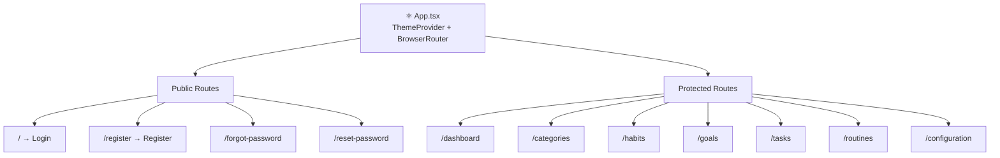
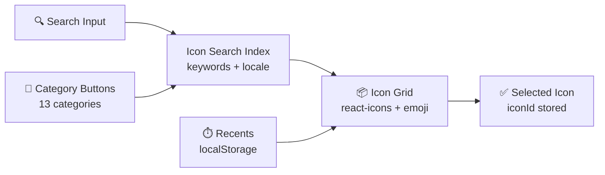
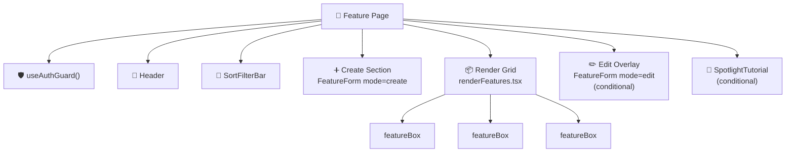
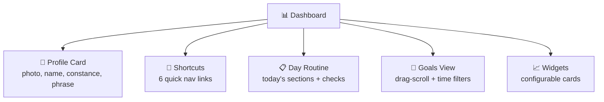
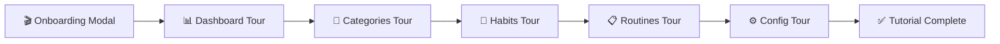

This document maps out the entire frontend component architecture: how pages are structured, what shared components exist, the patterns used for feature pages, and how the dashboard and tutorial system work.

## Page Structure

Every page follows the same skeleton: the App router wraps everything in a ThemeProvider, and each protected page calls useAuthGuard before rendering.

### Route configuration

| Route | Page | Auth Required |
|-------|------|---------------|
| / | Login | No |
| /register | Register | No |
| /forgot-password | ForgotPassword | No |
| /reset-password | ResetPassword | No |
| /dashboard | Dashboard | Yes |
| /categories | Categories | Yes |
| /habits | Habits | Yes |
| /goals | Goals | Yes |
| /tasks | Tasks | Yes |
| /routines | Routines | Yes |
| /configuration | Configuration | Yes |

## Layout Components

### Header

Present on every protected page. Fixed 60px height with primary background color.

- Displays translated page title
- Return-to-dashboard link (left side)
- Logout button (right side, optional)
- Responsive text sizing

### Modal

Portal-based overlay component used for create forms, delete confirmations, and category selection.

- Dark backdrop (bg-black/40)
- Click-outside-to-close
- Max 90vh height with overflow scroll
- Accessible: role="dialog", aria-modal

## Shared Components

| Component | Purpose | Props |
|-----------|---------|-------|
| **Button** | Primary action button | text, size (big/medium/small), mode (cancel/create/default), icon |
| **SmallButton** | Compact action | text, disabled, onClick |
| **ErrorNotice** | Display API errors | error (ApiErrorPayload) |
| **ProgressRing** | SVG circular progress | progress (0-100), size (sm/md/lg) |
| **DeleteModal** | Confirm deletion | objectId, name, deletePhrase, mode |
| **SortFilterBar** | Sort controls for lists | options, value, onChange, quickValues |

## Input Components

All form inputs follow the same pattern: controlled value, onChange callback, error message display, and responsive sizing.

| Component | Purpose | Key Features |
|-----------|---------|-------------|
| **GenericInput** | Standard text field | Label, error border, responsive widths |
| **DescriptionInput** | Textarea | Dynamic min-height by screen size |
| **ChooseInput** | Radio button group | Toggle behavior, color on selection |
| **SelectorInput** | Dropdown select | Object mapping, error display |
| **ExperienceInput** | XP level selector | Beginner/Intermediary/Advanced |
| **IconsBox** | Icon picker | Search, 13 categories, recents, emoji support |
| **ChooseCategories** | Category multi-select | Fetch categories, create inline, pending selection |

### Icon System

The icon picker is one of the most complex shared components:

- Icons sourced from react-icons (Material Design, Font Awesome, Ant Design) and emoji-datasource
- Search supports English and Portuguese keywords
- 13 categories: all, recents, icons, emoji, smileys, people, nature, food, travel, activities, objects, symbols, flags
- Recent icons tracked in localStorage (max 6)

## Feature Page Pattern

Every feature (habits, tasks, goals, categories, routines) follows the same **Create/Edit/Render/Box** pattern:

### Form component (FeatureForm)

Each feature has a shared form that handles both create and edit modes:

- react-hook-form with Controller wrappers for each input
- Zod schema validation with bilingual error messages (schema receives the t function)
- Mode-aware default values (empty for create, populated from Redux for edit)
- API call on submit (createX or editX)
- On success: refetch list, reset form, show toast
- On error: parse ApiErrorPayload, show ErrorNotice

### Box component (featureBox)

Expandable card for displaying individual items:

- Collapsed: icon, name, basic info
- Expanded: full details (description, categories, metrics)
- Edit button: dispatches to Redux edit slice, opens edit form
- Delete button: opens DeleteModal
- Color-coded difficulty/importance via useColors hook

### Render component (renderFeatures)

Grid display using CSS auto-fit with responsive column minimums:

- Mobile: 100px min columns
- Tablet: 170px min columns
- Desktop: 220px min columns

### Sort/filter

- SortFilterBar at top of each page
- Sort preference stored in Redux viewFiltersSlice
- Sorting done client-side with useMemo
- Options: name, level, xp, importance, difficulty, date (varies by feature)

## Dashboard

The dashboard is a composite page with multiple widget areas:

### Profile Card (perfil.tsx)

- Shows user photo, greeting, and constance streak
- Time display (updates every 30 seconds)
- Motivational phrase (italic)
- Responsive: full-width mobile, card layout desktop

### Shortcuts

Quick navigation to all 6 main features (Categories, Habits, Tasks, Routines, Goals, Configuration). Hover effects with scale and color transitions.

### Day Routine

Displays today's scheduled routine with sections. Each section shows habit/task groups that can be checked or skipped.

### Goals View

Horizontal drag-scroll container with time-based filter tabs (This Week, This Month, This Year, Future, Past). Uses useDragScroll hook for mobile swipe support.

### Widgets

Configurable dashboard cards in the widgets folder:

| Widget | Content |
|--------|---------|
| Constance | Streak days counter |
| Daily Progress | Doughnut chart (Chart.js) |
| Level Progress | XP bar visualization |
| Better Area | Top-performing category |
| Worst Area | Category needing attention |
| Fast Tips | Quick productivity tips |

Widget visibility is configured in the Configuration page and stored in Redux (perfil.widgetsIdsInUse).

## Tutorial System

An interactive onboarding system that guides new users through the app using spotlight highlights.

### How it works

- **SpotlightTutorial** component targets elements via CSS selectors (data-tutorial-id attributes)
- Each step has a title, description, position (auto-calculated), and action type (click/observe)
- Uses Framer Motion for animations
- Auto-scrolls target elements into view
- Phase tracking stored in localStorage
- Tutorial completion flag persisted in Redux and backend

### Phase progression

| Phase | Triggers |
|-------|---------|
| intro | First login |
| dashboard | After intro modal |
| categories | Navigate to categories |
| habits-dashboard | Return to dashboard |
| habits | Navigate to habits |
| routines-dashboard | Return to dashboard |
| routines | Navigate to routines |
| config-dashboard | Return to dashboard |
| config | Navigate to configuration |
| done | All phases complete |

Each page has a dedicated hook (useDashboardTutorial, useCategoriesTutorial, etc.) that manages its tutorial steps and phase transitions.
