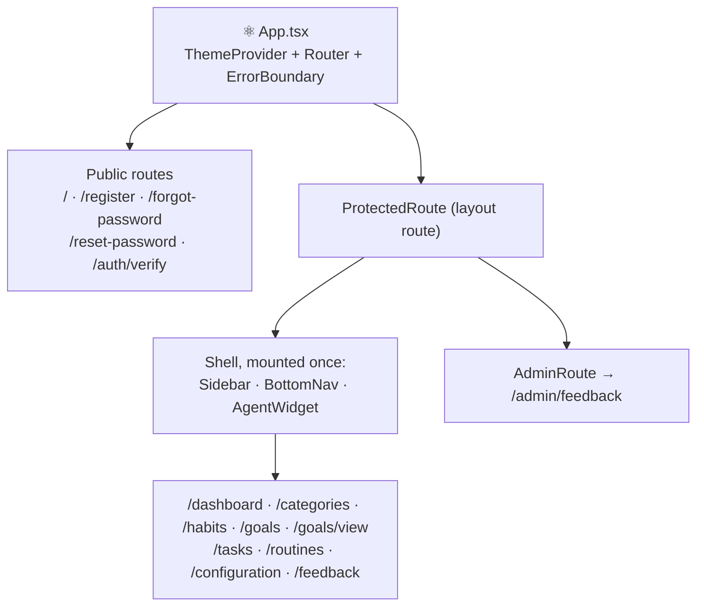

This document maps the web frontend: how pages and components are organized, the patterns every feature follows, how the dashboard widgets and the tutorial work, and how the bundle is split. The web app lives in `apps/web` of the frontend monorepo and consumes the shared packages (state, theme, i18n, validation, icons, api) as source through Vite aliases.

## Routing and the shell


```mermaid
flowchart TD
  APP["⚛️ App.tsx<br/>ThemeProvider + Router + ErrorBoundary"]
  APP --> PUB["Public routes<br/>/ · /register · /forgot-password<br/>/reset-password · /auth/verify"]
  APP --> PROT["ProtectedRoute (layout route)"]
  PROT --> SHELL["Shell, mounted once:<br/>Sidebar · BottomNav · AgentWidget"]
  SHELL --> PAGES["/dashboard · /categories · /habits · /goals · /goals/view<br/>/tasks · /routines · /configuration · /feedback"]
  PROT --> ADMIN["AdminRoute → /admin/feedback"]
```

Every route component is lazy, including AdminRoute itself, so ordinary users never download the admin gate or its API calls. Two Suspense boundaries catch those chunks, and where they sit is load-bearing. The one in `App.tsx`, with a full-screen spinner, serves the public routes. The one inside `ProtectedRoute`, with a spinner sized to the page, wraps the page outlet alone, so a page loading for the first time can blank the page area and nothing else. For a while the outer boundary was the only one, and the first visit to any page hid the whole shell while the chunk came down. React tears down layout effects on a Suspense hide, and framer-motion keeps its animation state in one, so an assistant panel closed in that same tick (which is what the agent's internal links do) lost its exit animation and came back at full opacity with the widget already believing it closed. The bubble drew over the chat and Escape did nothing. On boot, `useSilentRefresh` holds the app in a "checking" state until the refresh cookie has been traded for a token, which is what prevents a flash of 401s or a bounce to login on reload.

The shell mounts once inside the protected layout route: the collapsible desktop Sidebar (order: Today, Categories, Habits, Tasks, Routines, Goals, with Feedback and Config in the footer), the phone BottomNav (Today, Routines, the Assistant in the center slot as the only entry to the agent, Habits, and a More sheet), and the floating AgentWidget. Pages render no header of their own; a shared PageHeader component is the in-page title block. Nav items carry `data-tutorial-id` anchors for the tutorial spotlight.

Auth pages deliberately avoid the icon registry, keeping the icon and emoji chunks out of the unauthenticated first load.

## Component organization

```
src/
  pages/        one folder per route, tests colocated
  components/   per-domain folders (agent, categories, dashboard, goals,
                habits, routines, tasks, tutorial, widgets, ...)
  ui/           design-system primitives with no domain knowledge
  hooks/  context/  lib/  services/  redux/  utils/
```

The `ui/` layer holds the primitives: Card, Chip, Ring, XpBar, XpSparkline, StatTile, SegmentedControl, IconButton, IconTile, CheckStrip, GhostAdd, BeyouIcon, PageHeader. Domain components compose these. The shared Modal is a portal with a real focus trap: Tab cycling, focus restore on close, Escape, and aria-labelledby, and every dialog in the app renders through it.

### The entity quartet

Every domain entity (category, habit, task, goal, routine) follows the same four-part pattern:

| Part | Role |
|------|------|
| createX / editX | Thin modal wrappers choosing the form's mode |
| XForm | The shared react-hook-form component, one per entity |
| xBox | The expandable card showing one item, with edit and delete actions |
| renderXs | The responsive grid that maps the list |

Forms resolve through zod schemas that live in the shared validation package, written as factories taking the translation function, so every validation message is bilingual by construction. Every label goes through one `FormLabel` (`FieldLabel` on mobile) that draws the field's standing: an accent asterisk where the server refuses the form without it, a muted "optional" where it may stay empty, one marker per field and never both. The flags follow the request DTOs, not taste; a task's importance and difficulty are the case that made the rule, since both clients required them for months while the server never did. Cross-field routine rules (overlapping section times, overnight ranges) live beside them as plain functions the form and the routine builder both call. A list routine is validated by its own schema rather than a branch inside the daily one: the two forms hold genuinely different state, an array of timed sections against a flat array of picked habits and tasks, and one schema accepting both would check neither properly.

## Dashboard and widgets

The dashboard composes a profile card, shortcut links, today's routine with its check-in flow, a goals rail, and the configurable widget area.

## Goals: the tree and the viewer

The goals page groups sub-goals under their main goal by default, with a flat list one toggle away. A card with sub-goals carries a "n/m sub-goals" chip, a thin second bar for the children's mean progress, and a fold that lists them as compact rows with their own stepper; when every child is complete the card offers to complete the parent, because that is still the only thing that pays the parent's XP. Search and the deep link look through the hierarchy: a match on a sub-goal keeps its main goal on the page, dimmed when it only made it through the child. The form's "Main goal" picker is pre-filtered with the same rule the server enforces (not itself, not a descendant, three levels), and "Add sub-goal" on a card opens it with the parent, its categories and its deadline already filled in. Deleting a parent warns that the children become main goals.

`/goals/view` is the same goal, one at a time: a `fixed inset-0` layer over the shell, like the Focus Mode, with Escape as the way out. Each slide gives the motivation the room the card never had, a large progress ring, the deadline as days left, the categories, the same stepper and Complete button as the card, the sub-goals as a list that jumps to their own slide, and a way back to the main goal. Ordering is by status by default (in progress, then not started, then completed), or by category, deadline, progress or name, persisted per device in `viewFilters.goalsViewer`; the arrows and the keyboard walk the same deck, and `?goal=` opens on a given slide. The mobile app has the same screen at the root of its router, outside the tab group, for the same reason the focus screen lives there: the bottom bar is a sibling of the screens, not an overlay, so a screen inside the group cannot hide it.

Widget identity is shared state: the list of ids lives in the state package (worstArea, constance, constanceHeatmap, betterArea, dailyProgress, fastTips, levelProgress, categoryBalance, moodWeek), and both apps read it. Four render full-width. A fabric component maps id to component, so adding a widget is one entry in the map plus one entry in the shared list — and the mobile map is an exhaustive `Record<WidgetId, …>`, so a new id fails the mobile build until mobile implements it. That is deliberate: the alternative is a widget the two platforms disagree about.

Most widgets are handed their data by the dashboard. Two fetch their own — the constance heatmap and the mood week — because both read a date range nothing else on the page needs, and both are optional, so a user without them should not pay for the request. A self-fetching widget owes the rail a stable height while it loads: `moodWeek` renders the week's shape with placeholder dots and a `data-loading` attribute rather than deciding between its two views, because deciding early painted a full week of blank days and then flipped, twice, for anyone who had not marked today.

Selection lives in Configuration: a drag-to-reorder list that autosaves on every change, pushing the new order to the backend and Redux together, and rolling nothing into Redux when the server rejects. On phones the dashboard renders widgets in a snap-scroll carousel, one per screen, so adding widgets never pushes today's routine below the fold.

## The diary

`/mood` is an ordinary page inside the shell, and the only one whose content is something the
person wrote rather than something the app recorded. Four blocks down the page: the day with its
five faces, the journal box with a Save button, a month calendar with a coloured dot per recorded
day, and the recent entries.

Two details are load-bearing, and both are about not losing writing.

The faces and the Save button send DIFFERENT requests. A face sends the level alone; Save sends
the whole entry. That is why tapping a face on the dashboard widget cannot wipe the morning's
journal — the request has no field for it — and it is enforced on the server too, not only here.

The text area seeds from the stored entry, keyed on the day AND on the entry itself. Keyed on the
day alone it seeded empty before the day's entry had arrived and never re-seeded, so a day with a
journal showed blank and Save then cleared it: the same data loss the two-verb split exists to
prevent, reintroduced one layer up. It also refuses to replace typed text with nothing, so a
late-arriving empty entry cannot swallow what somebody is in the middle of writing.

## The tutorial, in two systems

Onboarding is a phase machine persisted in localStorage, with values whitelist-validated on read:

```
intro → ai-onboarding → dashboard → categories → habits-dashboard → habits
→ routines-dashboard → routines → routines-summary → config-dashboard → config → done
```

Two distinct systems ride that machine:

- **The intro modal**: four concept cards (categories, habits, tasks, routines), and then a fork: take the AI onboarding wizard or the manual tour.
- **The spotlight tour**: each step names a CSS selector, a position, and an action (click or observe). The finder picks the first visible match, which is what lets the desktop sidebar and the phone More-sheet share the same step definitions, and the tooltip clamps itself to the viewport. Each page has a hook owning its steps and phase transitions.

The AI onboarding wizard walks five steps (categories, habits and tasks, routine, goals, summary), fetching typed suggestions from the backend and creating real entities step by step through the ordinary REST endpoints. Progress persists to localStorage as step-plus-created-references only; the suggestions themselves are deliberately not persisted, so a reload re-fetches instead of double-creating. The creates check the account first and skip a name that is already there, which is what keeps the error banner's Try again from adding a second copy of everything a failed pass had got through before it failed. A failure now says which kind it is: a suggestion call that failed keeps the AI-unavailable screen, while a rejected entity write names what fell over, shows the server's reason and lists what the wizard already saved.

## Gamification feedback

Three pieces turn a routine check into visible progress:

- **XpFloat**: a "+N XP" chip that rises over the checked item for a second, driven by the real xpGenerated value in the check response. Under reduced motion it fades in place.
- **CelebrationOverlay**: a global overlay draining a FIFO queue of celebrations (level-ups and streak milestones), auto-dismissing after four seconds, dismissable by click or Escape.
- **The RefreshUI flow**: check responses carry a RefreshUI payload, and a shared apply function updates the profile, categories, habit, and routine slices in one pass, deciding on the way whether a celebration belongs in the queue. The details live in the [Redux and data topic](/architecture/redux-data).

Data freshness is handled by a shared auto-refresh policy with three prompts: returning to the tab, the local day rolling over, and a five-minute interval while visible. Single-flight, silent on failure, and paused entirely while the tab is hidden or a check animation is mid-flight.

## Code splitting

Route-level laziness plus five manual chunks, in an order that matters:

| Chunk | Contents | Why |
|-------|----------|-----|
| icons-base | react-icons | The heaviest optional weight |
| telemetry | Sentry SDK | Must be matched before the forms rule: the SDK ships a file with "zod" in its path. Tree-shaken away entirely in builds without a DSN |
| motion | framer-motion | Only needed after login |
| forms | react-hook-form, resolvers, zod | Form-heavy pages only |
| vendor | react, router, redux family | The stable base |

The dev server pre-bundles the lazy-route dependencies, because discovering them mid-session used to trigger a re-optimization and a full reload halfway through using the app.

## Conventions worth keeping

- Every interactive element is a real button or link; icon tiles included. The icon picker's tiles were the last `<span onClick>` holdouts and are buttons with aria-labels now.
- Toasts are capped at three, positioned per device class, with custom close and icon components.
- One-shot invitations (like the empty-widgets nudge) dismiss through a shared localStorage-flag hook rather than ad-hoc state.
- Drag-and-drop uses react-beautiful-dnd behind a StrictMode shim.
