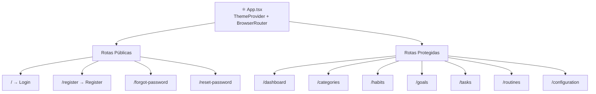
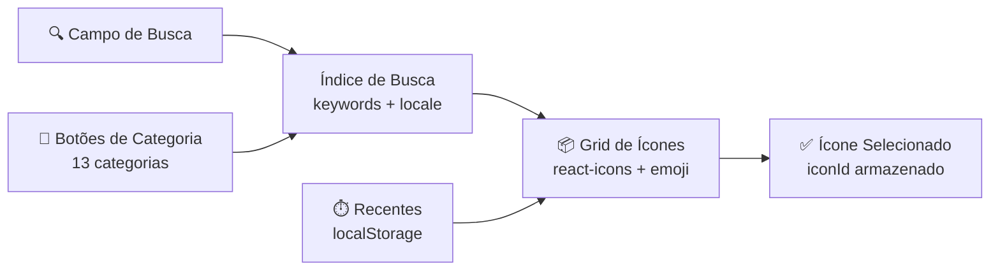
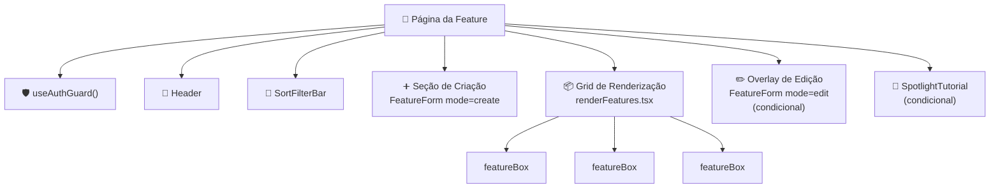
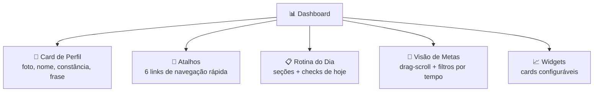
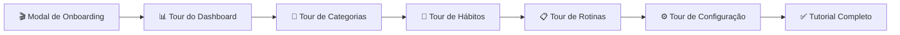

Este documento mapeia toda a arquitetura de componentes do frontend: como as páginas são estruturadas, quais componentes compartilhados existem, os padrões usados nas páginas de features e como o dashboard e o sistema de tutorial funcionam.

## Estrutura de Páginas

Toda página segue o mesmo esqueleto: o App router envolve tudo em um ThemeProvider, e cada página protegida chama useAuthGuard antes de renderizar.

### Configuração de rotas

| Rota | Página | Auth Necessário |
|------|--------|----------------|
| / | Login | Não |
| /register | Register | Não |
| /forgot-password | ForgotPassword | Não |
| /reset-password | ResetPassword | Não |
| /dashboard | Dashboard | Sim |
| /categories | Categories | Sim |
| /habits | Habits | Sim |
| /goals | Goals | Sim |
| /tasks | Tasks | Sim |
| /routines | Routines | Sim |
| /configuration | Configuration | Sim |

## Componentes de Layout

### Header

Presente em toda página protegida. Altura fixa de 60px com cor de fundo primária.

- Exibe título da página traduzido
- Link de retorno ao dashboard (lado esquerdo)
- Botão de logout (lado direito, opcional)
- Tamanho de texto responsivo

### Modal

Componente de overlay baseado em Portal usado para formulários de criação, confirmações de deleção e seleção de categorias.

- Backdrop escuro (bg-black/40)
- Clique fora para fechar
- Altura máx 90vh com overflow scroll
- Acessível: role="dialog", aria-modal

## Componentes Compartilhados

| Componente | Propósito | Props |
|-----------|---------|-------|
| **Button** | Botão de ação principal | text, size (big/medium/small), mode (cancel/create/default), icon |
| **SmallButton** | Ação compacta | text, disabled, onClick |
| **ErrorNotice** | Exibir erros da API | error (ApiErrorPayload) |
| **ProgressRing** | Progresso circular SVG | progress (0-100), size (sm/md/lg) |
| **DeleteModal** | Confirmar deleção | objectId, name, deletePhrase, mode |
| **SortFilterBar** | Controles de ordenação | options, value, onChange, quickValues |

## Componentes de Input

Todos os inputs seguem o mesmo padrão: valor controlado, callback onChange, exibição de mensagem de erro e dimensionamento responsivo.

| Componente | Propósito | Características |
|-----------|---------|----------------|
| **GenericInput** | Campo de texto padrão | Label, borda de erro, larguras responsivas |
| **DescriptionInput** | Textarea | Altura mínima dinâmica por tamanho de tela |
| **ChooseInput** | Grupo de radio buttons | Comportamento toggle, cor na seleção |
| **SelectorInput** | Dropdown select | Mapeamento de objetos, exibição de erro |
| **ExperienceInput** | Seletor de nível XP | Beginner/Intermediary/Advanced |
| **IconsBox** | Seletor de ícones | Busca, 13 categorias, recentes, suporte a emoji |
| **ChooseCategories** | Multi-select de categorias | Busca categorias, criar inline, seleção pendente |

### Sistema de Ícones

O seletor de ícones é um dos componentes compartilhados mais complexos:

- Ícones vindos de react-icons (Material Design, Font Awesome, Ant Design) e emoji-datasource
- Busca suporta palavras-chave em inglês e português
- 13 categorias: all, recents, icons, emoji, smileys, people, nature, food, travel, activities, objects, symbols, flags
- Ícones recentes rastreados no localStorage (máx 6)

## Padrão de Página de Feature

Toda feature (hábitos, tarefas, metas, categorias, rotinas) segue o mesmo padrão **Create/Edit/Render/Box**:

### Componente de formulário (FeatureForm)

Cada feature tem um formulário compartilhado que lida com modos de criação e edição:

- react-hook-form com wrappers Controller para cada input
- Validação com schema Zod com mensagens de erro bilíngues (schema recebe a função t)
- Valores padrão por modo (vazio para criação, preenchido do Redux para edição)
- Chamada API no submit (createX ou editX)
- No sucesso: refetch lista, reset form, toast
- No erro: parse ApiErrorPayload, exibir ErrorNotice

### Componente de card (featureBox)

Card expandível para exibir itens individuais:

- Colapsado: ícone, nome, info básica
- Expandido: detalhes completos (descrição, categorias, métricas)
- Botão editar: dispatch para Redux edit slice, abre formulário de edição
- Botão deletar: abre DeleteModal
- Dificuldade/importância com código de cores via hook useColors

### Componente de renderização (renderFeatures)

Grid usando CSS auto-fit com mínimos de coluna responsivos:

- Mobile: colunas mín 100px
- Tablet: colunas mín 170px
- Desktop: colunas mín 220px

### Ordenação/filtro

- SortFilterBar no topo de cada página
- Preferência de ordenação armazenada no Redux viewFiltersSlice
- Ordenação feita client-side com useMemo
- Opções: nome, level, xp, importância, dificuldade, data (varia por feature)

## Dashboard

O dashboard é uma página composta com múltiplas áreas de widgets:

### Card de Perfil (perfil.tsx)

- Mostra foto do usuário, saudação e streak de constância
- Exibição de hora (atualiza a cada 30 segundos)
- Frase motivacional (itálico)
- Responsivo: full-width mobile, layout card desktop

### Atalhos

Navegação rápida para todas as 6 features principais (Categorias, Hábitos, Tarefas, Rotinas, Metas, Configuração). Efeitos hover com scale e transições de cor.

### Rotina do Dia

Exibe a rotina agendada para hoje com seções. Cada seção mostra grupos de hábitos/tarefas que podem ser marcados como feitos ou pulados.

### Visão de Metas

Container com drag-scroll horizontal e abas de filtro por tempo (Esta Semana, Este Mês, Este Ano, Futuro, Passado). Usa hook useDragScroll para suporte a swipe mobile.

### Widgets

Cards configuráveis do dashboard na pasta widgets:

| Widget | Conteúdo |
|--------|----------|
| Constance | Contador de dias de streak |
| Daily Progress | Gráfico donut (Chart.js) |
| Level Progress | Visualização de barra de XP |
| Better Area | Categoria com melhor desempenho |
| Worst Area | Categoria que precisa de atenção |
| Fast Tips | Dicas rápidas de produtividade |

Visibilidade dos widgets é configurada na página de Configuração e armazenada no Redux (perfil.widgetsIdsInUse).

## Sistema de Tutorial

Um sistema de onboarding interativo que guia novos usuários pelo app usando destaques spotlight.

### Como funciona

- Componente **SpotlightTutorial** alvo elementos via CSS selectors (atributos data-tutorial-id)
- Cada passo tem título, descrição, posição (auto-calculada) e tipo de ação (click/observe)
- Usa Framer Motion para animações
- Auto-scroll dos elementos alvo para a viewport
- Rastreamento de fase armazenado no localStorage
- Flag de conclusão do tutorial persistida no Redux e backend

### Progressão de fases

| Fase | Gatilho |
|------|---------|
| intro | Primeiro login |
| dashboard | Após modal de intro |
| categories | Navegar para categorias |
| habits-dashboard | Retornar ao dashboard |
| habits | Navegar para hábitos |
| routines-dashboard | Retornar ao dashboard |
| routines | Navegar para rotinas |
| config-dashboard | Retornar ao dashboard |
| config | Navegar para configuração |
| done | Todas as fases completas |

Cada página tem um hook dedicado (useDashboardTutorial, useCategoriesTutorial, etc.) que gerencia seus passos de tutorial e transições de fase.
